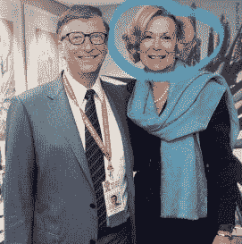

# 冠状病毒危机沙皇:政治家对抗新贵族

> 原文：<https://medium.datadriveninvestor.com/coronavirus-crisis-czars-politicians-versus-the-neo-aristocrats-63012cbb6a3a?source=collection_archive---------7----------------------->

Coronavirus

在中国武汉报道首例冠状病毒病例仅四个月后，微软联合创始人、慈善家比尔·盖茨(Bill Gates)正考虑推出包含数字证书的人体植入胶囊。植入式纳米技术设备也被称为“量子点纹身”，目前正在麻省理工学院和莱斯大学进行测试。据称，该设备将提供保存 GPS 可跟踪疫苗接种记录的方法，使研究人员能够跟踪已确诊并接种新冠肺炎疫苗的个人。

有争议的新技术倡议为一些社会政治难题打开了许多大门。一个这样的困境与侵犯个人隐私的想法有关，因此危及个人自由。

在自然危机或冠状病毒流行期间，公民倾向于暂时牺牲一定程度的自由来换取透明、负责任的公共安全，这是一种正常现象。但问题是，我们的底线在哪里？！-谁是事实？！

迄今为止，尽管普遍的看法可能受制于主流媒体的劝说，即这是政府的有限特权。然而，保护公民利益的责任却又在政治风光的背后，呈现出完全不同的景象。

# 谁在负责冠状病毒大流行？

最近，我偶然看到了发表在 Biohackinfo News 上的博客[。故事定义了；这位 64 岁的技术行业同行、世界第二大富豪和全球化者如何在 Reddit 的“问我任何事”会议上广播他希望如何解决新冠肺炎危机。](https://biohackinfo.com/news-bill-gates-id2020-vaccine-implant-covid-19-digital-certificates/)

盖茨，确认；他迟早需要创建一个数字证书来检测和跟踪那些已经康复、最近接受过测试或已经接种过疫苗的人。然而，免疫证明并不局限于他所背诵的内容。事实上，量子点纹身更有可能与比尔·盖茨的另一个项目“ID2020”相辅相成。

ID2020 是盖茨的最新项目，目前正在由微软进行尝试。这项技术旨在解决“超过 10 亿人”没有官方认可身份的问题。据这位亿万富翁称，ID2020 将通过数字识别解决缺乏可追踪性的问题。然而，数字身份实施的最有回报的方式是通过智能手机或 [RFID 微芯片植入](https://en.wikipedia.org/wiki/Microchip_implant_(human))。

 [## 冠状病毒；惊慌失措；字里行间的 z |数据驱动的投资者

### 围绕冠状病毒的话题；更准确地说，新冠肺炎几乎占据了整个新闻预报的头条…

www.datadriveninvestor.com](https://www.datadriveninvestor.com/2020/03/23/coronavirus-a-to-panic-z-between-the-lines/) 

此外，微软还与其他四家公司建立了合作关系，包括埃森哲、IDEO、Gavi 和洛克菲勒基金会，它们都受到联合国的支持。该合资企业已被纳入联合国的“[可持续发展目标](https://sustainabledevelopment.un.org/?menu=1300)”宏图，而这又是最近全球化努力的一部分。

为了应对由重要行业领导者领导的全球化智慧，后者为民族主义叛乱分子创造了一个真空，他们正在回应破坏上述全球化努力。一些联合民族主义运动由国际政治偶像领导，包括俄国的弗拉基米尔·普京、土耳其的埃尔多安、印度的莫迪和唐纳德·特朗普。

《健康影响新闻》的编辑布莱恩·希尔哈维有一个发人深省的观点，我将在后面的文章中概述。

# 唐纳德·特朗普；或者比尔·盖茨；谁最有影响力？

特朗普总统开始了他目前作为美国总统的工作。像任何总统一样，他的任期是有限的，最多持续 4 到 8 年。然而，比尔·盖茨并不是一个选举产生的领导人，而且作为全球公认的最富有的人之一，自 1978 年的《阿拉木图宣言》以来，他已经影响了公共卫生政策几十年。从最初的成功开始，盖茨已经经历了许多位美国总统，当然，他不会很快结束自己的职业生涯。此外，地球上没有强大到足以迫使全球主义者退出的实体。

2020 年 4 月 7 日，特朗普总统宣布，美国可能不再支持世界卫生组织(世卫组织)，因为他确信处理冠状病毒疫情的组织已经崩溃。虽然就国家而言，总统的看法可能是正确的，但比尔·盖茨对世卫组织的财政支持要高得多，同样通过“比尔和梅林达·盖茨基金会”，以及通过他所拉拢的其他组织和企业。比尔·盖茨比世界上大多数国家更富有，更有影响力。然而，这位全球大亨没有任何过错。那么他在 COVID19 致谢中的最终目的是什么呢？到目前为止，他的霸权已经削弱了世界上几乎所有国家的经济。

# 新封建主义正在走向全球

比尔·盖茨的使命非常宏大，也非常微妙。除非技术设计的手段和专有信息随着他的进步而被公开，这不仅对个人自由是灾难性的，而且会给社会结构留下永久的伤疤。产生选定的政府独裁是一回事，但特许像微软联合创始人这样的私营公司是完全不同的另一回事。

不可否认的是，政府的“附庸”将永远是大公司证明其新封建主义使命的先决条件。然而，他们将同样希望人口众多作为他们的“农奴。”

相互传统的民族主义者和全球主义者同样分享平行的策略来推动他们特定的野心。因为同样的原因，他们使用民粹主义的灵感只是为了一个，不像范围。尽管如此，两者都遭到了基层宗教组织的抵制。

Covid-19

[的基督徒和一些什叶派穆斯林](https://biohackinfo.com/news-bill-gates-id2020-vaccine-implant-covid-19-digital-certificates/)反对人体入侵身份证明技术。根据他们的信念，这样的技术是邪恶的，正如圣经和一些迈赫迪预言中提到的。

不久前，已经为丹麦政府和美国海军开发微芯片植入技术的丹麦科技公司不得不放弃其推出的“革命性”物联网驱动的微芯片植入技术，据称是因为基督教活动分子袭击了其在哥本哈根的办公室。

# 量子点纹身技术:阴谋还是事实

路透社的一篇报道称，比尔·盖茨使用微芯片植入物对抗冠状病毒的计划只不过是一个阴谋论。路透社继续；比尔·盖茨预见了健康记录“数字证书”的使用，但没有说明这项技术将以微芯片植入的形式出现。根据最近的报告，没有计划在冠状病毒爆发期间使用据称的技术。

如果盖茨的发明是为了治疗冠状病毒，这种争论是不必要的，因为他设想植入和跟踪的技术不仅用于直接的战术用途，还具有许多其他应用的潜在用途，对他来说触手可及。事实上，量子点技术是通向全方位控制人类生活的大门。

就新冠肺炎·疫情而言，解决方案似乎比问题本身更糟糕；这就是[布莱恩·希尔哈维在他的专栏](https://healthimpactnews.com/2020/who-is-controlling-the-u-s-response-to-covid19-the-white-house-or-bill-gates/)中所描述的。

虽然政府的支持是让所有美国人呆在家里，练习社交距离，但在商业关闭等其他情况下，特朗普总统似乎准备让美国公众重返工作岗位，恢复正常活动。因此，在对冠状病毒的恐惧中，这是常识，也是一把双刃剑。无论是否继续封锁，无论如何都会把社会分割成碎片。话说回来，让人们失业和被社会孤立的健康后果，可能远比对冠状病毒的担忧更糟糕。

尽管卫生保健界建议，处于危险中的主要是老年人和体弱者，而不是大多数人口，但这一切都突然改变了。此外，限制还将持续 30 天。

# 然而，谁在负责冠状病毒大流行？

比尔·盖茨和他在埃森哲、脸书、Sors 基金会、IDEO、Gavi、世卫组织以及联合国支持的洛克菲勒基金会的朋友们似乎有其他计划。

安东尼·福奇博士(美国国家过敏和传染病研究所主任)和黛博拉·白利博士(专门从事艾滋病毒/艾滋病免疫学、疫苗研究和全球健康的外交官)显然有不同的计划。在新冠肺炎危机期间，白宫冠状病毒特别工作组的两个媒体亮点已经能够说服特朗普总统让国家关闭的时间比他显然寻求的时间更长。但是这个国家的大多数人可能没有意识到的是，这两位医生都与比尔·盖茨有财务关系。

*Adapted from: shorturl.at/iqwS4*

2019 年，美国国立卫生研究院花费了 1 亿美元的美国政府资源来开发基于基因的艾滋病和镰状细胞病(SCD)疗法。福奇博士是美国国立卫生研究院(NIH)的精英成员，NIAID 是后者项目的一部分。在同一份声明中，盖茨基金会还保证与美国国立卫生研究院合作 1 亿美元。

制药公司 Moderna 也是第一家筹集资金开发 COVID19 疫苗的公司。疫苗开发由福奇博士和 NIAID 领导。据报道；新型冠状病毒疫苗将是一种基于 mRNA 的疫苗，这种疫苗以前从未在市场上出现过，并有可能改变人类 DNA。

另据报道，NIADH 在福奇的领导下，之前参与了新冠肺炎的[增益功能研究。](https://medium.com/datadriveninvestor/coronavirus-a-to-panic-z-between-the-lines-bd770208de59)

这似乎不仅仅是一个纯粹的巧合，见证了美国历史上第一次援引[公共准备和紧急事件准备法案](https://www.phe.gov/Preparedness/legal/prepact/Pages/default.aspx)(预备法案)。COVID19 疫苗准备法案的触发因素是缺乏常规测试和安全预防措施的快速通道，特别是第一个基于 mRNA 的疫苗将在美国和世界人口中进行测试。

*Bill Gates with Dr. Debra Birx. Adapted from: shorturl.at/iqwS4*

另一方面，黛布拉·比尔克斯博士曾与福奇博士在艾滋病研究和疫苗开发方面合作过，她也与比尔·盖茨有经济上的联系。根据帕特里克·豪利的说法。

帕特里克·豪利是一名美国记者，也是《大联盟政治》的主编。据他说，Birx 博士已经放弃了冠状病毒爆发的几个拟议模型，并选择了一个由比尔盖茨通过 IHME 卫生计量和评估研究所资助的单一模型。Howley 进一步报道，Deborah Birx 是全球基金的董事会成员。正如记者 Jordan Schactel 发现的那样，该信托基金由比尔·盖茨的组织网络提供大量资金。比尔和梅林达·盖茨基金会还在 2012 年给了全球基金一张 7.5 亿美元的期票，表明该基金会是全球基金的重要盟友。盖茨基金会迄今已向全球基金提供了 22.4 亿美元的补贴，并承诺为国际基金 2020-2022 年的第六次充资提供 7.6 亿美元。

# 全球贵族的议程不是秘密

比尔·盖茨的倡议并不是一个隐藏的秘密。他是一个全球主义者，在联合国、世卫组织、NIH、Rockefeller 和其他人的关注下获得了一席之地。他的倡议可以追溯到 1978 年 9 月在哈萨克斯坦阿拉木图举行的初级卫生保健国际会议(PHC)，当时通过了“[阿拉木图](https://medium.com/datadriveninvestor/alma-ata-declaration-of-health-for-all-a-generation-old-quest-with-trivial-conquest-2b27cf9b4c4)宣言”。1978 年的宣言被认为是二十世纪公共卫生倡议的重要里程碑，它将初级保健医学定义和定位为在全球实现“全民医疗保健”的关键部分，由[比尔盖茨](https://en.wikipedia.org/wiki/Health_For_All)亲自领导。

Globalism

盖茨完全可以使用大众广播，包括社交媒体。盖茨没有比此时此地更好的时机来利用公众的恐惧、焦虑和政治家让全体人口接种一种新的基于 mRNA 的 COVID19 疫苗。总之，他希望封锁继续下去，直到这种疫苗被开发出来。一旦生产出来，只有那些拥有 COVID19 疫苗证书的人才被允许旅行。媒体多年来一直报道，比尔和梅林达·盖茨基金会是世卫组织最重要的捐助者之一，仅次于美国，超过世界上所有其他国家。

[相关文章:令人惊讶的医疗账单和突如其来的国会法案](https://www.datadriveninvestor.com/2019/09/30/surprise-medical-bills-and-the-abrupt-congressional-bill/)

# 全球主义者用冠状病毒购买通行证

盖茨是一位慈善家，他捐赠了数百万甚至数十亿美元帮助研发冠状病毒疫苗。福奇，NIAID 的主任，因此，由疏忽，由医疗专业人员和政府服务的监督，另一方面，也获得了慈善家般的称号，由协会。因此，媒体给了他们两个“免费通行证”[安东尼·福奇，](https://www.express.co.uk/news/weird/1253135/coronavirus-genetically-engineered-bioweapon-wuhan-lab-leak-covid19-spt)，他是[冠状病毒功能获得(GOF)研究](https://www.express.co.uk/news/weird/1253135/coronavirus-genetically-engineered-bioweapon-wuhan-lab-leak-covid19-spt)的负责人，现在被认为是公众极度绝望时期的冠状病毒明星。

贵族捐助者比尔·盖茨和白宫头号人物安东尼·福奇正在塑造公众对冠状病毒的反应。在这个过程中，他们在最近几周得到了一些强大权力的保证。显而易见，权力的力量命令企业关闭，将公民锁在家中，关闭全国各地的学校，使国家经济停滞不前。

# 冠状病毒大流行不仅仅是一场健康危机

正如我以前多次强调的那样，小说《疫情》是一个全球公共卫生问题，但它的横向影响甚至比现实中的“疫情”还要糟糕新冠肺炎对市民来说可能很新奇。然而，在企业卡特尔领域，这并不新鲜。

现代[封建思想，也叫新封建主义，](https://medium.com/datadriveninvestor/21-st-century-corporate-medicine-and-the-surge-of-neo-feudalism-b9eae63d8e8c)是全球范围内的普遍趋势。当前围绕冠状病毒的争议确实是当代国家法规、经济和公共生活复苏的典型缩影。新封建主义使人想起那些在不同的封建制度中盛行的东西。它代表了现代版本，展示了普通人和精英的不平等特权和法律保护。

正如我们在社会和经济全球化的混乱中所见证的那样，公司对医疗事业的全面控制迫在眉睫。

到目前为止，[占主导地位的政治、非正统的经济实践和人口健康](https://medium.com/datadriveninvestor/coronavirus-epidemic-beyond-socio-political-rhetoric-470c8cfd0926)计划在确定卫生当局对新出现疾病的严重性和反应性方面发挥了至关重要的作用，而不考虑其相对发病率和死亡率倾向。

在过去的几十年里，几家生产疫苗的制药公司直线下降，那些仍然生产疫苗的公司已经减少库存来生产新的疫苗。对政治的系统回顾表明，流行病的政治在某种程度上是无所不在的。在新出现的流行病引发的所有政治和经济混乱中，主要的困难最终落在了公民身上。

公司业务的垄断可能比实际病毒的致病后果更严重。然而，如果他们被视为公司的赚钱工具，获得对人民的控制，或者当被视为有价值时成为政客赢得选票的工具，他们仅仅是争吵而已。因此，公众恐慌是田园诗般的策略，而不是后果。“[模型化的新冠肺炎](https://medium.com/datadriveninvestor/coronavirus-a-to-panic-z-between-the-lines-bd770208de59)是全球反人类前线的仪器制造先锋。这种小型生物不仅作为传染媒介势不可挡，而且正在征服整个经济、人民的主权，事实上，还有理智。

# 信息就是力量，就是金钱；即使在冠状病毒大流行的时候

我们正在经历一个“[数据主义](https://medium.com/datadriveninvestor/data-value-corporate-rapacity-and-subversion-of-family-values-at-the-disbursal-of-individual-c6a3e7da09d5)的时代，个人信息对[大数据](https://www.datadriveninvestor.com/glossary/big-data/)行业价值数十亿。几乎工业领域的每个部门都对公共信息的价值感兴趣。比尔·盖茨的量子点纹身是数据挖掘冒险的众多例子之一。除非我们分散数据存储(因为这不符合企业卡特尔的最佳利益)，否则任何信息都将被公开用于除最初预期用途之外的其他用途，除非证明并非如此。“否则”这个词从来就不是一个显而易见的现象。社交媒体、互联网提供商避免实践“网络中立”

言论自由的概念在[社会工程](https://www.datadriveninvestor.com/2020/02/14/semantic-shift-societal-engineering-and-the-centuries-old-neglected-modern-autocracy/)的过程中消失了，这也是由贵族经营的公司和全球机构所为。

其他公共机构，如国家卫生研究所(NIH)，也受到私营公司在各种倡议下的影响，如“[我们所有人计划](https://medium.com/datadriveninvestor/national-institute-of-health-wants-your-blood-urine-and-data-what-is-next-978afee19dfb)，”冠状病毒疫苗或量子点纹身。尽管如此，分享慈善愿景，然后，获取数据和控制公众的使命。同样，建立任务小组来帮助[解决阿片类药物过量大流行](https://medium.com/datadriveninvestor/u-s-endorsed-screening-for-illicit-drug-use-a-hasty-move-with-feeble-import-data-driven-3f5e5c083a39)，这种大流行杀死的人比冠状病毒多得多，但却被用来获取个人主权。

历史上[组织拥有丰富的人格](https://medium.com/datadriveninvestor/transformers-a-metaphorical-analysis-of-the-modern-day-corporatism-d2ad19ef768)，利益相关者、资金和技术的集体影响力。现在，他们即将行使阅读人类思想的能力，在不违反任何法律的情况下获取他们的个人数据。公司领导层的贵族因拥有自己的智慧而致富。直到现在，影子学习人类行为的能力被认为是“好得难以置信”然而，随着目前大型数据库、数据挖掘策略、深度学习技术以及复杂的数学算法的进步，这种愿望无异于梦想成真。

# 是时候打破全球化和封建暴政的恶性循环了

在新封建主义争取更多农奴和附庸的过程中，医疗保健行业仍然无法免受他们的压迫。全球化对新世界的领主们来说似乎很有吸引力，因为它巩固了他们的领地，并为他们的终极贵族服务。

每一个公司里的狼人都是由比尔·盖茨、乔治·索罗斯这样的人物在他们自己的行业领域里所经营的领主的缩影。医疗保健领域的封建领主也在利用政府的附庸地位来实现他们的野心。一旦每一个封建占领了全球的地盘，那么他们就把他们的封地帝国化了。

对于具有国际吸引力的精英来说，全球主义只是一个权宜之计。今天冠状病毒大流行正是新封建主义征服世界所需要的。此外，如果成功，他们不必遵守与传统政权相同的规则。这使他们处于侵犯个人自由的最佳位置，通过利用人口众多的力量来造福少数人。

*原载于 2020 年 4 月 26 日 https://www.datadriveninvestor.com***。**

* [## 照顾一个病人需要一个村庄|数据驱动的投资者

### 我们大多数人都熟悉这句谚语——“养育一个孩子需要一个村庄。”我们在…中遇到了它的用法

www.datadriveninvestor.com](https://www.datadriveninvestor.com/2020/04/21/it-takes-a-village-to-take-care-of-a-patient/)*