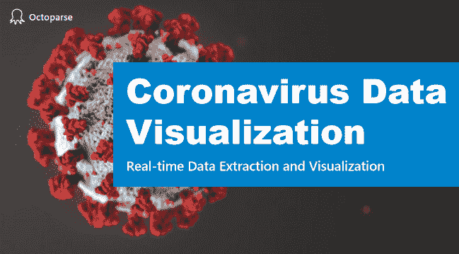

# 冠状病毒数据提取和可视化

> 原文：<https://medium.datadriveninvestor.com/coronavirus-data-extraction-and-visualization-7a0ef6c06474?source=collection_archive---------12----------------------->

自 2020 年 1 月 20 日韩国确诊首例冠状病毒以来，截至 3 月 12 日，感染总人数已达 7869 人。虽然这次疫情疫情显示出被控制在国内的迹象，但还不确定我们需要多长时间才能完全击败冠状病毒。

在这一点上，我们认为有必要用一个更具互动性的视觉地图来呈现疫情。本文的目标是向您展示如何利用[**网络抓取**](https://www.octoparse.com/) 和可视化工具来完成数据分析工作的几个基本步骤。

本文由两部分组成:我们首先使用[**octo parse**](https://www.octoparse.com/)**提取 web 数据，然后使用 [**Finereport**](https://www.finereport.com/en/) 可视化数据。如果你是一个网络抓取工具的新手，请随意点击此视频******来学习如何从零开始提取数据。如果你对编码一无所知，不要担心，我们让文章超级容易理解。********

# ******第一部分:用八元解析进行数据抽取******

******首先，我们需要从疾病预防控制中心收集关于韩国的最新数据。放心用[爬虫档](https://www.dropbox.com/s/en3gjnmlw5zm6ky/Coronavirus%20Data%20Extraction.otd?dl=0)自己练吧。******

******数据提取包括 3 个步骤:******

*   ******步骤 1:通过输入 URL 构建一个 scraper 任务******
*   ******第二步:点击提取网页数据******
*   ******步骤 3:执行 scraper 任务******

******听起来很简单，对吗？嗯，这很容易！******

********首先，**点击“高级模式”后将网址粘贴到框中。然后点击“保存网址”继续。它会在其内置的浏览器中加载网页，供您点击和提取。******

******接下来，**单击任何表格单元格，然后按照“操作提示”面板上的指导进行操作。选择“选择所有子元素”，然后单击“全选”。恭喜你！我们刚刚成功地创建了一个刮刀。现在，我们应该通过单击“在循环中提取数据”来确认该步骤。****

******最后但并非最不重要的**，点击执行刮刀。****

****当我们完成提取数据时，我们可以导出到 excel 格式，并使用它来创建地图可视化。我知道数据随着时间的推移很容易过时，尤其是对时间敏感的数据。此时，您可以利用它的调度程序将您的任务置于自动驾驶状态。****

**** [## 为什么数据将改变投资管理|数据驱动的投资者

### 有人称之为“新石油”虽然它与黑金没有什么相似之处，但它的不断商品化…

www.datadriveninvestor.com](https://www.datadriveninvestor.com/2019/01/25/why-data-will-transform-investment-management/) 

# 第二部分:用 Finereport 实现数据可视化

首先，单击菜单栏中的“加号”按钮，选择并导入我们刚刚收集的文件。您可以从“预览”窗口检查它的准确性。这是许多人可能会忽略的必要步骤。我们正在使用地理定位和相应的数据。如果 FineReport 无法将维度作为地理信息读取，它将无法创建相应的地图。我们的数据看起来不错。我们现在去拿地图吧。

要添加地图层，点击“编辑”并选择“韩国”。嘣！你的地图出现了！而且看起来很棒！现在我们需要获取地图上的点来展示我们收集的每个地理位置的严重程度。为此，单击“数据”将案例编号与每个地理位置联系起来。

我们仍然需要做一些最后的调整，使它漂亮。更改颜色并编辑格式。然后刷新屏幕。

现在，让我们创建一个可视化地图来成功显示疫情。除此之外，我还创建数据表、气泡图、折线图等等。我所做的就是把它们组合成一个仪表板。

最好的部分是，我们可以通过 API 导入数据来激活这个仪表板，这可以通过 Octoparse 实现。**** 

*****原载于 2020 年 3 月 15 日*[*【https://www.octoparse.com】*](https://www.octoparse.com/blog/coronavirus-data-extraction-and-visualization)*。*****