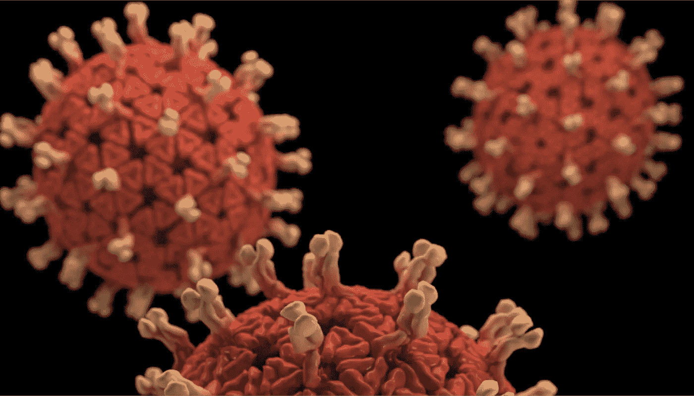
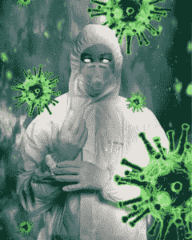

# 冠状病毒流行；超越社会政治修辞

> 原文：<https://medium.datadriveninvestor.com/coronavirus-epidemic-beyond-socio-political-rhetoric-470c8cfd0926?source=collection_archive---------10----------------------->

Coronavirus, COVID-19, pandemics

# 对新发传染病年表的深入了解

在过去的几十年里，我们都在思考新出现的和再次出现的传染病的日益增加的焦点。或者至少，我们看到了公共媒体与各种健康流行病的利害关系，这对政治家、记者和经济学家来说似乎是有价值的。

今天，冠状病毒，正如其铭文所示，已经成为社交媒体主题的(皇冠)。冠状病毒流行病的恶名激增并不是它自己独有的，因为许多其他疫情疫情在历史上已经成为警惕的核心。

 [## 医疗保健的未来正在被一场大型技术入侵所塑造|数据驱动型投资者

### 过去十年，全球经济的所有部门都经历了大规模的数字颠覆，而卫生部门现在…

www.datadriveninvestor.com](https://www.datadriveninvestor.com/2018/11/02/the-future-of-healthcare-is-being-shaped-by-a-big-tech-invasion/) 

并非每一次新出现的传染病爆发都会吸引相同的媒体、公众或政治关注。最重要的是，并不是每一种传染病都受到类似的公共卫生监督或拨款。今天，政治的、非正统的经济实践和人口健康计划在确定卫生当局对新出现的疾病的严重性和反应性方面起着至关重要的作用，而不考虑其相对发病率和死亡率倾向。

Coronavirus pandemics

# 新出现的传染病；和冠状病毒

关于新发传染病的国家过敏和传染病研究所有一份关于新发流行病的出版物。这份声明仅仅标志着一种新出现的传染病。后者主要包括以前不熟悉的传染病的爆发；在过去二十年中，已经确定的发病率和地理跨度最近激增的疾病。新出现的流行病也可能指持续存在的广泛传播的挑战性疾病。

我们可能都知道的一些新出现的疾病包括艾滋病毒感染、SARS、莱姆病、大肠杆菌 O157: H7(大肠杆菌)、汉坦病毒、登革热、西尼罗病毒和寨卡病毒。今天，我们也可以将冠状病毒感染包括在新出现的疾病中。

这并不罕见，我们可以见证旧的传染病在经历了几十年甚至几个世纪的大幅下降后再次出现。由于针对曾经得到有效控制的疾病的公共卫生法规的恶化，疾病的再次出现也可能随之而来。紧急情况也可能由于生物体的突变或当已知致病生物体的新毒株如流感病毒出现时发生。

人类行为，如抗生素的过度使用，也会通过产生耐药细菌来影响重新出现。

疟疾、肺结核、霍乱、百日咳、流行性感冒、肺炎球菌疾病和淋病是最近一些突发事件——传染病出现的例子。

# 冠状病毒流行病

2020 年 2 月[，世界卫生组织(世卫组织)](https://www.hopkinsmedicine.org/health/conditions-and-diseases/coronavirus)公布了一种新型冠状病毒毒株的官方术语，自 2019 年首次爆发以来，这种病毒已在全球范围内感染了数千人。该组织现在称之为新冠肺炎。后一个术语代表冠状病毒的“COVI”，“D”代表“疾病”，“19”代表它被识别的年份(2019 年)。但是，病毒本身目前被称为“新型冠状病毒”。

冠状病毒种类繁多。只有少数菌株会致病。新冠肺炎病毒是最近在中国武汉爆发的呼吸道疾病的罪魁祸首。

# 新冠肺炎传播方式

最近的数据显示新冠肺炎病毒可以在人与人之间传播。然而，还有许多未知因素，包括它的传染性有多强，尽管目前的证据支持病毒的高传播性。

全球各地的各个中心都在关注 2019 年冠状病毒的传播。截至 1 月 30 日，世界卫生组织已宣布新冠肺炎疫情为全球公共卫生紧急事件。

# 冠状病毒流行病是如何开始的？

这是典型的迹象，表明新冠肺炎最初于 2019 年 12 月出现在中国武汉市。然而，卫生官员仍在调查这种新型冠状病毒的确切谱系。然而，它可能与中国武汉的一个海鲜市场有关，因为一些访问该市场的人患上了由新型冠状病毒引起的病毒性肺炎。

新冠肺炎病毒显然可能来自动物。似乎在人与人之间传播。在中国和包括美国在内的超过 24 个其他国家的任何地方的人群中都发现了冠状病毒。

epidemics

# 新冠肺炎的潜伏期和症状

冠状病毒感染的症状似乎会在接触后 14 天内出现。

新冠肺炎症状是非特异性的，包括:咳嗽；发烧；呼吸急促也是一些其他病毒感染(如流感)的常见症状。在极少数情况下，新冠肺炎会导致严重的呼吸系统问题、肾衰竭甚至死亡。

# 新冠肺炎是如何被诊断的？

由于冠状病毒与其他生物体具有相同的症状和感染模式，因此仅通过简单的体检可能难以诊断。轻微的新冠肺炎病例可能看起来类似于流感或重感冒。实验室检查可以确诊。

# 新冠肺炎疗法

至于许多病毒感染，冠状病毒没有特效疗法。感染新冠肺炎病毒的患者必须接受旨在缓解症状的支持性治疗。对于严重病例的治疗，包括研究、药物和疗法，可能适用。

# 新冠肺炎的死亡率

可以预见，新冠肺炎的死亡率为 1-2%。截至 2020 年 2 月 28 日，已有 2871 人死于新冠肺炎。然而，相比之下，有 36，687 人痊愈。

# 冠状病毒和 SARS

2003 年爆发的严重急性呼吸系统综合症(SARS)也始于中国，并在 2004 年稳定下来之前传播到其他国家。导致新冠肺炎的病毒与导致 2003 年 SARS 爆发的病毒有关。后两种是冠状病毒的类型。但新冠肺炎似乎比 2003 年的 SARS 传播得更快，但病情没有那么严重。

# 针对冠状病毒的保护？

疾病控制和预防中心(CDC)建议，至少 20 秒钟的频繁洗手可以显著减少传播。使用含酒精的洗手液可能还有额外的好处。其他预防措施包括用纸巾遮住咳嗽和打喷嚏，然后将纸巾扔进垃圾桶，避免用未洗手的手接触眼睛、鼻子或嘴巴。

生病的人必须呆在家里，并被督促清洁和消毒物体表面，包括它们周围的物体。

 [## “不管公共安全倡导者如何估计许可证条例可能造成的后果…

medium.com](https://medium.com/@Adamtabriz/irrespective-of-how-the-public-safety-champions-reckon-what-licensing-ordinances-can-perpetrate-a3555c13687a) 

# 冠状病毒和流感病毒有什么相似之处

流行性感冒，俗称“流感”，是由流感病毒引起的传染性疾病。像冠状病毒感染一样，症状可能从轻微到严重。然而，最常见的症状包括高烧、流鼻涕、喉咙痛、肌肉和关节痛、头痛、咳嗽和感觉疲劳。

流感和新冠肺炎是两种不同类型的病毒，但[两者都有典型的症状特征](https://www.google.com/amp/s/www.hopkinsmedicine.org/health/conditions-and-diseases/coronavirus/coronavirus-disease-2019-vs-the-flu%3famp=true)，包括发烧、咳嗽、身体疼痛、疲劳，有时还会呕吐和腹泻。两者都可能是轻微的或严重的，在极少数情况下甚至是致命的。这两种微生物会导致肺炎。两者都可以通过被感染者咳嗽、打喷嚏或说话时产生的飞沫在人与人之间传播。

新冠肺炎病毒和流感可以在患者出现症状前几天消失。

这两种病毒都不能用抗生素治疗，而两者都是通过解决症状来处理的，例如退烧。严重的病例可能需要住院和加强支持，如机械通气。

这两种疾病都可以通过频繁、细致的洗手，生病时呆在家里的角落里咳嗽，以及限制与感染者的接触来阻止。

新冠肺炎代表了病毒的一个单一品种。它代表 2019 年冠状病毒，称为“严重急性呼吸综合征冠状病毒 2 ”,或新型冠状病毒。但是另一方面，流感是由几种不同类型和毒株的流感病毒引起的。

虽然流感和新冠肺炎的传播方式相似，但也有可能不同。例如，新冠肺炎病毒可能会通过空气传播，而微小的飞沫可能会在空气中停留更长时间，甚至在患者不再靠近后也会给其他人带来疾病。

# 治疗

抗病毒药物目前还不能用于新冠肺炎，但是在我们说话的时候，这些药物正在接受测试，看它们是否能解决症状。抗病毒药物可以治疗症状，有时还可以缩短病程。

目前新冠肺炎还没有可用的疫苗，尽管它正在研发中。流感疫苗是容易获得的，对预防一些最危险的类型或降低流感的严重程度是有用的。

# 死亡率和发病率统计

根据传染病研究和政策中心对 72000 名新冠肺炎患者[进行的调查，检测到 2.3%的死亡率](http://www.cidrap.umn.edu/news-perspective/2020/02/study-72000-covid-19-patients-finds-23-death-rate)。

coronavirus SARS epidemics

新冠肺炎在全世界感染了大约 84，119 个病例；截至 2020 年 2 月 28 日，美国有 62 例。

全球流感病例估计有 10 亿；美国每年有 930 万到 4500 万个病例。

全世界报告约 2，871 人死于冠状病毒；截至 2020 年 2 月 28 日，美国无死亡病例；然而，预计将出现。全球报告的流感死亡人数为 29.1 万至 64.6 万；美国每年有 12，000 到 61，000 人死亡。

# 电晕病毒神话

不幸的是，冠状病毒流行病受制于其自身的[故事](https://www.hopkinsmedicine.org/health/conditions-and-diseases/coronavirus/2019-novel-coronavirus-myth-versus-fact)。很少有人说误解是:

*   治愈新冠肺炎的疫苗已经问世。
*   一个人可以通过吞咽或漱口漂白剂、服用醋酸或类固醇，或者使用精油、盐水、乙醇或其他物质来保护自己免受新冠肺炎病毒的侵害。
*   新型冠状病毒是人们有意构思或释放的。

事实是:病毒会随着时间而变化。周期性地，当病毒通过动物传播时，疾病爆发发生；或者经历变化并传递给人类。但是它应用于冠状病毒的真实性目前是推测性的。

*   到处都有人死于新冠肺炎病毒。

毫无疑问，截至 2020 年 2 月 28 日，中国已有 2791 人死于新冠肺炎，其他国家也有 80 人。

*   购买从中国运来的产品会让人生病。

研究人员目前正在研究新型冠状病毒。他们仍然需要更多地了解它是如何感染人类的。在撰写本文时，科学家评论说，像新冠肺炎这样的病毒不会在表面存活很长时间。因此，人们不可能因为一个包裹在运输途中数天或数周而感染新冠肺炎病毒。

*   口罩可以保护我们免受新冠肺炎病毒的侵害。

特殊类型的专业紧身口罩(如 N95)可以在医护人员照顾受感染患者时保护他们。但是对于一般公众来说，佩戴轻便的一次性外科口罩的好处还不清楚。

# 媒体在冠状病毒流行中的作用

公共卫生的重要性毋庸置疑，因此后者并不能消除对新冠肺炎的重视。然而，现实的期望和考虑到环境的预防措施是至关重要的。公共媒体应该使公众意识到最新的传播，而现有的公众，但偶尔我们看到媒体的反应并不排斥公共健康和安全。相反，遵循政治使命的花言巧语。

很明显，在通知公众时，媒体完全过火了，因此造成了公众恐慌。但恐慌编造与否总是传达出[负面后果](https://www.google.com/amp/s/thehill.com/opinion/healthcare/485197-the-hidden-cost-of-causing-a-panic-over-a-coronavirus%3famp)。

CDC 网站公告显示，2003 年持续 6 个月的 SARS 给世界造成了大约 400 亿美元的损失。

healthcare and lab test

对当前冠状病毒流行的恐慌已经超过了对疫情非典的恐慌。在这种情况下，它谨慎地推断，一旦新冠肺炎走上正轨，企业和他们雇用的人的财务回报将远远高于 400 亿美元。

# 医疗保健的政治

21 世纪的医疗保健比以往任何时候都更加政治化。它已经成为左翼比右翼更重要的讨论话题，主要是因为它已经成为社会福利名册上的一员。谁能提供最低成本的医疗服务或拥有遏制疫情的灵丹妙药，谁就能赢得大众投票。这样做的时候，他们根据自己复杂的演讲行为来吸引媒体。从时间顺序来看，总而言之，政治总是在医疗保健服务中扮演着无效的角色。政治化的医疗保健是一个探针，以创造更复杂的，并提出了第三方自我寻求者的温床。通过建立公众的紧迫感甚至恐慌感，它可以被用作提高个体企业销售和收入的代理。

# 冠状病毒政治学

今天，随着公共媒体建立的无尽的紧迫感，冠状病毒的故事正在以比病毒本身更快的速度广泛展开。由于武汉冠状病毒爆发仍有待全球披露，人与人之间的传播现已得到证实，其故事和愤怒也是如此。这座拥有 1100 万人口的城市现在正被隔离。词汇也随着病毒的传播而扭曲。随着事实的出现，从暴发到流行，疫情或者大概到世界卫生组织(世卫组织)的国际关注的突发公共卫生事件。所有最新的冠状病毒死亡人数是可怜的。然而，公众的兴趣和媒体对疫情爆发的紧张报道，包括将这种新病毒称为“神秘”的不良倾向，正在加剧已经存在的普遍恐慌感。

# 遏制传染病的公共卫生战略

H1N1 09 和 SARS 的[经验非常有用，让我们了解了应对新出现流行病的简化方法的潜力和不足。关键信息是需要扩大监督，更明智的规划，改善诊断测试，并保持对基本卫生标准的关注。](https://www.ncbi.nlm.nih.gov/pubmed/21252658)

关于[数学模型](https://www.ncbi.nlm.nih.gov/pmc/articles/PMC6398585/)的公认方法的推论仅仅依赖于几个假设。然而，地理建模方法主要通过空间科学发挥作用，可能会填补没有数据确定的空白。有时，潜在的生态过程知之甚少，入侵过程的动态方面被忽视。这些缺陷可以部分地通过添加病毒基因组数据得到改善，这些数据包含关于先前传播和入侵模式的信息。

# 疫苗产业、人口健康和疫苗市场

今天，我们的医疗保健模式遵循了两个世纪之久的人口健康计划。因此，它将主要侧重于治疗选择(在这种情况下，疫苗开发)，只有当它属于较低的成本效益比的范围内。换句话说，制药行业为了一小部分人开发疫苗是不可行的。

# 疫苗市场的价值

今天，冠状病毒的爆发凸显了即将到来的[、350 亿美元的疫苗市场](https://www.cnbc.com/2020/02/21/coronavirus-brings-light-to-the-35-billion-vaccine-market.html)。冠状病毒爆发的关键人物正在对快速增长的疫苗行业进行审查。

疫苗市场在过去 20 年中翻了 6 倍。占市场份额约 85%的四大巨头是英国制药商葛兰素史克、法国制药公司赛诺菲和美国的默克和辉瑞。这种寡头垄断或有限竞争的状态限制了少数生产商或销售商的市场份额。主要由于制造和供应链的复杂性，已经形成了显著的市场整合。反过来，后者垄断了疫苗行业，对少数人产生了负面影响，这些人本来可以获得大量适当的疫苗接种。

# 媒体和政治帮助冠状病毒问题

将流行病和流行病政治化对我们的世界来说并不新鲜；尤其是美国。被称为“西班牙流感”的致命病原体发生在 1917 年 4 月，当时美国加入了第一次世界大战。在担任总统期间，伍德罗·威尔逊发起了一场运动，在压制批评的同时赢得民粹主义者的支持。因此，他组织了一个公共信息委员会，其主席乔治·克里尔开始促进“宣传”，即“信仰的传播”。

威尔逊批准了《煽动叛乱法》，该法禁止不诚实、淫秽、粗鄙和贬损政府或任何可能阻碍战争努力的语言。政府在全国张贴标语，要求公民举报散布悲观轶事的人。

 [## “尽管是一个纯医学领域，干细胞治疗、研究及其吸引力已经成为……

medium.com](https://medium.com/@Adamtabriz/despite-being-a-pure-medical-domain-stem-cell-therapy-research-and-its-appeals-have-become-the-a864b713ce79) 

# 政治贡献

# 西班牙流感

1918 年初，[西班牙流感病毒感染了堪萨斯州军事基地芬斯顿军营的大量士兵。之后，感染迅速蔓延到其他车站。随着它进入平民世界，公共卫生官员为战争努力讲述了一个谎言。它来自威尔逊创造的宣传机器。一艘军舰将病毒带到了费城，水手们开始死亡。然而，该市的公共卫生管理人员，也是一位政治候选人，名叫威尔默·克鲁森，认为这是“老式流感”](https://www.newyorker.com/news/daily-comment/the-coronavirus-and-how-political-spin-has-worsened-epidemics)

随着死亡人数的上升，克鲁森让公众相信，这座城市正走在“将疫情扼杀在萌芽状态”的轨道上，一些新闻机构成了维护面子的联盟。《问事报》的一个标题宣称，“科学护理阻止流行病”，而事实上，当地医院正在新病例的挤压下崩溃。

# 艾滋病病毒

1982 年，随着艾滋病毒和艾滋病病例在男同性恋人群中日益显著。美国疾病控制和预防中心也报告说这是一种流行病。但是，当罗纳德·里根总统的发言人拉里·斯皮克斯在新闻发布会上被邀请对此进行反思时，他对这一概念进行了愚弄。不可避免的是，在那之后，里根在 1985 年 9 月公开谈到了这种疾病。

# 冠状病毒

在中国，继李文亮之后，武汉的一位医生引起了人们对冠状病毒的关注。中国警方瞬间批评他喷“谣言”。那是在他死于病毒之后；政府限制要求言论自由的网上帖子。就在病毒浮出水面并开始传播的几周后，武汉当地政府命令新闻机构封锁消息，并允许大约 500 万人逃离这座城市，直到 1 月 22 日被隔离。

# 中国不再强调冠状病毒的威胁

尽管有紧急要求，中国共产党还是将来自国际医学组织的活病毒样本压制了数周。许多人怀疑中国人继续淡化冠状病毒的影响。低报的感染和死亡人数，特别是考虑到检测工具的缺乏和通讯中断，似乎为这种假设提供了合理的依据。

民主党总统候选人周六粉碎了唐纳德·特朗普(Donald Trump)的观点，即冠状病毒是民主党人的[【新的骗局】](https://www.theguardian.com/us-news/2020/feb/28/trump-calls-coronavirus-outbreak-a-hoax-and-links-it-to-immigration-at-rally)描述袭击是“危险的”和“令人不安的”，而特朗普则喊道，民主党人正在利用冠状病毒爆发的政治优势。

特朗普在 2020 年 2 月南卡罗来纳州的一次集会上提出了这一观点。他告诉人群，民主党人一直在将冠状病毒爆发“政治化”。

当冠状病毒最近几个月进入美国时，它立即陷入了政治姿态和操纵之中。最近，[拉什·林堡](https://en.wikipedia.org/wiki/Rush_Limbaugh)，美国电台名人，[保守派](https://en.wikipedia.org/wiki/Conservatism_in_the_United_States)政治主播，告诉他的听众。

# 伊朗和新冠肺炎

伊朗政府直到很晚才证实只有 12 人死于该病毒。库姆的当地卫生官员告诉记者，仅在他的城市，就有 50 人死于新冠肺炎。在一场残酷的闹剧中，伊朗卫生部副部长 Iraj Harirchi 出现在电视上淡化风险，甚至在他咳嗽并用毛巾擦额头的时候。那天晚上，他发现冠状病毒检测呈阳性。

# 媒体投稿

根据 NBC 的[报道，冠状病毒正在分配一个独特的机会来干涉美国即将举行的总统选举。提高疾病恐惧症的可能性让人们在选举日呆在家里，这表明虚假信息运动可能如何绕过科技公司的保护。](https://www.nbcnews.com/tech/security/coronavirus-provides-unique-opportunity-meddle-u-s-election-officials-warn-n1145331)

在去年秋天发给选举官员的一份警告中，联邦调查局(FBI)明确警告说，俄罗斯正在努力暗中压制或扼杀美国选民参加明年的选举。

 [## 身体互联网(IoB):医疗支持的一个关键缺口:又一波技术浪潮…

### 互联网互联网和物联网(IoT)是人类最具革命性的发明…

www.linkedin.com](https://www.linkedin.com/pulse/internet-bodies-iob-key-notch-medical-sustenance-yet-tabriz-m-d-/) 

# 美国、意大利、伊朗、中国和世界其他地方

据美国有线电视新闻网[报道，截至 2020 年 2 月 2 日，意大利冠状病毒病例上升了 50%](https://www.google.com/amp/s/amp.cnn.com/cnn/2020/03/01/europe/italy-coronavirus-cases-travel-advisory/index.html) 。

意大利民事保护局报告称，该国已有 1694 例确诊冠状病毒病例。这比一周前的 1，128 例确诊病例有所增加，截至上述日期记录的死亡人数为 34 人。除亚洲以外，意大利是冠状病毒病例最多的国家。

流行病似乎不服从任何确定的社会经济模式；然而，有组织的方法是最重要的。

# 公司和冠状病毒流行病

在更早的[五十年](https://www.healthaffairs.org/doi/full/10.1377/hlthaff.24.3.622)期间，制造疫苗的众多制药公司已经急剧减少，那些仍然制造疫苗的公司已经减少库存来制造新的疫苗。制药公司故意退出疫苗市场，仅仅是因为疫苗的研究、开发、测试和生产成本高昂。此外，因为销售疫苗的市场远小于对其他药品的需求。

新出现的感染、公共紧迫性的发展以及围绕各种传染病爆发(如新冠肺炎)的恐慌，为少数几家寡头垄断的制药公司提供了潜在的财政机会。

但是在平常的一天，顶级疫苗制造商默克和辉瑞一直瞄准中国和老年人，因为这更有利可图。这是否意味着从中国武汉出现索尼克只是巧合？！

据[美国消费者新闻与商业频道](https://www.google.com/amp/s/www.cnbc.com/amp/2020/02/27/goldman-sees-zero-earnings-growth-for-us-companies-this-year-because-of-coronavirus.html)报道，高盛已经将美国公司今年的收益预期修改为每股 165 美元，预计 2020 年增长 0%。高盛(Goldman Sachs)的估计是华尔街一致预测的一笔意外之财，华尔街仍预计今年收益将攀升 7%。普遍的预测是，缩减的预测反映了第一季度中国经济活动的急剧下降。此外，它预测美国出口商的最终需求将下降，许多美国公司的供应链将爆发，美国经济活动将放缓，以及行业的高度怀疑。

# 流行病政治学

对三种不同社会经济环境下的三种不同疾病爆发的政治的系统回顾揭示了[流行病政治](https://link.springer.com/article/10.1007/s40609-018-0123-y)在某种程度上是无所不在的。然而，政治的表现因收益框架而异。在多伦多 SARS 疫情、巴西寨卡疫情和利比里亚埃博拉疫情期间独特描绘的政治原则。

最普遍的是社会和经济不平等的作用，包括在特定流行病期间的贫困。不管国家的工资水平如何，少数民族和边缘化群体最容易受到新出现的感染。政府和机构要对这些个人和社区做出适当的反应。这样做，他们必须伴随着代表最容易受到流行病的小说。具体来说，他们应该在主流媒体以及同行评议的出版文献中为贫困社区服务。值得注意的是，它们必须支持往往会影响卫生规划和决策的流行病学和医学研究。

# 新发疾病的规模政治

几十年来，规模政治的概念为历史学家提供了一个实用的外壳。它帮助他们分析了环境和健康之间的联系。规模政治使他们能够研究 20 世纪 90 年代围绕新发疾病的公共卫生运动。就不同的参与者如何在地理和政治表达中运用尺度而言，后者尤其如此。

此外，它使他们能够了解如何在不同的规模上进行配置以产生结果、后果和干预。以及他们在陈述的不同层次之间转换的时刻。生物医学科学家、大众媒体、公共卫生和国家安全专家为这场运动做出了贡献。他们完全利用了美国人对全球化和现代性在新风险产生中的作用的矛盾心理。他们也不可避免地用一些术语来框定它们，使特定的干预显得必要、合理或实际。

# 人们恐慌了

疾病控制和预防中心(CDC)提醒我们不要害怕，同时建议采取必要的预防措施。该机构举例说明，2003 年 2 月爆发的疫情 SARS 也是在亚洲出现的冠状病毒。因此，到 2003 年 7 月非典肆虐时。当时，它已经蔓延到 29 个国家，感染了大约 8000 人，并夺去了大约 775 人的生命。绝大多数死亡的人都是老年人或患有严重疾病的人。

# 病人痛苦

在新出现的流行病引发的所有政治和经济混乱中，最大的困难最终落在了病人身上。冠状病毒政治化的负面后果是迅速的。然而，公司业务的垄断很可能比实际病毒的致病后果更容易传播。几个世纪以来，新出现的传染病一直盛行。然而，如果被认为是可行的话，它们只是作为公司的赚钱工具或政客赢得选票的工具。公众恐慌是理想的策略，而不是结果。

很明显感觉到了一种紧迫感，但恐慌是必须不惜一切代价避免的一个方面。恐慌和混乱必然会给医生、医疗利益相关者，最重要的是给患者带来更多不必要的负担。社会经济的衰退是相当大的，受益的是少数公司，而大多数公司则陷入困境。

*原载于 2020 年 3 月 8 日*[*【http://www.datadriveninvestor.com】*](http://www.datadriveninvestor.com/2020/03/08/coronavirus-epidemic-beyond-socio-political-rhetoric/)*。*

 [## 社会主义，裙带资本主义和普遍无视个人性格|数据驱动…

### 在生存领域内，人类属于大多数面向社会的居住者的范畴。几个世纪以来…

www.datadriveninvestor.com](http://www.datadriveninvestor.com/2020/02/20/socialism-crony-capitalism-and-the-prevalent-disregard-for-individual-disposition/)