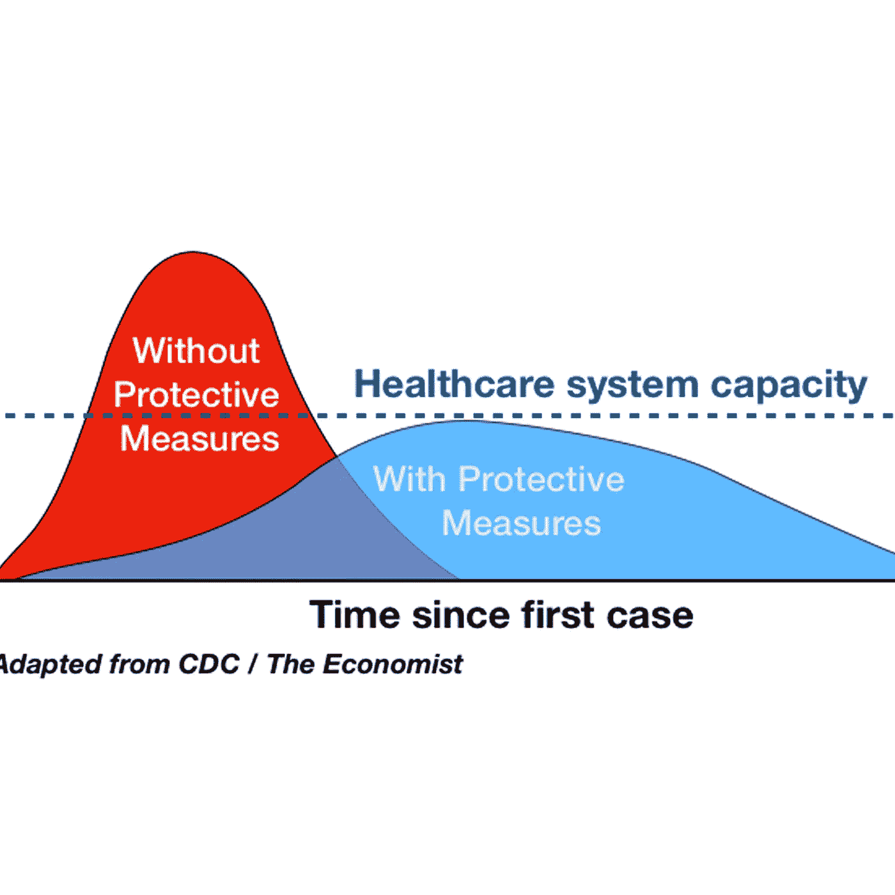

# 冠状病毒、网络和经济

> 原文：<https://medium.datadriveninvestor.com/coronavirus-networks-and-the-economy-585e79b20c7d?source=collection_archive---------7----------------------->

## 不要惊慌。

如果你现在去杂货店，你会发现没有卫生纸，很少纸巾(尽管商店的招牌上写着每个家庭只卖一张)，几乎没有肉，尤其是汉堡。自然，没有液体洗手液(虽然有很多条肥皂)，也没有洗手液。换句话说，大多数人都很恐慌。

大量的人目前在我们的杂货店和零售店。停车场几乎全满了。与此同时，我们发现越来越多的冠状病毒病例，越来越多的人出现在公共场合。这完全抵消了地方、州和联邦政府为减少传播所做的努力。如果人们继续像以前那样买东西，我们的商店会继续保持低密度，病毒传播也会减少。相反，恐慌实际上是在增加传播的概率。

 [## 另一场精心策划的全球经济危机正在逼近？如果我们的数据经济可以帮助它|数据…

### 我们的 DApp 的开发，称为 DECENTR，目前正与我们的 R&D 同步进行，作为我们即将到来的…

www.datadriveninvestor.com](https://www.datadriveninvestor.com/2019/03/06/another-engineered-global-economic-crisis-looming-not-if-our-data-economy-can-help-it/) 

没有人喜欢听到这些，但是我们面临的短缺在很大程度上是因为反价格欺诈法。在危机期间允许价格上涨的少数历史案例中，价格上涨了几天，大量高需求的东西很快就可以得到，然后价格下降到危机前的水平以下。这完全是经济学可以预测的。如果没有这一过程，我们最终只会面临大规模短缺，许多人无法获得他们需要的东西。除了同样被抢购一空的纸巾和面巾纸之外，卫生纸没有太多的替代品。奇怪的是，我今天去商店的时候，货架上都是面巾纸。尽管打喷嚏和流鼻涕不是新冠肺炎的症状之一，但它被与流感相提并论的事实会让你认为人们会买纸巾，但迄今为止，没有

## 病毒

冠状病毒实际上很常见。几乎可以肯定，你过去患过几种冠状病毒。你可能以为是感冒了。如果情况特别糟糕，你甚至可能会认为是流感。然而，冠状病毒的问题是，偶尔会出现一种特别致命的病毒——至少相对于其他冠状病毒而言——如 2002-2004 年的 SARS、2012 年的 MERS 和目前正在全球传播的新冠肺炎。幸运的是，尽管新冠肺炎的死亡率是流感的 10-30 倍(死亡率为 1-3%对 0.1%)，但它远没有 SARS (11%)和 MERS (35%)那么致命。然而，较低的死亡率通常意味着病毒传播更快，年轻人和健康人的轻微症状意味着快速传播是完全可能的。

新冠肺炎主要感染下呼吸道。对大多数人来说，这是轻微的，会引起低烧、干咳、身体疼痛、鼻塞、流鼻涕和喉咙痛。如果你发高烧、呼吸急促、咳嗽严重——尤其是痰多的时候(表明你可能得了肺炎)，那绝对是你去医院的时候了。症状可能会持续 3-13 天，在此期间你仍然具有传染性。也就是说你迫不及待地想要生病，以避免传染给别人。你甚至可能是携带者而不自知，因为有些人根本没有任何症状，或者症状非常轻微，你甚至不会认为自己患有新冠肺炎。

如上所述，普通流感的死亡率约为 0.1%，患有其他健康状况的老年人受到的打击最大。从上图中我们可以看到，老年人再次受到最严重的打击——但比例要高得多。如果你年轻健康，你会得流鼻涕，但你可能会把它传染给你的父母或祖父母，并有可能杀死他们。对于年轻人和健康的人来说，这种疾病与你们无关，而是与我们的老年人有关。

然而，如果我们不减缓传播速度，这种疾病很容易就会影响到你。我们需要避免大规模人群和避免会导致感染的接触的原因是为了减缓传播，而不是阻止它。我们需要减缓传播速度，这样我们的医院才不会不堪重负。

我们不希望我们的医疗保健系统达到容量，更不希望超过容量(我们的医疗保健系统存在这个问题有很多原因，其中最重要的是限制容量的法规。虽然孩子们一般不会感染新冠肺炎病毒，但如果医院人满为患，如果他们因其他疾病或意外而生病，就没有地方可去了。你也一样。如果我们能减缓传播速度，医院就能保持满负荷运转，人们就不会面临死于其他本可以避免的疾病的危险。

## 经济影响

我们已经看到了这种病毒对经济的一些影响。股票市场崩溃了——一次又一次地崩溃。美联储提出 1.5 万亿美元的一揽子计划来帮助股市复苏，但这是对华尔街的救助，不会影响整体经济。真正的问题来自那些选择关闭的企业，它们没有能力继续支付员工工资。这些人仍然有账单要付，还有杂货要买，抵押贷款公司也不太可能放任不管。一些缓解可以以临时普遍基本收入的形式出现，如国会正在提议的那样，但这是否会通过，以及钱从哪里来都是值得怀疑的。毕竟，3 亿人每月 1000 美元相当于每月 3000 亿美元。美联储提出的 1.5 万亿美元救市计划将持续 5 个月。这可能足够覆盖我们受新冠肺炎影响的时期了。

随着时间的推移，经济影响将更加广泛，很难说会有什么影响。我们将发现我们的经济体系到底有多脆弱——我们可以肯定，无论发现什么弱点，都将被归咎于市场是自由市场经济的程度，而不是它不是自由市场经济的程度。然而，正是法规和法规减缓反应时间的事实将脆弱性引入了系统。我要指出的是，私立学校在公立学校关闭前几天就关闭了(有些学校，比如纽约，还没有关闭)，私人公司的反应比政府机构快得多。地方政府也比州政府和联邦政府反应更快——我要指出，达拉斯市比得克萨斯州反应更快，而得克萨斯州比联邦政府反应更快。两者之间有一天的差异，但指数增长期间的一天可能是很重要的。

服务经济肯定会比其他行业受到更大的冲击。航空公司、酒店和娱乐业将受到最沉重的打击，因为人们旅行和参加的活动越来越少(即使他们没有被明确禁止这样做)。然而，由于服务经济在美国经济中占如此大的比重，这肯定会对整个经济产生连锁反应。我们肯定会看到经济下滑，尽管这也可能是短期的。

## 政治分歧

我们正处于选举年，必然会有政治分歧。这忽略了一个事实，即特朗普、桑德斯和拜登肯定都在这种病毒最危险的年龄范围内，尽管它也肯定会以这种方式影响选举。

疾控中心和食品药品管理局是减缓新冠肺炎的最大障碍之一。由于 CDC 和 FDA 的规定，本可以生产新冠肺炎检测试剂盒的公司被禁止生产。换句话说，如果不是因为政府的规定，我们本可以有更广泛的病毒检测手段。不知何故，这两个组织(或其存在的逻辑)都不会受到指责，尽管现任政府肯定会受到指责。具有讽刺意味的是，本届政府喜欢限制货物和人员的流动，这很可能会大大减缓传播速度。在正常情况下，爱情对经济有害，但有了疫情，它实际上可能会有积极的结果。不幸的是，如果这被证明是真的，他们会将这些好处过度应用于正常情况，并造成长期伤害。

就政治行动而言，这才是真正的危险。很多时候，当政府在紧急情况下采取行动时，他们颁布的法律在某种程度上仍然有效。想想那些在 9/11 之后近 20 年仍然存在的东西，它们肯定已经超越了政府控制的必要性或有用性。因此，我们可以预期，政府在这场危机中所做的许多事情在危机结束后仍将继续存在。最有可能保留下来的将是那些在危机期间实际上最没有积极影响的东西。然而，那些不知道如何像经济学家一样思考的人，不会知道什么是真正可行的，什么是不可行的，什么是不可行的。

大多数可行的办法将由企业在自由市场中发现。大多数行不通的将由政府强制实施。然而，后者将会把所有成功的事情归功于自己，而前者将会因为我们将要经历的问题而受到指责。像往常一样。因此，长期的政治影响将是更多的政府管制和对你们生活的控制。这也可能是全民医疗的转折点。然而，在短期内，它可能会让一位看起来几乎肯定会赢得连任的总统下台民主党人选择了一位几乎在所有方面都与总统相似的人。

不管发生什么，如果我们是古希腊人，我们会把这一切归咎于我们糟糕的领导能力。也许他们说得有道理。不幸的是，我们似乎并不比他们聪明多少——当雅典在很大程度上因为一场瘟疫而被斯巴达人所削弱时，他们首先建立了十三个暴君，然后建立了一个民主政权，宣判苏格拉底有罪并将其杀害。我们的政治反应会是什么？谁会成为我们的替罪羊？

(对于那些想知道我是否有资格写这样的东西的人，我要指出的是，我有重组基因技术的本科学位和两年的生物学研究生课程，其中包括微生物学、细胞生物学、免疫学、比较免疫学和病毒学研究生课程。此外，我还发表了关于网络理论和经济学的同行评议论文。)