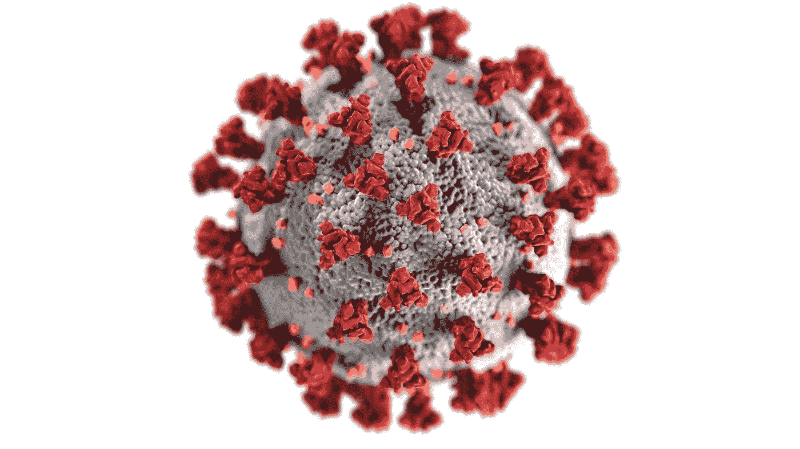
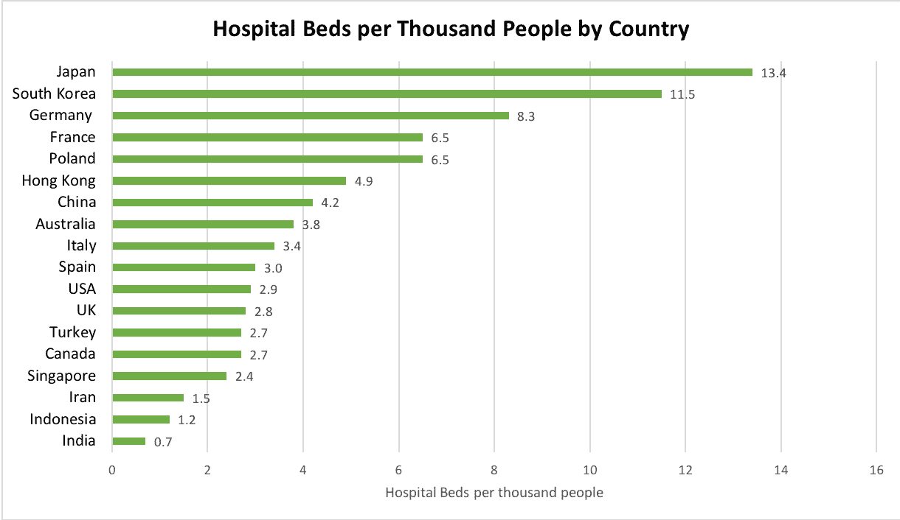
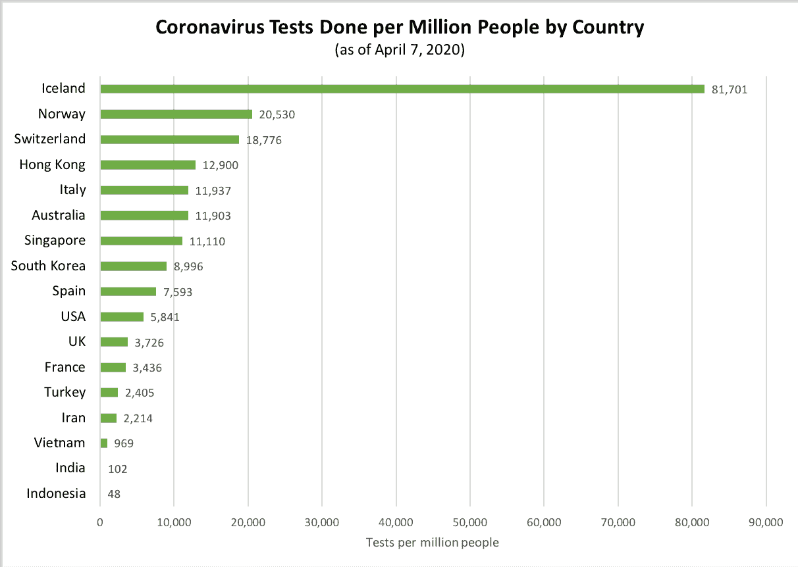

# 冠状病毒:真正的问题是什么？

> 原文：<https://medium.datadriveninvestor.com/coronavirus-not-highly-infectious-or-deadly-but-a-serious-shock-to-healthcare-infrastructure-d8fde265b883?source=collection_archive---------1----------------------->

## *冠状病毒可能没有我们想象的那么致命，但它仍然是对我们毫无准备的医疗基础设施的严重冲击*

Photo by [Melanie Wasser](https://unsplash.com/@melwasser) on [Unsplash](https://unsplash.com/photos/j8a-TEakg78)

我一直对世界对冠状病毒的反应感到困惑——尽管不是政策反应。我赞同社交距离和洗手。不过，我不太确定。

无论如何，我感到惊讶的是媒体和公众的反应，这种反应充满了如此多的恐惧、恐慌和末日般的恐惧——这种戏剧性的感觉是，冠状病毒是一种我们从未见过的如此致命的杀手。许多人被冠状病毒本身的恐惧所淹没，特别是从 T2 专家那里听说新冠肺炎可能会持续存在并年复一年地发生。

**然而，我相信新冠肺炎的未来仍然是光明的，因为这种疾病本身的传染性比许多其他疾病都低，没有我们想象的那么致命，而且变异速度很慢，足以让疫苗非常有效。**然而，我们对这次疫情毫无准备，我们需要扩大我们的医疗基础设施(病床、呼吸机、疫苗)来年复一年地应对冠状病毒。

再说一次，我并不否认冠状病毒的影响。我正在遵循协议，以帮助拉平曲线，节省医疗容量:经常用洗手液洗手，保持社交距离，经常呆在家里。我正在帮助一家服装制造公司改造生产线，每天生产多达 3 万套防护服和 10 万个口罩，供全印尼的医生应对新冠肺炎疫情。

但是让我们明确冠状病毒的真正问题。这种疾病本身不会比严重的流感更致命。我们的世界充满了其他许多传染性更强、致命性更强的疾病，直到今天每年仍有数百万人死于这些疾病。**然而，冠状病毒是严重的，这是因为，作为疫情，它对我们毫无准备的医疗基础设施造成了巨大的冲击。**

# **传染性**

围绕新冠肺炎的一些恐惧来自于它传播的广度和速度。让我们看看它与其他传染病相比如何。

为了衡量疾病的传染性，流行病学家使用一个称为 R0 的因子来衡量一个感染者将疾病传播给多少人。现在，专家们仍在确定新冠肺炎的传染性，但截至目前，大多数人说新冠肺炎的 R0 在 2 到 3 之间。[最近的一些初步研究表明](https://wwwnc.cdc.gov/eid/article/26/7/20-0282_article)R0 可以是 3 到 8 之间的任何值。我们将不得不等待并看到最终的研究结果。

现在，让我们来看看与其他主要疾病相比，新冠肺炎的传染性。[对比](https://www.bloomberg.com/opinion/articles/2020-03-05/how-bad-is-the-coronavirus-let-s-compare-with-sars-ebola-flu)(基于世卫组织和 CDC 数据):

*   基本季节性流感的 R0 约为 1.5，[每年感染多达 10 亿人，每年导致多达 65 万人死亡](https://www.who.int/influenza/Global_Influenza_Strategy_2019_2030_Summary_English.pdf?ua=1)。
*   结核病的 R0 在 6-7 之间，可能比新冠肺炎高两倍。最重要的是，结核病在许多发展中国家仍然非常普遍，每年导致 100 多万人死亡。
*   天花、脊髓灰质炎、白喉的 R0 都在 6-7 之间，也比新冠肺炎高两倍。
*   百日咳的传染性可能比 R0 为 12 的新冠肺炎高四倍(每年导致 16 万人死亡)。
*   麻疹是最具传染性的疾病之一，R0 为 15。它每年杀死超过 10 万人，仅在 20 年前的 2000 年，它每年杀死 50 万人。

Photo by [CDC](https://unsplash.com/@cdc) on [Unsplash](https://unsplash.com/photos/k0KRNtqcjfw)

因此，在从 0.8(中东呼吸综合征)到 15(麻疹)的传染性谱上，与每年导致数百万人死亡的其他传染性和致命疾病相比，新冠肺炎位于该谱的中下段。不可否认，即使具有中度传染性，我们也尚未对这种冠状病毒产生免疫力，因为它是一种新的变异。然而，冠状病毒[的变异速度实际上比流感](https://www.livescience.com/coronavirus-mutation-rate.html)慢四倍，这给了我们一种比流感疫苗更有效的冠状病毒疫苗的希望。因为季节性流感每年变异得更快，它仍然可以避开我们的疫苗，每年感染大约 10 亿人。因此，即使冠状病毒在这里停留，一旦我们有了疫苗，我们就可以没事了。

> 然而，我相信新冠肺炎的未来仍然是光明的，因为这种疾病本身比许多其他疾病的传染性更低，比我们想象的更致命，并且变异速度足够慢，疫苗可以非常有效。

# **死亡率** **死亡率**

Photo by [Mikael Seegen](https://unsplash.com/@mikael_seegen) on [Unsplash](https://unsplash.com/photos/jX6WXNkvsPs)

好的，所以如果新冠肺炎在传染病的整体架构中没有那么强的传染性，只比流感稍微强一点点，也许人们担心的是新冠肺炎有多致命，或者死亡率。**但是媒体报道的死亡率是误导和高度夸大的。他们对流感死亡率的比较在数学上是不一致的。**

让我们看看死亡率的公式:

死亡人数/感染人数= %死亡率

现在，这里的大问题是:**我们如何知道实际的感染总数？事实是，我们不知道新冠肺炎感染病例的实际数量，甚至在一段时间内也无法估计。事实上，我们严重低估了感染总数，因为大多数新冠肺炎病例症状轻微或没有症状，而且许多病例无法检测。因此，实际感染的人数比检测出的阳性感染人数高出许多倍。**

 [## 冠状病毒；惊慌失措；字里行间的 z |数据驱动的投资者

### 围绕冠状病毒的话题；更准确地说，新冠肺炎几乎占据了整个新闻预报的头条…

www.datadriveninvestor.com](https://www.datadriveninvestor.com/2020/03/23/coronavirus-a-to-panic-z-between-the-lines/) 

但是在缺乏数据的情况下，与其说数据还不够清晰，不足以确定新冠肺炎的死亡率，不如说**媒体和公众假设实际感染人数等于检测出的阳性*感染人数。***现在，在世界范围内，我们计算新冠肺炎死亡率的公式是:

死亡人数/*检测阳性*感染人数= *报告的*新冠肺炎死亡率%

截至 2020 年 4 月 8 日，对于新冠肺炎，我们有(根据 worldometer.info):

83090 例死亡/1446981 例阳性检测病例= 5.7% *报告的*新冠肺炎死亡率

然而，如果我们用现在计算新冠肺炎死亡率的同样方法来计算季节性流感的死亡率，流感的死亡率将是 10%。10%!

这是根据[这里](https://www.cdc.gov/flu/weekly/index.htm)最新的 CDC 数字。截至 2020 年 3 月 28 日的一周，CDC 估计，迄今为止，在 246，842 例阳性检测病例中，美国有 24，000 例流感死亡。因此，季节性流感的死亡率为:

24，000 例死亡/ 246，842 例阳性检测病例= 9.7% (~10%)流感死亡率

现在，疾病预防控制中心估计，美国每年有数千万人感染流感，因此，如果引用 10%的死亡率，这将意味着每年有数百万美国人死于流感，但这并没有发生。与此同时，媒体一直在引用该流感的死亡率为 0.1%。那么是 0.1%还是 10%呢？那是 100 倍的不同。

不同的是，当媒体引用流感的死亡率时，他们使用的是估计感染总数中的死亡人数，但当他们引用新冠肺炎的死亡率时，他们使用的是阳性检测感染中的死亡人数。他们没有告诉你他们使用了两种不同的计算方法。

如上图所示，本赛季到目前为止，美国只有 242，330 例阳性流感病例。但 CDC 估计，美国本季迄今为止的实际流感感染人数为 3900 万，比流感测试阳性病例数高出 161 倍(比流感测试总人数 127 万高出 30 倍)。这就是 0.1%流感死亡率的来源:

24，000 例死亡/ 39，000，000 例估计总病例= 0.06%流感死亡率(接近 0.1%)

> 所有这些意味着新冠肺炎的实际死亡率可能比目前报道的 5.7%低十倍以上，这意味着新冠肺炎的实际死亡率将低于 0.5%，类似于一场严重的流感

如你所见，**实际感染人数与流感检测阳性感染人数之间存在巨大差异(相差 100 多倍)**。新冠肺炎也是如此，原因如下:

1.  *选择偏差*:检测中会出现选择偏差，因为主要是那些有严重新冠肺炎症状的人接受检测，而不是每个新冠肺炎患者。但是大多数新冠肺炎病毒感染都有轻微的症状，疾病预防控制中心估计 25%的感染者不会有任何症状。**因此，大多数新冠肺炎感染者实际上永远不会被检测或记录**,因为大多数人不会有不良甚至明显的症状。这就是为什么[疾病预防控制中心建议](https://www.cdc.gov/coronavirus/2019-ncov/if-you-are-sick/steps-when-sick.html)大多数人在家康复，因为不必要的去医院检测新冠肺炎病毒会让你和其他人面临感染的风险，还会耗尽那些症状严重的人迫切需要的稀缺检测资源，这就是原因 2。
2.  *检测能力不足:*全面检测能力不足，尤其是在美国，例如，[医院只为员工和症状最严重的员工保留检测](https://www.bloomberg.com/news/articles/2020-04-06/hospitals-struggle-with-testing-protective-gear-report-finds)。**因为我们的检测能力如此之低，我们知道实际感染比阳性检测感染高得多**(稍后会有更多)。
3.  *地方病与流行病:*在计算新冠肺炎阳性检测病例的死亡率和估算的流感总病例的死亡率方面存在差异，因为**新冠肺炎是流行病，而流感是地方病。像新冠肺炎这样的流行病会迅速影响大量人群，然后消退，而像季节性流感这样的地方病会持续存在或定期复发。因为流感是地方性的，而且这么多年来每年都会发生，**随着时间的推移，** [**CDC 已经能够开发一个模型**](https://www.cdc.gov/flu/about/burden/how-cdc-estimates.htm) **来估计有多少实际的流感病例，而不仅仅是阳性检测病例。对于这次新的新冠肺炎疫情，我们现在还做不到这一点，因为我们仍在学习。创造像我们应对流感那样的新冠肺炎模型需要时间。****

现在，上述理由 1 和 2 中声称“大多数”新冠肺炎感染没有被检测或记录是模糊的。最多多少钱？幸运的是，来自 [**斯坦福**](https://www.wsj.com/articles/is-the-coronavirus-as-deadly-as-they-say-11585088464) **和** [**耶鲁**](https://www.nytimes.com/2020/03/20/opinion/coronavirus-pandemic-social-distancing.html) **的**传染病专家所做的研究和分析显示，超过 90%的实际新冠肺炎感染病例可能没有被报告。****

基于中国和意大利人口样本的新冠肺炎检测结果，[两位斯坦福大学专家计算出](https://www.wsj.com/articles/is-the-coronavirus-as-deadly-as-they-say-11585088464)在这些地区，**实际新冠肺炎感染人数比实际报告感染人数**高出 30 到 130 倍，这意味着即使在意大利(报告死亡率最高的国家之一，为 12.6%)，**新冠肺炎的实际死亡率也将在 0.1%左右。**

韩国提供了一个很好的例子，在那里进行了广泛的检测，因此阳性检测感染人数在所有实际感染中所占的比例较高。因此，韩国的死亡率明显较低，为 1.9%(全球为 5%)。但是，整个韩国人口中只有不到 1%的人接受了检测，在接受检测的人中，有 2.3%的人对新冠肺炎病毒呈阳性。现在，2.3%的阳性率并不等同于新冠肺炎在整个人口中的患病率，因为检测新冠肺炎的样本组并不代表整个人口。我们知道这是因为上面的第二个原因:稀缺的测试资源。由于当局只能测试这么多人，他们不会在完全健康的人身上浪费宝贵的测试资源。他们将只测试生病或脆弱的人，这些人最有可能患有新冠肺炎，从而扭曲了样本组的代表性。

但只是作为一个思想实验，如果我们确实假设新冠肺炎感染阳性率为 2.3%，与韩国全部 5120 万人口患病率相同，这将意味着韩国实际冠状病毒感染总数为 118 万，实际死亡率为 0.02%。

除了世界各地从未记录的所有这些感染外，作为病毒中心的中国[非常狭隘地将冠状病毒病例](https://www.medrxiv.org/content/10.1101/2020.03.23.20041319v1)定义为只有那些有呼吸道症状、发烧和 X 射线证明患有肺炎的人。这意味着在病毒开始传播的中国从未报道过如此多的感染病例。

真实的新冠肺炎死亡率比报道的要低得多，不仅因为病例数比报道的高几倍，还因为由于对如何分类新冠肺炎死亡的模糊和宽松的指导方针，新冠肺炎造成的真正死亡人数可能更低。

所有这些都意味着新冠肺炎的实际死亡率可能比目前报道的 5.7%低十倍以上，这意味着新冠肺炎的实际死亡率将低于 0.5%，类似于一场严重的流感(而且，在全球范围内，[流感每年仍导致 50 多万人死亡](https://www.who.int/news-room/detail/14-12-2017-up-to-650-000-people-die-of-respiratory-diseases-linked-to-seasonal-flu-each-year))。世界上研究新冠肺炎的最高权威之一，[安东尼·福奇也证实了这种大规模漏报新冠肺炎病例的可能性，因此大大降低了新冠肺炎的死亡率，更接近流感的死亡率。](https://www.nejm.org/doi/full/10.1056/NEJMe2002387)

最重要的是，如此多的死亡是由于缺乏医疗基础设施。有多少人因为没有足够的呼吸机、病床和医生而死去？例如，在意大利和西班牙，如此多的死亡是可以预防的，但由于资源稀缺，医生们被迫选择让谁生谁死。这让我们想到了新冠肺炎的真正问题。

# **基础设施不足**

所以冠状病毒很可能没有那么高的传染性或致命性。但这仍然是一个严重的问题，因为它对我们的医疗基础设施造成了巨大的需求冲击，而我们对新冠肺炎这样的流行病爆发毫无准备。

在世界各地，为所有需要医疗护理的人(现在包括新冠肺炎患者)服务的医院基础设施和冠状病毒检测基础设施都严重不足。

Source: World Bank Data: [https://data.worldbank.org/indicator/sh.med.beds.zs](https://data.worldbank.org/indicator/sh.med.beds.zs)

正如你在上面的图表中所看到的，一些大的发展中国家(如印度和印尼)以及发达国家(如美国和英国)的人均医院病床数量相对较低，以应对新冠肺炎住院患者的激增。这可能会导致更高的死亡率，因为许多本可以在新冠肺炎幸存下来的人可能会因为得不到所需的治疗而死亡。相比之下，韩国和日本的人均医院病床数量是美国和英国的四倍，这一点以及其他因素可能有助于这两个国家避免因缺乏治疗而导致不必要的死亡，因此新冠肺炎报告的死亡率要低得多，为 2%(全球为 5.7%)。

冠状病毒会给医院基础设施带来多大的冲击？例如，让我们看看美国。美国每千人拥有 2.9 张病床，这意味着其 3.272 亿人口拥有约 95 万张病床。考虑到需要住院治疗的地方病感染的百分比，这在任何正常年份都可能足够了。但当感染和住院人数激增时，就像新冠肺炎一样，这可能是不够的。[大约 20-25%的新冠肺炎测试感染](https://www.cdc.gov/mmwr/volumes/69/wr/mm6912e2.htm#T1_down)需要[住院治疗](https://informationisbeautiful.net/visualizations/covid-19-coronavirus-infographic-datapack/)，因此，截至目前仅新冠肺炎感染病例就超过 40 万，**美国已经需要额外的 10 万张病床来维持同样的人均病床比例。在两到三个月的时间里，医院的病床供应增加了 10%。不幸的是，医院和其他医疗保健基础设施不像自动扩展云计算基础设施那样容易扩展。医院、病床和呼吸机都不是亚马逊网络服务。**

但是，为了节省医院床位，实际发生的情况是医院推迟了对没有新冠肺炎的患者的非紧急护理，患者只是出于对感染的恐惧，自行决定避免到医院进行重要的手术、程序和预防性护理。因此，医院和医疗保健中心实际上并没有像我们担心的那样不堪重负。事实上，他们甚至在解雇医护人员，并努力应对患者数量和收入的大幅下降。但是，再说一次，这并不是因为医院拥有或建立了额外的能力来处理正常病人数量之外的新冠肺炎疫情。这是因为医院延误或拒绝了大量的病人。然而，在像纽约这样的疾病爆发中心，情况就不同了。即使推迟了对非新冠肺炎患者的治疗，纽约市的医疗系统也几乎不堪重负。

因此，很明显，像新冠肺炎这样的疾病爆发问题不仅仅局限于感染了新冠肺炎病毒的人。存在负外部性:医院床位的缺乏也伤害了所有其他需要医疗护理的病人。由于医疗资源和医院床位稀缺，且被用于新冠肺炎患者，患有其他严重疾病的人得不到所需的护理或关注，可能会死亡。

此外，正如你在下面的图表中所看到的，许多大国，包括发达国家和发展中国家，都没有能力对他们的人口进行广泛的新冠肺炎检测。最严重的是，像印度和印尼这样的大型发展中国家，几个月后分别只检测了 0.01%和 0.005%的人口，相比之下，像南韩和新加坡这样的国家只有大约 1%的人口检测了新冠肺炎相关的感染和死亡病例。就连美国也在为检测能力而挣扎，所以[医院正在为他们的员工和那些病情最严重的人保留检测。所有这些再次导致了非常低的阳性检测感染数量，因此也导致了死亡率的膨胀(如上所述)。](https://www.bloomberg.com/news/articles/2020-04-06/hospitals-struggle-with-testing-protective-gear-report-finds)

Source: Worldometer Data: [https://www.worldometers.info/coronavirus/#countries](https://www.worldometers.info/coronavirus/#countries)

每年有更多的传染性和致命性疾病夺去数百万人的生命，但与现在的新冠肺炎不同，它们是地方性的，这意味着它们定期发生或持续存在。对于这些每年发生甚至导致数百万人死亡的地方病，发达国家的医疗保健系统仍然能够应对，因为他们已经根据需求规划了供应。他们知道每年大概有多少人会被各种疾病感染，有多少人会来医院，所以这些国家已经建立了足够的医院、检测、医疗设备和药物来应对。**但是** **当像新冠肺炎这样的流行病爆发如此之快时，对医疗资源的需求将远远超过供应**。所以我们不知所措，被迫选择谁生谁死。

然而，冠状病毒可能成为生活中一个新的常态。根据约翰·霍普金斯大学流行病学副教授贾斯汀·莱斯勒的说法，[新型冠状病毒可能会成为地方病](https://www.globalhealthnow.org/2020-02/coronavirus-expert-reality-check#lessler-2)，并像流感一样年复一年地存在，感染我们大多数人。[安东尼·福奇也说了同样的话](https://www.cnbc.com/2020/04/06/coronavirus-fight-white-house-health-advisor-fauci-says-we-never-get-back-to-normal.html)，冠状病毒将会长期存在。我们将不得不把冠状病毒当作一年一度的生活事件来对待。**我们将逐渐了解并接受冠状病毒每年杀死成千上万的人(** [**)，就像流感每年杀死成千上万的人一样**](https://www.who.int/news-room/detail/14-12-2017-up-to-650-000-people-die-of-respiratory-diseases-linked-to-seasonal-flu-each-year) **)** ，因此我们将扩大我们的医疗保健基础设施，以便能够治疗每年因冠状病毒和所有其他传染病而患病的所有人。

世界各地的政府正试图通过实施各种政策来做正确的事情，例如在某些情况下实施社交距离和临时封锁。然而，他们面临着艰难的选择，因为即使是这些政策也会造成巨大的经济和健康损害(贫困、失业、自杀、财富损失等等)。但是私营部门也必须加快步伐。公司必须投资开发疫苗，建造更便宜、更快速的呼吸机，设计能够在疫情期间快速扩大规模的医院。我们必须在看不到任何迫切需求的时候投资这些东西。因为正是在供应充足的时候，我们必须建立足够的过剩供应，以应对无法预测的极端需求。

公共和私营部门必须迅速采取行动——这不是因为冠状病毒是传染性和致命性最强的疾病之一。它不是。而是因为如果我们能够使冠状病毒曲线变平并降低感染率，那么我们将有足够的时间来扩大我们的医疗保健基础设施，以防止如此多的不必要的死亡，并在冠状病毒存在的世界中好好生活。这是我们都能够并且应该关心的事情。