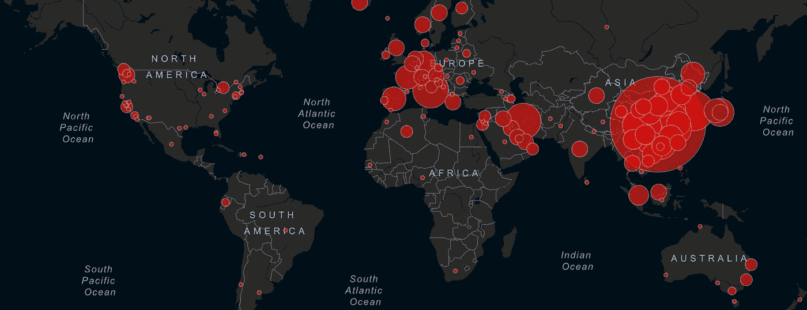
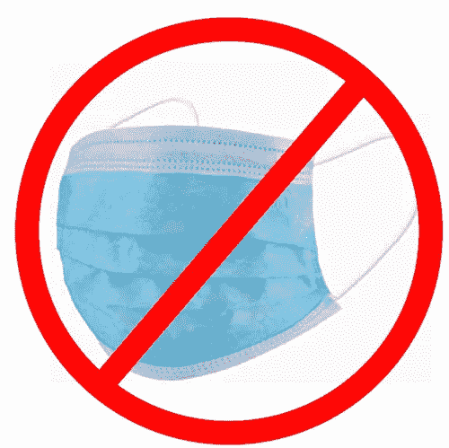
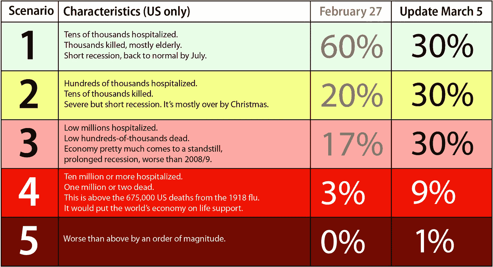
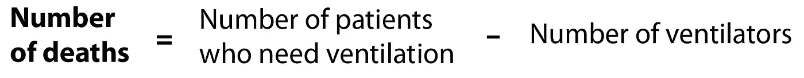
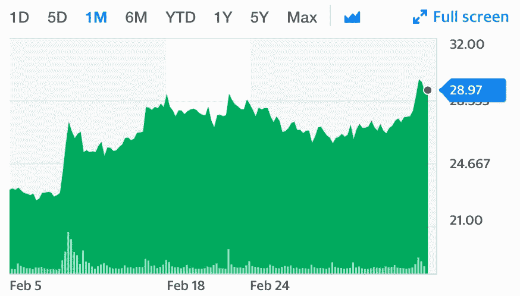

# 冠状病毒更新:现在该做什么

> 原文：<https://medium.datadriveninvestor.com/coronavirus-update-what-to-do-now-d10200f49df8?source=collection_archive---------1----------------------->

## 2020 年 3 月 5 日星期四。

更新:3 月 9 日星期一，我制作了一个视频总结了这一点，所以你可以观看或阅读…

上周，我报道了[冠状病毒爆发可能比我们想象的还要糟糕](https://medium.com/@pullnews/the-coronavirus-may-be-more-serious-than-we-think-b590e35ab6fc)。我一直在和鲍勃稳定地合作，我们意识到情况可能比那更糟。抱歉。我不打算分解我的推理或科学论文。我要告诉你我们知道什么，我们不知道什么，我建议你现在做什么。这是给美国大陆人的。

## 底线:抱最好的希望，做最坏的打算。

Map of confirmed Coronavirus infections, March 5, 2020

# 我们所知道的

更多病例:[全球约 10 万例，美国已知 150 例](https://www.arcgis.com/apps/opsdashboard/index.html#/bda7594740fd40299423467b48e9ecf6)。由于这里的检测很差，而且人们可以在没有症状的情况下携带病毒，我们严重低估了受感染的人数。

*   目前感染这种疾病的风险很低，但我相信随着病例数呈指数增长，这种情况将会改变。
*   如果你感染了这种病毒，死亡率可能在 5%左右，但这是偏向于 70 岁以上的人。
*   病毒攻击你的肺部。一旦到了那里，它就会让你咳嗽，而咳嗽很可能就是它传播的方式。它通过需要帮助呼吸的严重肺炎致死——那些不能使用适当设备的人会死亡。
*   这通常不像是打喷嚏和鼻塞的感冒。发烧和干咳是最常见的症状。需要注意的是无法停止的咳嗽。
*   大部分传播是针对六英尺以内的人，持续时间超过三十分钟(办公室工作人员、餐馆工作人员、家庭)。
*   大多数的传播是通过液滴，你从握手或物体表面获得，然后你触摸你的眼睛，鼻子，嘴。
*   它在寒冷干燥的空气中停留的时间更长(所有病毒都是如此)。
*   传播率在世界范围内呈指数增长(每个人传播病毒给至少两个人)，尽管[新加坡的传播率似乎是线性的](https://www.themoneyillusion.com/questions-on-the-coronavirus/#comment-5380591)，这很有趣。
*   美国的检测已经完全失败，这就是为什么我们不知道这里有多少病例。在韩国，检测已经普及，现在已经确诊了 6000 多个病例。
*   检测能告诉卫生官员很多，但不能告诉病人太多。要么你的症状严重到足以让你去医院，要么你没有。
*   接触追踪——弄清楚病毒是如何传播的并隔离那些被感染的人— [现在是不可能的](https://www.cnn.com/2020/03/04/opinions/coronavirus-local-public-health-challenges-el-sayed/index.html)。这种病毒几乎肯定会传播到美国所有主要城市，也许是大多数较小的城市。
*   特朗普现在说“我们会不惜一切代价。”但是[他在 2018 年解雇了美国疫情应对团队以削减成本](https://www.snopes.com/fact-check/trump-fire-pandemic-team/)和[削减对疾病预防控制中心的资金](https://www.washingtonpost.com/news/to-your-health/wp/2018/02/01/cdc-to-cut-by-80-percent-efforts-to-prevent-global-disease-outbreak/)。
*   迈克·彭斯是川普政府的领头人。彭斯在科学方面没有良好的记录。他在病毒爆发方面没有良好的记录。
*   口罩没有帮助，还会增加你生病的几率。

# 我们不知道的是

我们仍然不太清楚病毒将如何在主要城市传播。这导致现在不确定该如何应对。

*   我们不知道一旦你被感染，多久后你会出现症状。通常在一周内，但也可能长达一个月。
*   它可以通过气溶胶传播。这意味着它有可能通过[管道](https://www.livescience.com/coronavirus-spread-building-pipes.html)和[通风系统](https://www.nytimes.com/2020/03/04/opinion/coronavirus-buildings.html)传播。具有 HEPA 滤波器的系统(飞机、医院等。)防这个。如果有办法在大楼里传播病毒，那么大楼里的其他人也会有危险。我们目前没有看到这一点。目前风险较低。
*   我们不知道会有多少病例。它呈指数增长，但我们不知道增长率是多少。说案例数量每周翻倍是没有意义的，因为 a)我们没有测试很多人，b)不管现在的比率是多少，都会随着时间动态变化。它可能会在大约六个月内感染 90%的美国人，但这不会发生。我们只能讨论不同地区的情况和可能性。
*   我们知道它正在活跃地变异，尽管我们不认为这使得开发疫苗变得困难。
*   我们不知道夏天会发生什么。当天气变暖时，大多数病毒停止传播，因为飞沫更难在空气中传播，病毒也更难在表面存活。流感通常在 5 月结束(然后第二波在 11 月再次开始)。这种新型冠状病毒会发生吗？有可能，但是我们不能确定。
*   我们不知道是否会有口服疫苗可用(这使得分发变得容易得多)。疫苗应该在夏天通过测试，并在 7 月开始部署，尽管我们不知道供应情况，也不知道我们多快能在大城市达到群体免疫。疫苗最有可能在 2021 年被广泛使用。
*   直到顶峰过去很久之后，我们才知道我们已经到达顶峰。信息将继续是粗略的和基于场景的。
*   我们不知道医疗系统会如何应对。在一些情况下，我们已经有了我们需要的东西，但在大多数情况下，许多城市都被推过了他们的舒适区，至少一些医院会被病例淹没。想想许多老年人居住的城市或社区。

# 我的预测

记住，我只是一个在网上写东西的人。我不像唐纳德·川普那样是权威消息来源，川普是 m̶e̶d̶i̶a̶病毒流行病学的专家。

在我看来，美国现在“有可能”出现 100 万个病例，也有可能出现 1000 万个病例。这意味着今年将有 15 万至 100 万人住院治疗。在低谷的时候，我们会挺过来，一切都会过去。在高端，这将是一个悲剧，如果它能被阻止在那里。本质上，我认为美国有五个数量级:

我上周的预测和本周的预测的不同之处在于，第一种情况现在只有 30%的可能性，所有其他情况加起来有 60%。这是因为接触追踪现在是不可能的，缺乏测试意味着我们可能严重低估了感染的人数。我们大约有 20 万张额外的病床；我们没有一百万张多余的床。这些患者中的大部分将在临时设施中，呼吸器的数量不太可能发生太大变化，因此死亡率可能会大幅上升。

我相信#1 和#2 的组合有 60%的可能性，这给了我希望，这将是道路上的一个颠簸，我们将在圣诞节前恢复正常。然而，一旦我们到了第二名，一切都变了，因为第一名就出局了，继续第三名和第四名的可能性增加了。此时，3 号产品的 30%是现实的，不应该打折扣。

# 关于通风

我们没有能治愈这种疾病的药物。你死于新冠肺炎病毒，主要是因为你无法获得生存所需的呼吸机，因为病毒正在对你的肺部造成损害。如果受感染人数的增长超出了我们为需要的人提供合适设备的能力，那么*死亡人数与受感染人数的比率将会上升*。很多。

# 现在该怎么办

最好的办法是想象我们已经有 100 万受感染的人，并采取相应的行动，这可能会防止 100 万人被感染。再次声明，这只是我的建议，我不是专家。我从许多来源收集信息，并试图让你更容易采取明智的行动。从现在开始遵循这些规则:

# 采取必要措施避免感染

阅读并熟悉[疾病预防控制中心](https://www.cdc.gov/coronavirus/2019-ncov/community/index.html)和[世卫组织](https://www.who.int/emergencies/diseases/novel-coronavirus-2019/advice-for-public)的建议。

**没有手抖。**拳头或手肘突起。

**每天对所有表面进行消毒**，无论是在工作还是在家。这包括钱、钥匙、眼镜、帽子等。如果你没有别的东西，漂白剂和酒精都可以。

远离任何有人咳嗽的房间。这包括商店和餐馆。

**不要摸脸！**现在开始。用纸巾触摸眼睛、鼻子、嘴巴，然后扔掉纸巾。培养摸脸意识和零容忍。

**现在取消所有不必要的旅行**:邮轮、航班、火车旅行等。如果你的城市变得更加受感染，避开所有拥挤的区域:旅游中心、购物中心、超市。

现在取消像奥运会、政治会议、欧洲杯等重大活动是明智的。我不喜欢，但我更不喜欢等到最后一刻。

不要买或戴口罩，那没用。

保持健康。充足的睡眠，有规律的锻炼，吃得好，等等。不要被拖垮。考虑每天服用 25 微克维生素 D(见下面的视频)。

在电梯里要小心。考虑走楼梯，然后消毒你的手。

**携带并使用一次性手套。我不愿意告诉人们去买手套，因为手套不够用，但是每个人大概应该有 25 副(不是 100 副)。**

把外面的空气带进你的公寓，和管理人员讨论 HEPA 过滤器。保持你的家温暖干燥。

准备检疫。得到你需要的东西，正如我上周概述的。

**不要去看医生！你真的不应该去看医生——她只能治疗你的症状。生病的人都在那里。如果你呼吸困难，*打电话给你的医生*讨论你的选择。**

**如果你所在的城市确诊病例很少，照常去办公室**使用上述预防措施。

不要容忍在办公室里咳嗽。任何咳嗽或发烧的人都必须待在家里。如果你所在的城市有很多病例，换成一半员工在办公室工作，其他人在家工作，然后轮换工作。散开。持续擦拭表面，使用洗手液或手套。一旦你在你的城市看到升级的迹象，尽可能少的去你的办公室或公司。使用 Slack 实时保持联系。

Price of Slack stock (Symbol: WORK) over the past month.

酒店应该继续营业。如果酒店关门，更多的人会集中到那些还在营业的酒店。随着旅游的人越来越少，酒店将不得不裁员，但稀疏的员工和稀疏的客户可能会比客满或完全空着要好。如果病人需要被隔离，你需要准备好在他们的房间里为他们服务。酒店可以宣传他们的入住率限制在 40 %,这将让他们收支平衡并管理风险。

**餐厅有很多人在近距离工作**——用你所在城市的一般感染率作为参考。零售店和供应链如果有生意的话，可能应该继续工作。用手套处理钱，并要求任何咳嗽的人离开。

**医院必须保持开放**，我们必须确保他们可以通过不购买的方式获得他们需要的口罩、隔离衣和手套。工厂应该生产他们认为可以销售的产品。送货员应该戴手套而不是口罩。任何抓住把手或其他经常接触的物品的人都应该戴上一次性手套。工厂和供应链应该尽可能保持开放——如果对你的产品有需求，尽可能安全地满足它。

**送货员**:戴手套，经常处理，不要摸脸。

家人和朋友应该制定一个计划。如果父母中的一方生病了，想办法隔离他们，依靠另一方来照顾孩子。如果你有朋友生病了，带上他们的孩子。现在讨论这个，希望你不需要。每周末开一次家长会或建立一个共享信息的平台。

随着当地情况的变化，调整你的计划。如果你在途中或到达目的地后看起来有可能被感染，就不要去上班。自我隔离是最有效的不生病的方法。

# 如果你有症状

很可能是感冒或者流感，但是不传染别人是你的工作。呆在家里。隔离有助于减缓传播速度。隔离越早越好，效果会很大。即使你不能完全隔离自己，最好在接下来的几个月里尽可能接近隔离条件。

*   不要出去。不要去商店。吃燕麦片和拉面。把所有东西都送到。
*   不要做测试。
*   没有访客。
*   将室外空气引入你的公寓/公寓，并与管理人员讨论 HEPA 过滤器。保持你的家温暖干燥。
*   如果你外出，穿上全套防护服。那应该能让你不出门。在公园或森林里跑步是可以的，但是不要去购物。
*   精心处理表面、衣物等。
*   不要摸脸。养成并保持这个习惯。
*   保持健康，保持身材。带着手套去健身房，然后消毒。
*   尽你所能上网。这是学习和提高技能的大好时机(从[这里](http://dsiegel.com)开始)。
*   隔离应该持续四周，而不是两周。
*   如果咳嗽或呼吸变得严重，打电话给你的医生。了解你所在城市的呼吸设施在哪里。

有室友怎么办？我的建议是去一个地方，你可以有一个房间，从一个单独的房间或一个小区域管理一切。让别人在公共区域咳嗽是没有用的。

如果你有孩子或家人呢？离开他们，离开四个星期。使用 Skype 或 Zoom 保持联系。

# 不要担心；做好准备。

如果你已经读到这里，这里是来自 MedCram 的最新消息。塞尤特博士在这里谈了很多关于维生素 D 的问题，但是在你研究这个选项的时候，一定要看看 ScienceBasedMedicine.com 的(事实证明，一段时间以来，我每天服用 25 微克的维生素 D 来帮助我的骨骼，这正是这里推荐的量):

[在 Twitter 上关注我](http://twitter.com/@pullnews)关于冠状病毒和其他知识分子突发新闻。如果你喜欢这个，请看 [**我的气候数据视频之旅**](https://www.youtube.com/watch?v=bJWnMA3-sQs) 。

[**大卫·西格尔**](http://dsiegel.com/) 是 DC 华盛顿州的一位连续创业者。他是[支柱项目](http://pillarproject.io/)和 [2030](http://2030.io/) 的创始人。他著有 [*【令牌手册】*](http://thetokenhandbook.com/)*[*开斯坦福*](http://www.openstanford.com/)*[*文化甲板*](http://theculturedeck.com/)*[*气候好奇*](http://climatecurious.com/)**[*气候资料之旅*](https://www.youtube.com/watch?v=bJWnMA3-sQs) 。他向世界各地的观众发表演讲——如果你想让他在你的下一次活动中发表演讲，请参见他的演讲人页面。他的全部作品在[**dsiegel.com**](http://www.dsiegel.com/)展出。*****