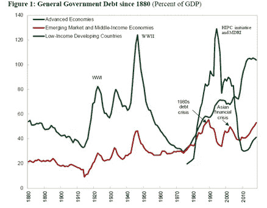
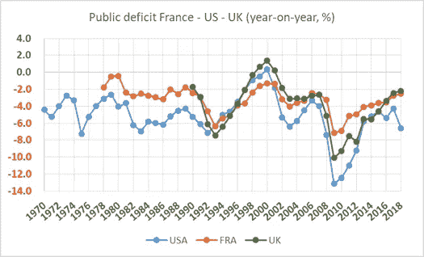
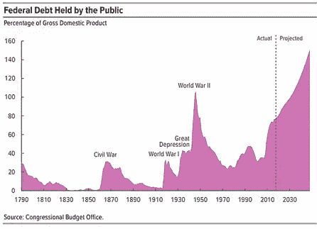
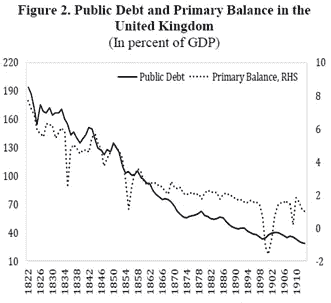
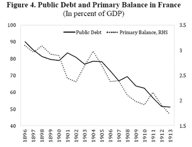
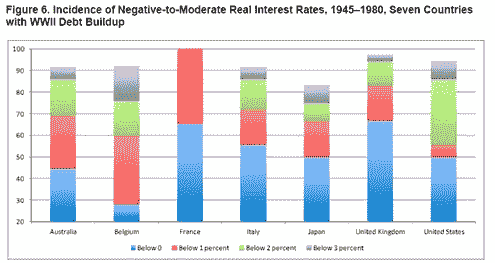

# 冠状病毒、战争言论和公共债务

> 原文：<https://medium.datadriveninvestor.com/coronavirus-war-rhetoric-and-public-debt-e00f4e2f476b?source=collection_archive---------14----------------------->

金融抑制的预期上升

***摘要***

*这篇文章着眼于公共债务的积累以及政府减少公共债务的手段。由于战争词汇正在出现，以描述全球对新冠肺炎的努力，这项研究提出了 1914 年之前的公共债务的演变，以及与两次世界大战有关的债务。这种债务在 1945 年至 1980 年间被消除，这要归功于“辉煌三十年代”的增长和“金融抑制”的广泛使用。2008 年的大衰退尚未消除，我们已经进入了另一个大规模负债的阶段。在未来十年没有增长的情况下，金融抑制很有可能卷土重来。文章最后总结了可能的组合，以管理似乎无法控制的上涨，以及看到不透明的金融体系将自己作为唯一具体的减排手段的风险，其后果是持久和普遍的不满。*

新冠肺炎·疫情在没有警告的情况下上升到了全球战争的地位。在自律的幌子下，到处都有政府挥舞国家凝聚力的原子武器的诱惑:“我们在打仗”。用于打击恐怖主义("[反恐战争](https://en.wikipedia.org/wiki/War_on_terror)")、资本主义("[我的敌人是金融](https://www.europe1.fr/politique/Hollande-mon-adversaire-c-est-le-monde-de-la-finance-727146)")以及现在的冠状病毒，战争说辞允许一些捷径。

但是发动战争是昂贵的。世界经济正在挣扎，昨天还很健康，今天却奄奄一息。虽然我们仍然处于混乱之中，而且几乎没有进行全国协商，每天都在作出决定，但让我们看看筹资问题。当然，如果把话语军事化有任何意义的话，我们必须在我们的历史教科书中找到有趣的相似之处，以阐明当前的情况。

***一.*** ***无数历史先例***

战争甚至在爆发前就调动了资源。法国于 1914 年 7 月 14 日开始征收直接所得税。维基百科告诉我们:“在第一次世界大战期间，它最初是为了资助战争和法国的重建”。在英国和德国，同样的辩论也发生在为军备竞赛融资的痛苦但必要的税收改革上。当冲突爆发时，成本激增，然后通过借贷获得融资，因为税收收入严重不足。1914 年和 1939 年的所有交战国主要通过税收和重新分配现有资源，在敌对行动之前的十年里积极铺平道路，但冲突的工业化使世界公共财政陷入瘫痪。

下图说明了这一点:

*Source: IMF Conference on Sovereign Debt, Sept. 2018.*

它显示了 1880 年至 2018 年间发达(绿色)、发展中(红色)和贫穷(蓝色)经济体的世界公共债务，以各地区国内生产总值的比率表示。

两次世界大战，1929 年危机，2008 年危机清晰可见。它还显示了减轻穷国债务的国际倡议，包括 1995 年的重债穷国(“重债穷国”)方案和 2005 年的 MDRI(“多边债务减免倡议”)。注意:截至 2016 年，两个计划免除的债务总额为 1266 亿美元。在 39 个可能符合资格的国家中，36 个已经从最大援助中受益。在这 36 个国家中，30 个在非洲】。

更令人吃惊的是以下发现:

*   在 1914 年之前，全世界都在进行一场普遍的、不间断的减债运动——甚至在第一次世界大战之前的十年里也是如此。英国的情况尤其具有启发性，我们将在下面回到这一点。
*   1970 年至 2000 年间，发达经济体彼此相安无事，然而债务却在激增。很明显，我们必须向预算赤字寻求解释:

*Source: OECD database*

在过去的 50 年里，似乎没有一个发达经济体能够控制其公共预算(这里有 3 个，但对其他国家的研究得出了同样的结论)。英国甚至发现自己不得不在 1976 年向国际货币基金组织申请贷款，这笔贷款伴随着大幅削减预算的监护。

因此，我们生活在一个政府不愿或无力平衡预算、债务不断累积的世界里。对于那些持怀疑态度的人，国会预算办公室提供了以下预测(仅针对美国):

这一预测可以追溯到 2015 年，远在当前危机之前。

但并非所有的希望都落空了:这些图表真的能让人放心吗？每次冲突过后，所有经济体都设法减少了累积债务。诚然，预算纪律在过去 40 年里并没有成为一个普遍的概念，但摆脱一堆债务肯定是可能的？两次世界大战造成的人员和物质损失不能作为随后经济增长和债务减免的唯一解释？

***二世。******1914 年前的世界***

事实上，对于那些想知道法国或美国是否有可能平衡预算的人来说，答案是:“是的，但那是很久以前的事了”(我们可能会忍不住加上一句，在一个非常遥远的星系)。下面的三张图显示了一战前法国、英国和美国的赤字和公共债务:

*ource: “Public Debt Through The Ages”, IMF Working Paper WP19/6, Jan. 2019*

法国和英国在拿破仑战争后负债累累，美国在内战后也是如此。然而，在接下来的几十年里，这三个国家都大幅削减了债务。英国的情况尤其引人注目，因为该国的债务从 GDP 的 200%下降到……几乎为零。这花了一个世纪，但这一努力是非凡的。这三张图显示了基本预算平衡(右边的比例)，这在很大程度上是正数。本质上，这是一项吸收了所有三个案例中债务的预算努力。

当然，减债政策已经得到了广泛的研究。当增长和财政管理还不够时，债务问题会通过“金融抑制”以一种不太明显的方式得到解决。这涉及到许多工具，首先是通货膨胀，它允许政府通过惩罚贷款人的货币政策来“化解”债务，而贷款人中绝大多数是国内投资者。惩罚性的主要含义是:债务持有人没有得到足够的报酬，因此被间接征税。在实践中，政府通过大规模系统性侵蚀公民购买力来摆脱债务。

在研究这一机制之前，必须走两条弯路。首先我们必须问:为什么债务是一个问题？毕竟，我们生活在高负债的经济体中，日本以 220%的 GDP 领先，似乎没有人受到这种状况的影响。事实是，债务在普遍漠不关心的情况下增长。此外，我们还必须绕道考察实际利率和名义利率的概念。

***三世。*** ***那又怎么样？***

负债的世界是什么样子的？这是一个简单的问题，我们就生活在这样一个世界里。这种情况的后果是什么？我们正处于新冠肺炎危机的中心。

对一个家庭来说，分析很简单:债务调动了无法在其他地方使用的资源。房产贷款、汽车贷款、电视机消费贷款、支付工具(变相贷款)，所有这些加在一起会减少可用收入，损害储蓄等。有多少家庭意识到扣除前几个月的收入后他们所剩无几？所有用于贷款的东西都不能存起来或者花在其他事情上，比如度假。诚然，汽车是全新的，这款新手机是一个奇迹，但所有这一切的后果是家庭的明显脆弱性。减薪，经济裁员，一切都崩溃了。现金流困难出现了:你不得不为这样或那样的贷款重新融资以腾出空间，在这里或那里存钱以满足你的最后期限。某些类型的债务很有意义:例如，一个人可以在他或她重返学校期间贷款生活。如果文凭让他或她大幅增加收入，这是一个有利可图的计算:他或她将有办法偿还贷款，之后将有可能靠增加的收入持久地生活。相反，为一部 3 年后就会过时的新手机负债真的有意义吗？债务造成生命危险的脆弱性。债务越高，这种疲软就越直接，也越具有潜在的破坏性。摆脱这种状况并不容易:你必须挣得更多，或者存得更多，因此有可能牺牲你的生活水平。即使你因为好的理由(买房子)而欠了债，你也必须努力生活(很长一段时间)。

对一家公司来说，道理是一样的:巨额债务会调动不再可用的资源。一些投资必须以这种方式合法融资，因为这种想法是为了创造未来的收入，以允许偿还。因此，当债务为投资融资时，它是正确的解决方案，但不是当前的支出。由于总容量有限，因此必须小心管理总体水平。

如果对一个家庭或企业来说，后果很容易识别，那么对一个国家来说，后果会有所不同吗？是的，有一个根本的区别:国家发行货币，因此可以随时开动印钞机。然而，这种机制会导致通货膨胀，也就是说，它在充实使用它的国家国库的同时，也使人民陷入贫困。每年 10%的通货膨胀率意味着，无论谁每月在€挣 1500 英镑，他明年的购买力都会下降 150 英镑。工资调 10%就不成问题了。但实际上是这样吗？一个国家可以限制其货币政策的使用，以免引起过多的通货膨胀。然而，在这种情况下，必须不断寻找愿意提供信贷的投资者。当这些投资者认为存在无法获得偿还的风险时，他们会要求更高的报酬，甚至决定不再贷款。他们还会紧盯通胀:当我因为通胀每年损失 10%的购买力时，我真的愿意以 5%的利率放贷吗？大概不会。负债对一个国家的影响与对一个家庭的影响完全一样:它将部分收入作为抵押来支付贷款人，而这些资源不再能够满足其他需求。另一种选择是借更多的钱，但必须以可接受的价格找到更多的贷款人。

我们眼前的这场危机提供了一个教科书式的案例。一揽子支持计划是专门为帮助公司挽救现金流而设计的。裁员在社会上是不可接受的(在欧洲，在美国就没那么不可接受了)。不存在清算资产的问题，比如一家航空公司的飞机:首先没有买家，然后这些飞机最终会再次飞行(或者……[会吗？](https://www.wsj.com/articles/aviations-crisis-just-became-permanent-11588166833))。但是债务如何偿还呢？许多政府提出的第一个措施是对小企业进行债务重组，这是一个征兆。这些不可压缩的还款流会立即给财政部带来压力，并可能迫使餐馆或酒店老板停业，即使在正常情况下业务是健康的。

公共当局在 2008 年调动了大量资源来应对危机。这对于减少灾难性的社会后果是必要的。问题是，这笔债务还远远没有还清。今天，另一个事件正在逼近，至少是同样的规模——至少我们是这么被告知的。自 2008 年以来，政府的预算灵活性遭到了严重破坏。公共预算将再次被调用……下一次危机还有什么回旋余地？政府有什么能力调动更多的资源来资助紧急措施？每天都在减少。20 年后，还有什么资源可以用于我们孩子的教育或其他全国性的公共服务？

***四世。*** ***实际利率***

这些简单但不简单的解释引入了“金融抑制”的概念。让我们看一下一个有储蓄可以投资的人的情况。他可以购买一年收益 5%的政府债券。对于投资的€100，他将在一年后收回€105。与此同时，INSEE 预测来年的通货膨胀率为 3%。这个数字意味着同样的一篮子商品和服务明年将多花 3%的钱。因此，如果我们的投资者借给€100 美元，并在一年后收回，他今天可能用€100 美元购买的篮子将花费他€103 美元。自从他回到€105，他的实际收益只有 2%，他将不得不花€3。因此，5%的比率并不能反映全部的实际情况。这是一个“名义”利率。投资的“实际”收益是€2，“实际”利率是 2%。因此存在以下关系:

实际利率=名义利率-通货膨胀

一个政府以 5%的利率借款，通货膨胀率为 3%，这是一笔好交易。如果通货膨胀率上升到 7%，实际利率变成负数:贷方实际上被抢劫了，因为他没有足够的收入来维持他的生活水平。政府利用了这笔意外之财，因为它的债务会随着通货膨胀而迅速消失。一个找到办法“强迫”其公民接受负实际利率的政府正在进行金融抑制。这是一种摆脱债务的神奇方式，在两次世界大战结束时被大量使用。在没有违约的情况下，除了合理的财政政策，这是偿还战争成本的唯一方法。

****那么我们是怎么走出来的呢？****

*现在让我们回到最初的问题，政府如何摆脱债务？答案是:*

*I . 1914 年以前:严格的财政纪律，包括巨额预算盈余*

*二。1945-1980 年(世界大战和大萧条):金融抑制和经济增长与重建相结合(“辉煌的三十年”)*

*三。1980-2008 年:很难回答，因为自 1980 年以来，发达经济体几乎没有减少债务。在美国，20 世纪 90 年代的增长导致了衰退，不幸的是，2008 年的大衰退基本上消除了这种衰退。*

*四。2008 年至 2020 年:金融抑制卷土重来，经济增长放缓。然而，结果是不确定的，自 2008 年以来没有明显减少。*

*动词 （verb 的缩写）2020 年后:虽然 2008 年的旧病尚未痊愈，但增长已经停滞，赤字已经突破了最高水平……还有什么选择？*

*下图说明了第二点:*

**

**Source: “The Liquidation of Government Debt”, IMF Working Paper WP/15/7, Jan-15**

*它显示了在一定水平的实际利率下所花费的时间比例。1945 年至 1980 年间，我们在法国和英国生活的 66%时间里，实际利率为负，而在美国，这一比例仍高达 50%。*

****六。金融抑制？****

*这个词可能看起来令人惊讶，但它是合理的。金融抑制是什么样子的？任何允许政府以低于市场对相关风险水平需求的利率借款的措施。我们说的是什么风险？信用风险和通货膨胀，两者都会降低未来还款流量的价值。*

*这方面的最终结果是实际利率为负。如上所述，负实际利率是对贷方征收的一种税，这种税使贷方变穷，而有利于借方。碰巧的是，如今相当一部分公共债务的名义回报率为负，甚至在通胀影响之前也是如此。巴克莱银行(Barclay's bank)计算了一个主权债务总规模为负的指数([见此处](https://www.bloomberg.com/graphics/negative-yield-bonds/))，2019 年底约为 11.2 万亿美元(约占未偿债务总额的 20%)。*

*在实践中，有许多措施可以抑制实际利率:控制资本流动、降低关键利率、为某些存款设定利率上限、强制储蓄、通胀性货币政策等。这里有两个例子:Livret 存折储蓄账户和金融机构的 LCR(流动性覆盖率)。*

*livret A 不是公共债务，而是一种储蓄产品。它是法国特有的，非常受欢迎，有 5500 万本存折开放，它将很好地服务于我们的目的。和它的兄弟 LDDS(“livret d 'épargne durable et solidaire”，一种致力于影响力投资的储蓄存折)，它从法国人那里收集了 4550 亿€。这些存折收集的金额用于资助国家事务，特别是住房。因此，它不是公共债务，而是具有公共投资目的的基金。*

*Livret A 的薪酬由一个包含通胀的公式设定，以保护储户，但法国央行(Banque de France)行长有权不采用这一公式，而是强制实行一个利率。Livret A 已经经历了几个实际利率为负的时期，最后一次是在 2020 年初(见图 T0)。当然，没有人会强迫储户投资 Livret A。然而，这是一项非常受欢迎的投资，尤其是在不确定的时期，设定利率是一项有意义的经济决策。*

*LCR 的情况完全不同。不细说，LCR 是欧洲监管的结果，欧洲监管要求银行持有流动性储备，以应对意外危机(如 2008 年)。这种流动性储备只能投资于无风险工具，还有什么比欧洲主权债务更好的选择呢？据估计，欧洲金融机构 10%的资产负债表投资于欧元区债券，尤其是德国债券。这些债券中有很大一部分是负利率…答对了。这正是金融抑制的一个例子，因为 LCR 不受谈判的约束。*

***七世*。*** ***结论****

*公共债务不会蒸发:在没有违约的情况下，由于国民财富增加，公共债务会得到偿还或(按比例)减少。鉴于经济增长无法决定，在缺乏严格预算的情况下，金融抑制是政府可以使用的最具体的债务削减手段。这个想法在 1945 年到 1980 年间被广泛应用。*

*今天，尤其是新冠肺炎之后，我们应该做些什么？通过限制性公共预算为我们的经济融资的长期不可能性使这种融资沦为影子的、隐藏的条款，这些条款征收间接的、看不见的税收，有可能通过不断侵蚀购买力而产生广泛的不满。此外，人为保持低利率和充足的流动性会产生大量其他风险，包括反复出现的投机泡沫。我们如何走出这个危险的等式？*

***参考书目***

***，卡门·m·莱因哈特和 m·贝伦·斯布兰奇，国际货币基金组织工作文件 WP/15/7，1-15***

****[*减少债务违约*](https://www.imf.org/en/News/Seminars/Conferences/2018/05/24/sovereign-debt-a-guide-for-economists-and-practitioners) *”，国际货币基金组织主权债务会议准备文件*，2018 年 9 月 13 日至 14 日，汤姆·贝斯特、奥利弗·布什、吕克·埃罗、贝伦·斯布兰奇亚****

**“ [*一个世纪以来大规模公共债务削减和积累的教训*](https://voxeu.org/article/century-public-debt-and-what-have-we-learned) ”，S. M. Ali Abbas，Nazim Belhocine，Asmaa El-Ganainy，Mark Horton，2011 年 12 月**

**“*”国际货币基金组织工作文件 WP/19/6，Barry Eichengreen，Asmaa El-Ganainy，Rui Pedro 埃斯特韦斯& Kris James Mitchener，1 月 19 日***