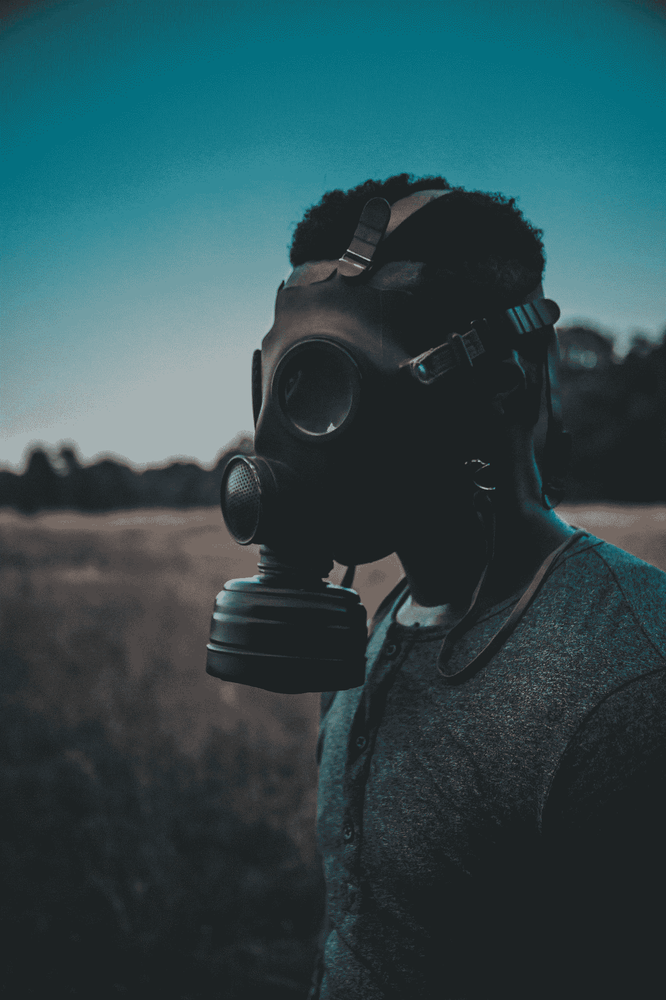
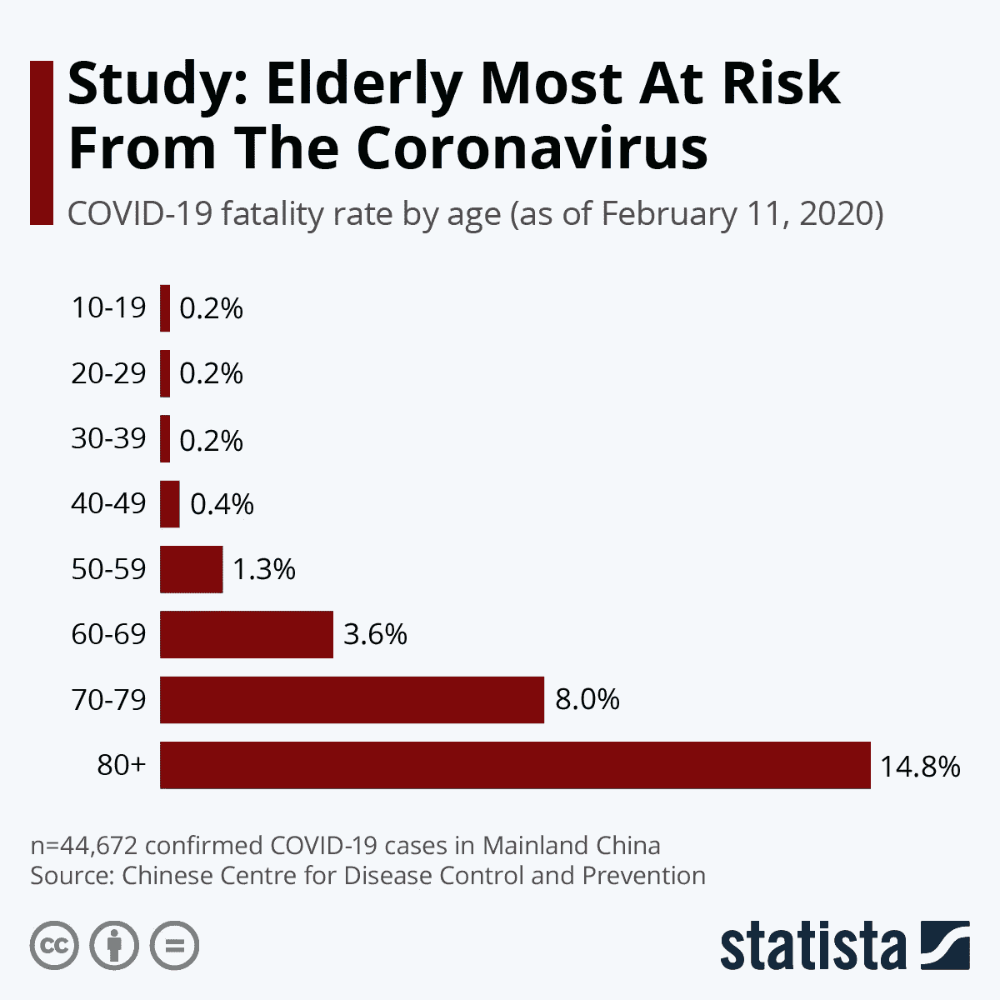

# 冠状病毒；没人谈论的事情

> 原文：<https://medium.datadriveninvestor.com/coronavirus-what-no-one-talks-about-fd8dd3e813fc?source=collection_archive---------13----------------------->

## 你能做的保护自己的显而易见的事情，大多数人都忽略了

Photo by [Paulo Silva](https://unsplash.com/@onevagabond?utm_source=medium&utm_medium=referral) on [Unsplash](https://unsplash.com?utm_source=medium&utm_medium=referral)

冠状病毒开始传播。

很抱歉。

但是说真的，每个人都在谈论它。口罩和手消毒剂都卖完了。货架空空如也，人心惶惶。

我们能做些什么来保护自己？

# 预防

世卫组织提供了一些预防措施。

世卫组织推荐的针对新型冠状病毒的必要[保护措施](https://www.who.int/emergencies/diseases/novel-coronavirus-2019/advice-for-public)

*   勤洗手
    定期用含酒精的洗手液彻底清洗双手，或者用肥皂和水清洗。
    这样可以杀死手上可能有的病毒。
*   保持社交距离
    与咳嗽或打喷嚏的人保持至少 1 米(3 英尺)的距离。
    这样，如果有人打喷嚏，你可以避免吸入可能含有病毒的小液滴。
*   避免接触眼睛、鼻子和嘴巴
    这样，你就避免了病毒从你的手转移到你的粘膜，从而进入你的身体。
*   保持呼吸卫生
    不要对着别人的脸打喷嚏。咳嗽或打喷嚏时，用弯曲的手肘或纸巾捂住口鼻。然后立即处理用过的纸巾。这样，你就避免了通过手传播不必要的病毒。
*   如果你有发烧、咳嗽和呼吸困难，及早就医
    如果你感到不适，就呆在家里。如果发烧、咳嗽、呼吸困难，要就医，提前打电话。遵循当地卫生部门的指示。

# 谁有危险？

[https://www.statista.com/chart/20860/coronavirus-fatality-rate-by-age/](https://www.statista.com/chart/20860/coronavirus-fatality-rate-by-age/)

如你所见，老年人面临的风险要高得多。

但这是为什么呢？是的，因为他们老了。

 [## 教科书行业如何最终被颠覆，并将继续改变|数据驱动…

### 就此而言，教科书产业在美国乃至全世界都有着悠久的历史。事实上，他们已经…

www.datadriveninvestor.com](https://www.datadriveninvestor.com/2018/09/25/how-the-textbook-industry-has-finally-been-disrupted-and-will-continue-to-change/) 

但是为什么老是个问题呢？是的，因为如果我们生病了，我们不会像年轻时那样迅速恢复。

但这是为什么呢？

如果我们不停地问*为什么*我们最终会和免疫系统在一起。

[免疫系统的定义](https://www.merriam-webster.com/dictionary/immune%20system)

流感季节发生在一年中寒冷的半年。但是今年剩下的时间里病毒会消失吗？不要！

他们还在那里。但是我们的免疫系统足够强大来对付这些病毒。

那么，我们如何确保我们的免疫系统全速运转呢？

# 如何增强你的免疫系统

*   不要吸烟吸烟会抑制你的肺部自我保护和清洁的能力。这只是戒烟的一千个理由之一。我知道很多人都突然戒烟了——你也可以。
*   多吃水果和蔬菜
    矿物质和维生素对你的免疫系统功能至关重要。
*   经常锻炼身体对健康有很多好处。稳定你的免疫系统只是其中之一。但是，不要过度！如果你过度劳累，你会暂时降低免疫系统的强度。
*   保持健康的体重
    体内储存的脂肪导致的慢性炎症会给你的身体带来压力，从而损害你的免疫系统。
*   适量饮酒酒精是一种毒药，会让你的整个系统紧张。
*   获得充足的睡眠研究人员还不知道最佳的睡眠量。然而，在睡眠期间，你的整个身体都在恢复和重建。如果可能的话，尽量保证至少七个小时不受干扰的睡眠。
*   社交生活活跃的社交生活与长寿相关。孤独是无声的杀手。在电晕的时候，至少给你爱的人打个电话。
*   阳光与自然
    出去晒晒太阳，补充你的维生素 D 储备。如果可能的话，去树林里散步，因为树木中的萜烯似乎可以增强免疫系统。
*   减轻长期压力长期压力会降低我们身体的抵抗能力。尽可能消除压力源。开始冥想，去放松的散步，去桑拿浴，尽可能经常地大笑。
*   补充剂
    和你的医生谈谈。
    但是充足的维生素 D、维生素 A、维生素 K 以及锌和欧米伽 3 似乎是健康的免疫系统所必需的。

# 外卖

预防是必要的。

但是，传播健康生活方式的信息可能会帮助更多的人，而不是传播恐惧。

# 准备好变得无限吗？

如果你想变得无限并大大加快你的学习速度，看看我的小抄:

[点击此处立即获取备忘单！](https://roadtolimitless.com/cheatsheet/)