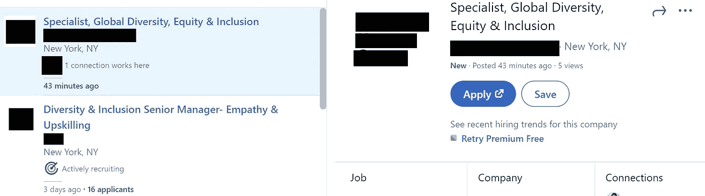
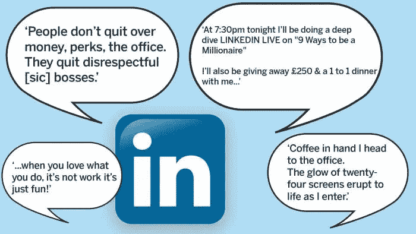

# 企业招聘:幕后观察

> 原文：<https://medium.datadriveninvestor.com/corporate-recruitment-a-look-behind-the-scenes-5408686d6b6c?source=collection_archive---------20----------------------->

对于那些想知道成为公司“看门人”是什么感觉的人来说，下面是我们工作的一部分。

Source: [Richard Hughes Jones](https://www.richardhughesjones.com/leadership-self-awareness/cat-looking-in-mirror-1400x68111/)

25 岁时，我在一家快速发展的媒体公司完成了从代理招聘到内部招聘的转变；当时我没有意识到的一个决定会影响我未来三年的职业道路。

我很快了解到一个重要的细节，这要归功于我的一位曾在中介招聘部门工作过的男性同事，那就是，内部招聘人员通常会因为不可靠的预期管理、不善于沟通而声名狼藉，最重要的是，*令人难以忍受的居高临下，这是他们被赋予权力的副作用，让不值得的候选人或中介机构无法与他们的组织合作。*

*我进行的谷歌搜索很快证明了这一信息是真实的。事实上，如果你在任何搜索网站上搜索“*糟糕的招聘人员*，你很可能会发现一连串负面评论，内容是求职者是如何被那些对接受客户面试抱有很高希望的招聘人员忽悠的。*

*所以，我是一个工作中的新手，我在想，“我真的进入了一个会被所有人讨厌的行业吗？”*

**

*Source: [99designs](https://99designs.com/blog/business/questions-to-ask-designers/)*

*业内人士都知道这一点，但是在运营部门(尤其是人才管理部门)工作具有挑战性，原因有很多。与在大多数情况下为您提供确定性解决方案的定量领域不同，在涉及到人的管理过程中，没有放之四海而皆准的方法。*

*虽然以前对企业内部团队招聘人员的看法不太积极，但自从我在 2017 年开始担任这一角色以来，这种观点近年来已经发生了变化。*

*公司开始雇佣代理招聘人员，他们已经拥有了一个在他们的行业中蓬勃发展的候选人网络，这个网络是通过他们向客户提供结果的努力积累起来的——这是在招聘人才代表方面的一个推动。)敏锐地意识到基于公司理想的“文化契合度”招聘意味着什么。)善于寻找外部候选人，以削减机构预算成本。*

## *为了揭穿这种陈旧的刻板印象，即“没有动机的”内部招聘人员会仔细阅读他/她根本没有注意到的候选人的简历，我们在组织战略和发展中发挥着比仅仅审查个人资料、发布职位和安排电话更大的作用。*

*还记得去年夏天黑人的命也是命抗议之后社交媒体上的骚动吗？*

**

*D&I is a newer function that is being incorporated across. HR/Recruitment teams.*

*各种组织的招聘和人力资源团队争相寻找资源来重组他们的系统，或找到即时的解决方案来缓解员工缺乏多样性的反弹。*

*同样，这也是在运营部门工作的一个障碍，但是[上游流程需要时间来实施](https://medium.com/@hashim.alzain/upstream-vs-downstream-approach-to-problem-solving-6dfe24ee1aef) -对于能够更好地处理这种情况影响的组织来说，为员工支持小组共享出口或为多元化和包容性经理创建职位的快速解决方案[并没有受到许多个人的欢迎](https://www.kornferry.com/insights/articles/perspective-d-and-i-hurdles?utm_source=social&utm_medium=linkedin&utm_campaign=corpsocial)，他们认为这种临时的权宜之计并不能解决问题的根本原因。*

> *“我们看到组织削减了他们的多样性和包容性(D & I)预算，并解雇了 D&I 员工…这是砧板上的第一件事。”— [曼迪·普莱斯，福布斯卡那里斯联合创始人&首席执行官](https://www.forbes.com/sites/geristengel/2020/06/17/black-lives-matter-protests-moves-corporate-di-initiatives-into-the-spotlight/?sh=600ea2ed7a0d)*

*我们都同意，2020 年给不同行业带来了几次冲击，但在这一事件促使团队独立思考，同时规划一项战略来补救过去做出的内部决策后，招聘工作真正被打乱了。*

*不管你的组织如何强调招聘和人才保留，你都会遇到一些经历，这些经历会让你暴露于不完美流程的陷阱，以及它们如何影响你公司的秩序平衡。*

*重申上面关于内部刻板印象的观点，**招聘团队通常会因为一些他们无法控制的因素而承受外部投诉的冲击(如玻璃门)。***

> *“招聘经理面试迟到了 10 分钟，而且没有后续邮件通知我被拒绝了。”*
> 
> **“XX 公司不在乎给女性加薪。文化被一个男孩俱乐部所主宰，这个俱乐部不会提拔任何他们不喜欢的人。”**

*如果你曾经担任过这个职位，**你会发现，以人为本、重视部门与招聘/人力资源团队合作的组织更有可能解决这些问题**。*

*考虑到上述假设情况，如果团队经理由于突发冲突而没有努力遵守他/她的面试时间表，或者如果另一个团队主管推荐一名男性候选人，而客户认为该男性候选人是比更合格的女性候选人更好的候选人，则适当的候选人参与和公平聘用的总体目标可能会被两名高级员工的行为抵消。*

***这并不是说“坏苹果”招聘人员永远不应该受到指责**，但提供这一观点的目的是为了展示公司评估如何描绘出管理决策、内部沟通差距以及员工个人对改善招聘流程的承诺的另一幅画面。*

**

*B 在继续之前，我想强调的是，作为一名企业招聘人员，声誉管理是非常重要的。你受雇于与你签约的企业的价值观保持一致(如果你还没有的话),并被鼓励提升这些价值观，作为你维护自己品牌的责任的一部分。*

*虽然“招聘营销”在历史上一直与求职板和雇主品牌网站联系在一起，但许多公司选择投资社交型招聘团队和内部员工招聘活动，这些活动[需要较少的资金投入](https://www.shrm.org/hr-today/news/hr-magazine/pages/010215-hiring.aspx)和[通过社交媒体上的合作利用虚拟团队建设的力量](https://www.rev.com/blog/linkedin-7-ways-to-get-more-engagement)。*

*不幸的是，很少有学习和发展团队提供社交媒体礼仪方面的适当培训，这是求职者(尤其是招聘人员)进入面试过程后期的一个常见原因，尽管他们拥有正确的技能或态度，却遭到拒绝。*

**

*Source: [Financial Times](https://www.ft.com/content/6fa4456c-9e6f-11e9-9c06-a4640c9feebb)*

*至于对不成功的面试过程的投诉，令人失望的是，你为一名潜在的雇员付出了这么多，却在他们的最后一轮面试后被告知你需要拒绝他们，因为**他们不符合团队正在寻找的某些标准**，或者更糟的是，他们在背景调查期间在网上发布了不恰当的评论来回应一份声明。*

*“*不合适*是什么意思？不同的招聘决策者对这个术语有不同的解释，这就是为什么保持对话和公开帖子的中立通常是明智的。*

*这里是“[友善](https://www.inc.com/quora/be-nice-its-the-best-thing-you-can-do-for-business.html)”的商业建议发挥作用的另一个领域:*

## ***由于我们的工作需要大量的人际关系网，我们经常会在关系的某一点上与候选人留下不愉快印象的人建立联系。***

*对于那些曾经破釜沉舟的人来说，这听起来可能有些吓人，但有一个心理学基础可以解释为什么基本的软技能，如[无论地位如何都要礼貌待人](https://www.businessinsider.com/tony-hsieh-zappos-hiring-strategy-2013-11)和[处理团队成员之间冲突的能力](https://www.psychologytoday.com/us/blog/turning-point/201902/how-manage-conflict-in-the-workplace)是一个人在公司表现的关键指标。*

*从各方面考虑，美国招聘人员最终认识到，几乎不可能找到完美的候选人，那些成功进入“近乎完美”群体的人，是那些通过符合技能要求和团队文化标准而赢得招聘团队的人。*

**

*Source: [AI Multiple](https://research.aimultiple.com/talent-on-demand/)*

*此时，那些读到这些见解的人可能会想，“*那么，在这么多简历充斥着你的收件箱的情况下，你如何决定首先面试谁呢*？”*

*坦率地说，**这又回到了我之前说过的话，即管理与人相关的流程不存在“一刀切”的方法。***

*每个组织都有招聘人员根据他们的领导团队如何指导他们工作，如果没有*根本没有招聘职能*(我个人认为这对于一些中型公司来说很有趣)。*

*与羽翼未丰的初创公司相比，较大的品牌公司自然会收到更多的申请。因此，**他们可以使用他们的申请人跟踪系统人工智能技术筛选简历，而不是后者审查提交给平台的每一份简历**。*

*一些招聘人员是 Linkedin 上的活跃联系人，他们会慷慨地回复你的拓展信息，而另一些人会不动你的电子邮件，或者拒绝接受你的联系邀请。*

*谈到筛选，我们遵循的每种方法背后都有一个原因，但最终，在求职过程中保持警惕是值得的**[**为你申请的职位量身定制你的简历**](https://www.glassdoor.com/blog/how-to-customize-your-resume/)**[**更新专业简介**](https://www.forbes.com/sites/robinryan/2020/04/21/stop-ignoring-your-linkedin-profile-best-ways-to-update-it-now/?sh=1100e5832eb7) **并在你的人际关系网中找到能为你的候选资格说好话的人。*******

*****从外部来看，招聘作为一项全职工作，可能不会对公司的整体业绩产生重大影响。尽管人才团队与其他组织、教育机构和专业网络团体的外部关系越来越多，但该部门仍然拥有“后台办公室”角色的头衔。*****

**********

*****Source: istockphoto*****

*******是的**，我们很容易被来自不同资历层次的求职者所吸引，他们向我们寻求在我们公司工作的机会，但随着我们在人力资本管理领域的不断成长，我们学会了克制自己，学会了与人共情。*****

*****这是谦逊和商业相结合的一课。我们知道不是每个人都会对我们 100%满意，但是我们的职能仍然是一项正在进行的工作，还没有得到所有领导团队的认可。*****

*****在此之前，我们将尽最大努力让您在求职过程中保持愉快。*****