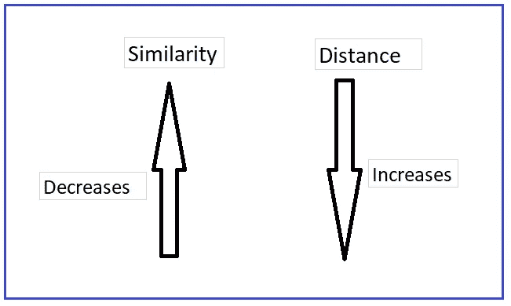
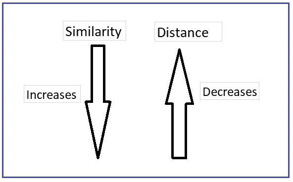
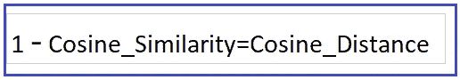
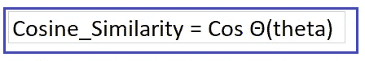
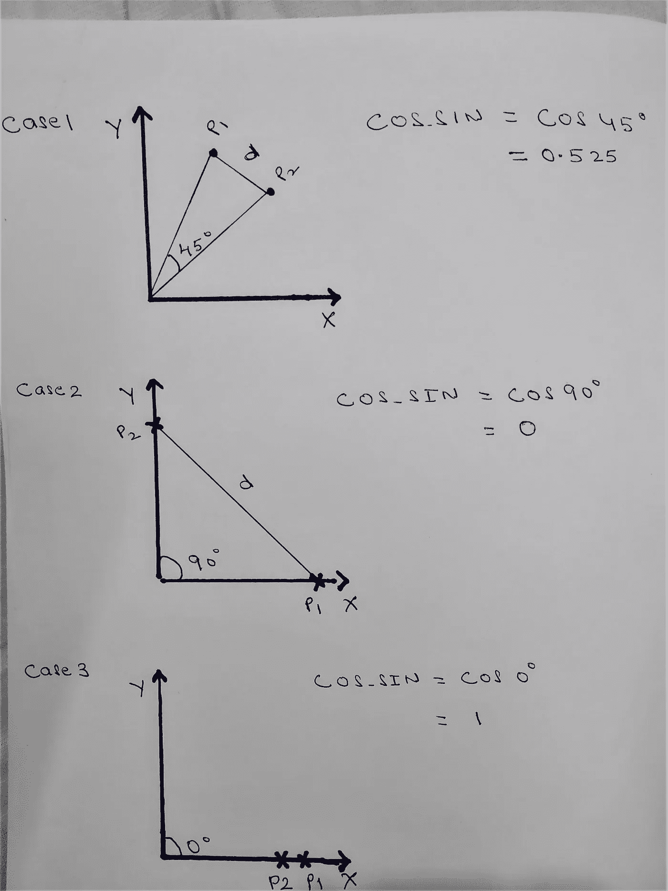
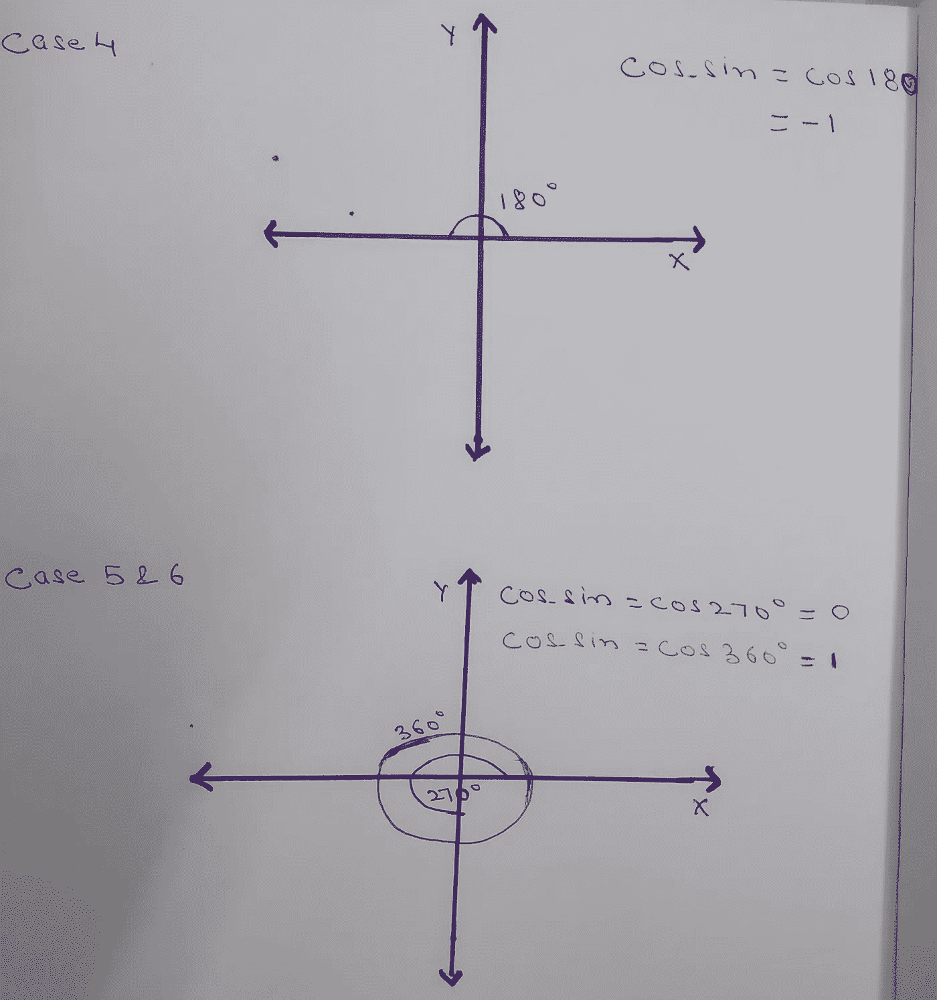

# 余弦相似度和余弦距离

> 原文：<https://medium.datadriveninvestor.com/cosine-similarity-cosine-distance-6571387f9bf8?source=collection_archive---------0----------------------->

## 简介:

余弦相似度用于确定文档或向量之间的相似度。在数学上，它测量的是在多维空间中投影的两个向量之间的角度余弦。还有其他相似性度量技术，如欧几里德距离或曼哈顿距离，但我们将在这里集中讨论余弦相似性和余弦距离。

余弦相似性和余弦距离之间关系可以定义如下。

1.  当两个向量之间的距离增加时，相似性降低

2.当两个向量之间的距离减小时，相似性增加。

## **余弦相似度和余弦距离:**

余弦相似性表示，要找到两点或向量之间的相似性，我们需要**找到它们之间的角度**。

计算余弦相似度和距离的公式如下:

这里 A =点 P1，B =点 P2(在我们的例子中)

让我们看看 Cos 的各种值，以了解两个数据点(向量)之间的余弦相似性和余弦距离 P1 和 P2 考虑两个轴 X 和 y

**下图有三个案例。**

**情况 1:** 当点 P1 & P2 之间的角度为 45 度时

余弦 _ 相似度= Cos 45 = 0.525

**情况二:**当两点 P1 & P2 相距较远，且两点之间的夹角为 90 度时

余弦相似度= Cos 90 = 0

**情况三:**当两点 P1 & P2 非常近且位于同一轴线上，且两点之间的角度为 0 度时

余弦相似度= Cos 0 = 1

**下图有下三种情况。**

**情况四:**当点 P1 & P2 两两相对，且两点间夹角为 180 度时

余弦 _ 相似度= Cos 180 = -1

**情况 5:** 当点 P1 & P2 之间的角度为 270 度时

余弦相似度= Cos 270 = 0

**情况 6:** 当点 P1 & P2 之间的角度为 360 度时

余弦 _ 相似度= Cos 360 = 1

让我们传递上面讨论的每个角度的值，并查看两点之间的**余弦距离。**

**1 —余弦相似度=余弦距离**

**情况 1**:Cos 45 度时

让我们替换上面公式中的值。

1–0.525 =余弦距离

0.475 =余弦距离

**情况二**:Cos 90 度时

1–0 =余弦距离

1 =余弦距离

**情况 3**:Cos 0 度时

1–1 =余弦距离

0 =余弦距离

**情况 4**:Cos 180 度时

1-(-1)=余弦距离

2 =余弦距离

**情况 5**:Cos 270 度时

1–0 =余弦距离

1 =余弦距离

**情况 6**:Cos 360 度时

1–1 =余弦距离

0 =余弦距离

**我们可以清楚地看到，当距离越小时，相似性越大(点彼此靠近)，当距离越大时，两个点不相似(彼此远离)**

余弦相似度和余弦距离在推荐系统中被大量使用，根据用户的好恶向用户推荐产品。

使用这种方法的几个例子是像亚马逊、Flipkart 这样的网站向客户推荐项目以获得个性化体验、电影评级和推荐等。

**结论**:我希望现在你已经清楚地理解了余弦相似度和余弦距离计算背后的数学原理及其用法。

希望你喜欢我的文章。请鼓掌👏(50 次)激励我继续写下去。

想要连接:

联系方式:【https://www.linkedin.com/in/anjani-kumar-9b969a39/ 

如果你喜欢我在 Medium 上的帖子，并希望我继续做这项工作，请考虑在 [**patreon**](https://www.patreon.com/anjanikumar) 上支持我