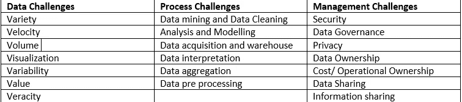
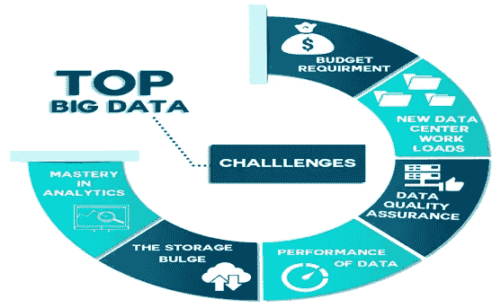
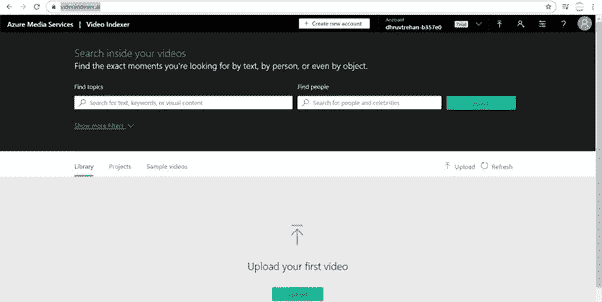
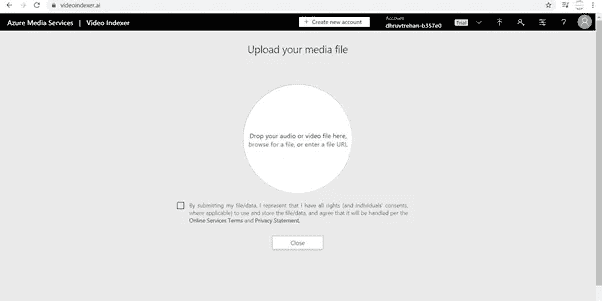
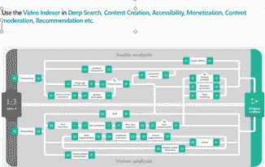
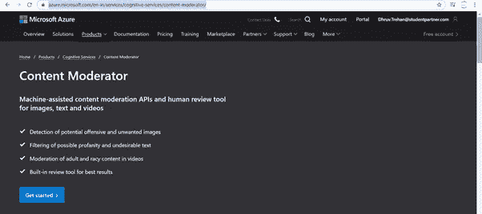
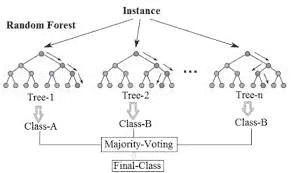

# 认知服务能否帮助减少数据冗余并加快大数据的处理速度？

> 原文：<https://medium.datadriveninvestor.com/could-cognitive-services-help-in-reducing-data-redundancy-and-result-in-faster-processing-of-big-dd77968514b8?source=collection_archive---------10----------------------->

欢迎回来的读者，

Image Source: [Tech Talents](https://www.google.com/imgres?imgurl=https%3A%2F%2Fblog.techtalent.jobs%2Fwp-content%2Fuploads%2F2018%2F10%2FWelcomeTechTalents-Compressed.png&imgrefurl=https%3A%2F%2Fblog.techtalent.jobs%2Fwelcome-tech-talents%2F&tbnid=tFGeWmAm-h-xMM&vet=12ahUKEwjFibzIkcTpAhWADLcAHeu4DlQQMygEegUIARDlAQ..i&docid=bDab6GapMH-gCM&w=928&h=500&q=welcome%20tech&ved=2ahUKEwjFibzIkcTpAhWADLcAHeu4DlQQMygEegUIARDlAQ)

**简介**

> 我是来自印度的微软学生伙伴 Dhruv Trehan。这个博客是由[微软学生合作伙伴](https://studentambassadors.microsoft.com/en-us)(印度)项目发起的 MSP 开发者故事计划带给你的。MSP 开发者故事是一个每月一次的竞赛，目的是帮助全球的学生开发者更加熟悉 AI 和 ML。

**动机**

社交媒体、移动、分析和云模式使用的激增导致了大量实时、多模态、非结构化和冗余数据的产生。目前，互联网离用户只有一步之遥。基于消费者选择发布任何内容的可行性已经整合了对大数据的影响。视频抄袭现在很普遍，因此抄袭导致数据冗余。

**目标**

在这篇博客中，作者将分析大数据面临的限制和挑战、 ***【数据冗余对数据处理工具的影响】***以及机器学习和微软开发的技术如何发挥作用。作者建议用该模型对相似数据进行分类和聚类，从而减少数据冗余。

**先决条件**

要实现这一目标，人们应该了解“大数据”

**大数据**

大数据是指可以通过计算分析来揭示与人类行为和互动相关的趋势、模式、关联的“大型数据集”。根据研究，生成的大数据量可分为 3 种类型:

> **社交网络**
> 
> **传统业务系统**
> 
> **物联网**

在这篇博客中，作者将讨论社交网络上用户生成的大数据。让我们先来看看一些统计数据，更习惯于数据增长的速度:互联网的使用达到了一个新的水平，根据 GSMA Intelligence 的统计，目前我们有超过 43.9 亿互联网用户和大约 51.6 亿移动电话用户。它还指出，社交媒体用户平均花费超过 2 小时 24 分钟在 8 个社交网络和消息应用程序上进行多重联网。

Image Source: [Towards Data Science](/Towards Data Science)

许多社交媒体应用程序，如 Twitter、脸书、Instagram、Snapchat、WhatsApp、微信、Tik-Tok、Reddit、Pinterest，每天都在生成超过 25 亿条数据。这背后的原因可能是电子产品的价格低廉，即使没有网络知识，人们也可以轻松地点击一下，将用户生成的内容(包括文本、语音、照片和视频)发布和上传到社交网站。多媒体大数据的局限性之一是，当数据规模达到 Pb 级时，传统的数据处理工具不足以处理复杂的数据集。

我们中的大多数人，当在 YouTube 上搜索任何特定主题时，我们可以分析出有多个用户提供相同的内容。这就降低了特定主题背后的原创性。此外，这种数据冗余是产生 Pb 级数据的主要原因。

Videos drawing similar conclusion

由于数据的这种增长，像 HADOOP、HPCC、STROM、CASSANDRA 和许多其他数据处理工具在管理大量数据方面是不够的。

Data processing tools are just done !

现在，让我们来看看我们在处理数据时所面临的挑战。

Limitations posed by Data

随着数据日益增多，下面讨论大数据面临的各种挑战:

Image Source: [Big Data Challenges](https://www.google.com/imgres?imgurl=https%3A%2F%2Fblog.tyronesystems.com%2Fwp-content%2Fuploads%2F2017%2F08%2FTuseday-2.png&imgrefurl=https%3A%2F%2Fblog.tyronesystems.com%2Ftop-big-data-challenges-and-solutions&tbnid=gT2mtWRgH8BdKM&vet=12ahUKEwiH7P-OksTpAhVpwnMBHSe9CHoQMygHegUIARCOAg..i&docid=jY1lZuDz6x7iBM&w=800&h=798&q=big%20data%20challenges%20&ved=2ahUKEwiH7P-OksTpAhVpwnMBHSe9CHoQMygHegUIARCOAg)

***数据挑战:*****种类**是指结构化和非结构化数据的类型和各种来源，**速度**是指数据在运动中的速度，**体积**决定存储和进一步产生的数据量，**可视化**是指理解数据以便于查看的方式。 **可变性**指向共享数据的不一致性，**真实性**承认数据分析是否恰当，**值**指数据下共享的知识。

***流程挑战:*数据挖掘**是指检查大型预先存在的数据库以生成新信息的过程。**数据清洗**指检测或破坏不准确的记录，并对其进行修改。**数据分析**可以定义为对数据进行清洗、转换，从中发现有用信息并做出相关决策的过程。**数据建模**是指通过实施某些技术为信息系统或我们的想法设计数据模型。**数据采集**是指分析现实世界的物理现象，并将其转换成数字数值。**数据解释**是指分析数据并从图表中收集细节。**数据聚合**是指组合多个数据集进行数据预处理。

***管理挑战:*** 社交网络平台是钱柜数据使用最多的平台。用户只需点击一下鼠标就能上网。最重要的因素是产生用户的信任，而信任可以通过向用户数据提供**隐私和安全**来实现。**数据共享**是指在多个社交媒体平台上共享数据。**数据所有权**是指用户对其产生的数据的占有。**数据治理**意味着任何组织都要遵循一套特定的规则。

Image Source: [Data Challenges](http://Visit Here)

当谈到大数据时，这些是研究人员面临的特定挑战，因为社交媒体网站产生的大数据正在呈指数级增长。在这篇博客中，作者将提出减少互联网上数据冗余的解决方案，以便通过数据处理工具快速处理大数据。

简单地说，这个问题有多种选择，我们可以采用以下技术来理解数据，并只处理数据冗余。

# 视频索引器

Azure Media Services Video Indexer 是一个基于 Azure Media Analytics、Azure Cognitive Search、认知服务(如 Face API、Microsoft Translator、计算机视觉 API 和自定义语音服务)构建的云应用程序。该应用程序允许您使用视频索引器视频和音频模型从您的视频中提取见解。

**实施**

**第一步:**使用您订阅的 Azure 帐户登录 [Azure 视频索引器](https://www.videoindexer.ai/)。显示屏会弹出。

**第二步:**一旦你点击**“上传视频”，**会弹出一个额外的屏幕。将您的音频或视频文件放在那里，这将需要几分钟来处理您的文件。

**第三步:**当你的文件被处理后，你可以看到视频索引器为你的视频提供见解。视频洞察涵盖了以下内容:

提及视频中的任何命名实体(如果有)

讲述视频中涵盖的主题

上传视频中讨论的标签

分析视频中幕后的情感

检测视频中的场景和情节。

太神奇了，这就是视频索引器的工作原理。如果我们策划视频索引器服务，将有助于了解用户生成的视频中的关键点，然后再上传。

Image Source: [Video Indexer](https://docs.microsoft.com/en-us/)

# 内容仲裁者 API

当检查特定平台上上传的内容的质量时，可以使用内容调节 API 来确定内容质量。在内容审核者 API 中，内容根据四个因素进行审核:

> 图像调节
> 
> 文本审核
> 
> 视频审核
> 
> 人工审查工具

**实现**

**第一步:**在 [Azure 内容版主](https://azure.microsoft.com/en-in/services/cognitive-services/content-moderator/)注册

Content Moderator

第二步:屏幕会显示出来。你点击“尝试”,选择图片、视频、文字，上传进行训练。训练数据需要几分钟时间。

步骤 3:当数据被训练时，它被指定了标签和标记，这可以帮助与上传内容的类型相关联。

第四步:你的数据经过训练和测试，并标明是否适合观众。

完整概述: [Azure 内容版主](https://docs.microsoft.com/en-us/azure/cognitive-services/content-moderator/)

## **文本分析 API**

使用文本分析 API，我们可以分析文本中表达的情感(例如，视频的描述)。

Importance of Text analytics

上传视频的标语和描述可能是我们分析视频内容的第一把钥匙。它创建视频的结构分析，并保持相似文档的聚类。它有助于预先检测视频的类别。

完整概述:[文本分析](https://docs.microsoft.com/en-us/azure/cognitive-services/text-analytics/)

## 视频分类

一堆特定的图像可以被称为视频。目前，视频是多媒体内容的最大来源之一，因为每分钟大约有 300 小时的视频数据被上传。数据的这种大规模增长导致数据冗余，这影响了数据的预处理。在分析数据时，我们可以实施以下 5 种视频分类方法中的任何一种:

> 用 ConvNet 一次分类一帧
> 
> 在一个网络中，使用时间分布的通信网并将特征传递给 RNN
> 
> 使用 3D 卷积网络
> 
> 用 ConvNet 从每一帧中提取特征并将序列传递给 RNN
> 
> 使用 ConvNet 从每一帧中提取特征，并将序列传递给单独的 MLP

*视频分类概述:* [*视频分类*](https://towardsdatascience.com/introduction-to-video-classification-6c6acbc57356)

# 时间和质量评估

这个参数可以帮助我们检测正在社交网络平台上共享的、但观众不喜欢的视频。在这样的框架中，这些视频不应该被恢复，而是可以被删除。

# 结论

现在，为了用这种方法获得模型，我们可以为每个视频开发一个数据库，然后将相似的实体视频聚类和分类在一起。这种方法将在分析上允许我们考虑上述所有相关参数，并生成多个视频的平均预测得分。得分较高的相似视频(产生相似结论)应该被重新存储，得分较低的视频可以被删除。

而且，我们可以实现“ ***随机森林分类算法*** ”来获得这个模型。

Image source: [Data Science](http://www.towardsdatascience.com)

**随机森林分类算法**是一种用于分类、回归和其他任务的方法，通过在训练时间构建大量决策树来操作，该决策树是单个树的类(分类)或均值预测(回归)的模式。

在这篇博客中，作者讨论了大数据带来的限制和挑战，并提出了减少数据冗余和帮助数据处理工具正常运行的相关技术。

> 还有更多要读，更多要研究！！

快乐阅读。非常感谢。

