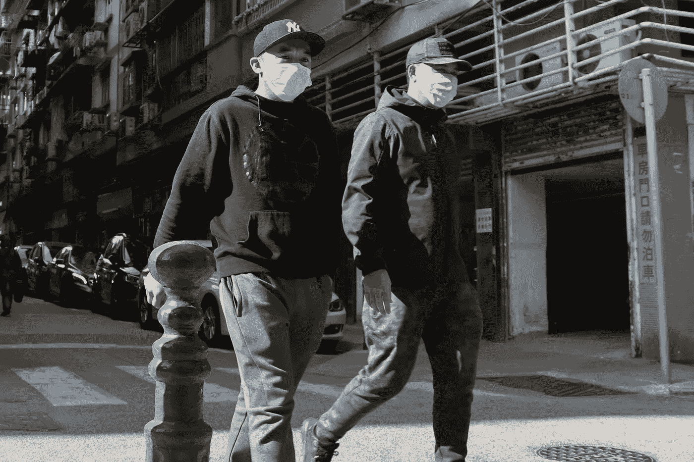

# 冠状病毒会把零工经济加入受害者名单吗？

> 原文：<https://medium.datadriveninvestor.com/could-coronavirus-add-the-gig-economy-to-its-list-of-victims-406782f50bad?source=collection_archive---------28----------------------->

围绕冠状病毒的恐惧无需解释，就在我写这篇文章的时候，在英国，我们刚刚听说了第 4 例死于冠状病毒的病例，意大利总理将疫情称为“意大利最黑暗的时刻”，华尔街的交易今天短暂暂停，此前股市暴跌引发了自动暂停交易。

Photo by Macau Photo Agency on Unsplash

该病毒引发了自 2008 年以来我们从未见过的经济和政治冲击。许多经济学家和金融家将试图比较并强调两次衰退之间的差异。

 [## 另一场精心策划的全球经济危机正在逼近？如果我们的数据经济可以帮助它|数据…

### 我们的 DApp 的开发，称为 DECENTR，目前正与我们的 R&D 同步进行，作为我们即将到来的…

www.datadriveninvestor.com](https://www.datadriveninvestor.com/2019/03/06/another-engineered-global-economic-crisis-looming-not-if-our-data-economy-can-help-it/) 

但是今天的全球经济有一个与 2008 年非常不同的组成部分——零工经济，今天的衰退可能会对其长期生存造成严重破坏。

# 它给了…

许多人将零工经济的指数增长和成功归因于 2008 年经济衰退的后果。

它不仅向勒紧裤腰带的市场提供廉价产品。它为大众提供了方便、灵活的工作方式。

Photo by Priscilla Du Preez on Unsplash

当优步在 2009 年推出“如果你是 10%的美国失业者中的一员，或者是生活在“在职贫困”中的更多人中的一员”,你所需要的只是一部智能手机和一辆车——突然间你就可以成为一名出租车司机。

数百万人利用这种容易获得的收入，开始将零工经济作为我们的主要或补充收入来源。

并且一直以惊人的速度增长。据估计，今年将有 43%的美国人加入零工经济*(注:这一数字包括所有的美国个体户)。*

千禧一代进入全球职场也推动了“零工”的兴起。我们千禧一代比我们厌恶风险的婴儿潮一代父母更不看重工作保障和工资。我们重视灵活性、放松的时间、兼顾多项事业的能力以及工作/生活的平衡——所有这些都是零工经济梦想给予我们的。

但是，从 2008 年经济衰退的灰烬中辉煌崛起的零工经济凤凰即将迎接其 2020 年的弟弟，前景并不乐观。

# …它带走了什么？

随着我们的全球经济动荡，零工经济将不得不承受三大打击。

Photo by [Ross Sneddon](https://unsplash.com/@rosssneddon?utm_source=unsplash&utm_medium=referral&utm_content=creditCopyText) on [Unsplash](https://unsplash.com/s/photos/delivery?utm_source=unsplash&utm_medium=referral&utm_content=creditCopyText)

**1。当钱少了，就变成了*钱多了*钱少了**

研究显示,“零工”的平均收入比从事同等全职工作的人要低。但他们理解这种权衡，并对零工带来的好处感到满意。

处于零工经济核心的核心权衡是，工人们是个体经营者，他们想什么时候工作就什么时候工作，但无权享受员工福利。

到目前为止，大多数人都过得很轻松，享受着按自己的方式工作的自由。但自 2008 年以来，这种权衡第一次显得不那么吸引人了。

在最好的情况下，如果身体不适，临时工将不得不承受两到三周的收入损失。对一些人来说，这听起来可能不算什么，但对许多零工来说，这将是一个严重的金融打击， [70%的美国人储蓄不足 1000 美元](https://www.statista.com/chart/20323/americans-lack-savings/)，[，欧洲的情况同样黯淡](https://think.ing.com/uploads/reports/ING_International_Survey_Savings_Retirement_Saving_Challenges_2019_FINAL.pdf)。

那么我们必须考虑到，用不了多久，世界大部分地区就会像今天的意大利一样，整个城市都被隔离起来。随着人们停止旅行，停止点餐，停止送包裹，停止委托创作——对零工的需求可能会直线下降。

那些在生病时能够经受住 3 周收入冲击的工人，不太可能经受住几个月持续的最低收入流。

**2。当经济停止运转**

如果需求方面的问题还不够，一旦冠状病毒最糟糕的时期过去，世界可能会面临全面衰退。

随着组织和家庭计算他们的财务损失，随着组织削减成本以保护他们四面楚歌的利润，失业率只会上升。

自 2009 年以来，零工一直没有应对失业率上升的问题，失业率同比下降至几十年来的最低水平。

在严峻的就业市场中，新失业的人可能去哪里找一份没有进入壁垒的工作？——零工经济

与 2009 年失业者涌入一个令人兴奋的、不断增长的、呼唤工人的市场不同，2020 年这股浪潮将冲击一个饱和的零工市场，没有多少空间留给新人，而且由于全球经济疲软，需求也在下降。

在繁荣时期,“市场力量”会迅速采取行动，因为零工工资较低，一些工人会从事其他工作，供需会找到一个健康的平衡。但由于替代工作很少，许多临时工的收入可能会大幅减少。

对于许多工人来说，零工经济第一次看起来不像一个吸引人的或可持续的工作环境。

**3。当政府被迫采取行动时**

如果大量工人开始需要政府的财政援助，他们会以此为契机，争取一些回报。临时雇主的雇员权利。

世界各地的法院已经花费了大量的时间和资源来讨论零工经济中的员工权利问题。

大多数欧洲人倾向于工人，要求公司提供病假工资、假期和合理的工资。

冠状病毒的后果可能会迫使政府采取更激进的行动，如果零工受到疫情更广泛影响的话。

但他们可能没必要采取行动。一旦零工经济的现实显露出丑陋的一面，政府可能会发现他们的劳动力首先背弃了它。