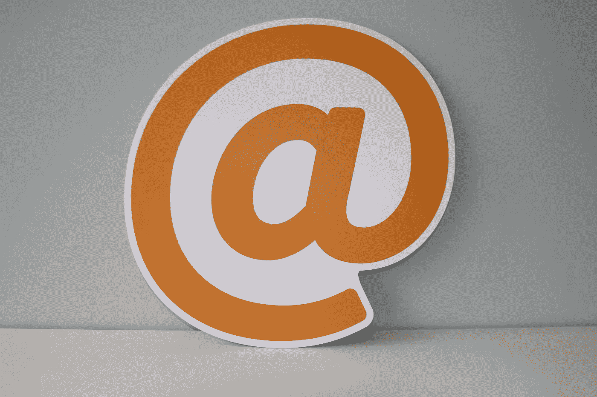

# 这会是我们都在等待的电子邮件服务吗？

> 原文：<https://medium.datadriveninvestor.com/could-hey-be-the-email-service-we-were-all-waiting-for-9be75cf218de?source=collection_archive---------29----------------------->

## 如果你厌倦了电子邮件管理，知道这个神奇的服务

Photo by [Onlineprinters](https://unsplash.com/@onlineprinters?utm_source=unsplash&utm_medium=referral&utm_content=creditCopyText) on [Unsplash](https://unsplash.com/s/photos/email?utm_source=unsplash&utm_medium=referral&utm_content=creditCopyText)

> 重要建议:这里没有任何联盟营销链接，我也没有从我在这篇文章中提到的公司或个人那里收到任何东西。

# 我们都厌倦了电子邮件管理。

是真的。我们不能欺骗自己。就像你摆脱不了的坏邻居。

电子邮件首次使用是在 1973 年。将近 50 年后的今天，2020 年或多或少还是老样子。

# 这难道不是奇迹吗？

我们能想到任何与 50 年前或多或少相似的技术服务或产品吗(假设它仍然存在)？

为什么会这样？

我真的无法回答这个问题。

我厌倦了电子邮件，但同时，我喜欢它。我疯了吗？确信这一点。

我喜欢电子邮件只是为了**一件大事**。

这是一种**异步媒体**。我决定何时查看它(我关闭了所有的通知)。

> 这给了我力量。不被打扰的力量。能够管理我的时间，我的生活。

我们继续使用电子邮件，因为没有什么可以和它竞争。

我们喜欢 Slack、Whatsapp、聊天服务、项目管理工具……但电子邮件仍然存在。

我甚至会说更多。例如，由于付费时事通讯等服务，它甚至还在增长。Substack 或 Convertkit 之类的服务可以提供很多这方面的信息。

# 去年 6 月，2020 年 15 日，经过两年的努力，Basecamp 发布了嘿，“最佳电子邮件”。

值得吗？

这是我看完[这个 YouTube 视频](https://www.youtube.com/watch?v=UCeYTysLyGI&t=1437s)后问自己的。在这里，你可以找到杰森弗里德，嘿的首席执行官，分享嘿之旅。

首先:它有一大堆新功能。

[这里](https://hey.com/features/)，可以找到排名靠前的。

*   我真的很喜欢这项服务，因为它是一种完全不同的“面对”电子邮件的方式。
*   在我看来，它的用户界面令人惊叹。
*   它有着我们一直想要的奇妙特性。

 [## 取代你的风投？企业家的 5 条原则|数据驱动的投资者

### 在 Tau Ventures，我们建议所有企业家将融资过程中的勤奋过程视为双向的…

www.datadriveninvestor.com](https://www.datadriveninvestor.com/2020/11/29/replacing-your-vc-5-principles-for-entrepreneurs/) 

**哪些关键特性引起了我的注意？**

*   **滚动。1973 年，阿帕网的人不知道卷轴是什么意思。今天是必须的。仅仅通过滚动屏幕就能看到一堆电子邮件，这太棒了。**
*   **成堆。**它们像标签吗？不完全是。你有三大堆文件:**收件箱**(或 **imbox** ，正如他们所称的那样， **Feed** (堆积你所有的时事通讯)，以及**文件跟踪**(存储你的收据、确认和交易邮件)。关键是你可以通过滚动来查看你的内容。真的很棒。
*   **焦点&回复。**又棒了！你可以进入所有你标记为“稍后回复”的邮件，看到一个华丽的屏幕，所有邮件内容都在你的左手边，每个邮件的右手边都有一个回复框，上面有一个回复按钮。可以一个接一个的回复，不用回头看收件箱。
*   **文件。你可以在一个库中看到你邮件的所有附件。您可以通过电子邮件地址、文件类型进行搜索…节省时间！**
*   **合并线程。**如果来自不同发件人的几封电子邮件彼此相关，您可以创建一个唯一的线程来将所有信息保存在一起。

我可以列出一整天的功能，因为这些家伙做了惊人的工作，我想祝贺他们。

# 重点是:我们该怎么办？

他们提供核心服务。这是任何用户拥有的最重要的服务之一。

我一生都在我的 Gmail 账户里！！！！(我是 2010 年创建的……)。

> 我们的 3 家公司正在与谷歌合作。我们不仅仅谈论电子邮件。我们说的是 Google Suite(现在的 Google Workspace)。从这里搬走真是疯了！

我的个人 Gmail 账户呢？我在很多事情上也依赖谷歌:电子邮件、工作空间、驱动……这些应用程序的互联方式非常棒。我不能停止使用它们。

我并不害怕迁移到新的软件架构中(最近，[我把我所有的生产力都转移到了观念](https://medium.com/datadriveninvestor/why-i-do-think-notion-software-can-change-your-life-3f09f22af91b))，但是这是一个很高的要求。

**我有很多“如果……会怎么样”…**

*   如果谷歌开发了这种功能会怎么样？我仍然在想为什么谷歌大更新如此罕见。当他们开发诸如“打盹”或“稍后发送”等功能时，这是我的一个“大动作”，这些功能是其他软件公司很久以前创建的。
*   **厌倦了 HEY 怎么办？**
*   如果 Basecamp 决定停止 HEY 的工作怎么办？
*   如果在告诉很多人我的新电子邮件地址(因为你必须创建一个. hey 电子邮件地址)后，我回到 Gmail 会怎么样？
*   …

当你谈到像电子邮件这样的核心服务时，这让人害怕。

顺便说一下， **HEY 一年 99 美元**。我不在乎每个月花 8 块钱买一个能改善我生活的核心服务，但我必须告诉你这些，以防万一…

# 外卖食品

我的立场非常明确。**我会留在谷歌**。

我很确定这种功能迟早会在 Google 中实现。

谷歌要往前走一步(我希望……)。

如果没有，那么可以使用过滤器、标签等等(或多或少)实现许多这样的特性。有点乱，但有可能。

无论如何，对你们中的许多人来说，嘿可能是一个有趣的选择:

*   **在我看来，是一个革命性的产品。他们从零开始，那永远是开发者的天堂。**
*   它的设计和实现非常好。HEY 的团队寻找电子邮件管理的所有缺点，并开发出真正独特的功能。

再次祝贺这个了不起的 Basecamp 团队，因为他们确实创造、设计和开发了改善我们生活的美丽产品。

## 访问专家视图— [订阅 DDI 英特尔](https://datadriveninvestor.com/ddi-intel)