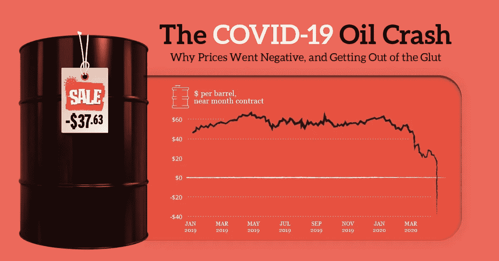
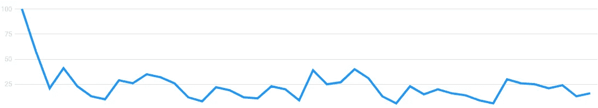

# 机器学习和 NLP 能预测石油的崩溃吗？答案是肯定的。数据驱动的投资者

> 原文：<https://medium.datadriveninvestor.com/could-machine-learning-and-nlp-have-predicted-oils-crash-2a5f6f8028cc?source=collection_archive---------15----------------------->

## 关于如何结合机器学习和自然语言处理成功预测新冠肺炎铅油崩溃的指南。

**2020 年 4 月 20 日****WTI**(美国原油基准)期货历史上首次达到负值。换句话说，生产商必须付钱给交易商，让他们扔掉手中多余的石油。这样的灾难不是一天的事情。相反，在崩溃前的几个月里，幕后一直在酝酿一个过程。该过程本身将在另一篇文章中讨论，因为它不是今天分析的主题。

 [## 编码器解码器序列:多长是太长？数据驱动的投资者

### 在机器学习中，很多时候我们处理的输入是序列，输出也是序列。我们称这样的一个…

www.datadriveninvestor.com](https://www.datadriveninvestor.com/2020/03/24/encoder-decoder-sequences-how-long-is-too-long/) 

黑金可以用很多东西来形容。不可否认，其主要特点是其波动性和不可预测性。理解我对这些词的解释很重要。石油是地缘政治游戏。历史数据通过显示每次重大价格波动时的地缘政治暗流证明了这一说法。

**本文中讨论的技术也可以手工实现，不需要使用** [**机器学习**](https://www.datadriveninvestor.com/glossary/machine-learning/)

# 机器学习在预测车祸中的作用

[机器学习](https://www.datadriveninvestor.com/glossary/machine-learning/)和[人工智能](https://www.datadriveninvestor.com/glossary/artificial-intelligence/)可以用来解决人类几乎所有的问题。价格预测也不例外。

无数的[机器学习](https://www.datadriveninvestor.com/glossary/machine-learning/)技术每天都被测试，以提供关于如何完善价格预测模型的见解。目前市场上的大多数模型利用人工神经网络、[随机森林](https://www.datadriveninvestor.com/glossary/random-forest/)和[逻辑回归](https://www.datadriveninvestor.com/glossary/logistic-regression/)等技术来执行某种时间序列技术分析。下面可以找到如何构建这种预测模型的详细解释。

*预测“黑金”价格误差小于 0.3%的完整指南使用* [*用机器学习和 Python 预测油价-*](https://medium.com/datadriveninvestor/predicting-oil-prices-with-machine-learning-and-python-324153c457ba)[*Python*](https://www.datadriveninvestor.com/glossary/python/)*和机器学习*

简单来说，数据科学家向他们的模型提供历史数据，并教它们如何做出相应的反应。然而，一个巨大的问题产生了。

## 问题是

问题很简单。市场是一个活的有机体。一个如此脆弱且易受第三方干扰的有机体，几乎不可能预测它的下一步行动。

换句话说，问题在于**未知**的元素。内幕消息才是王道。对冲基金和政府不断操纵市场，让数学和机器学习模型完全无能为力。

尽管有些时期可以被描述为“相对和平”，未知总是会浮出水面并改变一切。正如在引言中提到的，石油是一个主要的案例研究，因为它的价格容易受到地缘政治游戏的影响(例如俄罗斯对美国)。

# 那么解决办法是什么呢？

许多人得出了错误的结论，即机器学习不能用于预测市场结果，尤其是在新冠肺炎这样的意外情况下。与怀疑论者相反，我相信通过对我的石油预测模型进行一些调整，石油的市场崩溃可以很容易地预测出来。

时序机器学习分析管用。这是毫无疑问的。因此，任何模型都可以在某种程度上进行时间序列技术分析，这一点至关重要。然而，有许多失败的例子。

是否有效的答案介于两者之间。尽管它是成功的，但它无法在一个活跃的市场生态系统中独自发挥作用。这就是本文中介绍的技术的用武之地。

对于一个能够对意外变化/发现做出快速反应的模型，我得出的结论是它应该遵循以下准则:

*   **模型应具备交互能力(人为干扰可用作模型的数据输入)。**
*   **除了时间序列分析，还应每隔 3 小时对与商品相关的新闻文章进行情感分析。**
*   **Twitter 情绪分析应该每天进行。**
*   **该模型还应考虑从 google trends 导入的数据。**

虽然当“未知”开始起作用时，上述方法不能 100%准确，但情况肯定会得到更好的处理。

我相信一个遵循上述指导方针的模型可以部分预测最近的石油危机。

## 它是如何被应用到这种特殊情况的呢？

正如我已经概述的那样，这种情况不会在一天之内升级。相反，它已经发展了一个多月了。总而言之:

*   新闻分析显示，目前市场上的石油供应有所增加。
*   **使用谷歌趋势，该模型会发现石油需求突然减少。**
*   **Twitter 也可以作为一个参考点，但在这种情况下，它不会真的有所帮助。**

*如果你喜欢这篇文章，并且有兴趣免费接收每月独家内容，可以在本文末尾订阅我的独家邮件列表(也可以直接从* [*这里*](https://bit.ly/filipposmaillist) *)进入。*

# 新闻源分析

过去几个月里发生了一些非常奇怪的事情。大型出版物上出现了大量文章，都在谈论石油输出国组织石油产量的突然激增。

石油输出国组织成员同意在 2020 年 3 月 31 日之前限制产量。然而，3 月 6 日，俄罗斯宣布从 4 月 1 日起不再限制生产。作为回应，石油输出国组织宣布将增加产量。

现在很明显，为什么下面列出的文章开始在网络上出现:

 [## 大宗商品供给:欧佩克+供应激增

### 能源对于石油市场来说，这是一个可怕的季度，ICE 布伦特原油在 2010 年前三个月下跌了近 66%

think.ing.com](https://think.ing.com/snaps/the-commodities-feed-opec-supply-surge/)  [## 石油专家丹·尤金说，4 月份，石油需求可能每天减少 2000 万桶

### 石油市场正面临着“双重危机”, 欧佩克+联盟的瓦解影响了供应，同时石油市场的增长放缓

www.cnbc.com](https://www.cnbc.com/2020/03/30/dan-yergin-aprils-oil-demand-may-plunge-by-20-million-barrels-a-day.html)  [## 俄罗斯拒绝削减石油产量是在想什么？

### 上周，石油输出国组织与一个合作伙伴联盟举行了会议，该联盟自…以来一直致力于限制石油产量

www.forbes.com](https://www.forbes.com/sites/rrapier/2020/03/08/what-was-russia-thinking-in-refusing-to-cut-oil-production/#2c605ae07fcc)  [## 俄罗斯拒绝欧佩克+削减石油产量的协议

### 俄罗斯周五与石油输出国组织决裂，拒绝减少石油产量的呼吁。弗拉基米尔·普京总统下令…

www.insideover.com](https://www.insideover.com/economy/russia-refuses-opec-deal-to-cut-oil-production.html) 

该模型还会对月份进行分类，使用情绪分析来创建风险评分。

***我将调用此数据点 1**

# 谷歌趋势

谷歌趋势是一个很好的工具，但不幸的是，它经常被忽视，没有被考虑进去。一旦一个人理解了谷歌趋势实际上是什么，忽视它是没有意义的。

**谷歌趋势是整个世界搜索/购买模式的预览。**

因此，很明显，通过分析与石油相关的关键词/短语，可以获得许多有用的信息。这样的短语和单词太多了，但简单的例子有:

> *“哪里可以买到油？”*
> 
> *“我能从家里买油吗？”*
> 
> *“石油买起来贵吗？”*

这些关键字/短语如此重要的原因是它们向我们的模型显示了石油的需求量。这些都是想为自己购买石油的人进行的常见谷歌搜索。

需求数量显然不是石油的实际需求数量，因为模型根本没有计算这一数值所需的数据。实际上，这样的统计数据将使我们能够对前几周/几个月/几年的石油需求量有一个概念。

让我们来看看在石油危机前的几周内，与购买石油相关的谷歌趋势搜索。

Google Trends for Oil Purchases March-April

三月中旬左右，似乎发生了一些非常奇怪的事情。人们已经停止购买石油。

当在其他条件相同的环境中审视这一现象时，它毫无意义。一定有一个触发事件，导致了石油需求量的减少。这个事件是新冠肺炎。世界上的大多数人被迫在家里隔离，没有通过汽车通勤的奢侈。商业航班几乎完全被禁止，大部分海上旅行也是如此。换句话说，我们日常生活中对石油的需求已经大大减少。

该模型会立即发现这种异常情况，从而做出石油需求量已大幅减少的假设。

***我将调用此数据点 2**

# 推特情感分析

虽然 twitter 活动可能不是这种情况下最合适的指标，但提取与石油相关的推文的情感可以为模型提供额外的洞察力。

整合 twitter 的最佳方式是分析所有与石油相关的推文，并给它们打分。如果这个分数是负的，它可以帮助模型做出决定。

我最近看到了两个资源，它们与这个分析的内容直接相关，可能会有所帮助。

 [## 石油行业的 Twitter 挖掘:情感分析方法——IEEE 会议出版物

### Twitter 已经成为互联网用户中非常受欢迎的交流工具，允许 5 亿用户分享…

ieeexplore.ieee.org](https://ieeexplore.ieee.org/document/6686093)  [## NicholasTanWeiHong/原油情绪分析

### 这个项目利用了来自 Twitter 的文本数据，以及 R 中的自然语言处理包(例如…

github.com](https://github.com/NicholasTanWeiHong/crude-oil-sentiment-analysis) 

*   **我将把这个数据点称为 3**

# 结论

通过结合所有三个数据点，该模型将得出结论，即市场上石油供应过剩，因此价格将会下降。虽然它不会显示石油的确切价格，但它肯定会表明最好的办法是做空市场。

我鼓励每个人都尝试不同的机器学习技术，并尝试实现上述步骤，以便为石油和任何其他商品制作一个实用、更准确的价格预测器。

为了帮助人们思考，这是一个理论性的、非常简洁的方法。一旦我开发了这个模型，另一篇文章将会一部分一部分地解释它。

# 你想了解更多吗？

如果你想**增进你的知识**并且对**预测更多商品价格**感兴趣，我**强烈鼓励你**阅读下面**列出的文章**:

 [## 用机器学习和 Python 预测油价

### 使用 Python 和机器学习预测“黑金”价格的完整指南，误差小于 0.3%

medium.com](https://medium.com/datadriveninvestor/predicting-oil-prices-with-machine-learning-and-python-324153c457ba)  [## 千禧一代！这是你一直在寻找的非常规赚钱技巧

### 如何使用 python 和 ML 以 0 美元启动资金制作成千上万的完整蓝图。

medium.com](https://medium.com/datadriveninvestor/millennials-this-is-the-unconventional-money-making-technique-you-were-looking-for-3b47c7384c60)  [## 我如何使用 Python 和 Deep…帮助世卫组织应对非洲最致命的医疗危机之一

### 关于如何结合 Python 和 DL 以 98%的准确率检测一个人是否患有疟疾的完整指南。

medium.com](https://medium.com/datadriveninvestor/how-i-helped-the-who-deal-with-one-of-africas-deadliest-medical-crisis-using-python-and-deep-be259de48f08) 

*原载于 2020 年 5 月 4 日 https://www.datadriveninvestor.com**的* [*。*](https://www.datadriveninvestor.com/2020/05/04/could-machine-learning-and-nlp-have-predicted-oils-crash-the-answer-is-yes/)