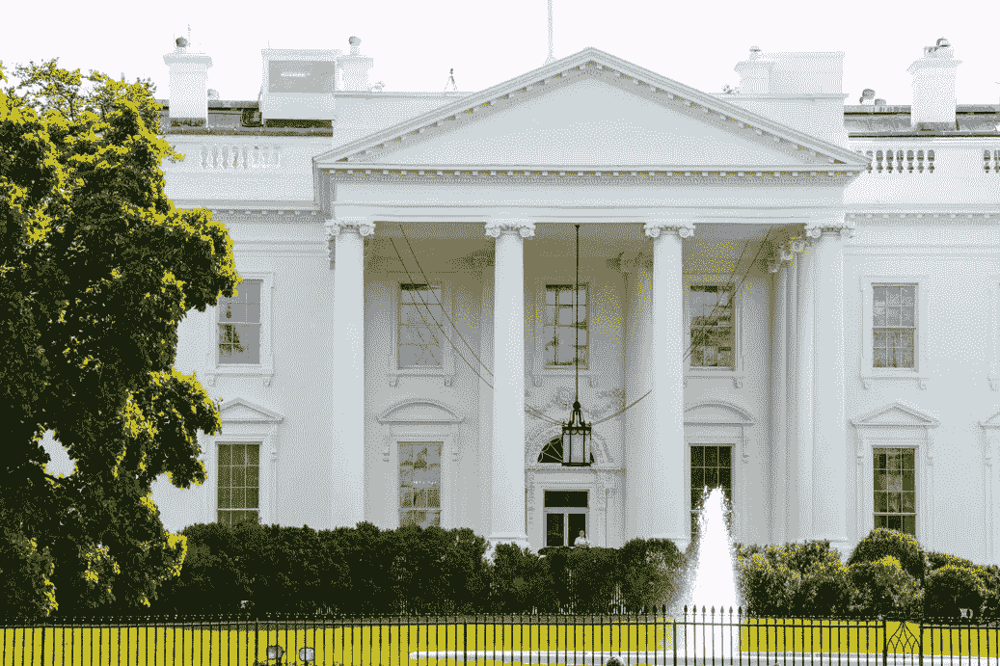
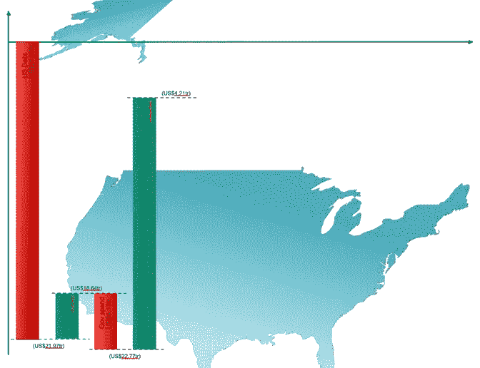
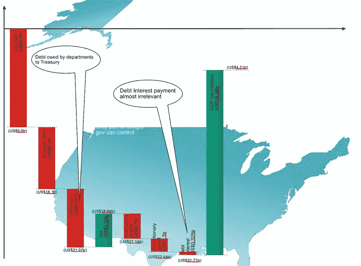
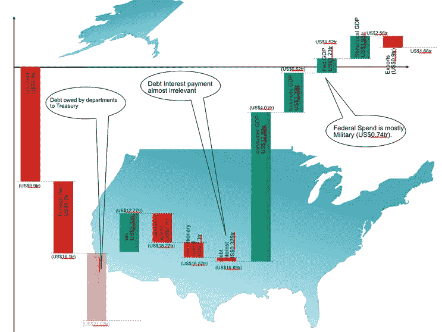

# 现代货币理论能拯救美国吗？

> 原文：<https://medium.datadriveninvestor.com/could-modern-monetary-theory-save-america-2c2a3ef0e185?source=collection_archive---------2----------------------->

## 政治家和学者对 MMT 提出了戏剧性的主张。我将其应用于 2018 年的美国经济，并了解到债务并不总是债务。

Photo by [Ben Mater](https://unsplash.com/@benjmater?utm_source=medium&utm_medium=referral) on [Unsplash](https://unsplash.com?utm_source=medium&utm_medium=referral)

现代货币理论(MMT)听起来枯燥乏味，但却引起了不小的轰动:

*   MMT 的主要思想家沃伦·莫斯勒显然挤满了意大利的体育场。(嗯，肯定是会议厅！)
*   斯蒂芬妮·凯尔顿教授，一位 MMT 的传播者，在日本遭到了围攻。
*   亚历山大·奥卡西奥-科尔特斯(纽约州众议员)，使用 MMT 来证明政策的合理性，是争议的焦点。

看看[这个、](https://www.bloomberg.com/news/articles/2019-07-26/randall-wray-modern-monetary-theory-is-going-global)和[这个](https://abcnews.go.com/Politics/ocasio-cortez-responds-criticism-progressive-policies-debate-exclusive/story?id=64679531)，也是。

为什么大惊小怪？这与 MMT 倡导者的戏剧性主张有关。

*“财政政策应该旨在创造充分就业，同时保持低通胀(而不是，比如说，实现预算平衡)。”* —詹姆斯·蒙泰尔，[为什么大家都讨厌 MMT？](https://www.gmo.com/globalassets/articles/viewpoints/2019/jm_why-does-everyone-hate-mmt_3-19.pdf)

*“我认为我们需要做的第一件事是打破税收支付 100%政府支出的错误观念，”* —亚历山大·奥卡西奥-科尔特斯，在 2019 年 2 月接受 NPR 晨报采访时说道

“如果国会批准几十亿美元或几千亿美元的额外支出，那么美联储的工作就是确保这些支票不会被退回，”——石溪大学的斯蒂芬妮·凯尔顿教授。

 [## 经济就是包容人|数据驱动的投资者

### 建模，数据，最重要的是，人 Tayo Oyedeji 博士在他的食谱中混合了所有这些成分，为一个…

www.datadriveninvestor.com](https://www.datadriveninvestor.com/2019/03/06/economy-is-all-about-including-people/) 

它的批评者并没有退缩:

“我认为，赤字对那些可以用本币借款的国家来说无关紧要的观点是错误的。我们要么减少支出，要么增加收入。”，杰罗姆·鲍威尔在 2019 年 2 月的参议院听证会上讲话。

谁是对的？如果这听起来好得不像是真的，但是 MMT 的支持者有令人印象深刻的资历。我不得不仔细看看。

The Whitehouse (Author, 2014)

与其用 MMT 的大杂烩让你厌烦，我想我会变得激进。理解理论最好的方法就是应用，于是我当了一天假美国总统(FakePrez)。作为 FakePrez，我试图理解 MMT 将如何对 2018 年的美国经济产生影响

我认识到债务并不总是债务，大政府并没有那么大。MMT 对我有用吗？

请继续阅读。

# 我需要好好想想 MMT。

意大利的一场危机启发了沃伦·莫斯勒。20 世纪 90 年代意大利陷入金融困境时，他是华尔街的交易员。公认的观点是，意大利将会拖欠贷款。

莫斯勒不同意，因为意大利控制着自己的货币，而且赌注很大。意大利没有违约，[莫斯勒赚了我们 1 亿美元](https://www.investopedia.com/modern-monetary-theory-mmt-4588060)。

他在 1993 年发表了一篇论文《软货币经济学》，阐述了一个垄断了一种 [*法定货币*](https://www.datadriveninvestor.com/glossary/fiat-currency-2/) 的政府不会缺钱的观点。它只是电脑上的一个数字，如果你需要更多，就改变这个数字。

为什么我们使用法定货币？因为世界经济太大了，不可能受到黄金或白银等实物的约束。根据美国中央情报局世界概况的数据，2017 年，世界经济的购买力为 127.8 万亿美元。所有铸造的黄金价值约 7.5 万亿美元。

让它深入人心。电脑上的数字才是真相，而不是实体的纸币或硬币。

明白这一点，MMT 更有意义。如果一个政府想向一个经济体注入资金，它会编辑一个数据库记录并开始支出。(感觉像出轨！)如果政府想要减缓经济增长，它会提高税收(而不是利率)并转移资金。

一个拥有法定货币超级权力的政府理论上可以做出惊人的事情:

*   一次性付清国债(如果是本国货币)。
*   向所有需要的人支付最低生活工资。没有人会被落下。
*   建设新的国家基础设施以满足绿色议程。

这样的政府不需要向任何人征税就能运转，这并非史无前例。有些国家有足够的外汇收入来避免向公民征税。Motley Fool 网站在这里列出了十个。

许多人不喜欢凭空创造货币的想法，并提到了上世纪 70 年代通胀危机的原罪。

大通胀被归咎于油价、货币投机者、贪婪的商人和贪婪的工会领导人。然而，很明显，为巨额预算赤字融资并得到政治领导人支持的货币政策是[原因](https://www.investopedia.com/articles/economics/09/1970s-great-inflation.asp)。

MMT 爱好者[如何解决](https://www.datadriveninvestor.com/glossary/address/)这个问题？注入经济的资金被浪费了。本来应该用来投资的。当经济无法满足需求时，就会出现通货膨胀，因此新的货币应该用于提高经济效率和能力。

作为 FakePrez，我能从中得到什么？

我喜欢 MMT 的清晰，简单，甚至优雅。法定货币的逻辑似乎很合理。然而，即使是法定货币也必须遵守供求规律，任何东西太多都是没有价值的。不是吗？

我将不得不问自己的问题是:——我如何识别什么将使经济更有生产力？—投资需要多长时间来促进经济？—如果投资出现问题，我是否有勇气提高税收来对抗通胀？

# 我需要了解美国经济。

作为致力于虚构政策的 FakePrez，我应该了解美国经济。经过一番思考，我决定平衡美国的负债和收入流。经济学家经常比较国债和 GDP，所以我就这么做。

我将使用瀑布图，每个图的粒度越来越大。

2018 US Economy (Will Murphy)

与国债相比，税收和政府支出似乎微不足道。幸运的是，我们有美国经济的规模(GDP 净通胀)来看待事情。

即便如此，如果美国经济是一家公司，它也会资不抵债。然而，美国经济是世界上最强大的，所以它不会那么糟糕。我需要更仔细地看。

# 债务有很多种。

Expanded National Debt (Will Murphy)

请看新图表的最左侧:

*   欠美国债权人的债务(9.9 万亿美元)
*   欠外国债权人的债务(62 万亿美元)
*   美国财政部欠其他部门的债务(5.87 万亿美元)

美国的债务包括流通中的货币价值。每张纸币和每枚 T2 硬币都会产生债务，但这只是名义上的债务。

外债更令人担忧。例如，美国欠中国 1.3 万亿美元，使其成为美国最大的债权人。如果中国变得刻薄怎么办？我需要再次恐慌吗？

中国的债务代表了进出口之间的不平衡。比方说，中国以 1000 美元的价格卖给美国一台电脑，而美国卖给中国 800 美元的加州葡萄酒。美国不会把 200 美元交给中国。取而代之的是，它将 200 美元存入中国在美国美联储的账户。

没有货币离开美国。

为什么中国会同意呢？它为美国人制造产品，这让它可以看到最新的技术。它在中国创造了就业机会，美国被迫认真对待中国。

政府内部债务不是威胁，因为这是美国财政部欠政府部门的钱。例如，多年前，美国的社会保障体系花不完预算，因此不得不购买国债。

美国国债可能看起来很庞大，但当你仔细观察时，它是软的。我将重新绘制没有政府间债务的瀑布图。

Economy With No Intra-Gov Debt (Wil Murphy)

看起来好多了。即使 MMT 的支持者对法定货币的看法完全错误，美国的债务也不像我最初认为的那样。

# 开销怎么样？

我需要创造增长吗？经济在 2018 年放缓，所以答案是肯定的。如果我跟随 MMT，我需要考虑创造金钱。

是否存在通胀问题？[2.49%](https://www.in2013dollars.com/inflation-rate-in-2018)，还可以，但偏高。如果我创造货币，我需要提高经济生产率。我把钱花在什么上面了？我还需要做多少？

从预算的角度来看，我 3.3 万亿美元支出中的 2.5 万亿美元是强制性的(如医疗保险)，3250 亿美元是债务利息[支付](https://www.datadriveninvestor.com/glossary/payment/)。我只有 13 亿美元可以使用。军方从中获得 9000 亿美元。这对经济有多大帮助？

我没有信心。

# 解构 2018 GDP。

Expanded GDP (Will Murphy)

美国 2018 年 GDP 为 20.5 万亿美元，经通胀调整后为 18.6 万亿美元，非常惊人。只有欧盟接近 27 个国家的经济总和。我 7950 亿美元的赤字怎么能让这么大的经济体显著增长呢？我需要类固醇的倍增效应。

我最好打开 GDP 的数据。

明星是 12.89 万亿美元的消费者支出，其次是 3.39 万亿美元的商业支出。哦，天哪，政府对 GDP 的影响只有 3.18 万亿美元

等等，比那更糟。3.18 万亿美元包括州级和地方支出。我控制不了。联邦政府的 GDP 贡献只有 1.23 万亿美元

我将不得不创造相当多的钱。我吓呆了。

# 在基础设施上下大赌注？

我能怎么做呢？

消费者支出略低于 GDP 的三分之二。我必须做一些影响 1 . 27 亿家庭的事情。[英语背诵文选减税听起来是最好的办法，但这意味着我失去了对付通货膨胀的唯一武器。虽然我会很快得到结果，而且会很受欢迎。

我需要确定美国的生产力继续增长。我有什么选择？大型基础设施项目听起来不错。[这里有五大](https://www.governing.com/topics/transportation-infrastructure/gov-5-biggest-us-infrastructure-projects-plus-5-at-risk.html):

*   杜勒斯运输扩建工程(造价 62 亿美元；8 年)。
*   奥泰梅萨东区(7.15 亿美元；等待好的)。
*   奥黑尔现代化(88 亿美元；8 年)。
*   新月形走廊扩建(25 亿美元；2030).
*   阿拉斯加高架桥(31 亿美元；？).

总计约 210 亿美元，这只是小钱。我更加恐慌了。大型基础设施项目需要数年甚至数十年才能完成。我现在需要额外的经济能力。

为什么他们需要这么长时间？联邦政府不能独自做这样的事情。需要州政府和地方企业提供资金。更糟糕的是，我需要得到当地的批准。

我也需要这些项目来推动整体经济。我祝杜勒斯和其他人好运，但我需要整个经济更好地运转。我需要阻止我的联邦减税政策将带来的通货膨胀。

我把辞职信放在哪里了？

MMT 以学术严谨著称，而且很优雅。对金钱在现代经济中如何运作有着真正的见解。政府对待债务的方式可以不同于个人或公司对待债务的方式。

它有缺陷，因为它假设:——中央政府对复杂的经济有足够的了解，可以对市场进行事后分析。—政府对一个经济体有足够的影响力，能够有意义地迅速改变它。—经济能力的提高与经济刺激相一致。

这些假设是不现实的，因为美国经济太大太复杂，无法集中操控。

美国 GDP 的最大组成部分是消费者支出，诚然，这很容易通过减税来刺激。人们在他们的账户上看到钱，消费主义发挥了它的魔力。

满足新需求所需的投资支出几乎完全超出了我的控制范围。我可以造桥、修路，但好处要好几年才能显现。与此同时，我要么取消减税政策，要么开始提高利率。

我希望 MMT 像听起来那么简单。

我在科技行业已经 30 年了。我的职业生涯开始于编写代码来模拟大型机时代的 IBM 集群控制器。在 2000 年代早期，在进入 IP 网络设计之前，我为英国电信的国家 MPLS 网络设计供应软件。在过去的十年里，我的观点变得更加商业化。我的学术训练始于计算机科学的 a. first，我获得了达勒姆大学的工商管理硕士学位。我热衷于跑步和弹钢琴。

*原载于 2020 年 2 月 4 日*[*【https://www.datadriveninvestor.com】*](https://www.datadriveninvestor.com/2020/02/04/could-modern-monetary-theory-save-america/)*。*