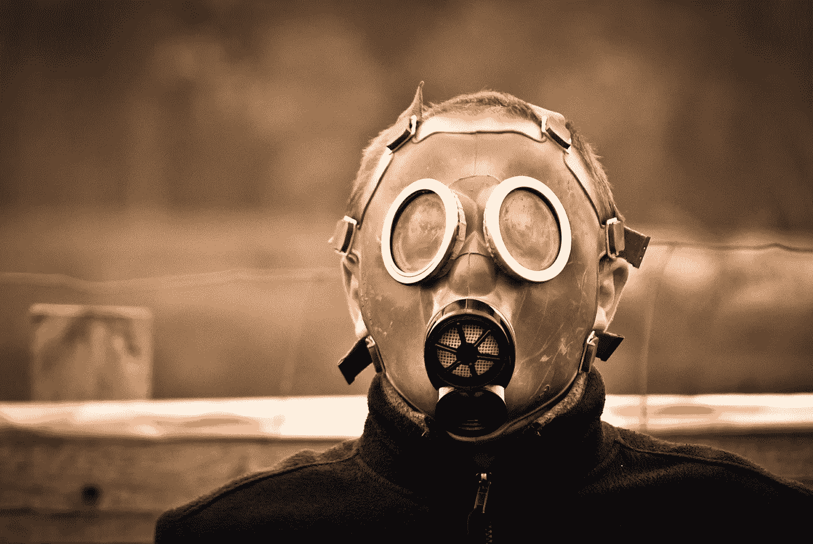

# 冠状病毒会摧毁自由市场吗？

> 原文：<https://medium.datadriveninvestor.com/could-the-coronavirus-destroy-the-free-market-a374b23519eb?source=collection_archive---------15----------------------->

[Łukasz Dyłka](https://pixabay.com/users/lukaszdylka-347100/?utm_source=link-attribution&utm_medium=referral&utm_campaign=image&utm_content=469217)

## 冠状病毒揭示了自由市场的缺陷，由于气候危机，这些缺陷将变得更糟

很难理解这么小的东西怎么会产生如此巨大的影响。冠状病毒的病例现已在 177 个国家得到确认。这种微小的病毒已经无情地在地球上传播。仅在英国，最坏的情况是 80%的 T2 感染率，50 万人死于该病毒。不幸的是，看起来情况在好转之前会变得更糟。

控制疫情的反应已经使全球经济陷入瘫痪。虽然冠状病毒成为头条新闻，但它破坏经济的速度令人惊讶。这个故事背后的故事是冠状病毒如何暴露了我们经济体系的内在缺陷，特别是自由市场。

## **濒临崩溃的经济**

应对危机的行动感觉更像是一个灾区，但这是一个公共卫生紧急事件，需要采取严厉的行动。一些国家采取了严厉的措施来强制实施封锁，另一些国家则鼓励自我隔离。这两项措施都阻止了人们以正常方式消费。通常熙熙攘攘的餐馆、酒吧和咖啡馆变得冷清了。冠状病毒在和平时期前所未有地阻止了资金的流动。

 [## 另一场精心策划的全球经济危机正在逼近？如果我们的数据经济可以帮助它|数据…

### 我们的 DApp 的开发，称为 DECENTR，目前正与我们的 R&D 同步进行，作为我们即将到来的…

www.datadriveninvestor.com](https://www.datadriveninvestor.com/2019/03/06/another-engineered-global-economic-crisis-looming-not-if-our-data-economy-can-help-it/) 

一旦资金流动停止，经济就会崩溃。疫情向我们表明，许多企业只差几笔欠款就要倒闭了。英国政府推出了 3500 亿英镑的一揽子援助计划来支持有需要的企业。美国似乎也会效仿，正在讨论一个[1 万亿美元的一揽子援助方案](https://www.reuters.com/article/us-health-coronavirus-usa-congress/u-s-lawmakers-pushing-ahead-with-third-coronavirus-aid-package-idUSKBN2161FX)来支持经济。

政府干预经济是不应该发生的。市场不需要政府干预，因为市场会自我纠正。资金流向需要它的地方。然而，理论书籍并没有在实践中发挥作用。冠状病毒的爆发是一个突出的例子，表明自由市场只有在一切都对其有利的情况下才能发挥作用。一切照旧之外的情况就像水中的冰山。市场不稳定到没有政府支持就无法运转的地步。

美国和英国政府都是自由市场的坚定支持者。像这样刺激经济是他们政治情绪的矛盾。但是别无选择，政府干预对于防止经济崩溃是必要的。自我修正的“自由”市场到此为止。

自由市场只有在运转时才是“自由的”。一旦情况发生变化，政府就需要进行干预来拯救经济。自由市场的支持者会辩称，非常时期需要非常手段。这些同样的拥护者会争辩说，自由市场总是会纠正错误。显然，市场并不像这些自由市场倡导者让你相信的那样能够自我修正。

## **终极第二十二条军规**

一旦一切恢复正常，自由市场就可以再次自由，我们都可以回到最重要的事情上，赚钱。这就是我们经济模式的终极弱点。一切照旧将为市场创造财富，但会给环境带来灾难。允许市场繁荣的条件正在制造气候危机。

自我修正的自由市场不承认环境破坏是一个问题。事实上，市场根本不考虑环境本身。全球二氧化碳排放是有史以来最大的市场失灵。然而，排放并没有作为成本内在化，而是政府需要处理的外部因素。

你能看出这里的问题吗？

一切都朝着有利于市场的方向发展。它不求回报。现在，比以往任何时候都更需要重新考虑让市场随心所欲的好处。不可避免的是，一旦危机消退，一切都会恢复正常。

由于我们经济体系的脆弱性，市场是毋庸置疑的。一切照旧让经济繁荣发展。同时，它也在破坏自然世界。一个自然的世界，对维持一切照常的条件来说是无价的。这是终极的第 22 条军规。

## **气候危机将导致灾难**

冠状病毒的影响是主要事件的前奏。随着我们迈向二十一世纪，气候危机的影响将变得势不可挡。一旦支持生命的条件被侵蚀掉，社会就会崩溃。

正如我们所见，规范可以很快瓦解。与气候危机不同的是，变化是不可逆转的。随着我们面前的环境发生变化，金钱无法解决全球社会面临的挑战。

我们所依赖的体系正处于崩溃的边缘。如果我们不为这些变化做好准备，气候危机将是致命的一击。

同样，我们可以指出市场是我们没有转变经济的原因。强大的既得利益集团在我们当前的行事方式中从自由市场中获得了丰厚的利益。他们有什么欲望或动力去做出改变？忘掉创造一个与自然和谐相处的经济吧。变革对他们的自身利益是一种风险。少数人的短期利益优先于环境的长期利益。

市场经济很可能有缺陷，但它在一件事上非常出色，让很多人变得富有。虽然它继续让富人更富，但人们很容易对其内在的弱点视而不见。最坏的情况是这些缺陷继续被忽视，直到为时已晚。

我们在和人类玩俄罗斯轮盘赌，不可避免地，我们会落在一颗子弹上。当我们这样做的时候，后果将是灾难性的。

【transformatise.com[*阅读原文，订阅更多文章*](http://www.transformatise.com/)