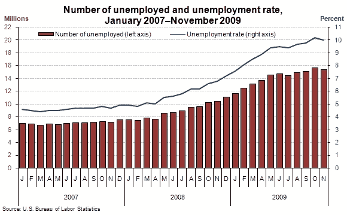
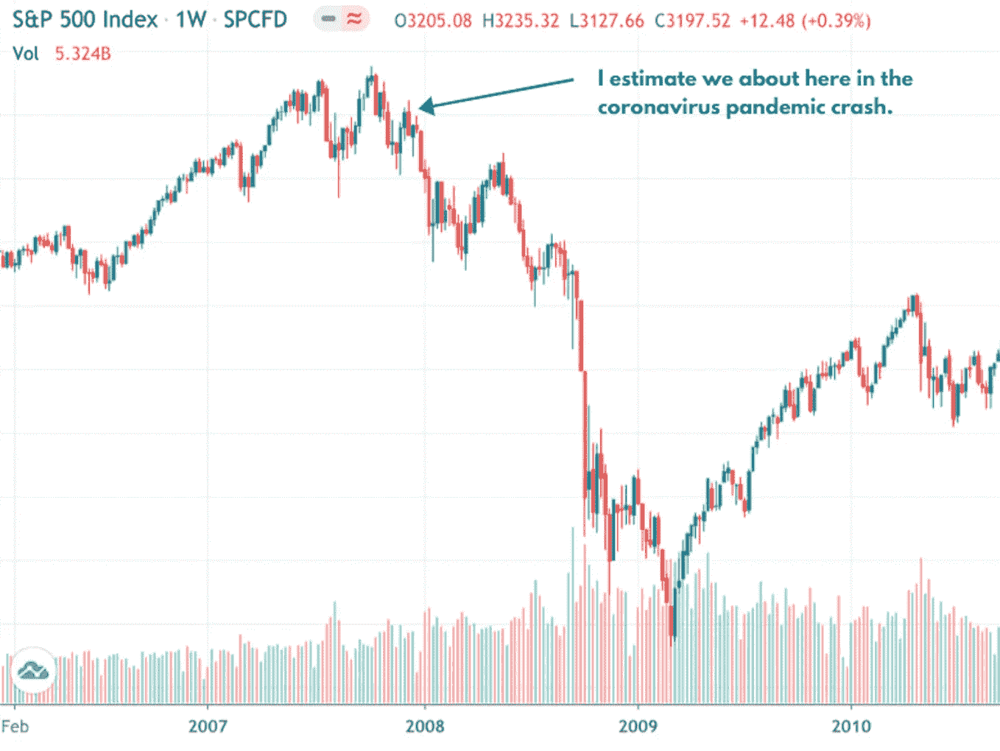

# 数数你的鸡，这次衰退将是残酷的

> 原文：<https://medium.datadriveninvestor.com/count-your-chickens-this-recession-will-be-brutal-7654818c6bf7?source=collection_archive---------13----------------------->

Image by Author.

如果评论家们说对了一件事，那就是经济将会衰退。从技术上来说，我们还没到那一步。“技术性”衰退是指连续两个季度的经济下滑。我们只收到了四分之一的“一级防范禁闭”命令。随着疫情冠状病毒开始影响世界各地的人们，Q1 只是稍微“封锁”了一段时间。

然而，鉴于国内生产总值和经济产出的大幅收缩，例如:

*   Q2 的英国经济产出萎缩了 19.1%。
*   Q2 的经济产出萎缩了 41%。
*   美国经济今年预计收缩 4.8%。

我对下个季度全球经济的部分和试探性重新开放下了很大的赌注，我们将陷入真正的衰退。这些数字太大了，不容忽视。

谁知道这么多的经济活动来自于过自己生活的人。

 [## 国内生产总值下降，国债飙升，新技术可以创造一个强大的新…

### 新冠肺炎危机留下的金融残骸将是毁灭性的，而且会持续很久。已经经济学家…

www.datadriveninvestor.com](https://www.datadriveninvestor.com/2020/04/27/declining-gdp-skyrocketing-national-debt-and-a-new-technology-that-can-create-a-robust-new-economy/) 

## 即将到来的衰退

你可以认为衰退就像地震一样。对人和企业造成的损害只发生在地面最初断裂之后。在这和随之而来的毁灭浪潮之间有一个延迟。经济崩溃也是如此。

这就是我们现在的处境。墙壁可能会摇晃，但漫长而缓慢的清理工作还没有开始。

让我用你能解释任何事情的唯一方法来解释:历史。

## 2008 年全球金融危机，解释。

这场危机的名称令人困惑，因为它始于 2007 年。但是 2008 年是事情开始变得严重的一年。贝尔斯登失败了。零售连锁店宣布了一波又一波的关店潮。美国和发达国家的经济看起来很可能会再次失败。银行和银行都在苦苦挣扎，里面所有的钱看起来可能会在瞬间消失。

2008 年的危机一个月比一个月艰难，坏消息越来越多。美国采取了史无前例的举措，给陷入困境的银行 7000 亿美元，以防止它们倒闭。

这是它在图表上的样子:

Image Copyright of [Trading View.](https://uk.tradingview.com/symbols/SPX/)

正如你从图表中看到的，事情看起来有一段时间有所好转，然后越来越糟，直到 2009 年初开始好转。

从危机的第一步结巴到“技术性”结束大约需要 18 个月。

这场危机对美国的许多社区来说是毁灭性的。一些地区尚未恢复。

大萧条和多年来政府试图阻止流血的严厉经济政策只是在美国人和欧洲人的伤口上撒盐。

英国的紧缩政策是对穷人、残疾人和任何没有 MBA 学位的人的蓄意攻击。

这实际上意味着:

> “这是我们的朋友造成的，但你要为此付出代价”

结果令人震惊。看看这张显示美国失业率的图表。

Image Copyright of [US Bureau of Labor Statistics.](https://www.bls.gov/opub/ted/2009/ted_20091208.htm?view_full)

从图表中可以看出，失业人数直到 2009 年末才达到顶峰。

不工作的人数不到 800 万。直到那时，情况才开始好转。这是在市场开始复苏很久之后。

这对我们来说是个坏消息。

## 冠状病毒疫情 2019 年至今

如果你把 2008 年和现在正在发生的事情做比较，就情节叙事而言，我们大约处于 2008 年初。值得注意的不同是，这次经济打击比 2008 年*严重。明显领先。在上面的图表中，我已经标出了我认为我们现在所处的位置:*

**

*Image Copyright of [Trading View.](https://uk.tradingview.com/symbols/SPX/)*

> *美国的失业率估计已经达到了 14.7%。*
> 
> *4800 万美国人失业。*

*2009 年的失业率为 11%，几乎是危机开始两年后。现在的失业率不太可能已经达到顶峰。从受影响的人数来看，这次衰退比大萧条更严重。*

*坏消息是，这次衰退将是残酷的。*

*考虑到疫情冠状病毒仍在全球蔓延，进一步封锁的可能性非常真实，如果不是不可避免的话。再加上消费者行为的变化，人们对出门和花钱感到焦虑，复苏之路将是漫长而艰难的。*

*现在我可能是错的，但是考虑到经济增长的数据，在经济好转之前，情况会变得更糟。*

## *你能做什么*

*如果你足够幸运没有失业，那么你可以:*

*   *开始存钱吧。*
*   *开始发展你的技能。*
*   *开始创造新的收入。*
*   *在精神上为自己的前路做好准备。*

*如果你在这段时间失去了工作，那么我真诚地为你感到，经济复苏之路将会更加艰难。*

*但是，我们每个人都有无限的希望和决心，而艰难的时刻只是暂时的。*

*现在，你有机会投入 100%的时间和精力去建立一些有价值的东西，这些东西可以度过这些艰难的时期，并帮助推动你走向未来的繁荣。*

*如果你喜欢这篇文章，那么请考虑注册我的邮件列表:*

 *[## 时事通讯注册—千禧净值之旅

### 注册我们的邮件列表，了解我们最新的帖子和深入的投资新闻和分析。我们…

millennialnetworthjourney.com](http://millennialnetworthjourney.com/newsletter-sign-up/)* 

***访问专家视图—** [**订阅 DDI 英特尔**](https://datadriveninvestor.com/ddi-intel)*