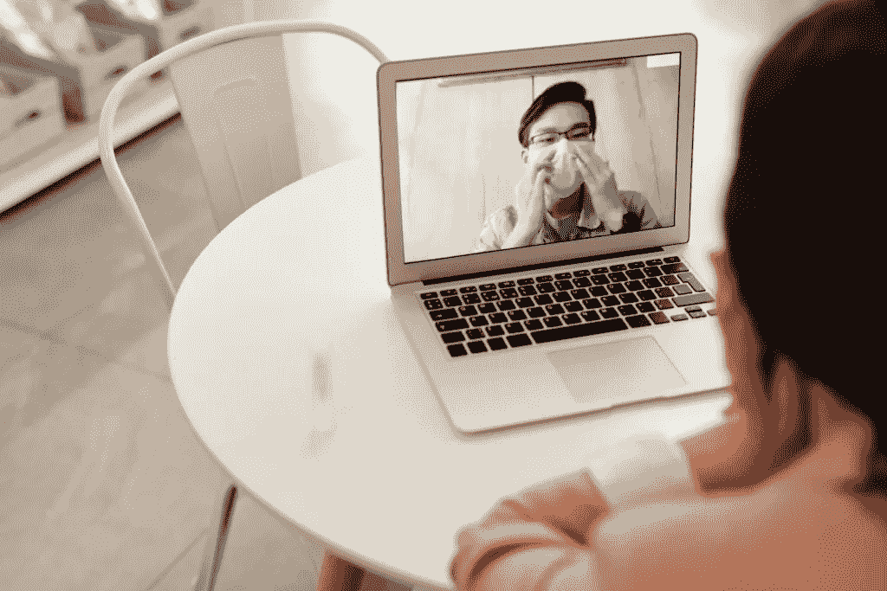

# 台面自由——新常态下的灵感

> 原文：<https://medium.datadriveninvestor.com/countertop-freedom-inspiration-amidst-a-new-normal-b1967f9b5e9c?source=collection_archive---------43----------------------->

*广告发布的客座博文*

新的一年即将到来，也许接下来的一年将会是你财务上的一个转折点。也许现在是时候开始你一直想做的生意或写作了。也许是时候尝试一下了！

好消息是，从来没有比这更直接的方式进入人们的思想。在这个疫情，我们比以往任何时候都更加紧密地联系在一起。这位企业家现在与其他被俘虏的观众有着不间断的联系，渴望在他们的客厅里消费。坏消息是，你不是唯一看到这个机会的人。

在一个每个人都有观点、对机构越来越不信任的世界里，我们如何从过多的内容创作者、社会评论员和付费广告中脱颖而出？答案可能比你想象的更简单。

你有一个秘密武器…

你很正常。

# 非常正常

没错，理论上你可能没什么特别的。事实上，*你*是营销活动中的目标对象，被卖给你不需要的东西。这可能看起来油嘴滑舌，但这种认识是强大的。它有助于摆脱只有成功人士才有的特殊属性或神圣火花的想法。它还允许你使用你的秘密武器，以毁灭性的，真实的，效果。

那么，你如何迈出第一步呢？这是老生常谈，但首先是关于联系。

你可能听说过，要想生意成功，你需要解决一个问题。这是真的，但是如果你没有听众，你就无法说服人们听你说话。互联网几乎让与他人联系变得太容易了。这就是问题所在。社交媒体(这是分享想法的完美环境)现在充斥着广告或毫无意义的陈词滥调。你可以做得更好。

我们都渴望与志趣相投的人交往。但是，除非我们用熟悉和真实的语气说话，否则人们怎么会知道你们是志同道合的呢？我们不一定要有原创的想法，只需要把伟大的想法转化到纸上，并使之可行。我们必须同时做到节俭、直接和平衡。

# 相互实现自我的时代

接受和视角是思考问题的第一步。但是还有两件事让你与众不同，这两件事有着内在的联系:你的愿望和你克服挑战的能力[与个人代理](https://adotium.co.uk/5-steps-to-develop-your-personal-agency-and-start-something-new/)。

我们的成功取决于我们如何解决问题。无论是成为 UX 设计师、汽车修理工还是演讲大师。

我们已经习惯了每天的成功故事。互联网现在让你足不出户就能获得人类成就的顶峰。但是如果我们从不离开舒适的领域，它就永远不会影响到我们。

互联网提供的是无限的学习机会。我们可以即时连接到数以百万计的想法，所有的问题和分享答案。在一个学习无限，每个人似乎什么都懂的境界里，很难脱颖而出。但是门槛没有你想的那么高。

有了数十亿人的集体知识，你几乎可以出售任何你想要的东西，**但它需要被很好地定义和操作**。它需要来自一个真实可信的来源——没有它，你注定会沦为点击诱饵的地下世界。

正常人一直都有梦想，但直到现在，都没有办法实现。自我限制的信念现在成了未连接者的保险政策。

*获取连接:* [关注@ad_otium](https://twitter.com/ad_otium?ref_src=twsrc%5Etfw)

# 你真正想达到的目标是什么？

金钱一直是激烈争夺的对象。几乎每个人都想得到更多，但是很少有人花时间去思考为什么。你对钱的渴望是如何掩盖你真正想要的东西的？是成功、影响力、时间？

这种二阶思维代表了你的问题。凿它，直到它开始看起来更容易辨认。下一个问题:从 1 到 10，你希望达到什么程度的精通？在成功的尺度上，10 可能是统治世界。我谦卑地建议把它拨回来。

有趣的是，在盘问之下，我们的愿望往往不符合要求。我们非常善于说出我们不想要的东西。我们自然都有一个极限，这可以创造一个起点。一些回拨梦思维的例子和围绕它可能导致的限制的问题:

*   “我想成功，但我不想做总理/首席执行官/领导人的工作”

问:你想要什么样的成功，为了达到这个目标你愿意做什么？

*   “我想要一所大房子，但我不想要太大的，它肯定很难维持”。

问:什么样的舒适度会让你真正感到满意？

问:你需要一种避免不知所措的方法吗？

*   我想要一个更健康的身体，但不想太受肌肉约束。

问:这更像是一个功能问题吗？

*   我想出名，但我不想让公众知道我的生活。

问:你渴望成名的定义是什么？

*   “我很想赢得彩票，但我不想赢太多。

好吧，最后一个我帮不了你。关键是，揭示你真正想要的可能有助于重新构建问题，并有助于培养你真实的声音。

你有多想要也只能做到这一步。很少有人仅仅通过看励志海报就能在生活中取得成功。总有一天，你不得不实际设计和实现一些东西。

# 想象一个工程解决方案

在成功的项目中，想象(即创造性)和计划之间有一个平衡。但这些因素往往不是互利的。我们都知道有些人整天都在计划和设计，但从来没有真正去执行。我们都知道有些人开辟了一条道路，却从未意识到自己迷失了。

陈旧的模型困扰着工程行业。有用的东西，但是没人知道为什么。我们只剩下一本操作手册了。我们已经将我们的设计、测试和批判性思维外包给专业机构或计算机。我们保持现状，而不是开拓新的领域。

但是真正的工程是解决核心问题。这是一个现实世界的问题，并设计一个合适的解决方案。它是关于实现帮助他人的事情。

# 有一张桌子是为你准备的

我意识到的一件事是，人们更有可能帮助你，而不是伤害你。互联网是一个伟大的平等者，几乎所有人都欢迎你提出你的想法、问题和想法。

在一个身体接触受到限制的世界里，仍然有一张桌子为你而设，但那是在你自己的家里。这种疫情导致了孤立和孤独，而技术已经加快步伐来迎接挑战。人们比以往任何时候都更期待可信、真实的信息。在蜂群思维的背后是一群个体，他们共同致力于帮助彼此成长。

如果你喜欢这篇博文，请查看我的网站，并考虑让 T2 在推特上关注我！

拥抱新发现的“台面自由”，我们的新常态，为了你自己！

释放你的自由，祝你新年快乐！！！

# 附加的

如果你喜欢这篇文章，也请考虑加入我的收件箱团队，并在下面的框中通过电子邮件订阅，[喜欢我的脸书页面](https://www.facebook.com/financialimagineer)或[在 Twitter 上关注我](https://twitter.com/FI_imagineer)。

*原载于 2020 年 12 月 29 日 https://www.financial-imagineer.com**的* [*。*](https://www.financial-imagineer.com/countertop-freedom/)

## 访问专家视图— [订阅 DDI 英特尔](https://datadriveninvestor.com/ddi-intel)