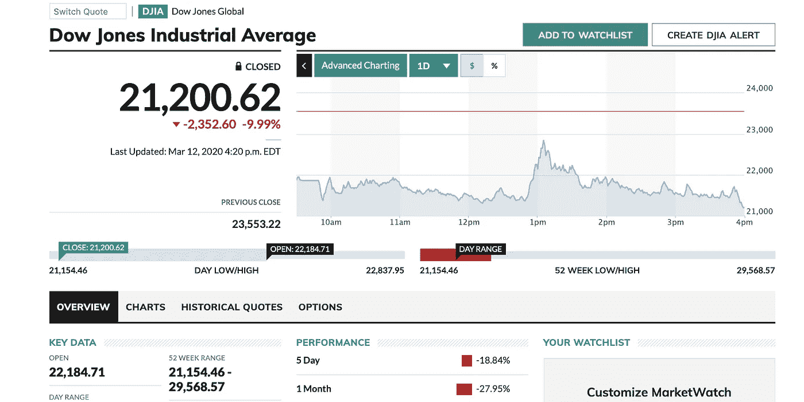

# 国家封锁&经济自由落体

> 原文：<https://medium.datadriveninvestor.com/countries-locked-down-an-economy-in-freefall-3e28962ad2e5?source=collection_archive---------11----------------------->

## 冠状病毒如何暴露美国经济的债务弱点

忽略股票市场的即时动荡——至少从表面上看是这样。2020 年 3 月 13 日持续的损失标志着自 1987 年金融危机以来市场的最大单日跌幅，随后第二天几乎同样令人印象深刻的死猫反弹是市场恐慌的迹象。尽管美国人囤积了大量的纸制品，同时淘汰了卫生产品，但市场同样动荡不安，很少有人关注真正的经济后果。

从许多方面来看，冠状病毒只是一场姗姗来迟的重大市场调整的催化剂，它可以暴露一些更糟糕的基本面问题，这些问题已经在我们的经济中酝酿了一段时间，并在许多方面自上次经济衰退以来一直在酝酿，当时的复苏是以牺牲长期基本面为代价的。

随着大型活动的停止，直接影响已经显而易见。体育联盟正在取消或推迟赛季，百老汇陷入黑暗，对受影响地区的旅行限制正使经济的重要领域陷入停滞至少一个月，这个问题很可能在受影响严重的地区蔓延，而且没有明确的终点。

 [## 另一场精心策划的全球经济危机正在逼近？如果我们的数据经济可以帮助它|数据…

### 我们的 DApp 的开发，称为 DECENTR，目前正与我们的 R&D 同步进行，作为我们即将到来的…

www.datadriveninvestor.com](https://www.datadriveninvestor.com/2019/03/06/another-engineered-global-economic-crisis-looming-not-if-our-data-economy-can-help-it/) 

首先受到影响的领域已经感受到了小型企业的痛苦。人们选择呆在室内，而不是寻找其他娱乐方式，这已经对餐馆(尤其是亚洲人拥有和经营的餐馆)、商店、展览等产生了深远的影响。不仅仅是在酒店业，越来越依赖在家工作的员工对那些为员工提供服务或支持的企业产生了直接影响。这些企业中有许多利润微薄，它们从哪怕是短期的停顿中恢复过来的能力令人担忧，即使当业务恢复正常时，也很可能会抹去大量财富和经济活动。与他们的大兄弟们相比，他们获得贷款和其他融资渠道的机会有限，这让他们只能寄希望于短期和立即恢复正常。

如果没有缓解，我们可能会在明年看到一系列小企业倒闭，其规模是自大萧条以来从未见过的，而且很可能会超过这一水平。根据这些停工或其他抑制消费者活动的时间和程度，因疫情爆发而受损和被根除的小企业类型将会增加，对当地的影响也将更加明显。

> 虽然市场在过去十年中取得了显著的增长，远远超过了 GDP 和工资的增长，但长期以来人们一直担心市场过热

从宏观层面来看，这对于大型企业和整体经济意味着什么。虽然市场在过去十年中取得了显著的增长，远远超过了 GDP 增长和工资增长，但长期以来一直存在对市场过热的担忧，这种担忧在特朗普的经济刺激措施引发大规模股票回购后加剧，这种回购在没有生产率的情况下提振了股票价值。对虚假提振或泡沫经济的担忧随着其他强劲基本面的出现而减弱，公司通过部分利用债务进行并购来增加市场份额，在强劲的就业率和其他高水平消费者活动指标下提高市场份额，使许多人有可能对这种不断增加的债务负担视而不见。

冠状病毒可能会使大量债务到期，并暴露出美国经济中有多少是真正盈利的，而增长只是建立在债务的基础上。

对于手头有大量现金储备的公司来说，安然度过持续的经济放缓是可控的。然而，低利率和容易获得贷款创造了一个环境，我们再次坐在创纪录的公司债务上，这已经超过了上次扩张巅峰时期的峰值，并将在大衰退中毁灭金融机构和企业。[市值超过 10 万亿美元，自经济衰退以来增长了约 50%](https://www.cnbc.com/2019/03/12/global-debt-up-50-percent-since-the-financial-crisis-sp-says.html)，有多个业务领域的活动立即停止对它们来说是一种负担，金融动荡可能会让它们在风中摇摆，没有复苏的道路。

航空公司、酒店、邮轮公司和其他酒店业巨头也很可能会发现，由于需求骤降，即使在商务和个人休闲旅游的直接影响消退后，也需要几个月才能恢复正常，因此在旅游业长期崩溃的情况下，他们也很难生存。9/11 之后，由于需求需要更长时间才能恢复，以及持续运营成本和债务的压力威胁到整个行业，即使航空公司关闭了一周，乘客人数也急剧下降，威胁到主要参与者的破产。

在债务的背景下，这些行业中的许多依赖于大量的债务负担来为飞机、船舶和主要市场资产的巨额支出提供资金。该行业的支付依赖于长期规划和对需求趋势的密切关注，以及支付利息和本金的能力，这依赖于来自广泛客户群的持续、稳定的收入。即使在债务负担相对于运营处于健康水平的情况下，也很少有人能够承受更不用说维持最近几周发生的急剧低迷，随着这种情况的持续，流入的缺乏和持续的债务很可能会将整合后的航空业的一个或多个参与者带入财务灾难，并给投资者、监管者和旅行者带来不稳定的局面。

这可能是最明显和最直接的影响领域，但如果你更深入、更广泛地观察经济领域，就会发现许多行业都存在一些令人担忧的迹象，表明经济收缩迫在眉睫。

一些需要注意的地方:

零售商一直在努力与电子商务竞争，他们自己的债务也越来越多，随着消费者避开公共场所，限制与人的互动，他们肯定会发现客流量减少。西尔斯(Sears)、JCPenney 和 Gamestop 等近年来苦苦挣扎的常青树零售商很可能在这场危机中发现自己的丧钟，因为即使是善意的努力也无法立即吸引人们回到大型公共场所。商品和运营成本只会继续堆积，艰难挣扎的空间克服能力必将削弱。

另一个风险敞口高于表面假设的领域是科技，因为人们越来越担心优步等公司的亏损越来越大，以及 we work IPO 选项的内爆，启动了收紧对这类公司监管的进程。我在上一篇文章中提到的长期不盈利的公司已经面临着控制亏损和寻找盈利途径的压力，并且肯定会面临来自投资者的更大压力。最近的市场波动加上真实、剧烈和急剧的撤资将迫使许多银行、风投和投资者将注意力转向短期前景，在没有盈利途径保证的情况下，他们更不愿意等待长期亏损结束。

在消费经济方面，已经有迹象表明许多家庭在债务负担中挣扎。尽管近年来失业率已降至创纪录低点，但这种就业扩张并不等同于薪资上涨，尽管房地产市场的繁荣程度远远超出了薪资水平，学生贷款债务和医疗账单的持续拖累仍在抑制许多家庭的活动。[40%的美国家庭负担不起 400 美元的惊喜账单](https://medium.com/@huntjlynn/its-the-people-stupid-economics-as-the-lost-social-science-f9d7a450395)在冠状病毒受到影响之前，这是一个脆弱点，这次经济衰退的影响将暴露这种脆弱性的程度。

几年来，消费者债务影响的迹象一直在显现，因为承担各种贷款和其他义务已成为维持强劲消费需求的关键，并掩盖了普通美国家庭糟糕的财政状况。[随着经济衰退后次级贷款利率从房地产市场转移到汽车市场，汽车收回率稳步上升。](https://www.chicagotribune.com/autos/ct-autos-riding-repo-man-20180516-story.html)[学生贷款违约率也在以类似的方式攀升](https://www.washingtonpost.com/news/grade-point/wp/2017/03/14/student-loan-defaults-are-rising-faster-than-you-think/)，这是一场被强劲的投资市场和低失业率所掩盖的危机，几乎没有人提及。长期以来，房地产市场一直是推动家庭财富增长的重要力量，但随着市场出现放缓迹象，尤其是高端市场的空置率越来越高。

对许多消费者来说，潜在的失业是短期的危机，但会带来长期的影响。由于整个行业至少在 3 月底之前都处于停顿状态，许多行业在 4 月份也处于停顿状态，因此出现租金和抵押贷款紧缩的风险很大。

> 我们可能不会意识到这种疲软的程度，直到我们看到一个经济部门的重大崩溃，如世界通信或雷曼兄弟

这些风险中的任何一个都应该引起人们的担忧，远远超过囤积卫生纸和其他家庭用品，当然也超过金融市场愿意接受的表面价值。我们可能不会意识到这种疲软的程度，直到我们看到一个经济部门的重大崩溃，如世界通信公司或雷曼兄弟公司，但我们正在正视我们作为一个国家和经济体的糟糕的财政习惯，它可能会在好转之前变得更糟。

展望未来，经济面临的风险不是可以或应该在一天的暴跌或第二天的反弹中研究的，而是我们开始从炒作和投机中寻找答案，并考虑经济中有多少是由未来票据推动的，这些票据只有在不到期时才能持续。