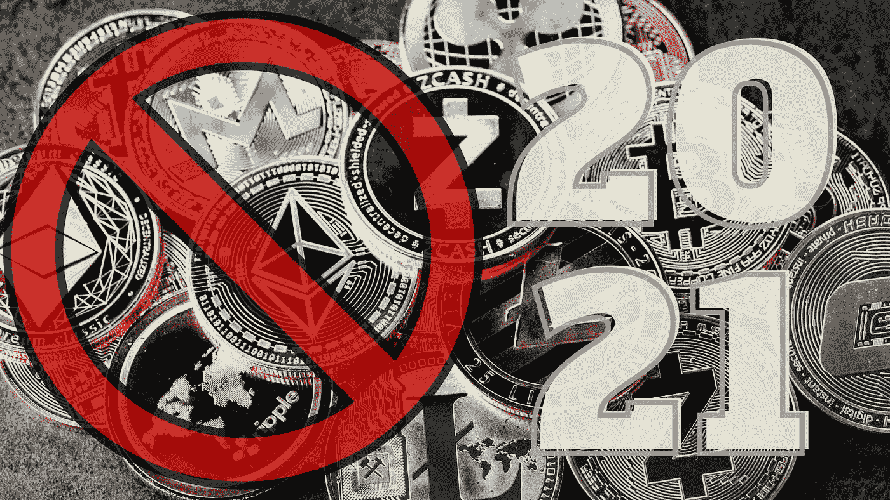
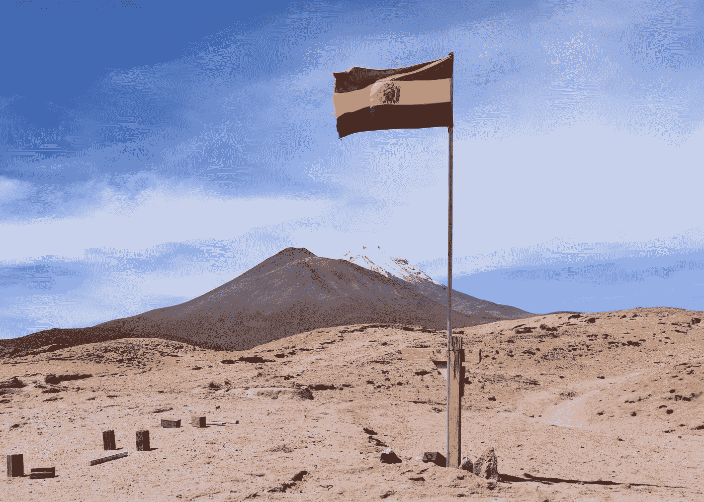
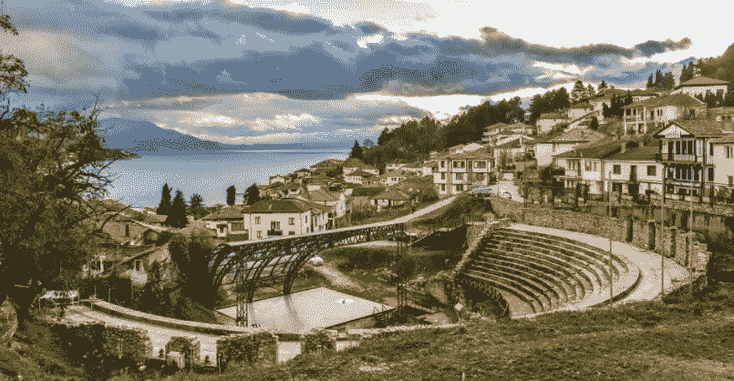
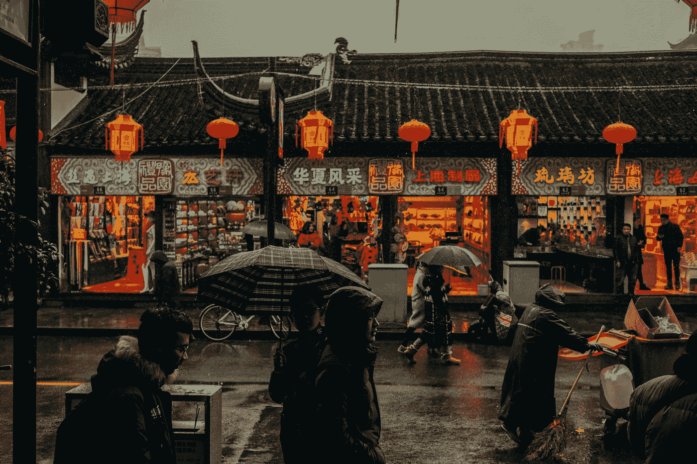
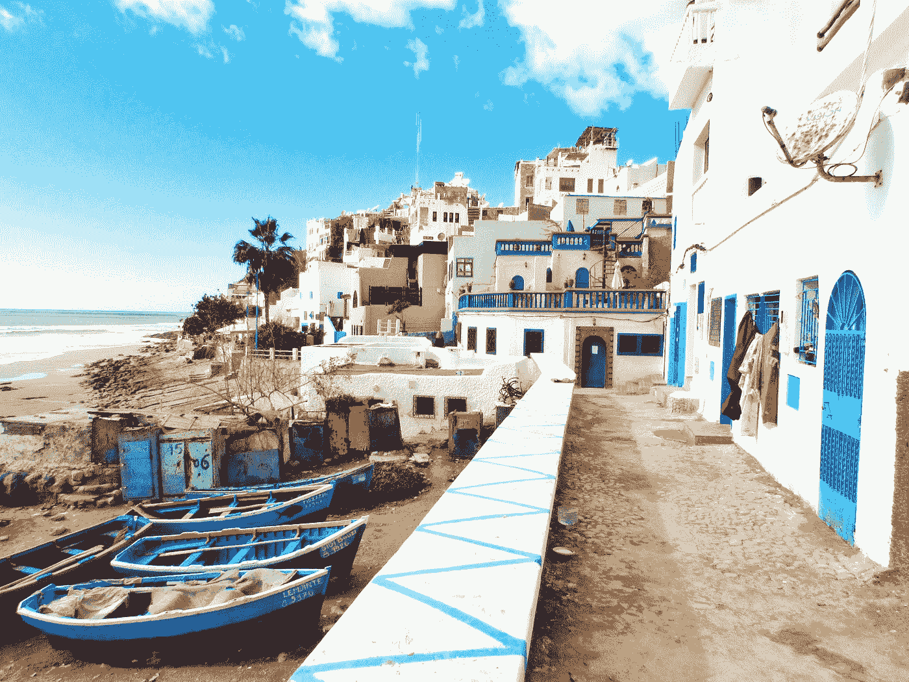

# 2021 年禁止比特币的国家

> 原文：<https://medium.datadriveninvestor.com/countries-that-bitcoin-is-banned-in-2021-a29658d4046f?source=collection_archive---------3----------------------->

毫无疑问，我们正处于将塑造未来世界的加密货币革命中，但并不是每个人都已经明白了这一点。尽管比特币的受欢迎程度和价格大幅上升，但仍有许多国家完全禁止比特币。

就在几天前，比特币被美国银行作为一种额外资产接受，这意味着它的接受度正在飙升。别忘了特斯拉在比特币上投入了惊人的 15 亿美元。即使有了这些巨大的发展，我将在下面列出的这些国家仍然不信任也不允许这种加密货币出现在他们的领土上。

# 阿尔及利亚

Photo by [nasro azaizia](https://unsplash.com/@nasro18dz?utm_source=medium&utm_medium=referral) on [Unsplash](https://unsplash.com?utm_source=medium&utm_medium=referral)

在北非地区，阿尔及利亚是完全禁止使用加密货币的国家之一。禁止购买、销售、使用和持有所谓的虚拟货币。虚拟货币是互联网用户通过网络使用的货币。它的特点是没有实物支持，如硬币、纸币、支票或信用卡支付。任何违反这一规定的行为都将根据现行法律法规受到惩罚。

# 玻利维亚

Photo by [Milos Hajder](https://unsplash.com/@mlshajder?utm_source=medium&utm_medium=referral) on [Unsplash](https://unsplash.com?utm_source=medium&utm_medium=referral)

玻利维亚是少数几个绝对禁止加密货币的国家之一。当局解释说，这项决议是为了保护他们的公民免受任何庞氏骗局或金字塔计划。任何不是由政府或授权实体发行和控制的货币都是被禁止的。尽管最近立法遭到了抵制，但仍然没有足够的“力量”来推翻这项法律。

# 北马其顿

Photo by [https://www.nomads-travel-guide.com/country/republic-of-north-macedonia/](https://www.nomads-travel-guide.com/country/republic-of-north-macedonia/)

北马其顿是唯一一个比特币、以太币等加密货币完全非法的欧洲国家。投资加密货币是非法的，国家银行警告说，加密交易与犯罪活动有关。央行还警告其公民，投机加密货币是一种金融风险，因为这些交易发生的平台不受法律监管。

# 中国

Photo by [Nuno Alberto](https://unsplash.com/@nunomiguelmendes?utm_source=medium&utm_medium=referral) on [Unsplash](https://unsplash.com?utm_source=medium&utm_medium=referral)

这是一个棘手的问题，因为中国最初禁止了 ico。然后有谣言说要完全禁止那里的所有采矿作业。这将对整个比特币区块链产生巨大影响，因为有大量来自中国的矿工。中国银行没有将比特币定义为货币，并禁止其交易，但该国已开始开发自己的加密硬币。可以肯定地说，当他们的加密货币上线时，贸易禁令将会结束。

# 摩洛哥

Photo by [Louis Hansel @shotsoflouis](https://unsplash.com/@louishansel?utm_source=medium&utm_medium=referral) on [Unsplash](https://unsplash.com?utm_source=medium&utm_medium=referral)

比特币和其他加密货币在摩洛哥被完全禁止。如果你拥有，交易，或与加密空间有任何关系，你将被罚款，甚至坐牢，这取决于严重程度。这些法律在这个国家不会很快改变，所以如果你来自那里，你可以完全忘记它。

# 结束语

大多数接受比特币并使其合法化的国家都在美洲和欧洲，这意味着高度发达的国家。亚洲有一些国家部分接受了这一点，但仍在制定法规，以防止税收入侵或洗钱行为的发生。

然而，禁止加密的国家有不同的历史，因为一些禁令来自宗教、政治方向等。希望随着时间的推移，他们会理解这是人类金钱的进化，并在他们的地方接受它。