# 协方差和相关性

> 原文：<https://medium.datadriveninvestor.com/covariance-and-correlation-5874f6fe9668?source=collection_archive---------12----------------------->

# 介绍

在本帖中，我们将讨论关于**协方差**和**相关性。**这在进行特征选择时起着重要的作用。

**协方差**，顾名思义就是两个变量放在一起时方差的度量。当我们有一个变量时，我们称之为方差，但是在有两个变量的情况下，我们指定它为**协方差**来测量这两个变量如何一起变化。**在进行数据分析时，协方差**被认为是一个非常重要的概念。我们将在随后的章节中更详细地讨论这一点。我们还将讨论**协方差**的一些限制，以及我们如何使用**相关性来减轻它。**定义两组数据之间的关联强度。

一、**当两个值一起增加时，相关性**为正。

二。**相关性**当一个值减少而另一个值增加时为负。

我们还将进入下面**相关性**的详细概念

1.  **皮尔逊相关系数。**
2.  **斯皮尔曼等级相关系数**

# 协方差

让我们试着用一个例子来理解**协方差**。让我们考虑一个城镇中个人的年龄和工资。

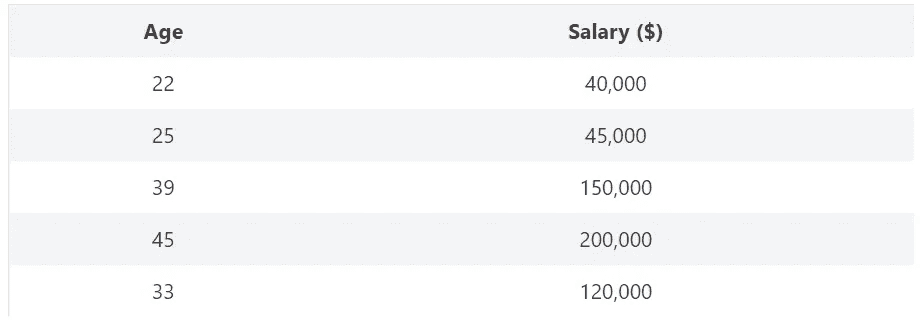

**Covariance Example : Image by Author**

所以，如果你注意到上面的表格，你会发现年龄和薪水之间存在正相关关系。随着**年龄**增加**工资**也增加。

因此，协方差的公式如下所示:

**Covariance Formula : Image by Author**

xi 在哪里……n 是个人年龄，**是个人年龄。n** 是个人工资。x，y 分别是年龄和价格的平均值。

如果你试着仔细看看协方差的等式，你会明白它与我们在**方差、**方差的情况下所做的非常相似，唯一的区别是在**方差、**方差的情况下，我们使用一个变量，而在**协方差**中，我们使用两个变量。

# 差异

让我们推导出**方差**方程，以便更清楚地理解这个概念:

如果你用上面的等式，而不是用 2 个变量，让我们用一个变量来推导等式:

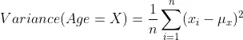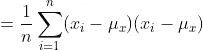

**Variance Formula: Image by Author**

因此，上面的方程看起来类似于**协方差方程。**我们可以将等式改写如下:

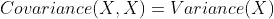

**Covariance Equation : Image by Author**

# 正负协方差

使用上面提到的**协方差**的等式，我们可以发现协方差是正还是负。

假设随着年龄(X)的增加，工资(Y)也增加，我们有一个正的协方差。

在另一种情况下，假设随着年龄(X)的增加，工资(Y)减少，那么我们有一个负的协方差。

让我们画一张图来更好地理解这种关系。

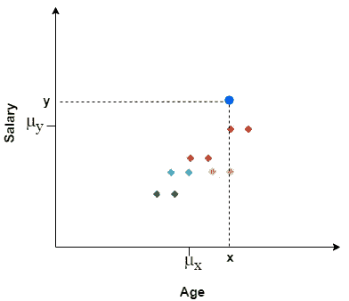

**Example — Positive Covariance : Image by Author**

# 正协方差

1.从上图中，如果你观察蓝点，那么 **x** 和 **y** 坐标都大于它们各自的平均值。所以如果你把这些值放到协方差方程中

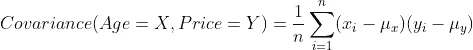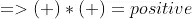

**Positive Covariance : Image by Author**

所以，这基本上意味着，如果随机值 **X** 增加，同时 **Y** 也增加，那么我们就有一个正的**协方差。**

# 负协方差

2.现在假设我们有一个场景，其中随机变量 **X** 增加，但是 **Y** 的值减少。在这种情况下，我们将有一个负的**协方差。**

您可以在下图中看到， **X** 的值高于平均值，然而 **Y** 的值低于平均值，这意味着随着 **X、**的增加， **Y** 的值已经减少。

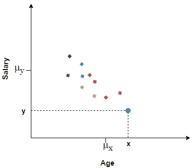

**Example — Negative Covariance : Image by Author**

将它放入等式中，我们将得到一个负值的协方差。

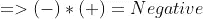

**Negative Covariance : Image by Author**

从上面的例子中我们发现了关于负的和正的协方差。但是在这里我们应该注意到一些事情，那就是**协方差**没有指定那里的积极或消极的值。

为了减轻这一限制，我们使用另一个矩阵，即**皮尔逊相关系数。**

**协方差**的关键在于，它有助于我们理解和量化数据集中两个变量之间的关系。因此，在我们的数据集中，如果某一列的值在增加，同时另一列的值也在增加，那么我们就有了**正协方差**。在另一种情况下，如果数据集中的一列值在增加，而另一列在减少，那么我们就会得到**负协方差。**

# 相互关系

既然我们已经了解了**协方差的概念，**让我们了解如何使用**皮尔逊相关系数来减轻它的局限性。**

# I .皮尔逊相关系数

皮尔逊相关系数基本上显示了两组数据之间的**线性关系**，以及我们是否可以使用折线图来表示两组数据。

皮尔逊相关系数的公式为:

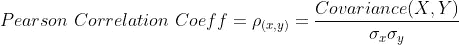

**Pearson Correlation Coefficient : Image by Author**

其中 **σx，σy** 是 **x 和**y 的标准偏差

正如上面在**协方差**部分所讨论的，如果我们试图找到两个变量的**协方差**，并且假设其中一个变量相对于另一个变量增加，那么我们得到一个正协方差。因此，我们由此理解的是**协方差**为我们提供了关系的**方向，也就是它是向正方向移动还是向负方向移动。**

现在，在皮尔逊相关系数为**的情况下，我们有一个额外的优势。有了 **X** 和 **Y (σx，σy)** 的方差，就能告诉我们 X 和 Y 之间相关性的**强度****

它还会告诉我们 **X** 和 **Y.** 之间关系的**方向**

所以**协方差**和**皮尔逊相关系数**的基本区别是，在**协方差的情况下，**我们无法知道 **X 和 Y** 或关系方向**之间的正相关或负相关的**强度**有多大。**

但是在**皮尔逊相关系数**的情况下，我们能够这样做，因为我们将**协方差**除以 **X 和 y 的**方差**。**

## 皮尔逊相关系数范围

相关系数的取值范围总是在 **-1 到 1 之间。**

让我们通过几个相关系数在-1 到 1 之间变化的例子来理解这个概念。

1.  假设我们有一个场景，其中 **X** 增加，同时 **Y** 也增加，并且值位于一条直线上，如下所示。在这种情况下，**皮尔逊相关系数**的值将总是 **1。**

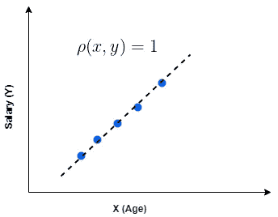

**Pearson Correlation Coefficient = 1 : Image by Author**

2.假设我们有一个场景，其中 **X** 增加 **Y** 减少，并且值位于一条直线上，如下所示。在这种情况下，**皮尔逊相关系数**的值将总是负的 **1。**

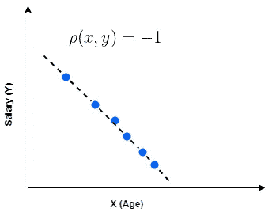

**Pearson Correlation Coefficient = -1 : Image by Author**

3.让我们考虑这样一种情况，我们在 **X 和 y 内没有任何一种关系**点分散在各处。在这种情况下，**皮尔逊相关系数**的值将始终为 **0。**

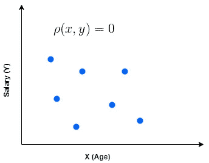

**Pearson Correlation Coefficient = 0: Image by Author**

4.在下面的场景中， **X 和 Y** 值负相关，因为 **X** 值增加， **Y** 值减少，但是所有点不在一条直线上。这意味着**皮尔逊相关系数**的值大于等于 **-1 并且**小于等于 **0。**

**-1 ≤ Pearson Correlation Coefficient ≤ 0 : Image by Author**

5.在下面的场景中， **X 和 Y** 值正相关，随着 **X** 值的增加， **Y** 值也增加，但是所有点不在一条直线上。这意味着**皮尔逊相关系数**的值大于等于 **0，而**小于等于 **1。**

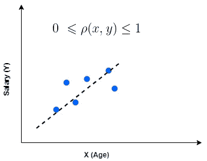

**0≤ Pearson Correlation Coefficient ≤1 : Image by Author**

既然我们已经讨论了我们可能拥有的不同场景和可能的值，让我们实际了解为什么要使用**皮尔逊相关系数**以及可以在哪里使用。

# 相关系数的重要性

**i .使用皮尔逊相关系数的特征选择**

**相关系数**基本用于**特征选择的情况。**让我们看一个例子，看看它如何用于**特征选择。**

让我们考虑两个变量， **X，y。**

**X** 是独立特征， **Y 是数据集的**结果变量/标签。假设我们发现 **X 和 Y** 之间的相关性为 1，这意味着当 **X** 增加时， **Y** 也增加。

我们也知道相关值是 1，这意味着 **X** 和 **Y** 是相同的。因此，我们不能放弃一个功能，并对其应用机器学习算法。

既然我们已经讨论了涉及**皮尔逊相关系数**的概念和不同场景，以及它对于**特征选择**的重要性，那么让我们继续讨论**斯皮尔曼的等级相关系数**以及它所针对的皮尔逊相关系数的局限性。

 [## 机器学习和人工智能如何改变电子商务的面貌？|数据驱动…

### 电子商务开发公司，现在，整合先进的客户体验到一个新的水平…

www.datadriveninvestor.com](https://www.datadriveninvestor.com/2020/11/19/how-machine-learning-and-artificial-intelligence-changing-the-face-of-ecommerce/) 

# 二。斯皮尔曼等级相关系数

假设我们有正相关的 **X 和 Y** 值，并且随着 **X** 值的增加， **Y** 值也增加，但是它们之间的关系是**非线性的。**

下图显示的图表更好地说明了这一点:

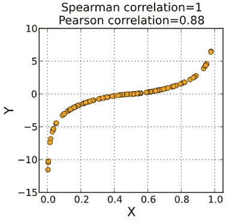

[**Spearman’s Rank Correlation Coefficient**](https://en.wikipedia.org/wiki/Spearman%27s_rank_correlation_coefficient)

在上图中， **X 和 Y** 正相关，但是如果我们对其应用**皮尔逊相关**，则值为 **0.88** 并且**斯皮尔曼相关**给出的结果为 **1。**

因此，当涉及到两个属性之间的非线性关系时，**斯皮尔曼相关性**比**皮尔森相关性**更有优势。

## 斯皮尔曼等级相关系数背后的概念

**Formula- Spearman Rank Correlation Coefficient : Image by Author**

我们也可以将等式写成如下:

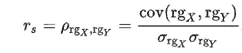

**Alternate formula : Image by Author**

这里，

1.  **ρ** 表示**皮尔逊相关系数，**应用于此处 X 和 Y 的**秩。**
2.  **cov(rgx，rgy)** 表示的**协方差 **X 和 Y 的秩****
3.  **σrgx，σrgy** 是 **X 和 y 的秩的标准差**

## 使用 Spearman 等级相关系数查找相关性时的场景

在使用 **Spearman 等级相关系数**方法寻找两个属性之间的相关性时，我们会遇到两种情况。

**情况 1** :当所有的等级都是不同的整数时，即等级中没有平局，我们可以使用下面的公式计算相关性:

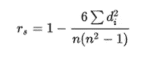

其中，***di = rg(Xi)—rg(Yi)***为 **X 与 Y** 的秩之差， **n，**为观测数。

这听起来有点抽象和复杂，但是相信我这不是。我们将举一个例子来更好地理解这个概念。

**示例–当排名中没有平局时**

上面的公式是一种**皮尔逊相关，**唯一的区别是它应用于 X 和 y 的**等级。**

让我们用下面的例子来理解等级。我们从维基百科中找到了这个例子。你也可以随意去那里看看。

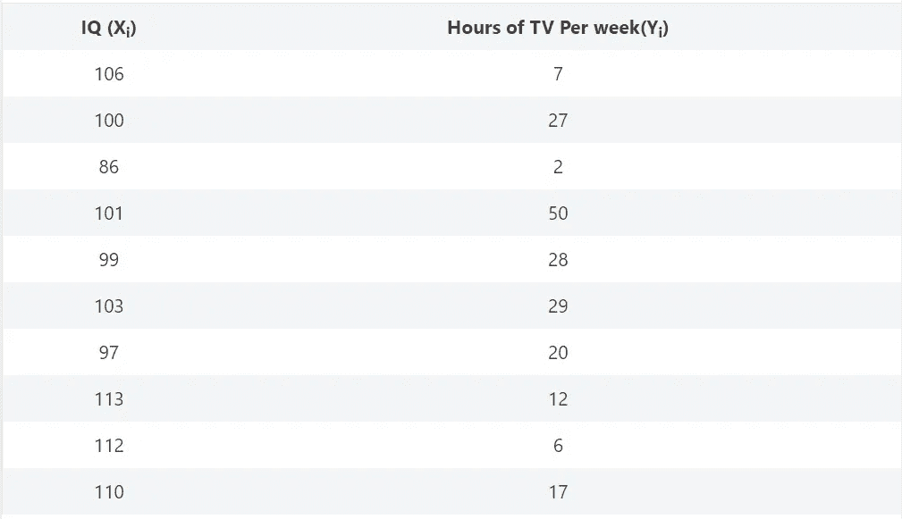

**When there are no tie in the Ranks : Image by Author**

要应用 **Spearman Rank** 公式，我们需要遵循以下步骤:

1.  对第一列的数据进行排序。
2.  创建一个单独的列 **xi** ，为第一列的排序值分配等级—**等级(xi)** 。
3.  类似地，创建一个单独的列 **yi** ，并将等级分配给第二列的排序值- **Rank(yi)**
4.  现在，为两个等级列之间的差异创建一个列— **di**
5.  最后，为两个等级列之间的差值的平方创建一个列。

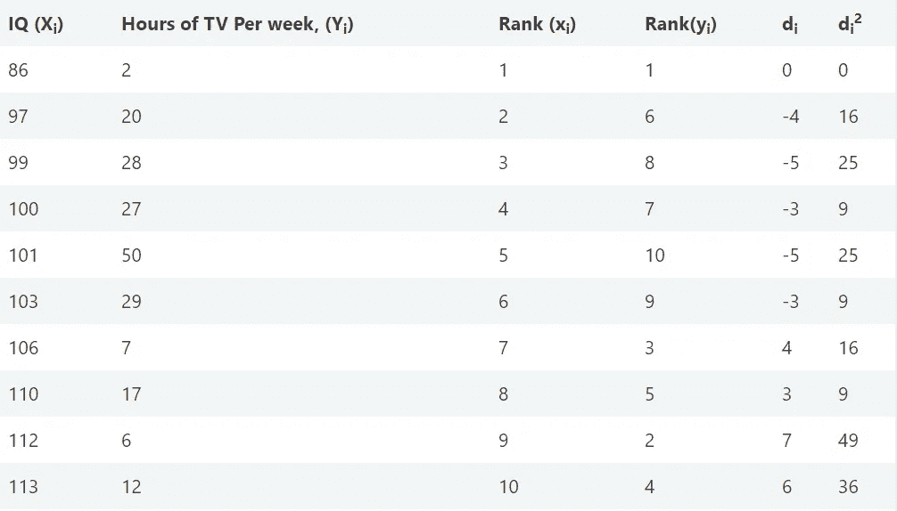

正如你在上面看到的，队伍中没有平局。所以我们可以用下面的公式来找出相关性。

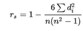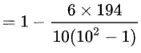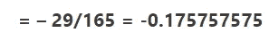

## **从结果得出的结论**

从上面的结果我们可以说，智商和每周看电视的时间是负相关的。由于这个值接近于零，我们可以说智商和每周看电视的时间(T21)之间的相关性非常低。结果的负值表明，每周看电视时间越长的人，智商越低。

**情况二**:队伍中有平局时。让我们举个例子来更好地理解这一点:

假设我们有以下记录，如下表所示:

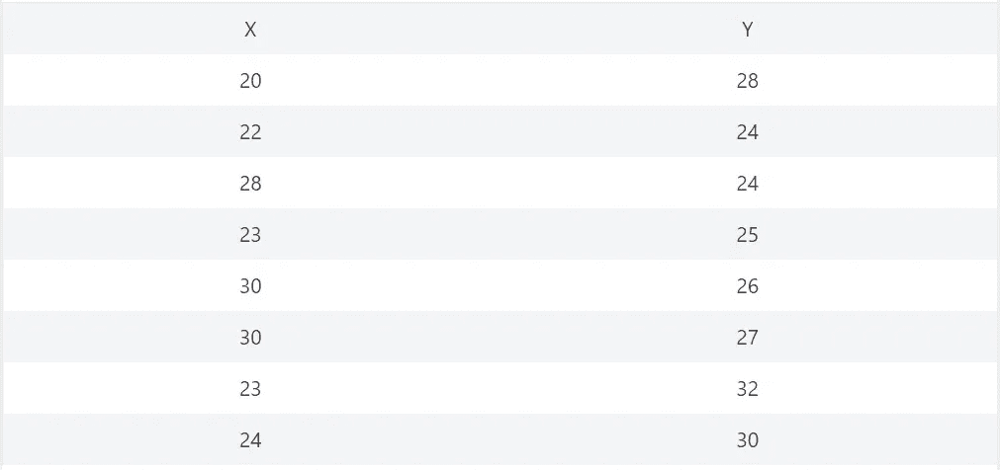

**When there are tie in the ranks : Image by Author**

现在，要找到 Spearman 相关性，我们需要遵循以下步骤:

**1** 。对第一列的数据进行排序。

**2** 。创建一个单独的列 **xi** ，为第一列的排序值分配等级—**等级(xi)** 。我们可以按照 **X 和 y 的值的升序或降序开始排序。**

**3** 。现在，如果第一列中的值具有相同的值，则取 2 个相同值的位置/索引值，并除以具有相同值的记录的计数。

《出埃及记》，列 **X** 中有 2 个位置，具有相同的值 30。假设那两个 30 的位置分别是 1 号和 2 号。

秩将是(1+2)/2，等于 1.5。因此，我们将为 30 的两个等级值分配 1.5。对于 **Y** 中的值，也将遵循这种方法。

**4** 。那么对于下一个元素，等级将是它的实际位置/索引值。如果它有并列排名，那么我们将再次从第三步开始。

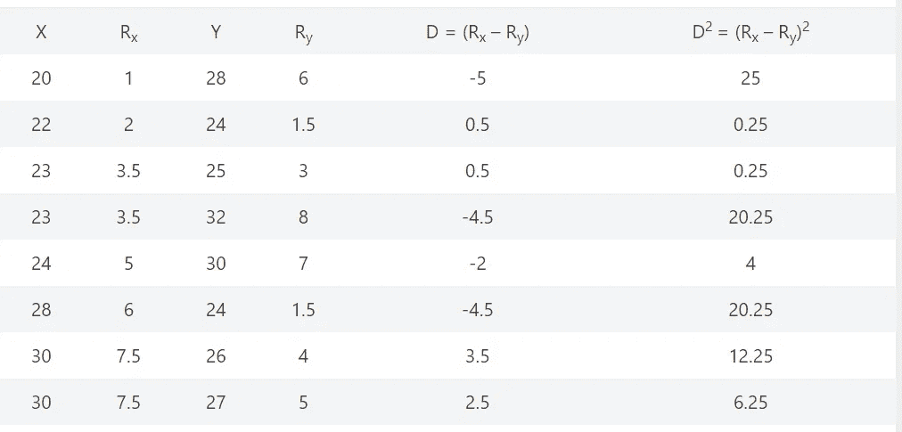

我们将使用下面的公式来计算相关系数。

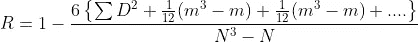

在上面的等式中，

1. **m** 表示特定数字重复出现的次数。

举例。，30 在列 **X** 中重复两次，因此(m3 — m)将是(23–2)= 6

类似地，23 在列 **X** 中重复两次，所以(m3-m)将是(23–2)= 6

我们将重复这个过程，重复的次数与相同的数字一样多。

2. **N** 表示记录的数量。

让我们通过将这些值代入上述公式来解决上述问题:

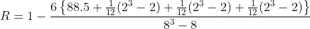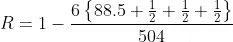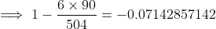

## **从结果得出的结论**

从上面的结果我们可以说属性 **X** 和 **Y** 都是负相关的。并且当值接近于**零时，**我们可以说 **X** 和 **Y** 之间的相关性非常低。结果的负值表明，对于那些具有较高 Y 值的人来说，X 值较低。

**访问专家视图—** [**订阅 DDI 英特尔**](https://datadriveninvestor.com/ddi-intel)