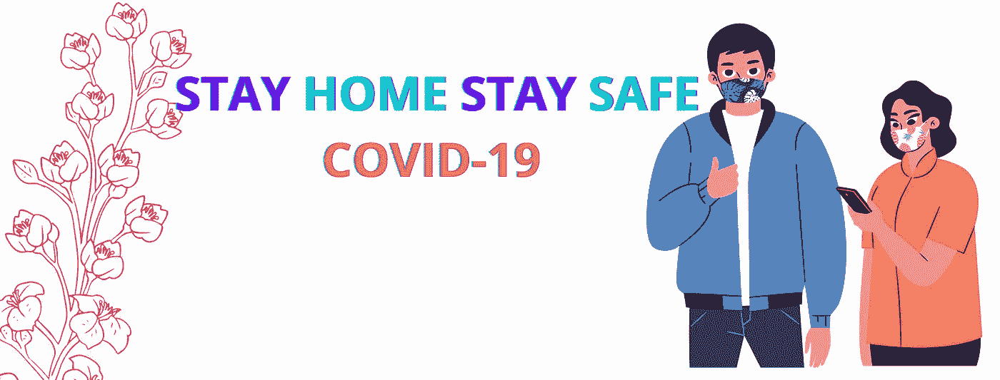

# 冠状病毒疾病(新冠肺炎):事实和影响

> 原文：<https://medium.datadriveninvestor.com/covid-19-6445f7c0f725?source=collection_archive---------13----------------------->

# **简介**

> 全世界都在遭受一种叫做新冠肺炎的疾病的折磨。这对人类来说是一个巨大的挑战。直到今天，这种疾病还没有疫苗。科学家正在研究能减轻症状的最佳疫苗。新冠肺炎这个名字表明它是在 2019 年被首次发现的。这种病毒是可以传播的。它从一个人传播到另一个人。它于 2019 年 12 月在中国首次被发现。最后，这是目前疫情局势的结果。
> 
> 这种病毒可以通过鼻子和嘴巴传播。常见的症状包括发烧、干咳和感冒。当一个人咳嗽时，咳嗽的飞沫成为病毒的携带者。当这些飞沫与感染者周围的人接触时，他们也会被感染。如果一个人受到这种方式的影响，他/她可以远离他人长达 14 天。这种疾病可以通过上述症状来识别，并在新冠肺炎试验中进行进一步的诊断。目前用于诊断新冠肺炎的胸部 CT 扫描测试被使用。新冠肺炎测试将在一些预先批准的医院进行。如果测试结果呈阳性，意味着他/她可以被隔离长达 14 天。在 14 天结束前，他/她可以再进行一次新冠肺炎测试，如果测试结果为阴性，意味着他/她可以照常去他们的地方。否则，他们可能还要被隔离 14 天。**【1】**
> 
> 中国发现首例冠状病毒。根据世界卫生组织的统计，2020 年 1 月 11 日和 12 日，中国武汉市登记了 41 例新冠肺炎病例。在该地区，一名患者因健康状况不佳死亡，6 名患者出院。在印度，喀拉拉邦报告了首例病例。他是武汉大学的学生，他曾经从大学乘飞机去印度。他接受了检查，结果呈阳性。那时，他被隔离了。后来，他得到了一份阴性报告，因此他从那家医院出院了。在第一例病例发生后，政府向所有通过航班从中国来的人宣布，从 2015 年 1 月起生效。因为那个人的政府检测了病毒确认，并把他们隔离了 14 天。后来，政府还向所有人宣布，他们应该避免从中国旅行。[1] [2]
> 例如，2002 年爆发的严重急性呼吸综合征(SARS)，是由 SARS-CoV(当前疫情的前身)引起的，也始于中国，并被认为是在蝙蝠中发现的，然后“溢出”到果子狸，然后进入人类。过渡到果子狸可能出现在一个潮湿的市场，像武汉的一个被怀疑是这次特别爆发的中心。[3][4][5][6]
> 
> 由于新冠肺炎病例增加，总理纳伦德拉·莫迪领导下的印度政府下令全国范围封锁 21 天。所以在印度，第一次封锁从 2020 年 3 月 24 日午夜开始到 2020 年 4 月 14 日。4 月 14 日至 5 月 3 日，我们的总理纳伦德拉·莫迪(Narendra Modi)继续实行全国封锁，4 月 20 日之后，对传播最小的地区进行了有限的放松。[7][8].在封锁期间，所有的服务都是可疑的。印度政府的所有公告都是通过在线模式发布的。由于这种封锁，病毒传播有所减少。但许多人遭受了这种疫情的情况，因为没有日常必需品，许多公司停止了他们的服务，所以人们没有工资。也有许多人为了工作来到其他城市。由于这种封锁，所有人都是在各自的区域受到攻击，因为封锁中没有运输设施。包括印度政府和许多名人在内的许多人赞助资金对受病毒影响的地区进行封锁。[8]
> 考虑到政府宣布在 2020 年 3 月 25 日前实施第一阶段封锁，新冠肺炎带来的风险百分比非常高。之后，封锁再次延长至 2020 年 5 月 3 日。[8]在封锁期间，所有的服务，如私人和政府公司都停止了服务。许多公司让员工在家工作。这里首先主要关心的是安全性。任何公司都可能包含安全数据。不会透露给其他部门或公司人员。该特定公司的员工应该可以访问它。考虑到网络攻击，所有员工都应该保护公司数据和个人财务数据。[9]
> 
> 目前新冠肺炎状况截至 2021 年 2 月 21 日，全球共登记**1.11 亿**、冠状病毒病例，其中**245 万**人死于冠状病毒，8580 万人被该病毒治愈。

截至 2021 年 2 月 21 日，印度共登记了**110 万**例冠状病毒病例，其中 **156，302** 人死于冠状病毒**1060 万**人被该病毒治愈。COVID 疫苗于 2021 年 1 月 16 日上市。接受疫苗的第一批人群将是医疗管理人员和卫生保健工作者。第二组将是 50 岁以上的人，50 岁以下有可诊断病症的人将接受新冠肺炎疫苗。

为了限制这种疫情病的传播，自愿接种新冠肺炎疫苗是非常必要的，这将通过发展我们体内强大的免疫系统来保护我们免受这种疾病的侵害。

在封锁期间，所有人都要遵守“呆在家里保持安全”的政府通知。通过这个通知，所有的人只通过在线模式支付他们的账单或任何东西。因为疫情的局势，孩子们没有学校和学院。因此，父母订阅了许多在线电影和网站。在订阅过程中，应用程序要求我们允许手机、电视、笔记本电脑等设备进入。这导致了新冠肺炎时期的犯罪。这些犯罪有不同的类型。间谍软件窃取用户的敏感个人数据，勒索软件控制个人的登录和其他重要凭据。由于这种攻击，人们不仅在个人经济上受到损失。[10]

*参考文献*

*[1]r . C . Khan na，Maria Vittoria Cicinelli，Suzanne S Gilbert，Santosh G Honavar，Gudlavalleti V S Murthy，“COVID-19 疫情:经验教训和未来方向”，《印度眼科杂志》。*

*[2]《冠状病毒疾病 2019(新冠肺炎)情况报告— 94》，*[*https://www . who . int/publications-detail/infection-prevention-and-control-due-health-care-when-novel-Coronavirus-(ncov)-infection-is-suspected-2020 125，*](https://www.who.int/publications-detail/infection-prevention-and-control-during-health-care-when-novel-coronavirus-(ncov)-infection-is-suspected-20200125,)***2020 年 4 月 23 日，***

*【3】t . sing Hal，《冠状病毒疾病回顾——2019(新冠肺炎)》，《印度儿科杂志》2020 年 3 月 13 日，*[*【https://doi.org/10.1007/s12098-020-03263-6*](https://doi.org/10.1007/s12098-020-03263-6)*。*

【4】[https://www . Reuters . com/article/us-China-SARS/China-scientists-say-SARS-灵猫-link-proven-iduspek 23793120061123](https://www.reuters.com/article/us-china-sars/china-scientists-say-sars-civet-cat-link-proved-idUSPEK23793120061123)。

[5] M .莱特科等人。al，“蝙蝠携带病毒的多样性、溢出和出现”，《自然评论微生物学》，第 18 卷，第 461-471 页，2020 年。

[6][https://swachhindia . ndtv . com/coronavirus-explained-all-you-done-to-know-the-SARS-epidemic-of-2002-44518/](https://swachhindia.ndtv.com/coronavirus-explained-all-you-need-to-know-about-the-sars-epidemic-of-2002-44518/)

*[7]p . Pulla，“新冠肺炎:印度实行封锁 21 天，病例增加”，BMJ，2020 年 3 月 26 日，doi: 10.1136/bmj.m1251*

# [8]维基百科，“新冠肺炎·疫情禁闭在印度”，[https://en . Wikipedia . org/wiki/新冠肺炎 _ 疫情 _ 禁闭 _ 在印度](https://en.wikipedia.org/wiki/COVID-19_pandemic_lockdown_in_India)。

*[9] S. U. Kumar、D. T. Kumar、B. P. Christopher 和 C. G. P. Doss，“新冠肺炎在印度的崛起和影响”，《医学前沿》，第 7 卷，2020 年 5 月。doi: 10.3389/fmed.2020.00250*

*p . Uppal，“新冠肺炎将导致印度犯罪率上升”，《国际研究杂志》，ISSN-2350-0530，第 8 卷，第一期。4，第 74–78 页，2020 年 4 月。*