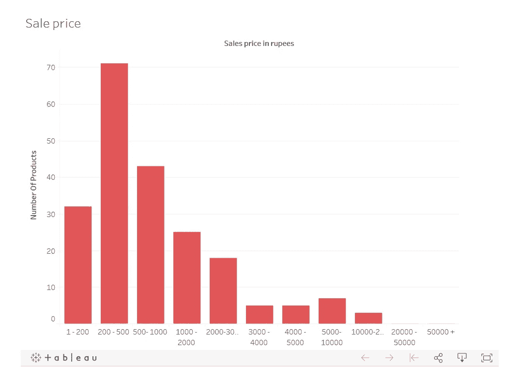
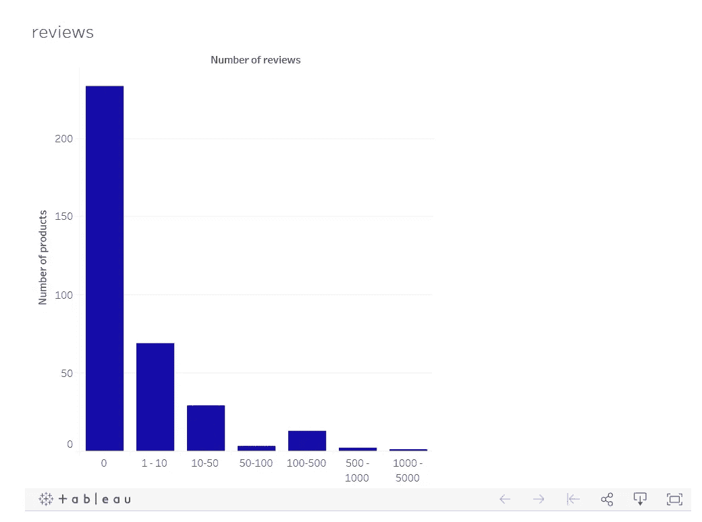
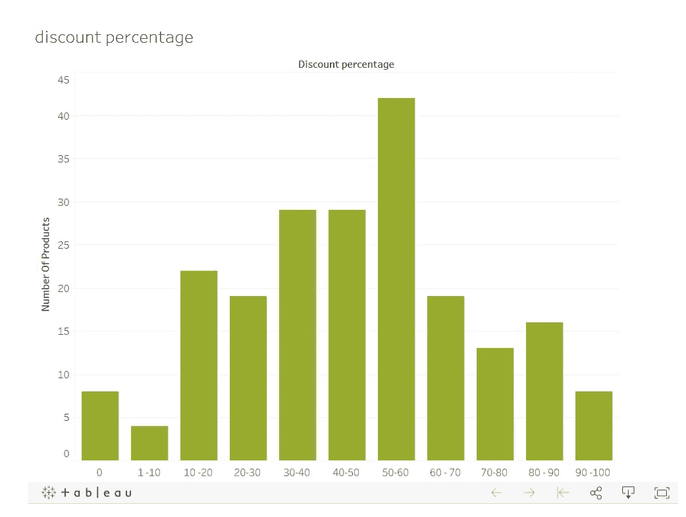

# 新冠肺炎和在线掠夺性定价

> 原文：<https://medium.datadriveninvestor.com/covid-19-and-predatory-pricing-online-239008c868d5?source=collection_archive---------16----------------------->

这篇博客调查了亚马逊上的卖家在新冠肺炎期间的不公平定价行为。我们还会研究一些关于评论、折扣和产品上市时间的其他细节。你可以在这里下载参考数据— [参考数据](http://bit.ly/3baO1J5)。

全世界都在努力遏制新冠肺炎。冠状病毒病，有些人是以此为契机来扒人的。许多国家正面临口罩供应的大规模短缺。在亚马逊和其他电子商务网站上，口罩的价格已经涨到了敲诈的程度。

我们分析了亚马逊医用口罩的产品数据。我们对卖家的一些商业行为感到震惊。在这篇博客中，我们试图找到你可能会有的问题的答案。让我们从源数据本身开始。

## 数据

我们在 3 月 9 日从亚马逊上提取了关于医用口罩的产品数据。我们使用 [Datahut 的](https://datahut.co/)自有亚马逊数据提取平台来获取数据。此处的数据可供下载参考。你可以在这里读到如何自己动手— [如何从亚马逊收集数据](/ How To Scrape Amazon Using Python Scrapy - Datahut – Blogblog.datahut.co › tutorial-how-to-scrape-amazon-data-using-python-s...)

亚马逊列出了 350 种产品，在抓取时，其中 141 种没有定价数据，因为它们已经缺货。我们使用 [Talend 数据准备工具](https://www.talend.com/)(这是一个优秀的免费数据辩论工具)清理了数据。然后我将数据加载到 SQL 数据库中进行分析。

我们将分析数据的不同属性，以找到您的问题的答案。我们从该产品首次在亚马逊上市的日期开始。

## 产品首次上市日期

第一个可用的日期是我们提取的数据中的一个字段，这意味着卖家首次在亚马逊上列出该产品的日期。我们根据产品首次上市的年份分析了数据，以下是可视化效果。

以下是一些有趣的观察结果。

1.  在总共 **350 种**产品中，有 **191 种**于 2020 年在亚马逊上市，占上市外科口罩总数的 **54%** 。
2.  在全部 **350** 产品中， **155** 产品于 3 月 1 日至 9 日上市，占上市口罩总数的 **44%** 。
3.  亚马逊上第一个上市的外科口罩是在 **2014 年**。
4.  这些新卖家中有许多对一个外科口罩漫天要价。

查看数据，看看您是否能找到一些我们遗漏的关于产品首次上市日期的信息。

## MRP 或最高零售价格。

根据定义，**最高零售价格** (MRP)是制造商计算的价格，是销售产品的最高价格。一些卖家对像外科口罩这样的商品漫天要价。这不是生意，而是驱逐。

 [## 数据科学和软件工程哪个更有前途？数据驱动的投资者

### 大约一个月前，当我坐在咖啡馆里为一个客户开发网站时，我发现了这个女人…

www.datadriveninvestor.com](https://www.datadriveninvestor.com/2019/01/23/which-is-more-promising-data-science-or-software-engineering/) 

在 350 种产品中，有 141 种没有定价。这是因为卖家没有更新定价或者产品缺货。为了澄清，我们没有在下面的可视化中显示这些产品，但是，它们可以在源数据中找到。

**这里有一些有趣的观察。**

1.  在 **209 款**有定价的产品中，只有 **52 款**低于 **500** 卢比的价格区间，略低于 **25%** 的价格区间，这在像新冠肺炎这样的危机时期是不合理的。
2.  2020 年在亚马逊上市的 191 种产品中，只有 15 种价格低于 500 卢比。
3.  在 3 月 1 日和 9 日上市的 155 种产品中，只有 13 种提供 500 卢比以下的产品。

检查数据，看看你是否能找到一些我们遗漏的关于 MRP 的东西

## 产品销售价格

产品销售价格是产品的销售价格。在像亚马逊这样的电子商务商店，通常会有折扣，当你从 MRP 中扣除时，你会得到销售价格。对于医用口罩来说，有些产品甚至打九折出售。

在 350 种产品中，有 141 种没有销售价格。这是因为卖家没有更新定价或者产品缺货。为了澄清，我们没有在下面的可视化中显示这些产品，但是，它们可以在源数据中找到。产品销售价格是我们在新冠肺炎期间要考虑的最重要的因素。

这里有一些有趣的观察。

1.  在有定价的 209 种产品中，有 103 种价格在 500 卢比以下。与 MRP 相比，同一支架中多了 51 个产品。积极的折扣是原因。
2.  在 3 月 1 日和 9 日从**上市的 **155** 产品中，只有 88** 在打折后提供 500 卢比以下的产品。

## 产品评论统计

顾客评论是影响购买决策的最佳方式之一。亚马逊上关于医用口罩的评论统计数据非常惊人。你可以看到下面的可视化。

**这里有一些有趣的观察。**

1.  在 **350** 列出的产品中，有 **233** 没有单独的评审
2.  只有一个产品有超过 1000 条评论( **1484** )
3.  在 2020 年上市的 **191** 产品中，只有 **14** 至少有一项评审。

看看数据，发现更多有趣的见解。

## 贴现惯例

像亚马逊和 Flipkart 这样的平台被印度竞争委员会标记为激进的折扣行为。对于医用口罩来说，销售者的打折行为非常激进。查看下面的可视化效果，了解折扣是如何进行的。

这里有一些有趣的事情。

1.  只有 **8** 的产品在 MRP 上销售，这意味着零折扣。
2.  在 209 种产品中，有 98 种有 50%或以上的折扣。
3.  所有列出的外科口罩中有 96.6% 在 MRP 上有折扣。

按照这种方式，丑陋的打折行为应该被平台阻止，尤其是在像新冠肺炎这样的危机时期。

## 结论

尽管亚马逊要求卖家遵守其公平定价政策，该政策禁止列出明显高于“亚马逊上或亚马逊下的最近价格”的商品。然而，许多卖家在新冠肺炎期间违反了这一政策。像外科口罩这样的必需品。在像新冠肺炎这样的危机中，他们使用了不公平和不道德的定价和折扣手段。

我们希望通过再次抓取相同的数据并对其进行分析，对变化的情况进行跟踪调查。如果您希望我们与您分享分析和数据，您可以下载数据并加入列表。[加入名单](http://bit.ly/3baO1J5)

作为一个种族，我们人类从来没有在经受考验时变得更强。我们将保持团结和强大。我们将一起打败新冠肺炎。

注意安全。定期洗手。多陪陪家人。

*原载于 2020 年 3 月 18 日*[*https://blog.datahut.co*](https://blog.datahut.co/covid-19-and-predatory-pricing-online/)*。*