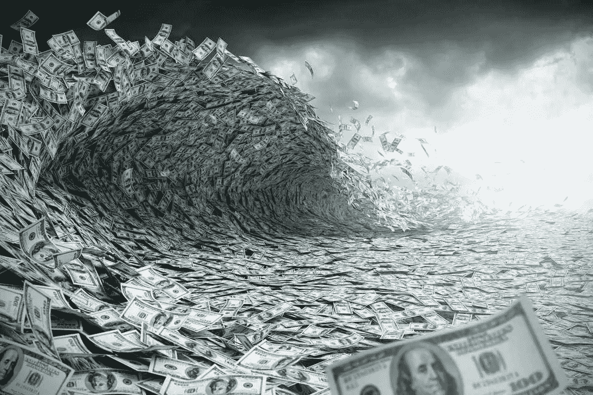
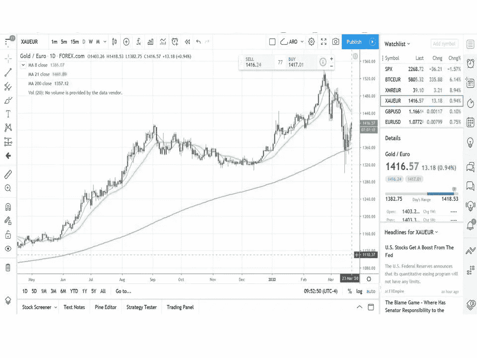
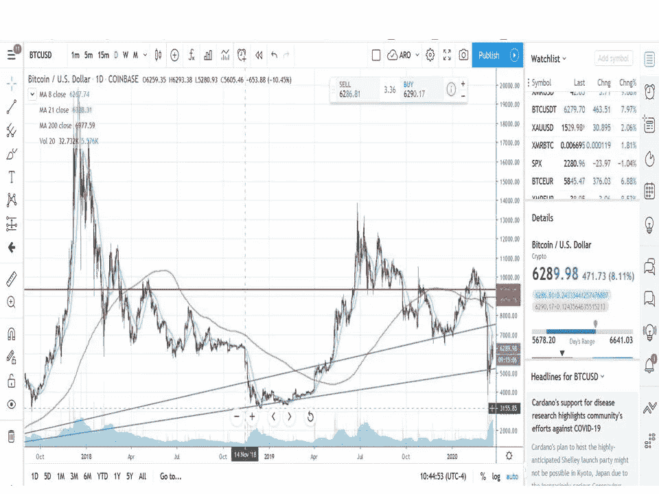
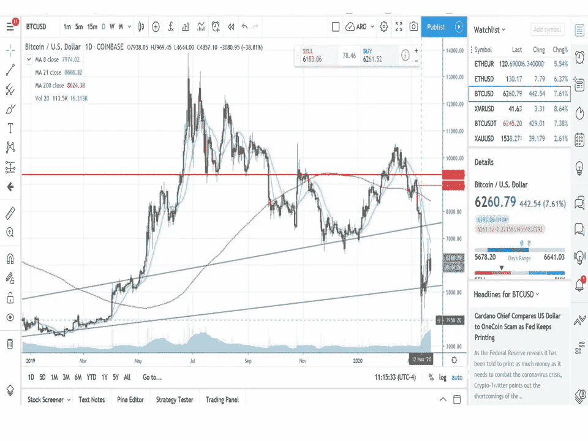
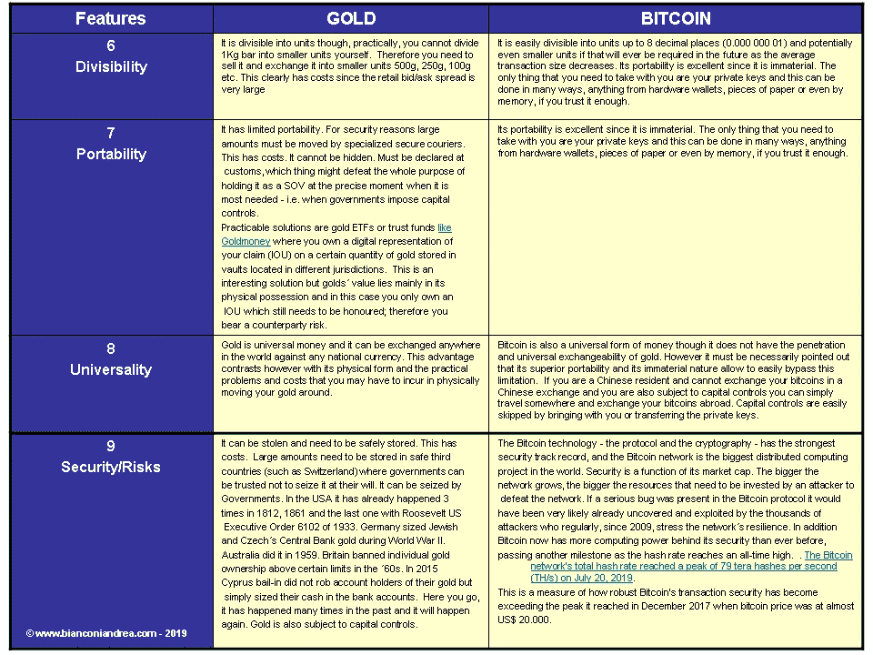

# 新冠肺炎和货币海啸对比特币和黄金的影响

> 原文：<https://medium.datadriveninvestor.com/covid-19-and-the-effects-of-the-monetary-tsunami-on-bitcoin-and-gold-b307d52fb1e5?source=collection_archive---------20----------------------->

围绕新冠肺炎疫情演变的不确定性及其对全球经济的影响让人们和市场都感到恐惧。全球衰退现在是[对 JP 摩根](https://www.bloomberg.com/news/articles/2020-03-17/morgan-stanley-economists-say-global-recession-now-base-case?srnd=premium-europe)最好的结果，而高盛预测[有可能出现第二次大萧条](https://www.zerohedge.com/economics/second-great-depression-begins-goldman-now-expects-record-24-crash-q2-gdp-sees-9)。目前可用的数据很少。现在确定对中国经济造成的损害还为时过早，中国经济仍在努力重新启动，此前其经济引擎省份湖北在 1 月 23 日武汉市首次被封锁后陷入停顿。在中国，病毒的传播似乎已经得到控制，但是经济损失仍然需要评估。

意大利的封锁措施[估计对旅游和运输活动造成了 90%的打击，对零售业造成了 50%的打击，对工厂产出造成了 10%的打击](https://www.nasdaq.com/articles/coronavirus-crackdown-is-cutting-italys-gdp-by-10-15-economist-2020-03-10)，估计对国内生产总值的影响 [**至少为 10-15%，可能更多**](https://www.research.unicredit.eu/DocsKey/economics_docs_2020_176326.ashx?EXT=pdf&KEY=C814QI31EjqIm_1zIJDBJCy5Ed_7eW8DXtNLTwA58xY=&T=1) 。

# 治愈全球病态经济的方法

就病态的全球经济而言，只有一种可能的方法可以避免萧条。这种疗法可能会奏效，但前提是那些最大的经济体只能在非常有限的时间内部分关闭。否则，衰退很可能会演变成致命的萧条。然后，正如唐纳德·特朗普(Donald Trump)今天在推特上说的那样，“治疗方法可能会变得比问题本身更糟糕”。

谁也说不准世界经济能在这种半瘫痪状态下坚持多久。一个月，两个月？

治疗方法是世界各国央行和政府能给这位病入膏肓的病人开出的唯一药方:大规模财政和货币刺激相结合。基本上，更多的信用创造，更多的法定货币贬值和货币通货膨胀，更多的 QE，这一次也是为人民的“直升机”货币即将到来。超过 1 万亿美元的数字印刷机已经开始疯狂运转，而这仅仅是个开始。T2 欧洲中央银行承诺一个新的 QE 一揽子计划，价值至少 7500 亿€卢比。德国答应给€6000 亿欧元，拜仁一家就给了€500 亿欧元。至少[德国可以从过去 20 年积累的经常账户盈余中提款。](https://tradingeconomics.com/germany/current-account)

当我写这篇文章的时候，美联储宣布了“无限 QE”，但是市场没有反应，又下跌了 3%。

德意志银行的奥利弗·哈维指出，这与 2008 年的情况明显不同。2008 年的金融危机是对需求方面的冲击，可以通过增加系统中的流动性来应对。然而，这一次我们面临的是供应冲击，它正演变为需求冲击。企业倒闭不是因为缺乏需求，而是因为它们被迫这样做。这种被迫关闭的所有后果，如破产、失业、支出收缩，显然也会影响需求，但在稍后阶段:“*如果政府试图将支出保持在关闭开始前的水平，同时保持关闭，只会有更多的资金追逐明显减少的商品和服务。其结果将是通货膨胀，而且是大量的通货膨胀。*

在承认这一点以及德意志银行对黄金作为通胀对冲工具持积极态度的事实后，现在预测(I)这场流动性海啸将流向何处以及可能产生的影响是什么，以及(ii)这场即将到来的衰退是否会突变为[萧条](https://en.wikipedia.org/wiki/Depression_(economics))，甚至可能引发当前金融体系的“重置”还为时过早。这也是在这种不稳定的情况下人们不能排除的事情。

事实上，世界坐拥巨额债务。再也没有真正的资产了。今天的金融资产是别人的债务和负债。凡是你能想到的，政府债券、市政债券、公司债券、数万亿抵押贷款和各种衍生品、美元、€欧元和所有法定货币都是负债。我们今天所说的*货币*只是一种负债，而今天的全球负债让全球 GDP 相形见绌。

国际货币基金组织可能不得不进行干预，发行更多的特别提款权来注入流动性。或许一种由黄金或石油等实物资产支持的全球加密货币将会诞生？如果召开新的*布雷顿森林*会议来拯救濒临崩溃的世界金融，谁知道会有什么结果。

然而——有这么多的变量和不确定性——我们应该集中精力尽可能地保持事情的简单。然后，不管上面所有的，一个人可以有理由相信一件事。也就是说，在所有情况下，即将到来的货币海啸将引发一波巨大的货币通胀和法定货币贬值。

在这种情况下，股票、黄金和比特币将以不同的方式在保护你的财富方面发挥关键作用。

# 在这种情况下，黄金和比特币会有怎样的表现？

即使在危机开始之前，也有理由一直看好黄金。之后，更是如此。当提到黄金时，人们应该只把*实物黄金*视为资产。剩下的都只是*纸黄金*。期货、交易所交易基金、未分配账户等都是负债，此外它们还有交易对手风险。当我写这篇文章的时候，黄金位于 200 毫安 1540 美元上方。更好的是，€乌尔在 1430 点远高于 200 毫安，尽管后期下跌，短暂突破 200 毫安，但仍然描绘了一幅看涨的画面。

Gold/EUR still a bullish picture with the 200MA holding well an unexpected buying opportunity

在最近的市场崩盘中，黄金也被变现了，这并不奇怪。在本期播客中，Macrovoices 很好地解释了其中的原因[，我推荐大家收听该播客，以便更好地理解欧洲美元市场的流动性危机和黄金掉期/租赁之间的复杂相互作用如何在短期内影响黄金价格。更简单地说，在像目前这样的流动性紧缩中，拥有黄金并在失去头寸时必须满足保证金要求的人被迫出售。此外，如果一个人不拥有黄金并面临流动性问题，他可以在市场上借入黄金，并在不考虑价格的情况下出售黄金，以提高流动性，其优势是黄金价格在出售后越低，稍后回购黄金以将其归还给贷款人的成本就越低，同时将任何正价差收入囊中。那些所谓的“黄金呕吐”总是发生在市场流动性最差的时候，并通过在关键水平触发止损单而引起连锁反应。](https://www.macrovoices.com/podcasts-collection/macrovoices-all-stars-podcasts/810-all-stars-97-jeff-snider-the-qe-market-meltdown-currency-inelasticity)

在 2008 年金融危机期间——从 2008 年 9 月雷曼兄弟倒闭开始——黄金下跌了 20%以上。但是，当解决办法显然是货币雪崩时，QE“不惜一切代价”，黄金反弹超过两年，从 700 美元升值到 2011 年 9 月 6 日的历史高点 1.921 美元。

 [## Azbit 旨在连接传统金融和加密货币|数据驱动的投资者

### Azbit 是下一个提供交易平台的加密项目，该平台提供保证金和算法交易。一样多…

www.datadriveninvestor.com](https://www.datadriveninvestor.com/2019/03/20/azbit-aims-to-connect-traditional-finance-and-cryptocurrency/) 

此外，这一次，随着货币海啸的到来，黄金将做好它的脏工作，并很可能创下新的历史新高。然而，如果清算和流动性紧缩持续下去，不能排除价格下跌，这将是绝佳的买入机会。

**现在谈谈比特币。**

与黄金相比，比特币显然是一种波动性和投机性更强的资产。因此，它与风险资产更相关。[正如我在各种文章](https://medium.com/@andreabianconi/oops-ray-dalio-missed-the-biggest-of-all-paradigm-shifts-crypto-79ce826c1445)中所表达的，在我看来，它有很大的价值，但并不适合所有场合。这是一个有效的对冲货币贬值，并提供无与伦比的保护，防止没收和胁迫，它是便携式的，它可以很容易地隐藏。

例如，从 2018 年 11 月 14 日开始到 2018 年 12 月 14 日，比特币与股票一起暴跌 50%，而黄金基本上没有受到影响。在下跌之前，我已经在这篇文章中警告了价格进一步下跌的可能性。由于许多基金在这个节骨眼上处于严重亏损状态，人们可以预计到年底他们将被迫清算他们的资产。这可能会导致加密市场在开始走高之前下跌。绝对值得记住的事情。

目前从 9.000 美元跌至 6.200 美元(-30%)也出乎我的意料，但这并没有让我感到惊讶，因为与 2018 年的下跌有许多相似之处。机构投资者——现在比以往任何时候都更多地投资于比特币——一直在抛售一切以变现，然后在这场危机将会发生什么变得更加明朗时重新定位。

如今，日复一日，显而易见的是，当局唯一可能的回应——尽管所有其他变量仍是未知的——将是向市场投放大量数字印刷的“货币”。这也是我非常看好比特币的充分理由。

December rally was compromised when BTC broke the 200MA at around $9.000

不过从技术上来说，特别是在每日时间框架内，情况已经大大恶化。很高兴看到比特币快速回到 200 毫安，大约 9.000 美元，并在恢复上升趋势之前保持住这个支撑位。

比特币的宏观环境非常乐观，但这并不意味着如果金融市场的紧张局势持续下去，比特币可能不会再次跌至 5000-4000 美元。然而，我注意到最近的价格波动(2020 年 3 月 23 日)，即美联储宣布无限 QE 的那一天，似乎并没有安抚投资者。虽然标准普尔 500 下跌了 3%,但 BTC/美元上涨了 10%,黄金/美元上涨了 3 . 6%。这可能意味着弱者被淘汰，霍德勒/公牛队重新控制了局面。

的 CEO 赵在这篇博客中解释了他对目前形势的看法。

**在这种特殊情况下，支持比特币而非黄金的最后一点考虑**。

如果病毒的传播没有得到迅速遏制，如果普遍的全球停工没有在几周内取消，最大经济体全球萧条的风险可能会成为现实。

萧条情景可能引发当前货币体系的“重置”，政府被迫抵押真实资产。这些“资产”将会是什么，现在还无法说清楚。也许更多的负债——而不是资产——比如国际货币基金组织的特别提款权。或者可能是一种由商品投资组合和黄金等实物资产支持的新的全球加密货币([凯因斯*班科*的加密版本)？)](https://en.wikipedia.org/wiki/Bancor)

在所有这些情况下，实物黄金将会短缺。政府可能没有足够的资金，他们可能不得不像历史上很多次那样采取没收手段(见下表 n. **9 安全/风险**)。表摘自[本文此处](https://medium.com/@andreabianconi/oops-ray-dalio-missed-the-biggest-of-all-paradigm-shifts-crypto-79ce826c1445))。

**尽管有被没收的风险，如果这种情况显然对黄金有利，那么对比特币来说就更是如此，因为比特币拥有额外的关键特征，如无限制的可携带性、对胁迫和没收的弹性，并且可以很容易隐藏。随着边境管制、旅行禁令和可能的资本管制的到来，比特币仍然具有无可比拟的优势**。

******************************************************************

***如果你喜欢这篇文章，请在左下角“鼓掌”x 次，这样它就会被更多的人分享。非常感谢***

# bianconiandrea # think block tank #加密货币#比特币#黄金#冠状病毒#新冠肺炎#萧条#衰退#无题-inc

******************************************************************

**法律免责声明**:本网站及其中包含的信息仅供一般指导，不构成法律意见。因此，它不应被用来替代就具体问题与律师的磋商。本文中的所有信息均按“原样”提供，不保证完整性、准确性、及时性或任何形式的明示或暗示的担保。

**投资免责声明**:本网站及其中包含的信息无意成为与所提交材料相关的建议或信用分析的来源，本网站中包含的信息和/或文件不构成投资建议。

www.bianconiandrea.com—2020

*原载于 2020 年 3 月 24 日*[*https://medium.com*](https://medium.com/@andreabianconi/covid-19-and-the-effects-of-the-monetary-tsunami-on-bitcoin-and-gold-c1b82b1d8876)*。*