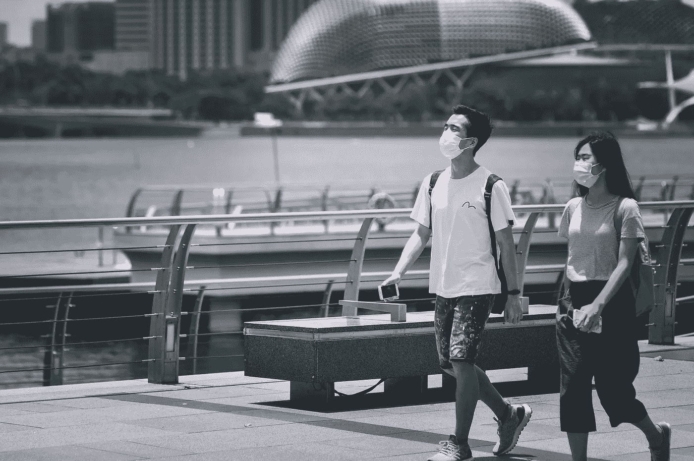

# COVID 19 可以通过空气传播

> 原文：<https://medium.datadriveninvestor.com/covid-19-can-spread-through-airborne-transmission-79a1d0b9505d?source=collection_archive---------28----------------------->

**疾病预防控制中心更新其指南**

世界卫生组织(世卫组织)表示，全球十分之一的人可能感染了新型冠状病毒，导致 COVID 19。

一般来说，肺结核、麻疹和水痘通过空气传播。目前的证据表明，COVID 19 感染者正在感染 6 英尺以外的其他人。可见于通风不良的封闭场所。这些数据表明 COVID 19 是一种空气传播感染。

当散布的气溶胶在空气中传播时，即使在一段距离和一段时间内仍然具有传染性，这种情况称为空气传播。[世卫组织](https://www.who.int/news-room/commentaries/detail/transmission-of-sars-cov-2-implications-for-infection-prevention-precautions)已经揭示了在某些产生气溶胶的医疗过程中，COVID 19 通过空气传播的可能性。缺乏关于室内传播潜在风险的证据。

Photo by [Victor He](https://unsplash.com/@victorhwn725?utm_source=unsplash&utm_medium=referral&utm_content=creditCopyText) on [Unsplash](https://unsplash.com/s/photos/coronavirus?utm_source=unsplash&utm_medium=referral&utm_content=creditCopyText)

# 新型冠状病毒空气传播新指引

根据最新消息， [CDC](https://docs.google.com/document/d/1yggHuuxjNRMQwOa4NY4vbR4iWDoqbnUBJn86sLiXsi4/edit) 表示，COVID 19 患者可以在通风不良的封闭场所内传播超过 6 英尺的感染。CDC 还解释说，病毒可以在空气中逗留几分钟到几小时，甚至在感染者离开房间后。

CDC 已于 10 月 5 日更新了其指南，解释了[COVID 19 如何传播](https://www.cdc.gov/coronavirus/2019-ncov/prevent-getting-sick/how-covid-spreads.html)，其中指出最常见的是 COVID 19 通过密切接触传播。它还提到，这种感染通过受污染的表面传播是不太常见的。

虽然目前的研究有限，但它支持通过 COVID 19 患者呼气直接产生的生物气溶胶传播的可能性。对这些指南最重要的补充是，更大的爆发显然是由可传播超过 6 英尺的气溶胶传播的结果。

 [## 为什么我们投资 Totient，也就是人工智能如何帮助我们生产抗癌药物和 Covid | Data…

### 9 月 10 日，一家人工智能驱动的药物研发公司宣布与……建立关键合作伙伴关系，从此悄然出现

www.datadriveninvestor.com](https://www.datadriveninvestor.com/2020/09/13/why-we-invested-in-totient-aka-how-ai-can-help-us-produce-drugs-against-cancer-and-covid/) 

# 空气传播的风险——你需要知道什么？

在通风不良的封闭空间中，空气传播感染和 COVID 19 传播的风险增加。当感染者深呼吸时，如唱歌或运动，有传播感染的机会。在这种情况下，被感染的飞沫会聚集，到达预期的 6 英尺以外。

尽管疾病预防控制中心强调通过密切接触传播更为普遍，科学家们仍然警告空气中残留的气溶胶会造成更大的威胁。卫生官员敦促人们适应户外活动，而不是健身房，戴口罩，并严格保持社交距离。

# 如何保持安全？

冠状病毒通过密切接触或气溶胶或两者的结合在人与人之间传播。在任何情况下，安全指南保持不变，避免与人近距离接触，面对面聊天，以及拥挤的地方。要经常戴口罩，防止感染扩散。保持手部卫生，经常用肥皂和水洗手。

公共场所保持通风有一定的[建议，要遵守。参加集体聚会时，尤其是在室内组织时，需要非常小心。仍有研究在进行，以更好地了解 COVID 19 的空气传播。当你外出时，良好的通风是必不可少的，室内设置的空气过滤器也被推荐。](http://www.ghhin.org/heat-and-covid-19/ac-and-ventilation)

导致 COVID 19 空气传播的 3 个主要因素是:

●在封闭空间接触感染者

●长期暴露于呼吸颗粒

●通风不足导致呼吸道飞沫积聚

# 结果

通过了解 COVID 19 的传播方式，我们可以保护自己免受感染的潜在风险。根据目前所有的证据，我们可以说仅仅 6 英尺的距离是不够的；我们也需要更好的通风。佩戴合适的有效口罩，保持社交距离，以及其他准则也是必不可少的。

## 获得专家视图— [订阅 DDI 英特尔](https://datadriveninvestor.com/ddi-intel)