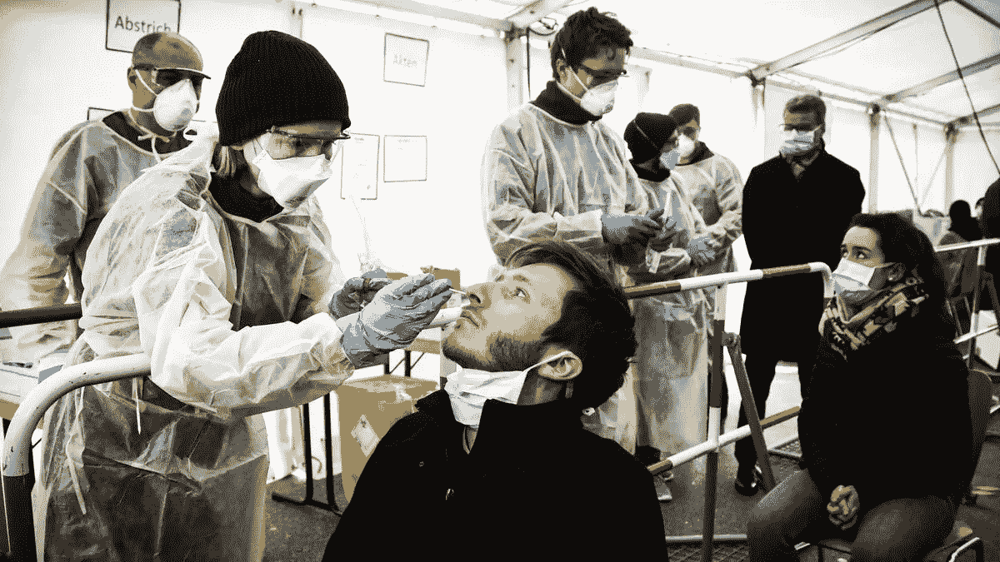
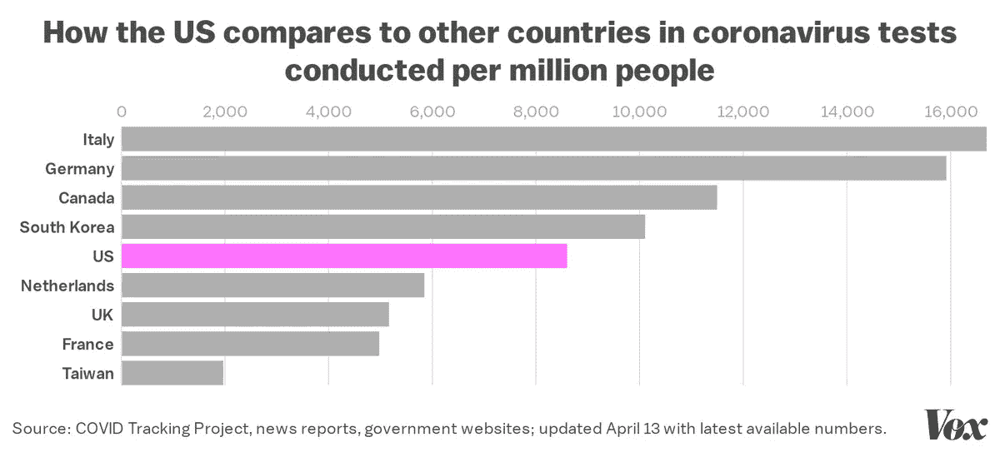
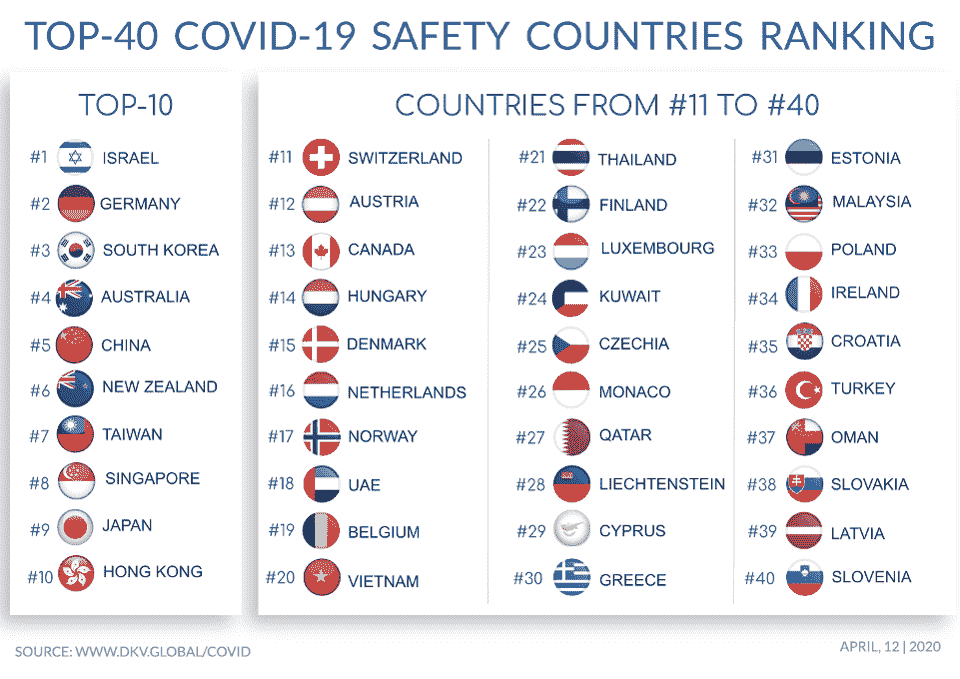
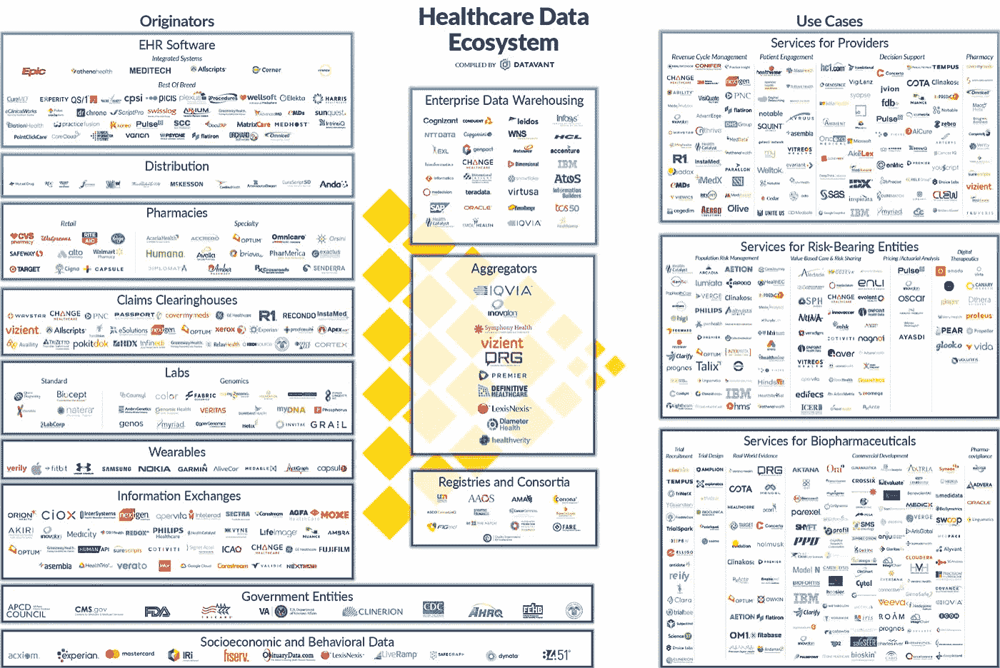
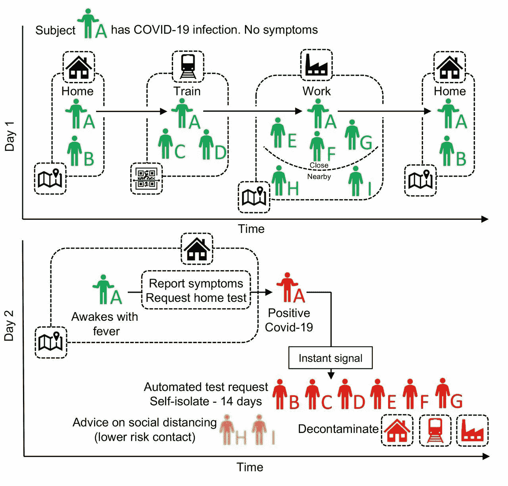
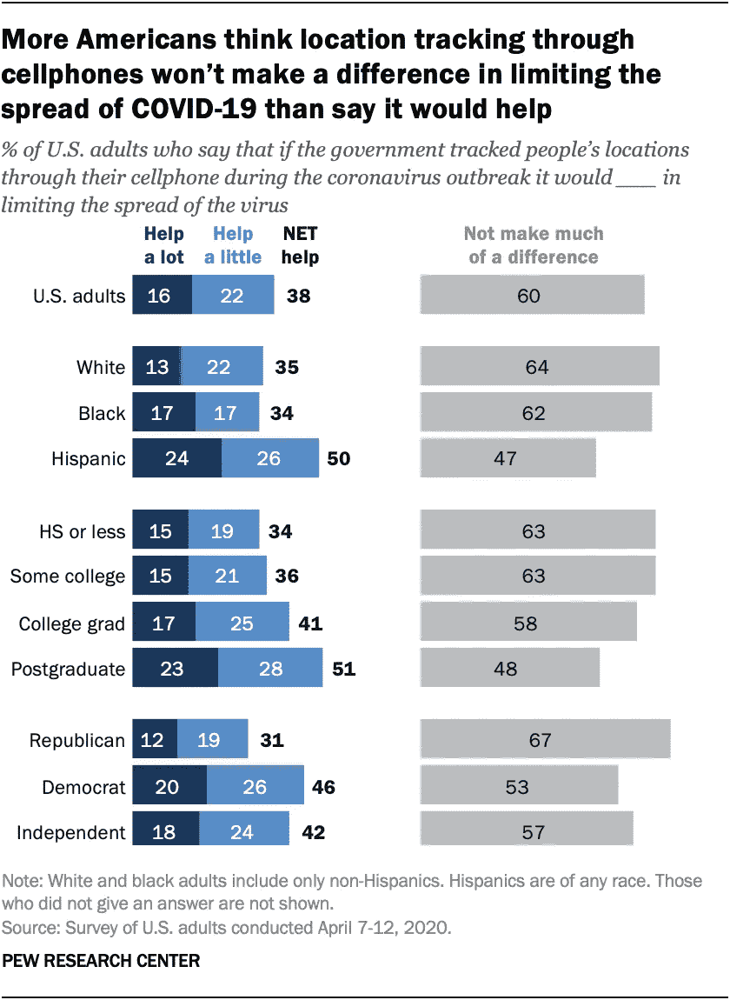

# 新冠肺炎数据是有价值的，因为我们是有价值的:大规模测试还是大规模监控？

> 原文：<https://medium.datadriveninvestor.com/covid-19-data-is-valuable-because-we-are-valuable-e944a3cad38e?source=collection_archive---------5----------------------->

I was dreaming of being tested ([vivid dreaming is on the rise](https://gen.medium.com/this-is-your-brain-on-coronavirus-dreams-356ff36c01b7)) ([image](https://www.vox.com/2020/4/13/21215133/coronavirus-testing-covid-19-tests-screening))

*只有当隐私保护技术被分散时，它们才成为维护尊严的技术*

我做了一个生动的梦，在一个积极的[接触者追踪](https://techcrunch.com/2020/04/18/what-is-contract-tracing/)信号和[没有可用的测试](https://khn.org/news/analysis-the-real-tragedy-of-not-having-enough-covid-19-tests/)将我变成了一个“*健康风险*”之后，我违背自己的意愿被带到了[贾维茨会议中心](https://www.washingtonpost.com/national/javits-center-coronavirus-field-hospital/2020/04/04/50bdbf32-75b2-11ea-87da-77a8136c1a6d_story.html)的紧急野战医院。当我没有有效的[豁免护照](https://www.who.int/news-room/commentaries/detail/immunity-passports-in-the-context-of-covid-19)进入临时设施时，士兵们用一个[电子手环](https://www.mobihealthnews.com/news/europe/bahrain-launches-electronic-bracelets-keep-track-active-covid-19-cases)把我铐上，我无法取下…

我醒来后检查我的前臂上是否刺了一个数字…

幸运的是，贾维茨中心的设施[正在关闭](https://www.businessinsider.com/why-nycs-largest-emergency-hospital-javits-center-pretty-much-empty-2020-4)，政府资助的集中接触者追踪正在被认真[重新考虑](https://www.reuters.com/article/us-health-coronavirus-europe-tech/germany-flips-on-smartphone-contact-tracing-backs-apple-and-google-idUSKCN22807J)，电子腕带在[巴林](https://www.mobihealthnews.com/news/europe/bahrain-launches-electronic-bracelets-keep-track-active-covid-19-cases)使用，而不是在纽约。尽管我们仍然没有对[和](https://www.vox.com/2020/4/13/21215133/coronavirus-testing-covid-19-tests-screening)进行足够的测试，但是我们非常清楚需要做些什么:

[**(1)群体测试，(2)人群智能，(3)分散追踪。**](https://www.cnn.com/2020/04/16/world/coronavirus-response-lessons-learned-intl/index.html)

# #1:大规模测试。识别。隔离。重复一遍。

我们知道，没有广泛的测试，我们就无法设计出合理的公共卫生政策。有多达 50%的无症状携带者和地方性人群在[疗养院](https://www.cnn.com/2020/04/24/us/nursing-homes-coronavirus-invs/index.html)、[监狱](https://www.reuters.com/article/us-health-coronavirus-prisons-testing-in/in-four-us-state-prisons-nearly-3300-inmates-test-positive-for-coronavirus-96-without-symptoms-idUSKCN2270RX)和[食品加工设施](https://www.cbsnews.com/news/coronavirus-meat-industry-workers-died-covid-19/)，很难想象如何以及何时放松社会距离，以避免第二波感染。不幸的是，我们测试的太少了。

From the COVID tracking project ([Source](https://covidtracking.com/))

为了让一种激进的*检测隔离方法*发挥作用*，*估计每天需要[**500 万到 2000 万次检测**](https://drive.google.com/file/d/1EhUfmT6ayG3ERxX-wZUmB2wtIEOhRAmP/view) 才能减少需要隔离的人数，让剩下的人重返工作岗位。这反过来将减少追踪接触者、戴口罩和保持社交距离的负担。从经济上来说，每天 3500 万次测试，每年 1000 亿美元的成本，与美国持续的封锁和社交距离措施造成的每月 3500 亿美元的损失相比微不足道(详情请阅读保罗·罗默的[优秀报告](https://roadmap.paulromer.net/paulromer-roadmap-report.pdf) : *负责任地重新开放美国*的路线图)。

# #2:创造群体智慧

截至 4 月 26 日(T1)，纽约市有 12067 人死于新冠肺炎。然而，这可能是 T2 低估了 T3，因为和许多地方一样，[的官方每日数据不包括那些没有死在医院里或检测结果呈阳性的人。由于死因需要几天才能确定，而且没有计算死于其他本来可以成功治疗的疾病的人数，因此很难衡量任何公共卫生政策的成功。](https://www.economist.com/graphic-detail/2020/04/16/tracking-covid-19-excess-deaths-across-countries)

因此，在美国应用社交距离并不令人惊讶，例如，[与应用严格社交距离的州(纽约、新泽西、ct、MA、CA、WA)和应用不社交距离的州(佛罗里达、GA、TX、TN)完全不同](https://medium.com/@tomaspueyo/coronavirus-out-of-many-one-36b886af37e9)。此外，由于预测死亡率模型[出现分歧](https://www.statnews.com/2020/04/17/influential-covid-19-model-uses-flawed-methods-shouldnt-guide-policies-critics-say/)，使用复合分析框架可能是确定此类政策成功与否的更好指南。

 [## 数字货币、区块链和货币的未来|数据驱动的投资者

### “区块链”、“加密货币”、“令牌化”，以及现在的“央行数字货币”已经成为…

www.datadriveninvestor.com](https://www.datadriveninvestor.com/2020/02/18/digital-currencies-blockchain-and-the-future-of-money/) 

比较结果的一种方法是使用深度知识集团的方法，该方法汇编了来自 200 多个国家的数据，并对其中的 60 个国家进行了排名。使用 4 个不同类别的 24 个具体参数对各国进行了评估:(1)检疫效率，(2)政府管理效率，(3)监测和检测，以及(4)应急处理准备情况。结果可以在下面看到，

Countries like China and Germany that focused on early quarantine measures before the number of confirmed cases surpassed 50,000, and and increased hospital capacity were able to contain the virus ([source](https://www.forbes.com/sites/cognitiveworld/2020/04/13/covid-19-complexity-demands-sophisticated-analytics-deep-analysis-of-global-pandemic-data-reveals-important-insights/#62d2da72f6e2))

至少在过去十年中，这种类型的上下文丰富的健康数据一直是一个有价值的市场。添加到保险索赔、购买和社交媒体输入中的临床记录、实验室和成像结果、基因组和健康数据，促成了一个已经饱和的 [2.7 吉字节](https://www.nodegraph.se/big-data-facts/) (2.7 万亿吉字节)数字世界。

然而，正如 COVID 所展示的，这个宇宙是支离破碎的，不协调的，并且在很大程度上是脆弱的。健康数据可能是为日常运营而设计的，但它*不是为需要实时研究和分析的多方危机管理而组织的*。许多中介机构的存在，如企业数据仓库、数据聚合器、患者和政府注册管理机构(见下文)，创造了一个易受攻击、共谋和审查的环境。

Healthcare market is [projected to grow](https://www.prnewswire.com/news-releases/global-big-data-in-healthcare-market-was-valued-at-over--14-7-billion-in-2018-and-is-projected-to-grow-at-a-cagr-of-around-20-to-reach--42-8-billion-by-2024--300907508.html) at a CAGR of around 20% and reach $ 42.8 billion by 2024 ([image](https://medium.com/datavant/the-fragmentation-of-health-data-8fa708109e13))

不幸的是，即使有了 COVID，我们[仍然继续使用这些数据聚合器](https://medium.com/datadriveninvestor/big-data-blockchain-and-keeping-pandemic-data-private-3e575484a1b)，如 [ArcGIS](https://www.arcgis.com/apps/MapJournal/index.html?appid=7edd44d94edb4b58ae57289e605632ca) (全球) [Anodot](https://app.anodot.com/#!/dashboards?tabs=main%3B5e6616e802bce5000df766ca&activeTab=1&%24Country_Region=%3BUS&%24Province_State=%3BAll&isFullScreen=%3Bfalse&constRange=%3B1m&startDate=%3B1581341073&endDate=%3B1583846673&autoRefreshInterval=%3B-1&timeScale=%3Blonglong&eventsPreset=%3B&eventsOn=%3Bfalse&invitationId=%3Binv_88d0-d4dc44770335) (美国)和 [Covid Tracking](https://covidtracking.com/data/) (美国)来提供来自政府和公共卫生机构和研究机构的最新公共信息*，而没有利用联合学习的实时能力，结合隐私保护技术(如 ZKP、TEE 和同态加密)和区块链*。(我在这里写了我们在健康委员会的工作。

# #3:道德追踪

我们低估了现有的可追溯技术。从苹果的[移动地图](https://www.apple.com/covid19/mobility?utm_source=newsletter&utm_medium=email&utm_campaign=newsletter_axioslogin&stream=top)到 Tectonix Geo 的[热图。我们都被监视着，似乎许多国家已经同意使用接触追踪(见下文)。](https://www.tectonix.com/)

Tracing apps reduce infection rates, even when just 60% of the population adopts them. ([Source](https://science.sciencemag.org/content/early/2020/04/09/science.abb6936.full))

尽管中国和南韩已经申请或者 T2 和英国想要申请政府资助的追踪(包括使用信用卡交易、智能手机定位数据和闭路电视录像)，其他国家(包括 T4 和美国)正在审查使用透明监督、明确的公平原则(包括平等访问和待遇)、强大的数据保护和对所用算法的审计。

尽管如此，大多数美国人不认为手机追踪将有助于限制新冠肺炎(见下图)，对于政府是否可以使用人们的手机来追踪那些病毒检测呈阳性的人的位置，以了解病毒是如何传播的，他们意见不一(52%对 48%)。

[Source](https://www.pewresearch.org/fact-tank/2020/04/16/most-americans-dont-think-cellphone-tracking-will-help-limit-covid-19-are-divided-on-whether-its-acceptable/?utm_source=adaptivemailer&utm_medium=email&utm_campaign=20-04-16%20tracking%20and%20covid&org=982&lvl=100&ite=5978&lea=1334333&ctr=0&par=1&stream=top)

麻省理工学院领导的保护个人隐私的努力之一是建立一个开放的，可互操作的，保护隐私的协议，称为 [PACT](https://pact.mit.edu/?utm_source=newsletter&utm_medium=email&utm_campaign=newsletter_axioslogin&stream=top) (私人自动联系追踪)。PACT 旨在成为一种技术标准/规范，任何人都可以在任何智能手机上部署，而不会向其他个人、政府、医疗保健提供商或手机服务提供商透露私人信息。

# 最终想法:大规模测试还是大规模监控？

随着封锁和其他限制措施的逐步取消，[许多国家正在开发数十种接触者追踪应用程序](https://docs.google.com/spreadsheets/d/1_BCKlMuniEhzvpQ-ha0jhdksvqdINUAUHA8J9LSr_Dc/edit#gid=0)以大规模采用，从而避免或最大限度地减少传染病死灰复燃。然而，一种集中式的方法，即数据由应用程序感知并发送到全国范围的服务器，引发了对公民隐私的严重担忧。

由 [Mirco Nanni 等人](https://arxiv.org/pdf/2004.05222.pdf)撰写。*“…我们提倡分散式方法的概念优势，即联系和位置数据都专门收集在公民个人的“个人数据存储”中，只有当公民的新冠肺炎病毒检测呈阳性时，才自愿共享，并具有隐私保护的粒度级别…”*

**但是，还有比使用分散式计算架构保护隐私更重要的事情。这是为了维护我们的尊严，因为…**

> ……我们就是我们的行动，我们的行动就是我们。这些行为被数据捕获，每当这些数据被第三方使用、滥用或出售时，我们的一部分尊严就被剥夺了。这些技术不仅能保护隐私，还能维护尊严。

不幸的是，历史充满了剥夺尊严的篇章。新冠肺炎为我们提供了一个机会，与区块链一起，保持我们的健康和安全，而不丧失我们的尊严。

*如果你喜欢你所读的内容，* ***继续在下面“鼓掌”，这样其他人也会看到(最多允许 50 次鼓掌！)***