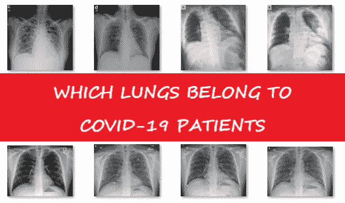
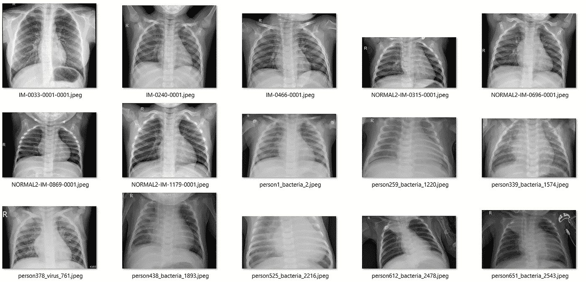
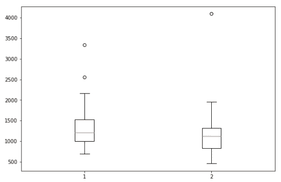
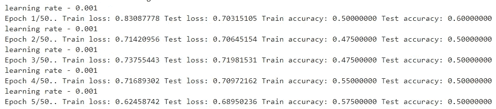
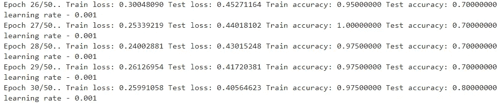
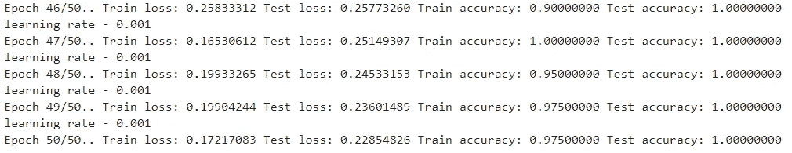
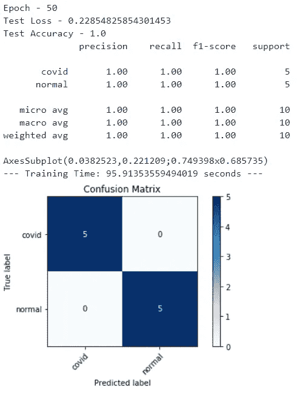
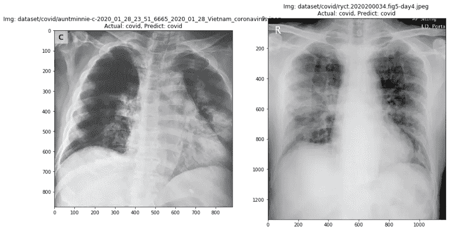
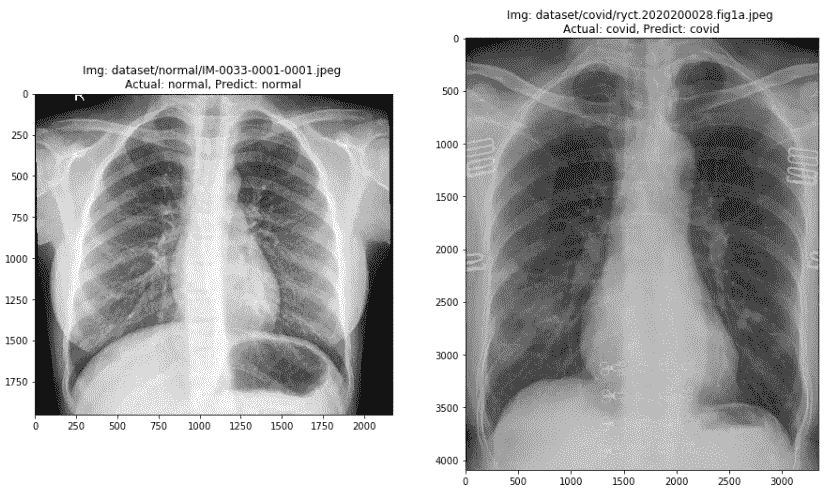
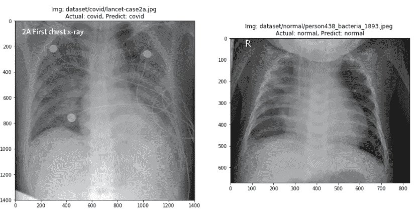

# 用 Pytorch 检测 X 射线图像中的新冠肺炎

> 原文：<https://medium.datadriveninvestor.com/covid-19-detection-in-x-ray-images-with-pytorch-5c5602b4658f?source=collection_archive---------1----------------------->

## 放射诊断和成像中的人工智能



Pic: Which lungs belong to COVID-19 patients?

昨天，我被周围的人问到一个问题:“我们有可能用 X 射线图像预测新冠肺炎吗？我立刻上网冲浪，发现世界上有几个团体正在为此而努力。

*   一组中国研究人员在“arxiv.org”上发表了一篇论文，标题为“[深度学习系统筛查冠状病毒疾病 2019 肺炎](https://arxiv.org/ftp/arxiv/papers/2002/2002.09334.pdf)”。他们的深度学习模型能够实现 86.7%的总体准确率，将 CT 图像分类为新冠肺炎、甲型流感病毒性肺炎或健康病例。
*   约瑟夫·保罗·寇恩、保罗·莫里森和蓝岛正试图建立一个包含新冠肺炎、中东呼吸综合征、非典和急性呼吸窘迫综合征病例的[开放数据库](https://github.com/ieee8023/covid-chestxray-dataset?fbclid=IwAR3yCPo_e55khIvhhqDdPhCI6OMCLXjZKEziNnUzZWC9_h3NkyhqdjTqD5c)，这些病例都有胸部 x 光或 CT 图像。
*   Adrian Rosebrock 发表了一篇关于“pyimagesearch”的教程，演示了使用 Keras、TensorFlow 和深度学习在 X 射线图像中检测[新冠肺炎的分步指南。他成功地实现了新冠肺炎和非新冠肺炎 X 射线图像之间 90%的分类模型总体准确性。](https://www.pyimagesearch.com/2020/03/16/detecting-covid-19-in-x-ray-images-with-keras-tensorflow-and-deep-learning/)

这个故事的贡献包括演示我实现的方法，以实现由 Adrian Rosebrock 使用深度学习框架 Pytorch 提供的图像数据集训练的 100%的整体模型准确性。

# 下载数据集

首先，我在“pyimagesearch”上通过输入我的电子邮件地址下载了阿德里安教程([https://www . pyimagesearch . com/2020/03/16/detecting-新冠肺炎-in-x-ray-images-with-keras-tensor flow-and-deep-learning/](https://www.pyimagesearch.com/2020/03/16/detecting-covid-19-in-x-ray-images-with-keras-tensorflow-and-deep-learning/))中的数据集，以下载数据集和源代码。接下来，我通过“pyimagesearch”发送到我邮箱的链接下载了它们。


Pic: Key in your email address to get the dataset.

在名为“数据集”的文件夹中，有两个子文件夹名为“covid”和“normal”。每个子文件夹包含 25 幅图像。



Pic: The images that are stored in “normal” sub-folder.


Pic: The images that are stored in “covid” sub-folder.

# 导入库

这个项目中使用的库包括 Torch、Torchvision、Sklearn、PIL、Matplotlib、Numpy、Os、Time 和 Random。

```
# Import essential libraries
from sklearn.metrics import accuracy_score, classification_report, confusion_matrix
from sklearn.model_selection import train_test_split
from PIL import Image
import torchvision
import matplotlib.pyplot as plt
import numpy as np
import torch
import os
import time
import random
%matplotlib inline
```

# 准备数据集

我准备了数据集，将图像的所有名称和标签分别存储为带有变量名“img_name”和“label”的列表。

```
path="dataset/"
img_name=[]
label=[]
for root, directories, files in os.walk(path):
    for file in files:
        img_name.append(root+"/"+file)
        label.append(root.split("/")[-1])
```

# 研究数据集

通过观察数据集，我得到了一些信息:

1.  所有的图像大小不一样，这意味着它们的高度和宽度不一样。
2.  所有图像的纵横比都不是 1: 1。如果我们将图像调整为固定的比例(224 像素宽和 224 像素高)，可能会导致整体模态精度下降。
3.  所有图像的缩放比例不同。在图像中，一些肺看起来很大，一些肺看起来很小。

我画了一个箱线图，显示了图像的高度和宽度在整个图像数据集中的分布。标签“1”代表宽度，标签“2”代表高度。观察到一些异常值。



Pic: The boxplot of widths and heights of all the images in the dataset.

# **分割数据集**

我把数据集拆分成 test_size = 0.2，random_state=50 的训练和测试，并使用 Sklearn 库分层。可以自由改变 random_state 的值，以观察使用不同的 random_state 值得到的结果是否一致。

```
train_img_name, val_img_name, train_label, val_label = train_test_split(img_name, label, test_size=0.2, random_state=50, stratify=label)
```

# 扩充数据集

在 Adrian 准备的教程中，他通过仅实现 random_rotation=15 度的设置来增强图像。除了 random_rotation 之外，我还将 random_zooming_ratio 的设置固定在 0.7 到 1.3 的范围内，以通过减少所有图像之间不同缩放比例的影响来确保分类器更加健壮。

```
train_Aug = torchvision.transforms.Compose([torchvision.transforms.Resize((224, 224)),                                 torchvision.transforms.RandomRotation((-20, 20)),                                          torchvision.transforms.RandomAffine(0, translate=None, scale=[0.7, 1.3], shear=None, resample=False, fillcolor=0),                                            torchvision.transforms.ToTensor()])
test_Aug = torchvision.transforms.Compose([torchvision.transforms.Resize((224, 224)),                                           torchvision.transforms.ToTensor()])
```

# 准备数据加载器

我准备了两个数据加载器，一个是加载训练图像的训练加载器，另一个是加载测试图像的测试加载器。

```
class CustomDatasetFromImages(torch.utils.data.Dataset):
    def __init__(self, img_name, label, transforms=None): 
        self.image_arr = np.asarray(img_name)
        self.label_arr = np.asarray(label)
        self.data_len = len(img_name)
        self.transforms = transforms
    def __getitem__(self, index):
        single_img_name = self.image_arr[index]
        img_array = Image.open(single_img_name).convert('RGB')
        if self.transforms is not None:
            img_array = self.transforms(img_array)
        image_label = self.label_arr[index]
        return (single_img_name, img_array, image_label)
    def __len__(self):
        return self.data_lentrain_set=CustomDatasetFromImages(train_img_name, train_label, transforms=train_Aug)
test_set=CustomDatasetFromImages(val_img_name, val_label, transforms=test_Aug)
trainloader= torch.utils.data.DataLoader(train_set, batch_size=64, num_workers=2,shuffle=True) 
testloader= torch.utils.data.DataLoader(test_set, batch_size=64, num_workers=2, shuffle=False)
```

# 初始化模型架构

我开始用 ResNet18 对图像建模，因为图像只有黑白的。如果 ResNet18 被证明是欠拟合的，那么在后面的实验中只会考虑引入更深的网络。我使用 Pytorch 提供的默认预训练体重。

```
model = torchvision.models.resnet18(pretrained=True)
```

我把 ResNet 18 最后一层的输出节点的编号改成了 2。

```
model.fc = torch.nn.Linear(512, len(unique_class))
```

# 配置超参数

我用的损失函数是交叉熵损失。

```
criterion = torch.nn.CrossEntropyLoss()
```

我使用的优化器是 Adam，初始学习率=0.001，权重衰减=0.0005。

```
optimizer = torch.optim.Adam(model.parameters(), lr=0.001, weight_decay=0.0005)
```

我使用的学习率调度器是 ReduceLROnPlateau，因子=0.1，耐心=10。这意味着，如果在训练过程中，训练损失在 10 个时期内不再连续减少，则学习率将变为其初始值的 0.1 倍。即:改变前= 0.001，改变后=0.0001。

```
scheduler = torch.optim.lr_scheduler.ReduceLROnPlateau(optimizer, factor=0.1, patience=10, eps=1e-06)
```

# 训练和评估模型

在定义了模型架构和所有超参数之后，现在可以用训练图像来训练模型，并用测试图像来评估模型。我设定的纪元总数是 50。保存包含模型权重的模型，该模型权重实现最低的验证损失，然后是最高的验证准确度。



Pic: The Training Loss, Training Accuracy, Testing Loss and Testing Accuracy in Epoch 1–5.



Pic: The Training Loss, Training Accuracy, Testing Loss and Testing Accuracy in Epoch 26–30.



Pic: The Training Loss, Training Accuracy, Testing Loss and Testing Accuracy in Epoch 46–50.

# 讨论

包含最佳结果的模型来自纪元 50。准确性得分、分类报告和混淆矩阵如下图所示。整个建模过程耗时 95.91 秒，建模过程运行在高规格的 GPU 上。



Fig: The best result (from epoch-50).

10 张测试图像的结果如下所示。



Pic: The result of the 10 testing images.

# 最后的话:

通过添加 random_zooming_ratio 的数据扩充设置，模型被设法从 90% (9 幅图像被正确预测，已由 Adrian 完成)提高到 100% (10 幅图像被正确预测)。

[](https://www.datadriveninvestor.com/2020/02/12/has-general-ai-exceeded-the-intellectual-capacity-of-humans/) [## AI 将军是否已经超过了人类的智力容量？数据驱动的投资者

### 不仅在游戏中，而且在劳动力市场上，机器都比人类聪明。在今天的许多领域，使用…

www.datadriveninvestor.com](https://www.datadriveninvestor.com/2020/02/12/has-general-ai-exceeded-the-intellectual-capacity-of-humans/) 

# **参考文献:**

*   Adrian Rosebrock，[使用 Keras、TensorFlow 和深度学习在 X 射线图像中检测新冠肺炎](https://www.pyimagesearch.com/2020/03/16/detecting-covid-19-in-x-ray-images-with-keras-tensorflow-and-deep-learning/)。