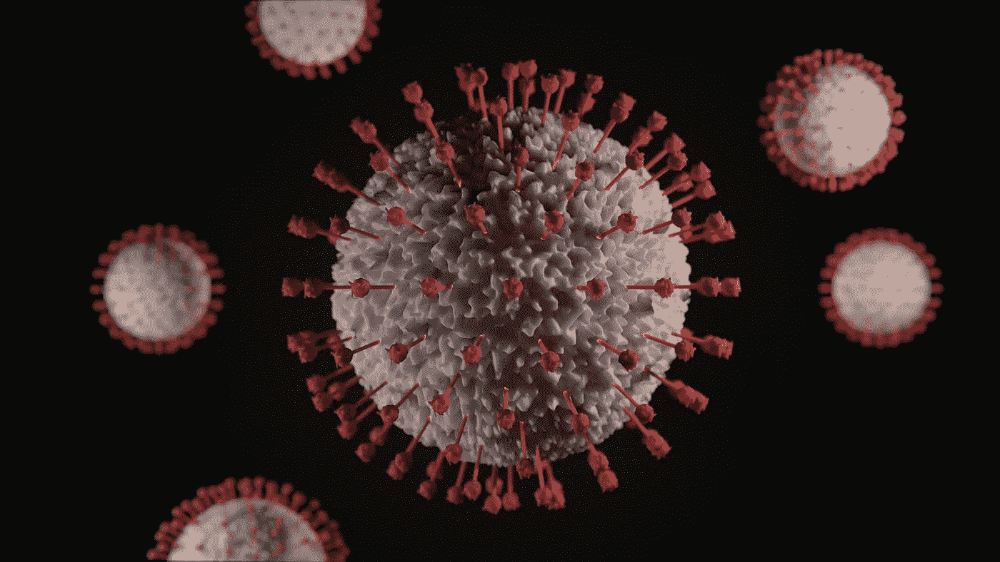
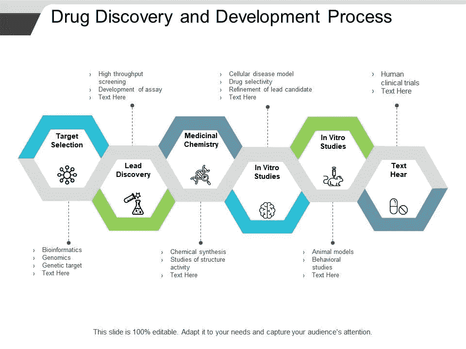
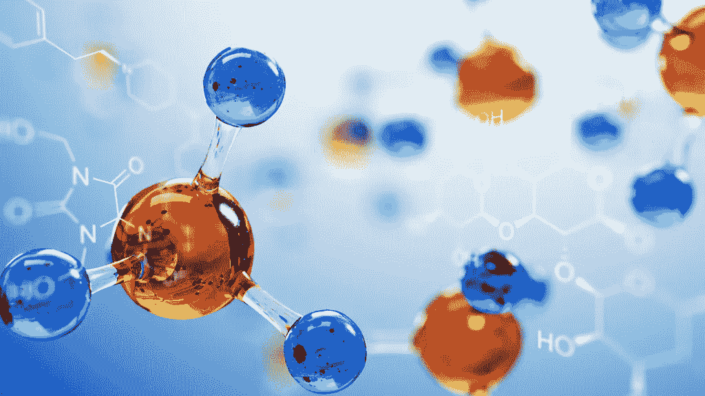
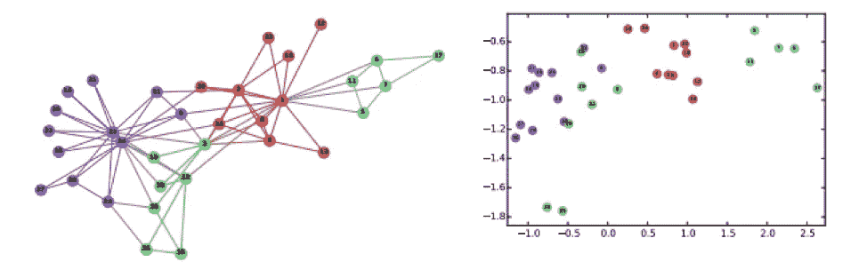
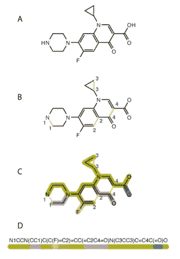
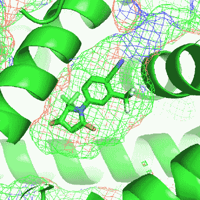
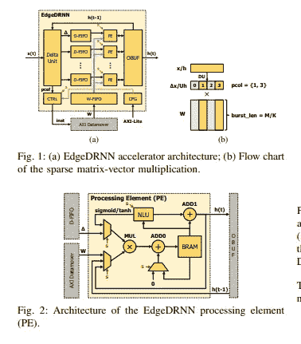

# 新冠肺炎:用神经网络发现药物

> 原文：<https://medium.datadriveninvestor.com/covid-19-drug-discovery-with-neural-networks-7b422f95e409?source=collection_archive---------11----------------------->

截至 2020 年 5 月 13 日，新型冠状病毒 2019(更名为新冠肺炎)已传播至全球 211 个国家和地区，死亡**294655**，确诊病例超过**4380522**。

新冠肺炎是一种急性呼吸道疾病，已被世界卫生组织列为疫情。关于这种特殊疾病的信息是有限的，但是，众所周知，这种疾病的死亡率很高，尤其是在已经存在疾病的人群中。今天，冠状病毒感染 2019(新型冠状病毒)是全球范围内的一个主要健康挑战，各种策略正在接受测试，包括药物再利用。在这个故事中，我们旨在解释如何开发可能的药物使用神经网络。

药物发现是识别潜在新药的过程。它涉及广泛的科学学科，包括生物学、化学和药理学。

将一种新药推向市场是一个复杂而耗时的过程，制药公司平均要花费 26 亿美元和十年的研发时间。该流程有多个定义的阶段，每个阶段都有各自相关的挑战、时间表和成本。这篇综述将讨论新药开发的整个过程，从靶点发现到临床试验和批准后监测。

# 介绍

世界卫生组织将冠状病毒疾病(新冠肺炎)称为由最近发现的冠状病毒引起的传染病。大多数感染新冠肺炎病毒的人将患有轻度至中度呼吸道疾病，无需特殊治疗即可康复。老年人和那些患有心血管疾病、糖尿病、慢性呼吸系统疾病和癌症等潜在疾病的人更有可能患上严重疾病。截至 2020 年 3 月 25 日，全球已有超过 462，562 人感染该疾病。

除中国外，其他国家或地区包括伊朗、欧洲仅在义大利就有超过 7000 人死亡，而摩洛哥则有超过 255 人报告新冠肺炎病例数快速增加，暗示这种新型冠状病毒已对全球健康构成威胁。

 [## 人工智能和监督资本主义|数据驱动的投资者

### 大科技，总是现在:人工智能推动的大科技，已经使购物，搜索，在你的…

www.datadriveninvestor.com](https://www.datadriveninvestor.com/2020/03/04/on-artificial-intelligence-and-surveillance-capitalism/) 

药物发现——由制药公司进行的寻找新药候选物的工作——是一个缓慢而昂贵的过程。

相关的化学空间是如此之大，以至于即使使用全自动机器人系统，也只能通过化学实验测试其中的一小部分。考虑用于这些筛选实验的分子不必完全随机选择，因为在分子的结构和其生理效应之间存在可以识别的关系。

然而，这些结构-活性关系不容易分析，并且没有建模它们的通用方法。因此，机器学习方法成为药物化学家和化学信息学家工具箱中的自然组成部分，他们致力于使药物发现过程更加有效。

应用经典机器学习算法时的一个挑战是它们需要严格格式的数据，例如包含十进制数的固定长度向量。当处理分子时，这种限制表现在选择化学描述符的冗长的特征工程中。

以图形作为输入数据的神经网络的新兴领域——在本文中称为图形神经网络(GNNs)——通过直接在化合物的原始图形表示上进行学习，展现了克服该问题的巨大潜力。

我将尝试使用深度学习方法系统地整合大规模可用的冠状病毒相关数据，并从一组候选药物中确定针对新冠肺炎的候选药物。

# 培训和实施细节

**数据集**

数据越多，机器学习方法往往越有效，随着这种新病毒的出现，数据变得更加难以获得。为了弄清楚分子如何结合到病毒的活性位点，我们可以访问开源数据集，该数据集以 SMILES 格式提供分子。用于训练和验证的 SMILES 数据集来自 GDB 数据库。

新冠肺炎蛋白酶的基因组数据(FASTA 格式)也可以在 Gen-Bank 中找到。我们需要将配体从 SMILES 格式转换过来。smi)转换为自动对接 PDBQT 格式(。pdbqt)，我们可以使用 Open Babel 来完成这项工作，这是一个化学工具箱，它可以使用化学数据的多种语言。

接下来，我们需要加载我们的 AutoDock PDBQT(。pdbqt)文件导入 PyRx/PyMOL，这是一个虚拟筛选软件，用于最终查看我们配体的 3D 结构。

# 深度学习模型

机器智能的新进展引入了可以从大量数据中学习重要模式的算法，在某些任务中接近专家水平的能力。

**边缘记忆神经网络**

第一个想法是使用称为边缘记忆神经网络的预定义模型，这种方法在“为生物活性和物理化学性质预测建立注意力和边缘卷积神经网络”一文中有详细描述，然后我将使用约束图变分自动编码器。这种方法在“用于分子设计的约束图变分自动编码器”一文中有详细描述

**MT-DTI**

作为第二个想法，我将再次使用基于深度学习的药物-靶标相互作用模型，称为分子变压器-药物靶标相互作用(MT-DTI)，以从论文“通过药物-靶标相互作用深度学习模型预测可能作用于新型冠状病毒(2019-nCoV)的商业可用抗病毒药物，中国武汉”中识别可能作用于 2019-nCoV 病毒蛋白的商业可用药物。我将尽可能地尝试使用更多的模型，并尝试优化它们的工作，目前仍处于寻找合适模型的阶段。

# 结论:

在医学、生物技术和药理学领域，**药物发现**是发现新的候选药物的过程。历史上，**药物**是通过识别传统疗法中的活性成分或偶然发现的**发现**发现的，就像青霉素一样，这是一个非常漫长且非常昂贵的过程，我确实认为有了 ML 和深度学习，我们可以让它变得容易得多。

分享这个故事是受到了深度学习部分提到的两篇论文的启发，只要有了这个[仪表盘。](https://www.worldometers.info/coronavirus/)

这些是我个人的研究，如果你有任何意见，请联系我。

欢迎来到我的媒体页面

[Github](https://github.com/zahrael97) ， [LinkedIn](https://www.linkedin.com/in/zahraelhamraoui97/) ， [Zahra Elhamraoui](http://zahraelhamraoui1997@gmail.com/) ， [Upwork](https://www.upwork.com/o/profiles/users/~01e52291fa456a8934/)