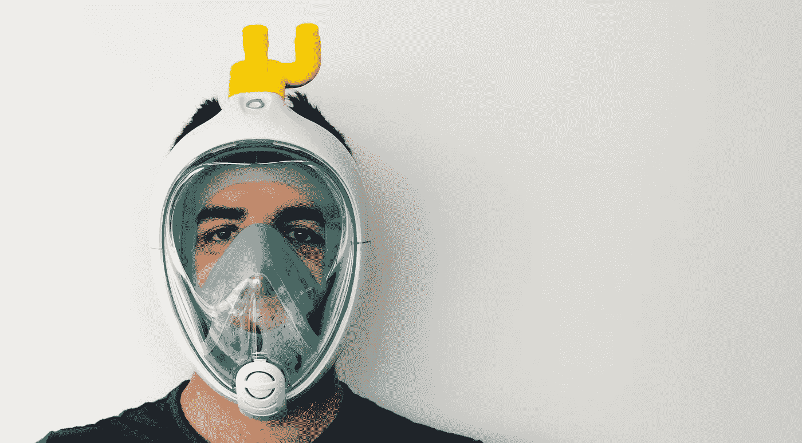
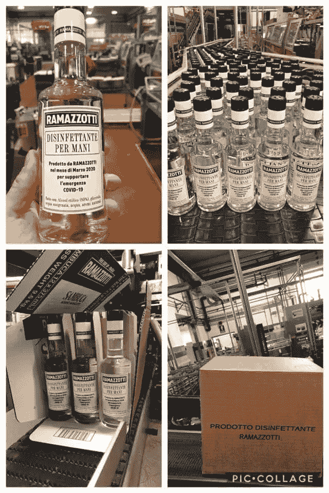
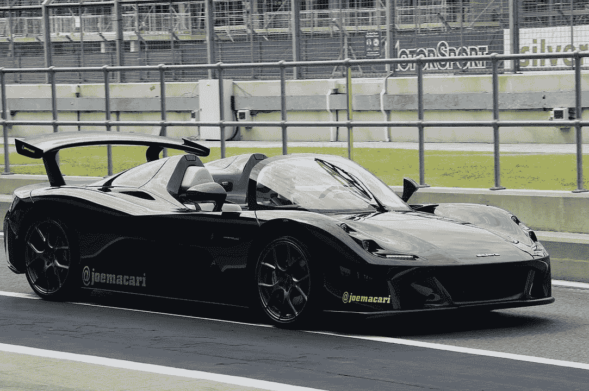
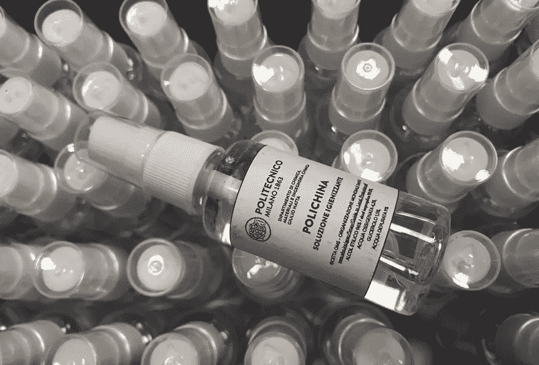

# COVID — 19:良好的意愿也意味着良好的业务

> 原文：<https://medium.datadriveninvestor.com/covid-19-good-will-means-good-business-too-d453f1582c83?source=collection_archive---------14----------------------->

## 意大利再一次站在了接下来将要发生的事情的最前沿

## 从当代英雄到自愿转产，商业和社会可以互相帮助。

EASY COVID 19\. A simple 3D-printed kit transforms snorkeling masks into respirators for Coronavirus patients in ICU. Courtesy of [Isinnova](https://www.isinnova.it/easy-covid19-eng/).

这些日子，意大利的生活越来越艰难。所有的商店和店铺都关门了，很多商家被迫停止生产和服务。但是随着艰难时期的到来，也带来了做好事和做(新)生意的机会。

在美国，总统正在运用国防生产法案(Defense Production Act)迫使企业将生产转化为国家需求(在这里是医疗设备)，而意大利人正在以不同的方式获得信息，并开始变得富有创造力和生产力。

> 随着艰难时期的到来，也出现了做好事和做(新)生意的机会。

如今，我们有很多**英雄行为**的例子。普通工人继续履行他们的职责，确保我们的社会能够不断满足每个人的需求。

This picture showing known superheros together with a casher with a mask went viral in Italy last week.

**不仅仅是医疗行业(医生、护士、护理人员、警察)。还有超市、运输、送货、清洁、垃圾收集、公用事业和食品生产商等行业的工人。**

Official video by Vatican News channel about the first-in-history event with Pope Francis.

在一个空无一人的罗马圣彼得广场上，教皇弗朗西斯在向世界发表的历史性讲话中明确提到，饥饿已经影响到人口中最脆弱的部分，并要求世界将这些黑暗时期转化为机遇。

在意大利，像甲烷气体分配厂和发电厂这样的战略性工业资产现在由志愿工作者管理，他们自我隔离 15 天(也与家人隔离！)用于授予业务连续性。

> 我们需要感谢这些现代英雄。我们需要鼓励每个人行动起来，并从中获得灵感。

Ramazzotti disinfectant liquid production. From [official Linkedin post](https://www.linkedin.com/posts/carlotta-pastelli-77073b3b_socialresponsability-covid19-pernodricarditalia-activity-6649322145996386304-NLqm) of a company representative.

我们可以在业务中发挥创意:

*   **意大利时尚品牌**(包括[阿玛尼](http://www.ansa.it/lombardia/notizie/2020/03/26/armani-converte-produzione-moda-in-camici-per-medici_33e8d316-b127-41d8-ae77-6f4cb2133f7b.html))正在将生产转向医用服装和用品
*   **意大利汽车品牌**(包括[法拉利、FCA](https://www.ilfattoquotidiano.it/2020/03/26/coronavirus-da-prada-e-gucci-a-fca-e-ferrari-tutte-le-aziende-italiane-che-riconvertono-la-produzione-per-fare-mascherine-e-ventilatori/5747676/) 、玛莎拉蒂和[达拉拉](https://motorsport.motorionline.com/2020/03/26/coronavirus-dallara-in-pista-i-partner-al-lavoro-per-produrre-valvole-respiratorie/))开始生产医疗保健设备，如呼吸器和相关部件

CC-BY: [David Merrett](https://www.flickr.com/people/14265068@N00) — [Dallara Stradale](https://www.flickr.com/photos/davehamster/48502366112/)

*   **意大利酒精饮料品牌**(包括 [Ramazzotti](https://www.linkedin.com/posts/carlotta-pastelli-77073b3b_socialresponsability-covid19-pernodricarditalia-activity-6649322145996386304-NLqm) )正在将生产转向消毒液
*   意大利 [**军用飞机和航空航天生产商**莱昂纳多](https://www.leonardocompany.com/en/press-release-detail/-/detail/28-03-2020-leonardo-solidarity-shown-by-the-company-through-its-support-towards-civilian-authorities-which-are-working-to-contain-the-covid-19-pandemi)提供飞机服务和生产设施
*   意大利的大学通过对材料进行测试(特别是控制口罩的有效性)和生产消毒剂来支持这次紧急事件。

The new “Polichina”, the disinfectant gel that Politecnico di Milano university is producing (around 6000 liters per day) and delivering to critical bodies in Milano.

*   **意大利初创公司**正在打造官方医疗设备的创造性替代品。这里有一个案例**一个浮潜面罩被改造成呼吸装置，这要归功于一些部件的 3D 打印**:

 [## 冠状病毒。由于 3D 打印组件，浮潜面罩成为了病人的呼吸机

www.rainews.it](http://www.rainews.it/dl/rainews/media/Coronavirus.-Maschere-da-snorkeling-diventano-ventilatori-ospedalieri-grazie-alla-stampa-3D-1e087332-c6ec-4eac-b32d-e3e0c0532a5d.html#foto-1) 

我们可以促进和推动这一切蓬勃发展，因为善意也可能意味着好生意。

 [## 2020 年最佳短期投资选择精选资源|数据驱动型投资者

### 投资是增加你净财富的一个好方法。如果你通过遵循一个严格的…

www.datadriveninvestor.com](https://www.datadriveninvestor.com/2020/03/28/handpicked-resources-for-the-best-short-term-investment-options-of-2020/)