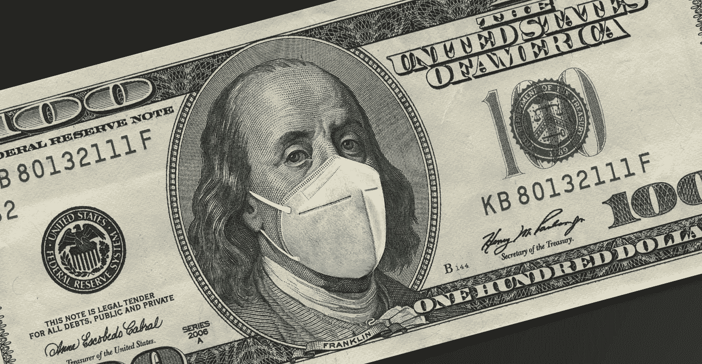
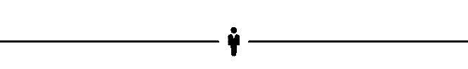

# 新冠肺炎责任保护是一个非常非常糟糕的主意

> 原文：<https://medium.datadriveninvestor.com/covid-19-liability-protections-are-a-really-really-bad-idea-982f7a0688a8?source=collection_archive---------27----------------------->

## 政治

## 为了保护企业，米奇·麦康奈尔愿意让美国经济走上绝路

Photo: Getty Images

在过去的几个月里，国会——尤其是美国参议院——表现得就像一个人，看到自己的家着火了，就决定看一会儿这场大火，看看会有多严重。他们没有联系消防部门，而是看着火势越来越大，希望火势会自行熄灭。

当然，我指的是华盛顿的新冠肺炎谈判，或者更准确地说，是谈判的失败。过去的六个月就像看一个政府无能的大师班。说人们在受苦是一种保守的说法。

## 我们正走向经济悬崖

到本月底，数百万人将看到他们的失业救济结束。此外，驱逐禁令将于本月底到期。时机再糟糕不过了。

就在本周，劳工部报告称，本周有 853，000 人申请失业救济，比前一周增加了 137，000 人。大约 29%的黑人和 17%的西班牙裔租房者拖欠房租和水电费。零售店和执法部门报告称，在 T2，基本必需品的入店行窃有所上升，突显出严重的食品不安全水平。

为什么国会允许事情变得如此接近边缘？事实上，有很多人应该受到指责。也就是说，联邦政府缺乏财政援助很难说是一个“两边”的等式。

 [## 为什么史蒂夫·姆努钦不想谈论乔布斯

### 共和党决心保护公司和股票市场。即使这会杀了我们。

medium.com](https://medium.com/the-journeyman-newsletter/why-steve-mnuchin-doesnt-want-to-talk-about-jobs-724146c2d751) 

值得称赞的是，众议院民主党人在五月通过了[英雄法案](https://www.debt.org/2020/07/21/heroes-act/),以延续将于六月底到期的医改法案。提议的法案为各州提供了额外的帮助，另一轮直接支付，以及延长 600 美元的失业刺激。

几乎没有人感到惊讶的是，共和党人对该法案 3 万亿美元的价格犹豫不决。因此，众议院议长南希·佩洛西提出向共和党妥协，最终从最初的一揽子计划中削减了超过 2 万亿美元。最近，佩洛西支持一个两党小组通过谈判达成妥协，但遭到麦康奈尔的拒绝。

在相互指责中，几乎很容易忘记共和党人控制着参议院和白宫。在过去七个月的任何时候，参议院都可以修改英雄法案，以此作为最终协议的基础。

 [## 新冠肺炎期间股票交易的 9 个教训|数据驱动的投资者

### 在你浏览之前，让我告诉你一些关于我自己的情况。我是…

www.datadriveninvestor.com](https://www.datadriveninvestor.com/2020/12/09/9-lessons-learned-about-stock-trading-during-covid-19/) 

## 是什么阻碍了新冠肺炎救援？

麦康奈尔通过新冠肺炎救济的障碍是企业的责任保护。他想包庇公司的荒谬程度:

> “麦康奈尔和参议员约翰·科宁(共和党-得克萨斯州)提出的责任提案将在 2024 年之前优先于州法律，要求投诉人在联邦法院证明企业或其他机构本质上是故意让他们生病的，同时还提供他们在症状出现前两周内去过的每个地方和每个人的清单——这甚至是在审判开始之前。公司可以起诉提出和解要求的人，然后美国检察官可以起诉他们。”

在如此多的个人痛苦中，麦康奈尔为什么要冒着大屠杀的风险让大企业摆脱困境？去年五月，我写了一篇关于共和党如何看待 T2 经济的文章:

> “就共和党而言，商业——尤其是大企业——就是经济。他们认为商业驱动经济，而不是人。对他们来说，公司就像汽车，首席执行官驾驶汽车，而员工则是替换零件。这就是为什么他们愿意开一家肉类加工厂，里面挤满了在有毒的疾病中肩并肩工作的人。这也是为什么他们不介意你失业了，或者你下个月付不起房租。他们认为你从一开始就得到了[太多的帮助。他们已经看到了数字，所以他们知道没有足够的工作机会。但是，他们不担心你下个月如何支付汽车付款，而是想确保福特继续生产汽车。这就是为什么他们需要你回去工作，重新开放经济，尽管工作环境不健康。如果你有胆量不回去做你的调酒师或呼叫中心的工作，因为害怕生病，或者，但愿不会，把生病带回家给家人——那就和失业说再见吧。”](https://www.businessinsider.com/lindsey-graham-congress-coronavirus-unemployment-benefit-over-our-dead-bodies-2020-4)

这种心态是共和党人专注于减少企业债务而不是保护员工的原因之一。这就是为什么当我们发现公司经理们打赌有多少员工会因为新冠肺炎而生病时，他们并不关心。这种方法会产生后果。

 [## 各位，准备好，情况会变得更糟

### 福利关怀法案的结束和迫在眉睫的驱逐浪潮会让你向往的宁静日子的…

medium.com](https://medium.com/datadriveninvestor/gird-your-loins-people-its-about-to-get-a-lot-worse-ae1fc054462) 

## 这里有一个关于麦康奈尔责任保护问题的真实例子

我家住在北卡罗来纳州的一个岛上。像大多数海滨城镇一样，旅游业对我们城镇的经济健康发展至关重要。自疫情以来，各行各业都受到了影响，尤其是餐馆。许多当地的酒吧和餐馆在容量明显减少的情况下挣扎着生存。

在封锁之前，我的妻子和女儿在岛上的一家餐馆工作。在关闭期间被暂时解雇后，由于容量限制，当餐厅重新开业时，两人都被解雇了。事实是，由于我属于高风险类别，他们俩都没打算回来。

与全国各地的餐馆一样，由于员工冠状病毒检测呈阳性，该餐馆已经开业和关闭了几次。正因为如此，当我听说他们几天前又关闭了，我并不感到惊讶。

但这一次，围绕关闭的环境有所不同。这是我目前拼凑的故事:

这家餐厅的一名服务器似乎被检测出新冠肺炎病毒呈阳性，但却隐瞒了这一信息，继续工作了两天，并与顾客互动。更糟糕的是，至少有一名餐厅经理知道这名员工检测呈阳性，但至少两天没有采取任何行动。

这意味着这两天工作的每个员工都应该隔离。这也意味着*那两天在那里吃饭的每一个顾客*很可能都被暴露了，所以他们应该隔离，更不用说他们周围的人了，等等。但是餐馆如何联系他们呢？

让我们把这个场景向前推进一步。假设有一名员工接触了超级传播者，这名员工感染了新冠肺炎病毒并死亡。或者可能是一个顾客，碰巧没有症状，把疾病带回家给他们患哮喘的孩子。从米奇·麦康奈尔的角度来看，餐馆和没有采取行动的经理都不应该承担任何责任。

根据麦康奈尔的提议，任何试图起诉餐厅的服务员或顾客都有被餐厅起诉和刑事起诉的风险。他的提议甚至会保护泰森食品公司的经理们，他们被发现把钱赌在他们的员工会因为新冠肺炎而生病的人数上。

米奇·麦康奈尔愿意看着经济崩溃，如果他不能如愿的话。

*我的文章是读者支持的，所以如果你喜欢这篇文章，请考虑成为我的每周简讯* [*【帮工*](https://linktr.ee/thejourneyman) *的订户！也可以关注我的* [*推特*](https://twitter.com/GeekTrader) *。感谢阅读！*

## 访问专家视图— [订阅 DDI 英特尔](https://datadriveninvestor.com/ddi-intel)