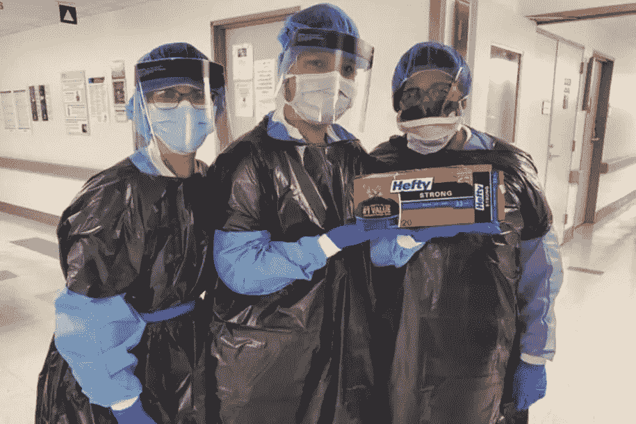
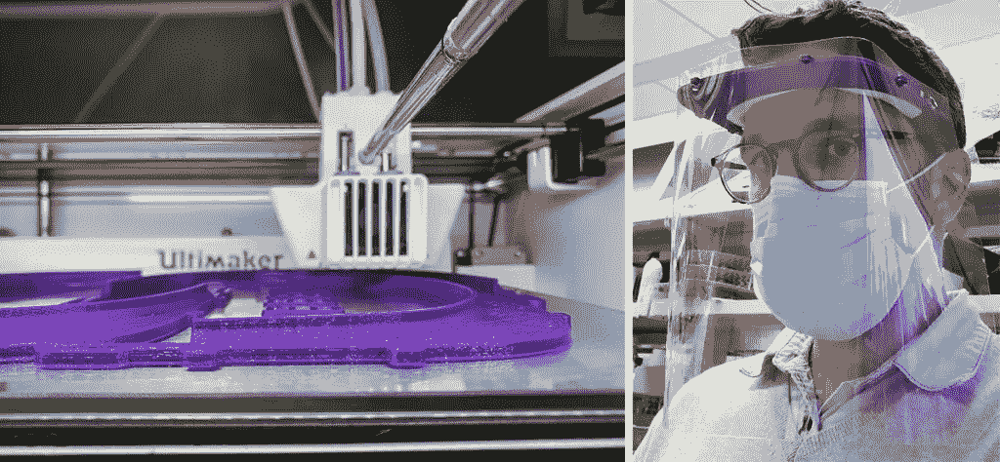
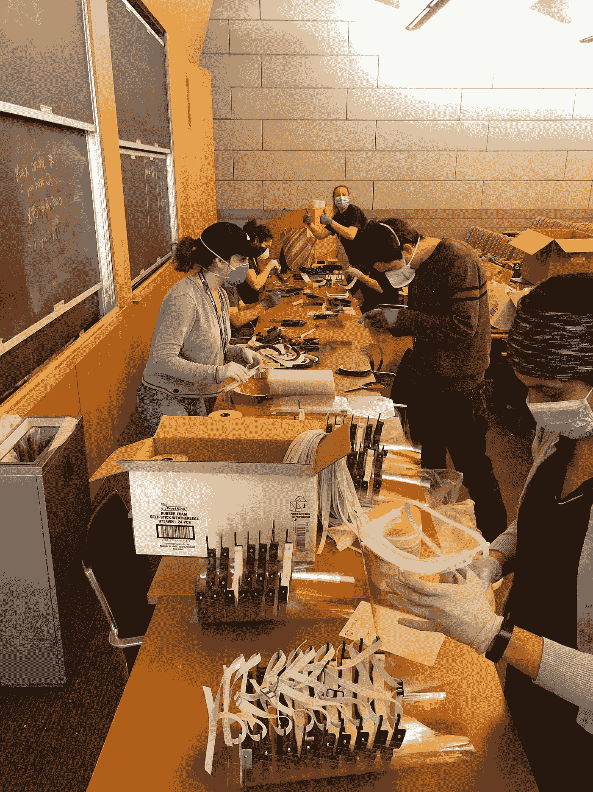
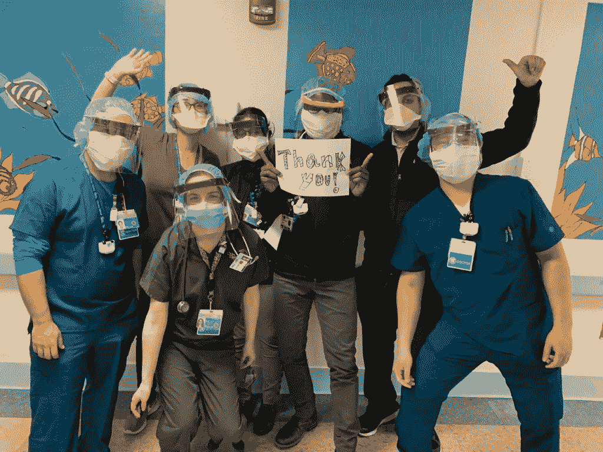

# 新冠肺炎封锁第 50 天:3D 打印重要设备

> 原文：<https://medium.datadriveninvestor.com/covid-19-lockdown-day-50-3d-printing-vital-equipment-76ea0dec3fb7?source=collection_archive---------12----------------------->

生活在冠状病毒瘟疫的中心是一种超现实的体验。在我的窗外，纽约显得宁静——没有了以前的噪音、喧嚣和喧闹的市民。然而，在几个街区之外的北部、南部和东部，这实际上是一个战区，死亡人数如此之多，以至于管理人员正在利用集体坟墓。危机早期最令人抓狂的画面之一是看到护士们穿着沉重的垃圾袋作为个人防护装备。

珍珠港事件后，美国国会通过了 1941 年第五次国防部拨款补充法案，以国家安全为由，强制要求所有军服在国内制造。1952 年，该法案被扩展并重新命名为[贝里修正案](https://en.wikipedia.org/wiki/Berry_Amendment)，要求国防部“在采购中优先考虑国内生产、制造或本土产品，尤其是食品、布料、织物和特种金属。”可悲的是，即使在过去的全球流行病(如 H5N1、SARS、MERS 和埃博拉)之后，联邦政府也未能扩大《贝里修正案》的范围，将医疗用品纳入其中，为下一次全球疫情做准备。

2005 年 11 月，乔治·w·布什总统[发布了](https://www.wearethemighty.com/MIGHTY-SURVIVAL/military-planners-strategized-for-pandemic?rebelltitem=1#rebelltitem1)一项“疫情流感国家战略”，以应对亚洲禽流感的爆发。13 天后，参谋长联席会议主席皮特·佩斯将军跟进，建立了他自己的“规划命令，指示所有作战指挥官为国防部应对疫情流感进行执行层面的规划……制定一项应急计划，专门解决部队健康保护、民事当局的国防支持以及人道主义援助和救灾这三项主要任务。”在军事准备的同时，白宫签署了一项行政命令，部署 70 多亿美元用于开发疫苗、疗法、检疫策略和医院准备，以应对潜在的疫情病毒。这些努力在早期遏制了病毒，并潜在地挽救了成千上万美国人的生命。前线战士的个人防护装备配给与今天的现实形成了鲜明的对比。

在当前的困境中，一些最鼓舞人心的时刻是目睹普通人一起给被隔离的老年人送食物；为超负荷工作的急救人员订购比萨饼和饼干；以及用 3D 打印机制造 PPE 的硬件发明家。在全国范围内，企业家们利用自己的聪明才智来填补政府资金缺口。几周前，我被介绍给一位这样的创新者，格雷格·布里顿汉姆，他是 NYU·兰贡医院(纽约市受灾最严重的医院之一)的博士生。这位从细胞生物学家转型为自动化专家的专家很快加入了一个基层组织，为纽约的医疗专业人士生产面罩。最近，我采访了他，作为我关于工程师如何加入机器人对抗致命病毒系列的一部分。

Brittingham 目前是 is 朗格健康系统遗传学研究所[的学生。ISG 大学的校长杰夫·伯克博士以从面包酵母中制造合成 DNA 而闻名。“ISG 是医院的一个研究所，采用系统方法来理解基本的生物学原理和人类疾病，”年轻的研究助理解释道。Brittingham 描述了他在研究所工作时对机器人和增材制造的熟悉程度，“构建兆碱基规模的 DNA 需要许多步骤。为了提高这一过程的时间效率，我们的研究所拥有一套机器人和自动化液体手柄以及 3D 打印机来构建定制的实验室工具。”](https://med.nyu.edu/departments-institutes/systems-genetics/)

 [## 论机器人权利:机器人可以被奴役吗？数据驱动的投资者

### 人们可以随心所欲地对待他们的机器人吗？一个人可以对他们的机器人“暴力”吗？机器人应该是…

www.datadriveninvestor.com](https://www.datadriveninvestor.com/2020/02/13/on-robot-rights-can-robots-be-enslaved/) 

当有人被扔进战壕时，我请 Brittingham 描述一下他在当前情况下在医院的经历。“我们整个医疗系统都在加班加点地对抗这个东西。他们身心俱疲，但仍在战斗。我认为我们能为他们做的最重要的事情是确保他们感到安全和被欣赏。”他补充说，“拥有合适的个人防护装备是其中很大的一部分，但像给前线的医生和护士送食物这样的小事也是如此。”虽然他不能治疗病人，但 Brittingham 和他的同事们正在使用实验室的设备为整个大都市地区制造个人防护设备。

这位 NYU 大学的研究生讲述了这一努力的起源，“[蒂姆·莱昂纳特](https://med.nyu.edu/faculty/timothee-lionnet)(ISG 的助理教授)和本·金(蒂姆实验室的博士后)在与[迈克尔·帕科德](https://nyulangone.org/doctors/1841327293/michael-e-pacold)(一位了解纽约市医院系统即将面临的挑战的医学科学家)讨论后，于 3 月中旬构思了 3D 打印面罩倡议。他们联系了在 ISG[拥有 3D 打印专业知识的团队，包括安德鲁·马丁、Neta Agmon 和我，我们开始原型设计和优化打印时间。我们设定的目标是每天生产数百个面罩，但发现医疗中心的 3 台打印机每天只能打印大约 50 个面罩支架。”他继续记录这一内部运动如何在研究所之外发展，“为了印刷更多的盾持有人，我们需要利用更广泛的打印机网络，我们对纽约市印刷社区的热情回应感到惊讶。我们联系了我们的网络，他们做了进一步的介绍，我们能够建立一个超过 20 个站点的群组，包括:](http://neta%20agmon/)[NYU·坦登工程学院](http://nyu%20tandon%20school%20of%20engineering/) (Victoria Bill，Christina Lafontaine 和 Elizabeth New)[NYU 牙科学院生物材料系](https://dental.nyu.edu/academicprograms/dental-hygiene-programs.html?gclid=CjwKCAjwp-X0BRAFEiwAheRui08Z25uggEqQfwIu2145-jzEUe4rajuiRbwwf3sdiONcu6LXKiJ-rRoCWVgQAvD_BwE)(Lukasz Witek)[NYU·朗格内放射学](http://nyu%20langone%20radiology/)的瑞安·布朗[，接枝牛奶](http://nyu%20langone%20radiology/)[的道格·拉森](https://www.graftmilk.co/)(一家定制哑光细丝公司)，NYU 科技健康[的德鲁·汉密尔顿](https://med.nyu.edu/our-community/health-technology) 纽约未来空间[的马库斯·斯瓦格](http://futurespace.nyc/)、NYU 生物城[的卡洛斯·卡尔默纳-方丹和洛根·沙赫特纳](https://as.nyu.edu/content/nyu-as/as/departments/biology.html)、NYU 生物城的莱昂内尔·克里斯蒂恩、[新实验室](https://newlab.com/)的亚历山大·苏斯、 [Ultimaker](https://www.dynamism.com/) 的马特·格里芬以及纽约市北部、新泽西州、康涅狄格州的个人打印机，甚至还有道格·拉森联系过的芝加哥的一家打印集团。

一旦机器就位，面罩工作人员就寻找人来生产和运送货物。“此外，我们需要志愿者来组装面罩，并协调整个城市的收发工作。我们有超过 70 名志愿者，他们来自 NYU 兰贡的萨克勒生物医学研究生院和博士后协会。在所有这些志愿者的帮助下，我们实现了每天组装和运送 200 个盾牌的目标，”Brittingham 自豪地说。他进一步说明，在过去两周内，该团队在全市捐赠了 1，600 多面盾牌，包括:NYU·兰贡(放射肿瘤学、Periop、胃肠、紧急管理、心脏病学、麻醉学、乳腺肿瘤学)、NYU·温思罗普(牙科)、Sinai 唐斯坦(包括儿科)、埃尔赫斯特、西奈山(GI、Neuro ICU)、蒙特菲奥雷/爱因斯坦、威尔·康奈尔、布鲁克戴尔、哈莱姆、伍德赫尔、NYP 卫理公会布鲁克林和里奇伍德志愿者救护车公司。Brittingham 对“盾牌舒适”这一事实深感自豪如果需要，他计划将面罩运送到其他地方。

我向 Brittingham 讨教了他在冲突后在全国范围内扩展内部 3D 打印和自动化项目的想法。“事实上，这个疫情始于世界最大制造商的制造中心，这加剧了问题。这就是为什么自组装在填补供应链缺口方面发挥了至关重要的作用，”他反映道。“不幸的是，美国没有医院储存足够的个人防护设备来对抗冠状病毒。问题是，即使您有足够的个人防护设备来保护前线人员，仍有许多其他部门在为患者提供治疗。随着疫情病毒的传播，因完全不相关的疾病而来的患者也感染了 Covid19，”这位博士生警告道。他简明扼要地总结道:“我认为，整个疫情教会了我们，当传统制造业无法满足医疗供应需求时，拥有本地制造能力是救命稻草。我认为，在这个疫情之后，这些趋势将会变得更加普遍——虽然本地 3D 打印机不会很快取代传统的供应链，但它们提供了一个权宜之计，可以在需要的时候生产关键的医疗材料。我不知道医院是否会扩大这些能力，但我可以告诉你，这相对来说很容易做到，前线的人们都很喜欢。”

*编者按:访问* [*NYU 兰戈内健康*](https://nyulangone.org/give/funds/covid-19) *了解如何帮助* *对抗新冠肺炎。*