# 新冠肺炎死亡率差异:数据和推测

> 原文：<https://medium.datadriveninvestor.com/covid-19-mortality-divergence-data-and-conjecture-783368effebf?source=collection_archive---------4----------------------->

Photo by [Rosie Kerr](https://unsplash.com/@rosiekerr?utm_source=medium&utm_medium=referral) on [Unsplash](https://unsplash.com?utm_source=medium&utm_medium=referral)

**为什么写这篇文章？**

我不是统计学家，这篇文章的统计范围超出了我的能力。但是，我相信我可以提出一些问题，让其他人能够了解并进一步发展。因此，这篇文章试图引起人们对关于冠状病毒事件的重要但却不为人知的问题的关注。它的主要目的是通过促进对当前问题的分析和更深入的思考来帮助我们理解。

**问题:为什么死亡率会有如此大的差异？**

冠状病毒世界水平的数据显示，各国之间的死亡人数差异很大。像比利时、法国、意大利、荷兰、西班牙和英国，确诊病例的死亡率为 10%或以上。同时；加拿大、德国、韩国、瑞士、美国和土耳其报告的死亡率为 4%及以下。尽管每个国家的数据质量和爆发阶段不同，但差异太大，不容忽视。是什么导致了这种差异？

 [## 冠状病毒；惊慌失措；字里行间的 z |数据驱动的投资者

### 围绕冠状病毒的话题；更准确地说，新冠肺炎几乎占据了整个新闻预报的头条…

www.datadriveninvestor.com](https://www.datadriveninvestor.com/2020/03/23/coronavirus-a-to-panic-z-between-the-lines/) 

**潜在答案:关注检测、病例和死亡的可用数据**

数据质量和突破的阶段都是潜在的重要因素，但考虑到数据的大小和突破的长度，足够大的样本量可能会抵消它们的分析问题。

一个合理的答案是，没有广泛检测的国家报告了更高的死亡率。这是一个棘手的问题，因为广泛的测试不仅与数字有关，还与样本分布有关。虽然大量检测更有可能表明国家一级的分布更广，但也不一定如此。此外，测试的数量并不意味着测试的个体数量。事实上，总的测试规模可能包括对同一个人的多次测试，包括对缺乏任何定性数据的卫生保健工作者的重复测试。为了平滑这些因素，测试的数量被用作覆盖范围的主要指标。在进行数据分析之前，我的假设是，那些死亡率较高的国家(I)每 100 万人口的检测次数较少，而(ii)每次检测的确诊病例较多。第一个意味着相对有限的覆盖面，第二个显示侧重于更有症状的病例(以及由于大量病例导致的保健系统的潜在过度扩张)。

另一个答案是医疗保健系统的质量，还有一个是预防措施对该国疫情总体发展的影响。高死亡率问题有一个答案，可能是这些原因和其他原因(遗传学、人口学等)的综合，但出于本文的目的，我将涵盖测试、病例和死亡的角度，看看它是否有助于更好地解决这个问题。

**方法论**

我希望这项工作尽可能及时，但 4 月 9 日的数据是我能从足够的样本中得到的最新数据。为此，我在 https://ourworldindata.org/coronavirus[的 Data](https://ourworldindata.org/coronavirus)中广泛使用了来自我们世界的数据，以及 Statista [的 https://www . Statista . com/statistics/1028731/covid 19-tests-select-countries-World wide/](https://www.statista.com/statistics/1028731/covid19-tests-select-countries-worldwide/)和 World ometer for population numbers[https://www . World ometers . info/World-population/population-by-country/](https://www.worldometers.info/world-population/population-by-country/)。

对于法国、德国和瑞典，我采用了 4 月 8 日的测试数据，并相当自由地推断到 4 月 9 日。鉴于持续时间很短，我相信我的推断不会导致有意义的统计差异。

我选取了累计人口超过 27 亿的 28 个国家作为样本。我遗漏了中国，因为它的测试数据和它在疫情中所处的阶段与样本中的大多数其他国家不一致。

我使用了 4 个指标进行分析:人口、测试、确诊病例和死亡。根据这些主要数据点，我研究了以下衍生产品:

(a)案例/测试比率:各国之间是否有一个有意义的平均数？

(b)死亡/病例比率:这里应该有比(a)更密切的关系。

死亡/测试比率:这有意义吗？如果有，什么意义？

(d)每 1 米的测试:这是对该国的覆盖面检查。

(e)每 100 万人的病例数:这是该国的感染传播检查。它与覆盖率的关系可能是有意义的。

(f)每 100 万人的死亡人数:这是在人口指标上对各国进行比较。

(g)测试/人群:验证覆盖人群的百分比(在潜在答案部分给出保留)。

(h)病例/人口:与(e)相同，但以百分点表示。

这些结果的平均值、中间值和标准偏差。

标准差与平均值的比率，以查看哪个因素的差异更大。

**结果表**

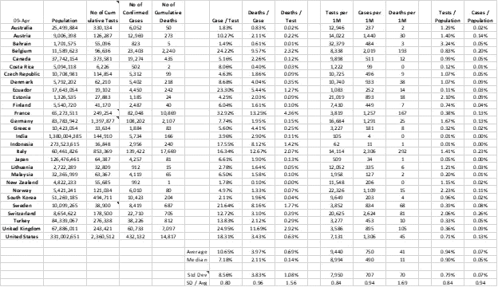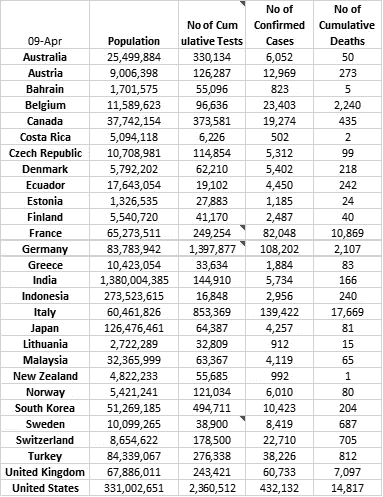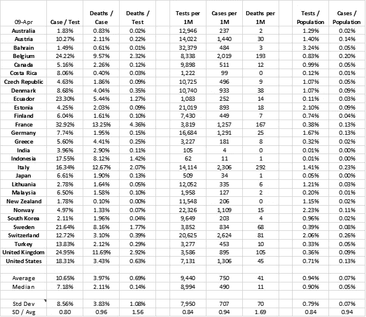

**观察— 1:每个测试关系的案例**

平均来说，10.65%的测试会产生阳性结果——这是一个新冠肺炎案例。然而，各国的数据差异很大，从巴林的 1.49%到法国的 32.92%。更重要的是，这里有一个聚集效应。一旦平均值向上突破，就像瑞士一样，那么比率较高的国家的数字就会明显更高。一种解释可能是，这些高于平均水平的国家正在检测有更可能被感染症状的患者。当我们检查这些国家和他们所做的与其人口相关的检测数量之间是否存在相关性时，让我们来看看这一点，这些国家不同于这里的低病例/检测比率国家(*跟进点 1*)。

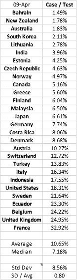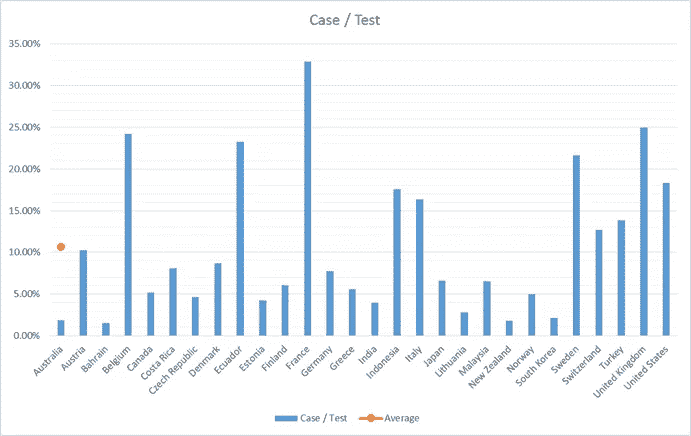

**观察— 2:每个病例的死亡数关系**

平均 3.97%是确诊病例的死亡率。然而，类似于案例/测试统计，各国之间存在很大差异，集群效应持续存在，一组国家在这一问题上得分很低或很高。

由于我们将病例/检测比率作为观察值 1，如果随访点 1 有效，那么具有较高病例/检测比率的国家应该是具有较高死亡/病例比率的国家。这将强化这样一个事实，即这些国家的医疗体系正处于紧张状态(以及其他可能限制其检测分散性的因素)。

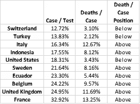

在病例/检测平均数高于样本平均数的 10 个国家中，7 个国家的死亡/病例平均数表明，这些国家正面临新患者的压力(*随访点 1*)。但与瑞士、土耳其和美国之间十分之三的分歧仍值得研究。我推测，土耳其和美国的例子是由于他们相对滞后于样本中的其他国家。这种滞后可能有助于他们获得更好的治疗方案。瑞士有着更老的人口和欧洲中部的位置，可能记录了相似的时间，需要更多的解释。也许它的数据会集中，或者也许它的资源会更多来对抗死亡。此外，土耳其和美国未来几周的数据也值得观察。

最后请注意，标准偏差与平均值的比率大于案例/测试比率。正如您在观察 3 中看到的，标准偏差与平均值的比率会随着死亡/测试指标的增加而进一步增加。

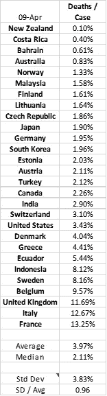

**观察— 3:每个测试关系的死亡数**

平均死亡率为 0.69%。类似于每个测试的病例和每个病例的死亡观察。这里有一个明显的聚集效应。由于这是前两个观察值的导数，使用了观察值 1 和 2 中包含的两个变量，让我们用一个表格来检查这个期望的有效性。

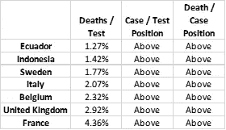

每次检测的死亡比率似乎向那些在应对疫情病毒方面问题相对较大的国家指出了这一点。请注意，瑞士、土耳其和美国从这份名单以及死亡/病例名单中掉出。这份名单上的国家是那些在控制死亡人数方面有困难的国家。

请注意，分析是基于截至 4 月 9 日的样本。例如，西班牙可能会在这个名单上，但它的数据在我使用的来源中并不容易获得。

最后，请注意，平均值的标准偏差在此指标上进一步增加。我推测，从病例/检测到死亡/病例到死亡/检测，这一指标的增加幅度显示了不同国家流行病进展的差异。虽然在案例确认中可以观察到这种差异，但在后来发现的案例中，这种差异被放大了。为了进一步分析，这里有一个跟进点，即一些国家在应对冠状病毒方面做得更好的有效性。

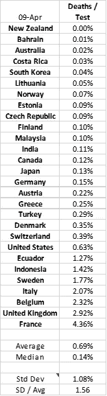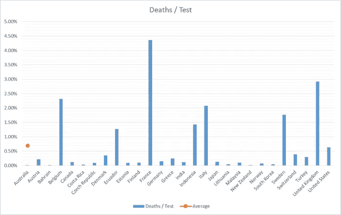

**观察— 4:覆盖率**

覆盖率是指测试了多少人口，每 100 万人口的测试结果是什么，或者占总人口的百分比(无论哪种方法更容易观察)。

截至 4 月 9 日，平均每 100 万人口进行了 9440 次测试。这相当于只测试了总人口的 0.94%。然而，如果进行多次测试，测试的实际人数将低于这个数字。

平均每 100 万人口有 750 例确诊病例，占确诊感染人口的 0.07%。

平均值看起来很低，而且分布与其他观察结果有些不同。其中一些国家如巴林、挪威、爱沙尼亚、瑞士、德国、意大利和奥地利已经做了广泛的测试。除了意大利，这些国家中的大多数在死亡人数上表现得更好。这与测试列表顶部的其他类似。我相信这绝不是巧合，而且**在进行检测的数量(占人口的百分比)和一个国家成功应对疫情之间存在明显的正相关。**

在每 100 万人的测试比率中，有一部分国家比平均水平低 1/3 以上。这些国家是马来西亚、哥斯达黎加、厄瓜多尔、日本、印度和印度尼西亚。所有这些国家每 100 万人中的病例比率都低于平均水平。**这再次证实了只有通过充分的测试才能发现病例——再次强调了广泛测试的重要性。**请注意，在这些明显低于平均水平的测试者中，厄瓜多尔和印度尼西亚的病例/测试和死亡/病例比率在统计上较高，这表明它们没有能力发现该问题在各自国家的广泛性。然而，与此相反的是；哥斯达黎加和日本已经进行了有限的测试，进展顺利。关于这两个问题，还有一个后续问题。

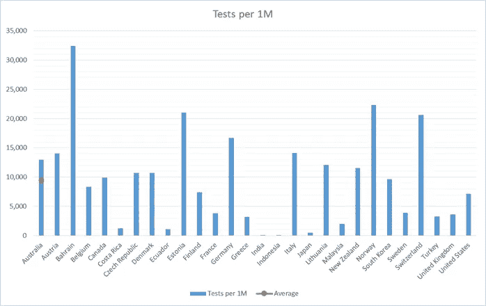

请记住，在观察结果 1 和 2 中，我有一个包含在本文中的后续观点:*一种解释可能是，这些高于平均水平的国家正在检测更有可能被感染的症状患者。当我们检查这些国家和他们所做的与其人口相关的检测数量之间是否存在相关性时，让我们来看看这一点，这些国家不同于这里的低病例/检测比率国家(*跟进点 1*)。*

我基本上是在问，每项测试的高案例比率是否是因为这些国家的测试覆盖率较低。让我们用观察-4 的数据将答案制成表格。

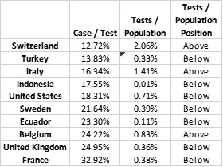

在病例/检测比率高于平均水平的 10 个国家中，有 7 个国家的病例/检测比率低于平均水平。一个需要进一步验证的观察结果是，这 7 个国家正在处理输入的患者，使其阳性检测结果向好的方向倾斜。一方面，这对他们未来的发展是积极的，但这也暗示了他们医疗保健系统的潜在瓶颈。**这个衍生分析第三次显示了增加测试覆盖率的重要性。**为此，土耳其和美国根据该数据集增加了日常测试，我认为这是朝着正确方向迈出的一步。至于意大利和比利时，它们有较高的检测覆盖率，但在处理它们的病例时仍然面临困难，我为未来的研究人员提出了另一个后续问题。他们可能遭受了迅速增加的感染的冲击，需要住院治疗，他们的检测可能没有及时跟上。答案不在本文涵盖的数据中。

**观察— 5:具有最佳比率的那些**

本文着眼于这些问题，希望能有所帮助。虽然数据在表格和图表中显而易见，但我们也可以从那些迄今为止更成功的国家那里学习。令我惊讶的是，他们来自世界各地。我将成功标准定义如下:每 100 万人口中死亡率低于平均水平，每 100 万人口中检测数高于平均水平的国家。

按照死亡人数较少的顺序排列，以下国家进行了广泛的检测并预防了死亡。粗略一瞥意味着所有人都有高收入水平，但我把它留给另一个后续点，以查明这个样本之间的相似之处以及与数据集中其他样本的比较。

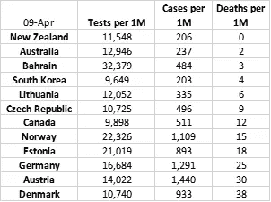

**结论**

我真诚地希望这篇文章有助于思考手头的问题。

我有 100%的信心，我们将设法解决病毒问题。这个周期将在 4 月达到顶峰，5 月下半月感觉会好一些。

我们将不得不学会与冠状病毒共存一段时间，后续的周期将考验我们。 ***为此，问题不在于病毒，而在于我们如何应对它。*** 我希望我们相互学习，合作，改进我们的应对方法。成功是不可避免的，但成功的代价取决于我们的方法。

2020 年 4 月 11 日