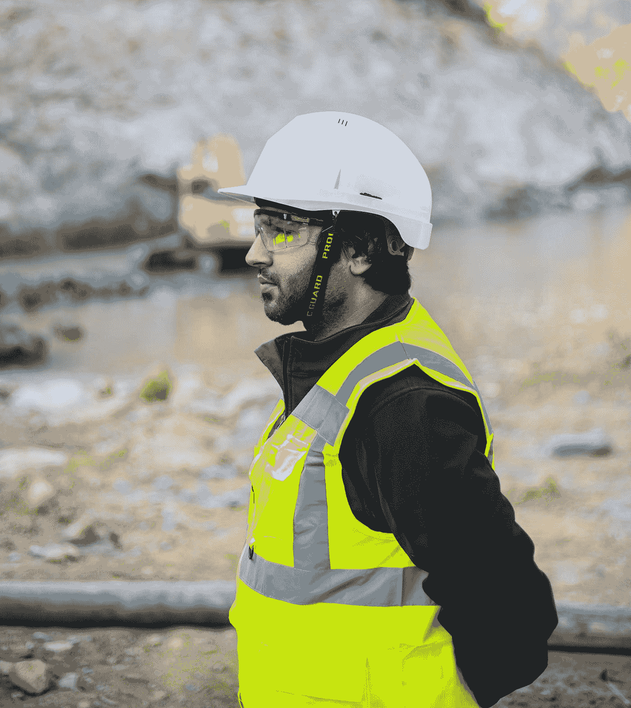

# 新冠肺炎:走出紧急，进入紧急

> 原文：<https://medium.datadriveninvestor.com/covid-19-out-of-the-emergency-into-the-urgency-82ae44ae6148?source=collection_archive---------15----------------------->

Photo by [Frank Busch](https://unsplash.com/@frankbusch?utm_source=medium&utm_medium=referral) on [Unsplash](https://unsplash.com?utm_source=medium&utm_medium=referral)

# 为您(和您的企业)抓住数字机遇的三个想法

COVID 疫情改变了我们的生活:现在我们正在回归“正常”，我们慢慢意识到这是一种“新”的正常。当思考我们(和组织)如何面对这一紧急情况时，有三个问题需要迫切关注:通过回答这些问题，我们可以在未来两个季度创造有趣的机会。本文的目的是引发讨论，并通过一些细节来探索它们，以便了解它们可能很快带来哪些个人和商业机会:

Photo by [Joanna Kosinska](https://unsplash.com/@joannakosinska?utm_source=medium&utm_medium=referral) on [Unsplash](https://unsplash.com?utm_source=medium&utm_medium=referral)

## 1.虚拟空间缺什么？虚拟电梯

从教育到工作会议，视频电话现在是“必须”的，因为它们有助于打破单调的家庭工作日，并使员工、朋友和家人感到“在一起”。这很好，但还不够。在过去两个月的封锁中，完全缺失的是非正式沟通，这部分与“意外收获”更相关，即偶尔发现有助于人们互动并保持社交和商业生活的无价信息。事实上，许多组织已经“人为地”创造了一种虚拟的非正式活动，如“虚拟咖啡”或“虚拟下班后”或虚拟竞争:非常令人鼓舞的举措，但它们都与我们都需要的“非结构化协作”有一个根本的区别:它们是有计划的。销售、R&D、人力资源等职能确实需要创造力，而虚拟的工作环境缺乏随意闲聊交流信息的机会。

谁将创造第一个“虚拟电梯”或“虚拟咖啡区”？

Photo by [Ahsanization ッ](https://unsplash.com/@ahsanization?utm_source=medium&utm_medium=referral) on [Unsplash](https://unsplash.com?utm_source=medium&utm_medium=referral)

## 2.如何通过设计让世界更安全？智能监控

安全(工作)环境是指人们(员工)采取措施和工具保护健康的环境。这种说法一直都是正确的，尽管最近的疫情事件将进一步强化这种说法。好的一面是，我们现在有大量廉价的技术，可以帮助监控安全措施的采用，从而减少(与工作相关的)事故。有使用开源技术(如谷歌 TensorFlow)的实时机器学习算法的在线版本，可以轻松、一致地检测人们是否戴着口罩。同样的算法可以检查工人在危险区域是否戴手套、安全鞋和头盔。

生活在一个有工作场所伤害的世界会有多好？

Photo by [Franck V.](https://unsplash.com/@franckinjapan?utm_source=medium&utm_medium=referral) on [Unsplash](https://unsplash.com?utm_source=medium&utm_medium=referral)

## 3.害怕丢失您的数据？被“云”救了

现在，在这么多积极的消息之后，事实是，我们可能会在不到一个季度的时间里经历非常大比例的数据泄露。

原因很简单。新的“常态”成倍增加了对企业网络的访问，尽管主要由安全 VPN 甚至自有设备控制，但潜在违规的数量是巨大的。打个比方，组织的安全结构就像墙一样，为了保护自己免受攻击，他们增加了“哨兵”(安全检查算法)，定期在这些墙周围运行。很好，但是空袭呢？“远程工作”、合同灵活性、设备激增给组织的安全性增加了新的维度。当前的安全控制将在短期内扩大规模，从而创造巨大的机会将尽可能多的服务转移到云上。

我们都会成为[数据投资人](https://medium.com/datadriveninvestor/if-data-is-money-cloud-is-bank-how-to-become-a-data-investor-ef188d404a72)！

## 结论

很快我们将走出数字时代的第一波疫情浪潮。我们都知道，对紧急情况采取行动会使世界面临巨大风险。这种理解将让我们所有人都有一种适当的紧迫感，以确定和实施将减轻风险的数字措施，保持我们自己的安全和创造力。

________________________________________________________________

*免责声明:除非明确声明，本文中的观点或意见是个人的，仅属于文章作者，不代表作者在专业或个人能力方面可能或可能不相关的人、机构或组织的观点或意见。*

_________________________________________________________________