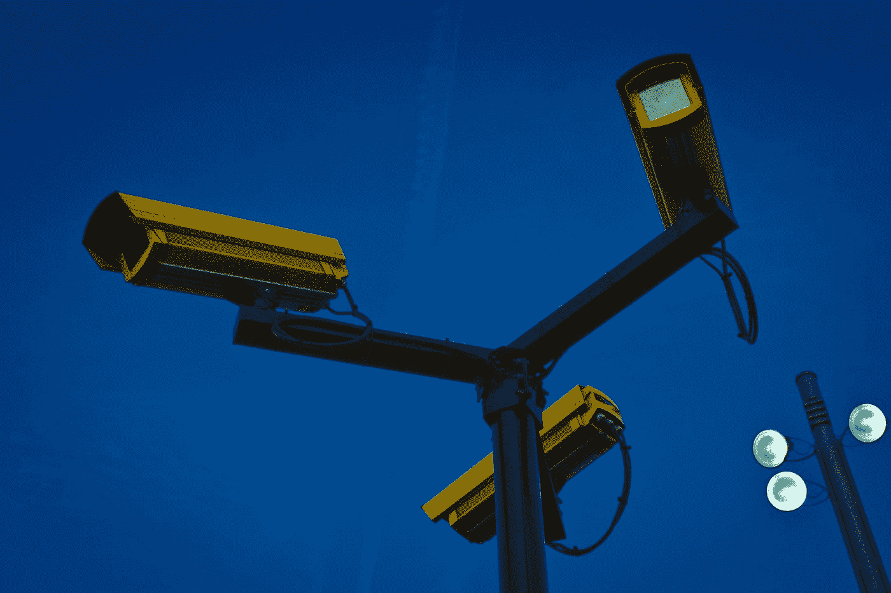

# 新冠肺炎·疫情和监视计划

> 原文：<https://medium.datadriveninvestor.com/covid-19-pandemic-and-surveillance-program-b3be0a9a8f53?source=collection_archive---------4----------------------->

## 现代企业特洛伊木马的缩影

Image by [Couleur](https://pixabay.com/users/Couleur-1195798/?utm_source=link-attribution&utm_medium=referral&utm_campaign=image&utm_content=3170012) from [Pixabay](https://pixabay.com/?utm_source=link-attribution&utm_medium=referral&utm_campaign=image&utm_content=3170012)

疫情奥罗拉病毒给世界经济、公共安全和个人健康带来了巨大压力。与新冠肺炎相关的混乱和不确定性并不是我们这个时代独有的，因为它在人类历史上已经发生过多次。在过去，各种各样的错误行为都是在混乱的情况下通过各种形式的机会犯下的。然而，导致这种不一致的一个重要因素是，公众相信政府和各种机构，甚至是企业会帮助他们摆脱混乱。不管是不是巧合，后者有时会成功。但在大多数情况下，公民为此付出了高昂的代价。而这种代价往往比最初的混乱要高得多。

利用混乱通常是通过果断地投射出一幅比现存问题更迷人的画面来实现的。它表演了罪犯的失败；尽管如此，在伪装之下，它是类似古代特洛伊木马现象的缩影。

# 特洛伊木马的概念——追根溯源

特洛伊木马的故事可以追溯到战争时期，当时希腊人利用一种欺骗性的方法进入自治城市特洛伊，从而宣告战争的胜利。在这个广为人知的故事中，经过 10 年徒劳无功的进攻，希腊人建造了一匹巨大的木马。他们偷偷带了一队精选的战士进去，包括奥德修斯，伊萨卡的希腊传奇国王。

希腊人起初扬帆而去，假装他们已经让步，留下了木马。一旦特洛伊人把马拉进他们的城镇，作为一种征服的情绪，那天晚上，希腊军队偷偷溜出马，打开城门，迎接已经返回的希腊军队。希腊军队随后进入并摧毁了特洛伊城，战争达到高潮。

几个世纪以来，“特洛伊木马”已经发展成为一个有点欺骗的阴谋，其根源是一个邀请敌人进入安全保护的据点或地方的标记:数据、监视、数据价值、数据挖掘和人工智能。

# 大数据业务是古老的特洛伊故事的体现。

各种实体因其宝贵的价值需要私人个人数据和健康信息。政府，尤其是专制政府，对公民的定位和身份识别以及控制他们的日常活动感兴趣。健康信息和大数据行业是价值数十亿美元的行业，在过去十年中，侵犯隐私和个人安全的利益已经变得势不可挡。

数据价值[，公司的贪婪，已经对家庭价值产生了负面影响。](https://medium.com/datadriveninvestor/data-value-corporate-rapacity-and-subversion-of-family-values-at-the-disbursal-of-individual-c6a3e7da09d5)中国警方正在[从全国各地的男人和男孩身上收集血液样本](https://www.nytimes.com/2020/06/17/world/asia/China-DNA-surveillance.html?referringSource=articleShare)以构建一个大约 7 亿男性的基因图谱，为当局提供一个强大的新工具，用于他们新兴的高科技审查国家。

为了应对疫情冠状病毒，最近，全球 30 多个国家的政府已经开始实施某种形式的监控计划。最新的努力应用于检测新冠肺炎患者和维持隔离-其中许多演习，连续，危及个人的自由裁量权。

侵犯个人隐私是一个复杂的问题，让世界各地的政府都处于主导地位。在“以遏制新冠肺炎·疫情为借口获取数据”一节中，承认个人信息提供了对私人和敏感信息的不透明的获取途径，除了集中资源打击疫情之外，还有多种前景。

Photo by [Frank Busch](https://unsplash.com/@frankbusch?utm_source=medium&utm_medium=referral) on [Unsplash](https://unsplash.com?utm_source=medium&utm_medium=referral)

抗击疫情最常见的监控形式是应用智能手机定位数据，这使政府能够跟踪人口流动，直至实施个人隔离。例如，在 2020 年 3 月初的[，伊朗](https://onezero.medium.com/the-pandemic-is-a-trojan-horse-for-surveillance-programs-around-the-world-887fa6f12ec9)[政府发布了一款被称为自我诊断工具的应用](https://www.businessinsider.com/iran-coronavirus-app-pulled-by-google-2020-3)。虽然该工具的功效可能很低，但鉴于有报告称病毒携带者无症状，该应用程序保存了数百万伊朗人的位置数据。

上面提到的只是冰山一角，因为这样的趋势不一定是一个新的意图。至少在过去，一些实体曾考虑过其他方式来抑制个人自主权。最近的趋势和创新是当代世界的特洛伊木马，许多其他的野心隐藏在各自的计划中，只有当达到其潜在的终点时才变得明显。

# 创建监视程序和数据挖掘的方法

数据是一种有价值的商品，尤其是对企业而言。数据科学更多的是关于业务[企业战略，而不是战术服务布局](https://medium.com/datadriveninvestor/data-science-medicine-tactics-vs-strategy-the-commencement-of-unclaimed-domain-abdbe8f60195)。它越来越成为行业内财政收入的物流服务。今天，每个公司都是软件公司。因此，监控绩效已经从战术性的承诺下滑到满足战略需要，以填补银行账户，获得控制权和权力。因此，每一个稳健的行业都在建立自己的特洛伊木马版本，隐藏大数据、人工智能以及欺骗性的口号(如遏制流行病、实施自我诊断工具，甚至通过量子点技术实现通用疫苗)来征服动植物。

# 电动滑板车是特洛伊木马。

除了意图之外，不管犯罪程度如何，在大多数情况下，大数据的准入成本都回到了个人身上。此外，在政府只有通过国会批准才能直接获取此类信息的国家，尽管如此，在大多数(如果不是全部)情况下，患者在获得服务或产品时忽略了细微差别，因而天真地同意了私营实体。例如，踏板车共享系统是当今世界上大多数主要城市提供的服务，通常由一家公司赞助。它们被称为电动滑板车(e-scooters)，可用于短期租赁。电动滑板车通常是“无码头的”，因为它们没有固定的家，可以在服务区的任意地方下车或上车。

Photo by [Twitter: @jankolario](https://unsplash.com/@jankolar?utm_source=medium&utm_medium=referral) on [Unsplash](https://unsplash.com?utm_source=medium&utm_medium=referral)

虽然踏板车共享系统致力于为公众提供一种快速便捷的城市交通方式，但与此同时，踏板车共享业务也会收集匿名 GPS 和基于手机的客户出行数据。据推测，这些数据有助于组织和城市计划建设新的自行车道，并强制实施停车和允许服务区等计划指南。城市迫使企业共享收集的数据，这些数据包含何时何地使用电动滑板车的精确细节。

然而，在 2019 年，[洛杉矶运输部](https://en.wikipedia.org/wiki/Scooter-sharing_system) (LADOT)暂停了优步子公司 Jump 租赁电动滑板车和自行车的授权，此前优步对共享实时数据感到失望。据称，作为该市试点许可计划的一部分，优步拒绝提供所有乘车的起点、终点和行驶时间的细节。

优步认为，该市的政策“构成了政府的监控项目”，只要稍加分析，政府就可以生成个人活动的详细记录。LADOT 为自己的推理进行了辩护，称需要这些数据来监控哪些代步车共享公司遵守了许可计划的规定，例如在城市限制区部署和运营的代步车数量。

最近，非营利组织电子前沿基金会(EFF)宣布将与美国公民自由联盟(ACLU)在加州的分支机构合作，对洛杉矶市提起诉讼。该法律套件要求该市负责收集“出行数据”，以及洛杉矶居民每天骑的数万辆小型摩托车的“实时位置和路线”。

# 药物筛选协议的特洛伊木马

2019 年，[美国国家专家组提倡筛查所有成年人](https://medium.com/datadriveninvestor/u-s-endorsed-screening-for-illicit-drug-use-a-hasty-move-with-feeble-import-data-driven-3f5e5c083a39)使用娱乐性药物。该建议是一项重大举措的一部分，旨在遏制该国日益增长的阿片类药物流行。对筛查方案的支持鼓励医生定期询问患者一系列关于药物使用和习惯的问题。然而，美国预防服务工作组的建议建议过早采取措施，因为它未能解决公众无法区分药物使用、滥用、成瘾和依赖的问题。它也没能描绘出它的社会、伦理和法律分支，创造了一个灰色地带，带来了最终有害的副作用。因此，当务之急是培养公众的心态，即成瘾和依赖是医学问题，就像糖尿病一样。消除围绕犯罪的妖魔化的社会观点或对药物滥用的错误文化观念对于启动有效的筛查方案至关重要。

患者隐私和健康信息的安全保护已经成为公共腐败的不稳定因素。迄今为止，还没有任何实体投入不带偏见的努力来有效地将它授予民众，这不是因为企业没有能力实施它，而仅仅是因为企业迫切希望获得机密的有价值的患者数据。实施有效的安全协议会破坏长期的企业使命。后者不排除与非法药物使用相关的数据，这开启了数据盗版讨论的另一个主题。

 [## 全民或跨州的国营保险私人医疗保险:经济学…

### 我们目前生活在一个所有非医疗行业都痴迷于…

medium.com](https://medium.com/datadriveninvestor/state-run-insurance-for-all-or-across-the-state-lines-private-healthcare-coverage-economics-e25297e14cc5) 

# “我们所有人计划”的特洛伊木马

在另一份出版物中，美国国家卫生研究院(NIH)宣布启动一项名为“我们所有人计划”的倡议这凸显了该组织向医疗个性化发展的趋势。虽然它包含一些争议，他们选择的人口目标仍然令人印象深刻:服务不足的社区。他们选择上述目标人群的理由是在政府长期虐待他们之后赢回一群公民的信任！

这项研究描述了采取六瓶患者血液，一份尿样，腰围测量，个人电子健康记录的访问，从附着在个人手腕上的可穿戴传感器收集的数据，以及一个看似社会安全号码！

美国国立卫生研究院(National Institutes of Health)向加州伯林盖姆(Burlingame)的一家健康技术公司提供了 460 万美元的启动资金，以启动首个全国性的遗传咨询资源。

这看起来很奇怪，因为对 NIH 正在进行的研究的许多关注之一强调建立公众信任，作为与当局分享大量关键数据的交换。随着该机构选择得不到充分服务的人群来参与这项研究的主要志愿者来源，红旗将进一步上升。

这里的特洛伊木马是这样一个概念，即美国国家卫生研究院(National Institute of Health)计划如何在个性化或精准医疗下实施一项计划，以获得人们的信任。

# 冠状病毒特洛伊木马

听起来可能很有争议，[冠状病毒已经成为生物战](https://medium.com/datadriveninvestor/coronavirus-a-to-panic-z-between-the-lines-bd770208de59)，但只是针对个体解放。大规模毁灭性武器因其发病率和死亡率而被抛弃。相反，它是通过制造恐慌，消除个人控制他们的权利，通过理智化他们对政府和企业的完全依赖。

毫无疑问，历史通过“西班牙流感”危机告诉我们，任何形式的混乱和恐慌都是公民自治丧失和政府接管制度的催化剂。混乱为积极进取者提供了机会，所以一旦混乱产生，就很难阻止它落入被排斥者的手中。每个政府都有一个程序，在危机时刻过去很久之后，还携带着破坏公民隐私的工具；例如，美国 2001 年颁布的《爱国者法案》是为了应对 911 袭击事件。《爱国者法案》为政府提供了广泛的监控权力和有限的监督，包括在没有法院系统授权的情况下要求电信公司提供消费者数据。911 悲剧已经过去二十多年了；然而《爱国者法案》今天依然存在！

# 冠状病毒监测计划是一种策略

冠状病毒疫情[监控项目](https://onezero.medium.com/the-pandemic-is-a-trojan-horse-for-surveillance-programs-around-the-world-887fa6f12ec9)是发生在我们生活中的另一个这样的例子。

在**阿根延，那些被发现违反隔离规定的人被强制下载一个追踪他们位置的应用程序。**

在**港**，那些抵达机场的人被提供了电子追踪腕带，必须通过他们智能手机的 GPS 信号与他们的家乡位置同步。

一家奥地利电信公司向政府提供了两天的匿名定位数据，以分析该国公众的活动。

全球 30 多个国家，包括法国、德国、英国、土耳其和巴西，都在实施类似的监控项目。然而，澳大利亚政府选择不使用基于手机的位置跟踪系统。

# 监视程序

在过去的二十年里，中国政府使用了几乎所有的监控手段，从公共场所的摄像头到面部识别搜索来监视人民。中国的公民通过他们的手机被定位追踪，无人驾驶飞机被用来提供来自政府的指示。政府还通过一个智能手机应用程序跟踪 200 多个城市的个人，该应用程序对他们的健康状况进行评级，并将他们分为绿色、黄色或红色。中国政府也在向私营企业施压，要求它们交出数据。

Photo by [Michael Dziedzic](https://unsplash.com/@lazycreekimages?utm_source=medium&utm_medium=referral) on [Unsplash](https://unsplash.com?utm_source=medium&utm_medium=referral)

一些政府，如土耳其政府，也分配了法律草案，要求社交媒体平台如脸书、YouTube 和 WhatsApp 在他们的委员会中包括政府代表。通过这种方式，政府可以迅速向这家社交媒体公司施压，要求其删除内容或封禁账户。然而，我们后来拒绝了大纲的最新部分。谷歌还贡献了大量的移动数据，这些数据是为谷歌地图的交通功能等服务收集的。

还有令人不安的州和地方政策，如在西弗吉尼亚州，那些病毒测试呈阳性但拒绝隔离的人被配备了 GPS 脚踝监视器。

据 Axios 和 City A.M .报道，4 月 15 日，试图将政府文件与个人数字身份绑定的英国初创公司 Onfido 正与美国和欧洲国家就开发一种能够证明对冠状病毒免疫的“护照”进行早期谈判。

微软的联合创始人比尔·盖茨正计划推出“[人体植入胶囊](https://medium.com/datadriveninvestor/covid-19-crisis-from-neo-populist-rhetoric-to-globalist-instrument-710e9c0e06b6)”，参与“数字证书”，旨在揭示那些接受冠状病毒测试和已经免疫的人。通过实施数字证书，技术沙皇希望跟踪谁已经康复或最近进行了测试或接种了疫苗。盖茨称之为人体植入的“数字证书”[量子点纹身](https://medium.com/datadriveninvestor/coronavirus-crisis-czars-politicians-versus-the-neo-aristocrats-63012cbb6a3a)是一种保存可追踪疫苗接种记录的方式。

根据《纽约时报》发表的一篇新报道，中国警方利用美国赛默飞世尔公司提供的技术，已经开始从全国范围内收集男性和男孩的血液样本，以建立一个大约 7 亿男性的基因图谱。该国行政当局的举动给了它“特洛伊木马”式的权力工具，从而高科技监视国家。根据澳大利亚战略政策研究所发布的一项最新研究，自 2017 年底以来，中国政府已经收集了足够多的标本，以建立一个全面的 DNA 数据库。有了这个数据库，官员们只需利用一个人的血液、唾液或其他遗传物质就能追踪到他的男性亲属。

# 数据是投资于 21 世纪特洛伊木马的金钱和权力。

医疗保健是珍贵的——这就是为什么每个人都渴望从医疗保健蛋糕中分一杯羹，不仅因为它的经济价值，还因为它可能会打开更多潜在机会的大门。这就是为什么许多非医疗实体，尤其是公司，认为他们已经进入了一个现代淘金热的新时代，因此必须征服市场(特洛伊)。

[公司制度的人格化](https://medium.com/datadriveninvestor/transformers-a-metaphorical-analysis-of-the-modern-day-corporatism-d2ad19ef768)克服了某些金融风险，从而促进了自由市场和经济。

在金钱和政治的影响下，企业卡特尔通过捆绑联合开发人类思维的集体姿态更是如此。

当前有争议的制度仅仅基于“公司人格化”的概念就赋予了公司无限的游说权力，而对其利益相关者没有重大责任，因此将个人置于巨大的不利地位。金钱、权力、政治影响力和统治地位的恶性循环被设计成像台风一样自我滋养。它不会停止，直到它造成破坏性的登陆。

公司不能管理政府；然而，他们当然知道如何干预他们的管理。公司和支持协会的[游说行为](https://medium.com/@Adamtabriz/the-staggering-amount-of-lobbying-in-healthcare-637802ffecff)绝对利用了系统内的立法漏洞来通过法令，这些法令看起来是针对一件事，但实际上是为了另一件事。

 [## 冠状病毒危机沙皇:政治家对抗新贵族

### 在中国武汉报道首例冠状病毒病例仅四个月后，微软联合创始人和据称…

medium.com](https://medium.com/datadriveninvestor/coronavirus-crisis-czars-politicians-versus-the-neo-aristocrats-63012cbb6a3a) 

现代企业使命是多方面的，同样也是相互关联的。在组织使命的核心，存在着公司战术使命和战略方法之间的差异，以赚取更多的钱和权力。例如，随着软件技术的进步，以及大数据对疯狂的雄心勃勃的市场的敌意，战术解决方案一步一步地被过分强调的营销策略所推翻和取代，这些策略只关注公司的长期货币成功。公司战略成就的最新例子包括，即使如此，也不仅限于联邦[反回扣法令](https://medium.com/datadriveninvestor/starks-law-corporate-safe-harbor-in-contradiction-of-impartiality-to-physician-decree-f572890707eb) (AKS)，以 Stark's law 的形式，这是美国公认的联邦欺诈和滥用法案之一。AKS 仅仅是允许选定的实体公开实施回扣做法，否则将被视为普通公民的犯罪。

在公司努力将权力、金钱和立法方向盘转向自己的过程中，[政府实体开始合作，甚至与相同的公司进行谈判](https://medium.com/@Adamtabriz/government-should-never-negotiate-with-private-entities-ff9c8721169)。后者是一个完美而独立的回扣、贿赂甚至勒索的场所。

# 新冠肺炎的特洛伊木马正被拖入全球舞台。

疫情冠状病毒正在对世界经济、医疗保健和人们的健康造成损害。就像任何自然灾害一样，它伴随着一些可以避免和不可避免的发病率和死亡率。然而，对任何问题不加鉴别的反应传达了它的某些意想不到的缺点。如果不严格遵守和明智地评估，它会导致混乱和不确定性。因此，这种混乱将使公民对欺骗毫无防备，这反过来又成为构建伪特洛伊木马的完美环境。在这种情况下，疫情将转变为一个系统，该系统将为企业和行政部门提供公共数据，并以着手应对疾病的名义进行监控，同时将准确的数据用于替代目的。一个奇观，如果此刻不解决，明天将几乎不可能解开。

[本文最初发表于数据驱动投资者](https://www.datadriveninvestor.com/2020/07/10/covid-19-pandemic-and-surveillance-program/)

 [## 医疗保健中负责任的透明度:为什么它很重要

### 问责是必要的，而“透明”是美德！

medium.com](https://medium.com/illumination/responsible-transparency-in-healthcare-why-it-is-important-88b823e1eb93)