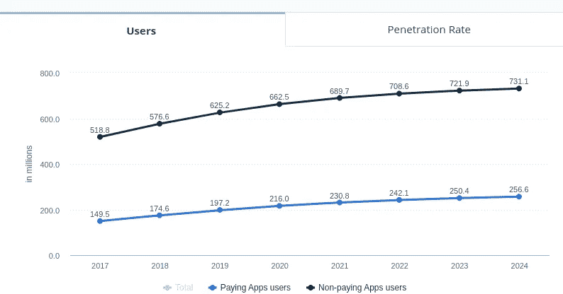
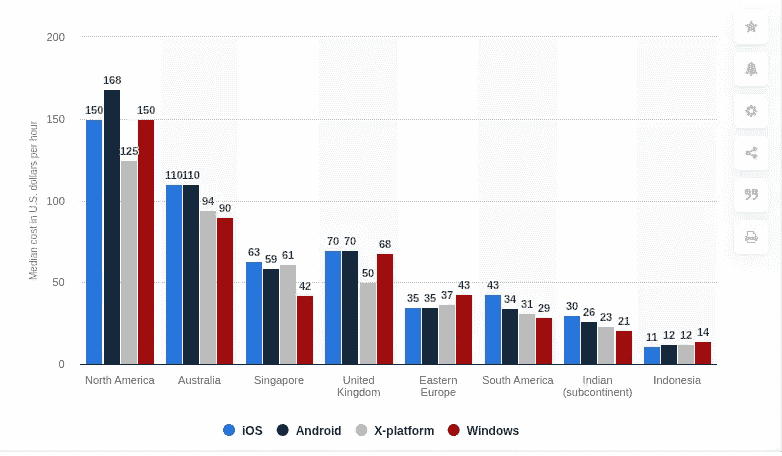

# 新冠肺炎疫情衰退:外包软件开发将如何帮助你在 2021 年生存？

> 原文：<https://medium.datadriveninvestor.com/covid-19-pandemic-recession-how-outsourcing-software-development-will-help-you-survive-in-2020-b6475a2a8850?source=collection_archive---------5----------------------->

## 你是否也感觉到新冠肺炎的经济衰退正在把所有的企业拖向萧条？如果是，那么让我们来看看外包软件开发如何帮助你在 2021 年的经济衰退中生存下来。

据 [**最新报道**](https://www.nytimes.com/2020/03/21/business/economy/coronavirus-recession.html) 报道，美国经济前景日益黯淡，数百万人失业，企业走向灭亡。毫无疑问，疫情冠状病毒的浪潮不仅锁定了门后的人，还在 2021 年推动经济日益下滑。

> 新冠肺炎给全球公司带来了严重的麻烦吗？

**让我们用一些数据和事实来发现经济的真实情况:**

> 据《经济时报》报道，很明显，今年世界经济将陷入衰退，预计新冠肺炎将造成数万亿美元的损失。
> 
> 来自 [THESTREET](https://www.thestreet.com/personal-finance/pandemic-recession-impact-small-businesses) 的预测，到 2020 年 6 月底，经济后果正在扼杀遍布美国的大约 3000 万家企业，预计将有 5900 万人失业。
> 
> 美国的季度 GDP 预计将放缓，直到 2021 年上半年才会复苏。
> 
> 由于新冠肺炎的爆发，摩根士丹利预测在接下来的六个月内，GDP 增长率将从 2.3%大幅下滑至 3.1%。

考虑到今天的经济现实和明天的预测事实，每个人都不得不相信新冠肺炎正在为 2020 年和 2021 年的所有规模的企业创造一个可怕的时代。

> *在这个充满挑战的时代，有一个核心问题困扰着每个人:* ***“如何在 2021 年这场不可避免的衰退中生存？”***

这是真的，疫情可以造成重大的经济损失，迫使人们呆在家里，另一方面，新冠肺炎给了那些已经站在迫在眉睫的衰退边缘的人明确的希望。所以，在 2020 年的衰退变成历史上最严重的衰退之前，是时候投资 [**应用程序开发公司**](https://www.xicom.biz/services/mobile-app-development/) 在 2021 年即将到来的衰退中生存下来了。

*嘿，坚持住！你不需要相信我的陈述。请看一些显示应用程序未来的统计数据。*

> 来自 Statista 的预测显示，2017 年移动应用用户下载了 1.789 亿个应用程序，预计到 2022 年将达到 2582 亿个。
> 
> 用户渗透率将从 2020 年的 11.8%上升到 2024 年的 12.8%。

***(Image Source:***[**https://www.statista.com/outlook/318/100/apps/worldwide#market-users**](https://www.statista.com/outlook/318/100/apps/worldwide#market-users)**)**

# **现在的中心问题是:2021 年软件开发如何帮助你？**

无论你提供什么样的服务或产品，你的企业的数字化存在将永远让你在激烈的竞争市场中领先一步。考虑到新冠肺炎目前的情况，企业已经迅速关闭，人们被关在门后，移动应用程序是满足他们日常需求的唯一希望。

因此，这是所有规模企业的最佳时机，包括初创公司、中小企业或企业，从零开始开发应用程序，或使用新兴技术升级您的旧应用程序，使其顺利运行。今天，数字化正在改变我们生活的每一个步骤，让人们不用离开舒适的家就可以使用语音命令从应用程序中购买任何东西，因此值得 [**雇佣应用程序开发人员**](https://www.xicom.biz/solutions/hire-developers/) 来为您的企业获得最佳应用程序。

大约有 27 亿智能手机用户和 90%的平均时间花在移动应用上，应用开发企业可以轻松征服市场，并能够抓住潜在的用户群。通过精心设计的应用程序，您可以将您的业务提升到一个新的水平，因为它为您提供了推广您的品牌的最佳平台。软件是一种工具，它使你能够识别并有效地征服这个每天都有数百万美元交易的市场。

## **现在你们中的许多人都在想，为什么经济衰退是投资软件开发的最佳时机？**

> 事实是，你的企业的数字化存在，尤其是在 2020 年不寻常的衰退期间(由于新冠肺炎)，将为你的企业增加竞争优势。其次，新冠肺炎等基本面问题导致的不可避免的低迷几乎不会影响数字品牌，因为一切都将在网上管理。因此，不存在突然宣布关闭工作场所的可能性。

# **创业公司如何通过外包 App 开发公司做好危机准备？**

Image by [Sebastian Herrmann](https://unsplash.com/@officestock) on [Unsplash](https://unsplash.com/)

对于任何公司来说，无论是它的初创公司还是亿万美元的公司，将他们的软件开发需求外包给软件开发公司都是最具挑战性的任务之一。然而，随着最好的软件公司的出现，推出吸引人的应用程序对企业来说变得简单了。

> 然而，现在的问题是“在 2020 年令人心痛的经济衰退期间，[雇佣移动应用开发者](https://www.xicom.biz/offerings/hire-mobile-developers/)是否是一个好决定”？

许多公司认为减少工资或员工数量是应对经济衰退的唯一办法。然而，事实之事是外包 [**软件开发公司**](https://www.xicom.biz/) 正完美的解决了这里的问题。

将您的软件开发需求外包给合适的公司将为您提供灵活性和效率，以获得适合您业务的最佳解决方案，而不会造成雇用内部开发团队的任何负担。

# **衰退中外包的优势**

Image by [Sebastian Herrmann](https://unsplash.com/@officestock) on [Unsplash](https://unsplash.com/)

让我们来看看在恶劣的商业环境中脱颖而出的好处:

## **1。以较低的成本获得突出显示**

与其雇用昂贵的内部 it 团队或安排培训课程来提高他们的开发技能，不如寻找价格更低的外包服务。

**(Image Source:** [**https://www.statista.com/statistics/628636/worldwide-mobile-app-development-costs-by-region-by-platform/**](https://www.statista.com/statistics/628636/worldwide-mobile-app-development-costs-by-region-by-platform/)**)**

根据 [Statista](https://www.statista.com/statistics/628636/worldwide-mobile-app-development-costs-by-region-by-platform/) 的数据，北美 iOS/Android 应用开发者的最高平均时薪为 150 美元/168 美元，而印度尼西亚和迪拜最低；开发者每小时的最低价格是 10-25 美元。

## **2。应用开发时间更短，上市速度更快**

当谈到应用程序开发时，你的应用程序启动时间很重要，可以让你实时锁定正确的受众。此外，外包公司由高专业知识和经验丰富的开发人员支持，他们随时准备在开发过程的任何阶段支持业务。

无论你是想从头开始开发一个应用程序，还是想让他们按原样执行你的应用程序想法，他们都有可能处理任何级别的应用程序开发项目，并确保在严格的期限内交付成熟的产品。

## **3。留给员工的工作量减少**

在经济衰退期间，公司通常采取的第一步是减少工作场所的人数，所以很明显，额外的工作被分配给了现有的员工，这导致了压力和额外的负担。在这种情况下，外包是避免给员工额外压力的完美解决方案。雇用外包团队将始终为您提供最佳结果。

## **4。节省软件开发预算**

即使在经济衰退期间，仅仅通过外包熟练的开发人员团队也有节省软件开发成本的空间。内部应用程序开发的成本会阻碍投资者投资于应用程序开发，但将项目外包给软件开发公司将为您提供一个具有成本效益的开发方案。

> [据统计](https://www.statista.com/statistics/189788/global-outsourcing-market-size/)，全球外包服务市场规模已经达到 925 亿美元，并且该数据还将逐年增加。

外包的 [**移动应用开发公司**](https://www.xicom.biz/services/mobile-app-development/) 拥有业内最优秀的开发人员作为后盾，并配备了所有最新的开发工具，因此投资者可以立即将任务分配给外包团队，而无需投资于内部 it 团队。

## **5。简化的软件开发流程**

在衰退期，规划出正确的策略，用更少的开发人员开发一个应用程序，是开发人员的艰巨任务之一。当您将项目需求提交给专门的开发机构时，您可以获得精心规划的开发流程和应用程序开发经验。在一个优秀的开发团队的支持下，战略团队遵循敏捷开发方法，以确保您及时交付项目。

如果你被说服为你的企业开发一个应用程序，但不知道从哪里开始，以及如何选择美国最好的外包软件开发公司，那么进一步阅读解锁提示。

# **2020 年聘请最佳外包软件开发公司的建议**

如果你是一个总是依赖内部团队来满足所有业务需求的人，那么你一定想知道在哪里可以找到最好的软件开发公司来雇佣最好的开发团队。让我们在有限的预算下，让你更容易 [**雇佣 app 开发者**](https://www.xicom.biz/solutions/hire-developers/) 来满足你的开发需求。

> **为你的项目雇佣软件开发人员的步骤:**

## **1。做足够的研究**

虽然点击搜索引擎上建议的第一个选项很有诱惑力，但是要花更多的时间做一些研究。浏览互联网，阅读评论，要求当地推荐，检查知名平台上的个人资料，包括 Goodfirms、Clutch 等，以确保你与正确的公司合作。

## **2。入围并向几家公司提问**

一旦你完成了调查，列出至少三家领先的软件开发公司。你可以通过安排电话和提问来开始了解每家公司。如果是一家离岸 app 开发公司，那么安排一次视频通话，与团队进行项目的详细讨论是最理想的。

但是，在进行视频通话之前，请确保您准备好了要讨论的问题，包括他们将部署什么技术、完成项目需要多长时间、成本等。

问这些问题以确定它们是否符合你的需求是至关重要的。

## **3。检查文件夹，了解他们的工作性质**

毫无疑问，对企业家来说，重要的是确定他们承担了什么样的项目，为什么客户工作过。作品集可以让你详细了解他们采用了什么类型的工作策略，他们的工作性质是什么。该公司的投资组合将让你了解该公司的潜力，并帮助你了解他们是否会满足你的未来需求。

## **4。交叉检查客户的审查**

交叉检查客户对任何公司的评论的最佳方式，我们建议您访问 Goodfirms、Clutch 等知名平台以达成交易。

# **结尾注释:**

在这篇文章的最后，值得告诉你的是，在这次严重的经济衰退中，只有最强大和最聪明的企业才能在 2020 年的衰退中生存下来。

此外，很难预测 2020 年的衰退在未来几天或几个月会是什么样的，但提前准备好最佳解决方案是你在这场衰退中生存下来的唯一明智之举。

为了最大限度地降低您的业务在未来关闭的风险，现在正是利用网络或 [**移动应用程序开发公司**](https://www.xicom.biz/services/mobile-app-development/) 将您的业务模式货币化以成功征服未来市场的最佳时机。