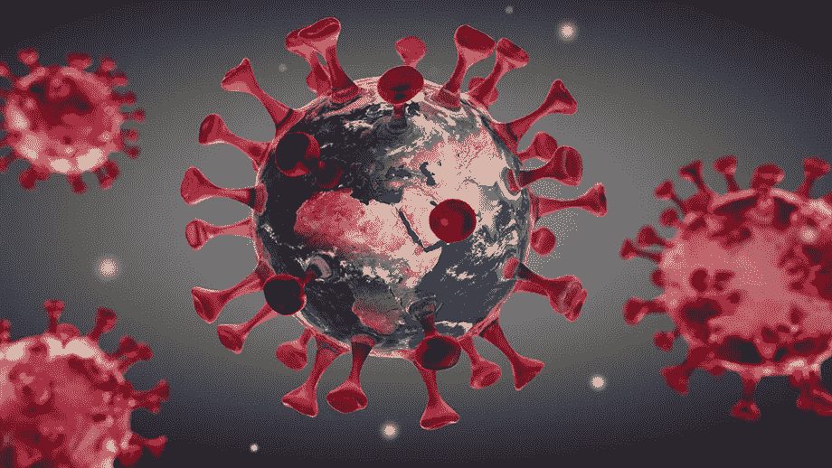

# 新冠肺炎:硬币的两面

> 原文：<https://medium.datadriveninvestor.com/covid-19-two-sides-of-a-coin-4e5919c48806?source=collection_archive---------15----------------------->

**The Coronavirus Copyright:** ©peterschreiber.media — stock.adobe.com

一种不知从哪里冒出来的疾病，让大众陷入恐慌，引起了全球的关注。但是，让我们黯然失色的乌云中有什么一线希望吗？我们能从这场流行病中得到什么好处吗？

从本质上讲，新冠肺炎有两个方面，或通常被称为冠状病毒。如果你不知道，这种疾病是最近爆发的，据信来自中国武汉。这是一种呼吸道疾病，攻击受害者的肺部和喉咙，可导致长达 14 天的感染。人们对这种疾病知之甚少，几乎可以肯定，在短期内，这种疾病对世界是一种威胁。但是从长远来看，它能帮助这个世界吗？

 [## 医疗保健的未来正在被一场大型技术入侵所塑造|数据驱动型投资者

### 过去十年，全球经济的所有部门都经历了大规模的数字颠覆，而卫生部门现在…

www.datadriveninvestor.com](https://www.datadriveninvestor.com/2018/11/02/the-future-of-healthcare-is-being-shaped-by-a-big-tech-invasion/) 

# **坏的一面**

不言而喻，这种疾病像任何疾病一样，会有不好的一面。基本上有两件事会对地球产生负面影响:

**1:群体感染**

正如英国首席医疗官克里斯·惠蒂教授所说，最糟糕的情况是英国 80%的人将受到影响。鉴于英国目前的人口为 6644 万，这相当于超过 5000 万人。根据世界卫生组织或世卫组织的数据，这些**中的 3.4%可能会死于这种病毒——仍然有大约 170 万人。当然，还没有报告轻微的病毒病例，这可能意味着死亡率明显低于显示的数字，但仍然是一个令人不安的数字。**

2:经济崩溃

经济不可避免地会受到影响。我们已经可以看到这种情况在病毒的早期阶段发生，美国采取措施通过每次暂停交易 15 分钟来阻止崩溃。随着学校、办公室和除了基本商店之外的所有商店关闭，整个度假行业陷入困境，大量收入将无法获得，从而降低了该国的整体 GDP。这已经可以在中国看到，那里已经出现了大规模的下跌。

还有更多问题，如大规模隔离等。，但最重要的是死亡和金钱的损失。

# **好的一面**

正如一句名言所说，每片乌云都有一线光明，乌云越暗，一线光明。发生的每件事都有好的一面，从长远来看，肯定有 3 个主要的好因素:

**1:利用家庭资源更好地工作**

随着案例的增加，越来越多的资源被提供给计划在家工作的人。这些包括基于网络的会议、直接连接到办公室网络的在线 VPN 等。从长远来看，这些想法有助于在家工作，这意味着更多办公室的更多人将能够在家工作。尽管这看起来像是一个让人们变得更懒、更享受家庭舒适的机会，但这实际上意味着，尽管感冒或流感，但通常每天都来上班的工作狂们能够休假，而不会将他们的任何疾病传播到他们的大学。这也意味着他们不太可能聚集他们的症状，更容易生病

“在家学习”的(可能)介绍？

今天，世界上不存在这样的想法——如果当学生生病时，学校必须允许他们在生病期间在家休息，并在他们回到学校时给他们压力，让他们补上大量的功课。此外，由于人们更容易生病，他们有时不得不在生病的情况下来学校，因为他们的出勤率可能很低。心理健康也是一大因素。特别是在中学高年级(11 年级以上)，学生的压力会变得无法忍受。然而，很少有学校能够接受这一合理的借口，这意味着压力增加，这是一件非常危险的事情。随着学校可能被锁定，我们可以开始看到一个选择，在家里做你的功课，让更多的选择留在家里自满

**3:长期免疫**

诚然，感染病毒并不是最令人愉快的情况，但从长远来看，它会有所帮助。像所有病毒和疾病一样，冠状病毒可能会进化成更具威胁性的东西，尽管目前死亡率相对较低，但它可能会飙升。现在就抓住病毒，在病毒还很弱的时候就抓住它，可以防止我们受到更危险的病毒的影响。

冠状病毒真的是一枚硬币的两面，尽管目前形势看起来相当暗淡，但谁知道呢？这可能真的是历史书上的一个转折点。