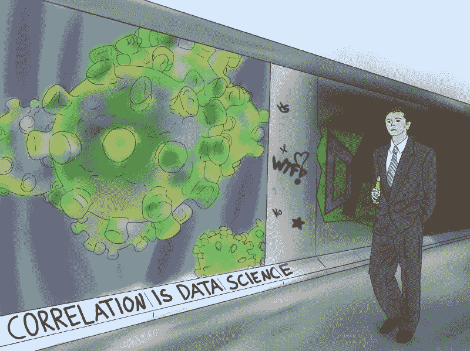
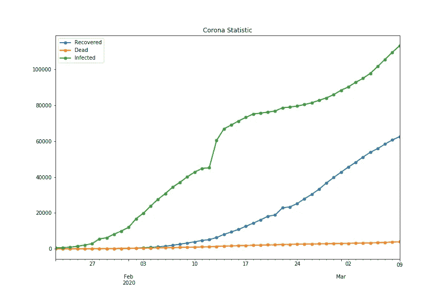
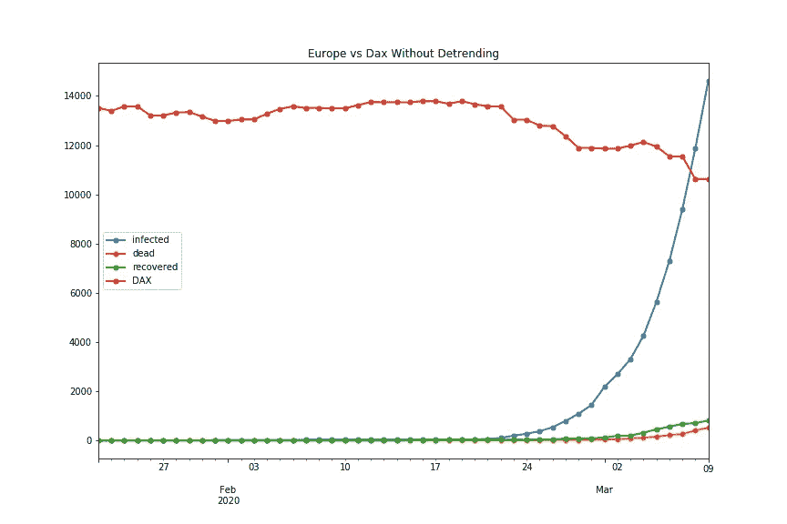
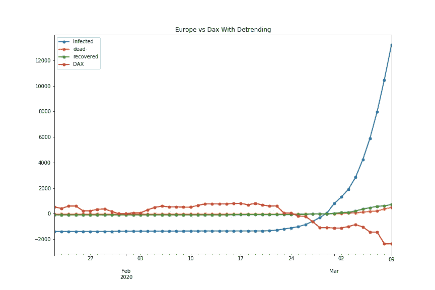
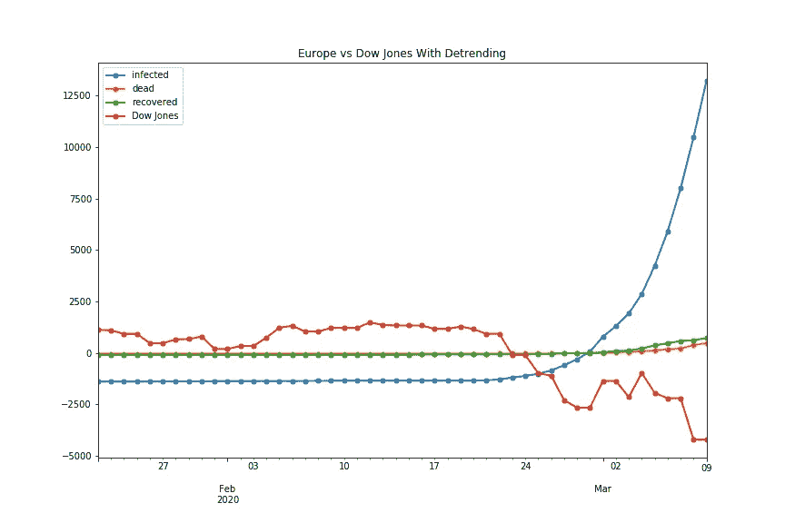

# COVID 19 与股票市场——数据科学视角

> 原文：<https://medium.datadriveninvestor.com/covid-19-vs-the-stock-market-a-data-science-perspective-d2f3618b6a61?source=collection_archive---------7----------------------->

Picture by Hannah Schieber

数据同样美丽而可怕。几个月前，冠状病毒向世界展示了它丑陋的一面，随之而来的是对被感染的恐惧。病毒爆发的后果是股票市场出现了大规模的负面趋势。

在本文中，我想向您展示感染和死亡人数的上升对区域股票市场的影响及其数据科学的局限性。因此，我采用了一些关于感染人数、康复人数和死亡人数的历史数据。

Current course of infection

感染、死亡和康复人数最多的是亚洲，截至 3 月 10 日，欧洲有 14.612 人感染，北美有 708 人，亚洲有 96.931 人感染。现在，我根据非洲大陆分离数据，以调查对当地股市的影响。

# **欧洲 vs DAX**

我们考察的第一个大陆是欧洲，因为我住在那里:)。现在我们想比较一下 Corona-Infected 的上升和 DAX 的走势，DAX 是世界上最大的股市指数之一:

当感染率上升时，我们已经可以看到一个小的下降趋势。但是我们当然要用数学来证明这一点！因此，我使用皮尔逊系数，它是一个相关系数，用来衡量区间内两个特征之间的线性相关程度。系数介于-1 和 1 之间，**其中-1 表示负线性相关，+1 表示正线性相关。如果我们的数据没有相关性，系数将为零**，我们将知道它们互不影响。请记住，皮尔逊系数不能映射非线性相关性，因此它不适用于每种类型的相关性。

 [## 成为数据科学家所需的 8 项技能|数据驱动型投资者

### 数字吓不倒你？没有什么比一张漂亮的 excel 表更令人满意的了？你会说几种语言…

www.datadriveninvestor.com](https://www.datadriveninvestor.com/2019/02/07/8-skills-you-need-to-become-a-data-scientist/) 

DAX 指数和我们不断上升的感染人数之间的相关的皮尔逊系数是:-0.852，因此我们必须假设这两个发展之间的高度相关性。

这种相关系数的一个问题是，如果两个数据集中的趋势都存在，则总是会有较高的正系数或负系数，因此我们执行去趋势。在我们的设置中，我只是减去了每个数据集的所有数据点的平均值:

去趋势后，再次计算相关系数，结果仍然是-0.852。

# **美国 vs 道琼斯**

对于美国股票市场，我使用道琼斯指数作为指数，只使用北美的科罗纳案例。我已经消除了趋势，正如我们可以看到的，当第一个案例出现时，道琼斯的反应非常消极。皮尔逊系数为-0.804，表明数据集之间也有很高的相关性。这非常有趣，因为美国的感染率远低于欧洲，所以美国人对较低的感染率反应强烈得多。

# **亚洲 vs 日经**

日经 225 指数是亚洲最重要的股票市场指数之一，在东京证券交易所交易。如果我们现在像以前一样比较结果，我们观察到对日经指数的影响相对较低，正如你在图中看到的。

还有，我们的皮尔逊系数比以前低了，-0.647。显然，亚洲市场对这种疾病的传播并没有那么消极。我还用 DAX 指数和道琼斯指数测试了亚洲的感染人数，但这两个市场的系数甚至更低。日经指数目前的下跌趋势似乎是对 DAX 和道琼斯指数下跌趋势的反应。

# **欧洲 vs 道琼斯**

通过之前的测试得到启发，我想知道欧洲爆发的电晕对道琼斯的影响有多强。我们再次将欧洲的感染人数与道琼斯指数进行比较，然后罢工。我们与-0.796 有很高的相关性，正如你在下图中看到的，一旦感染人数上升，道琼斯指数就会下跌。

# **相关性并不意味着因果关系**

上面我们有一些很好的图表和系数来证实假设:日冕对股票市场有巨大的影响。但正如许多书籍和文章中提到的，相关性并不意味着因果关系。正如过去几天所证明的那样，我们的熊市不仅受到威胁性电晕爆发的影响，还受到严重的石油危机和回购操作减少的影响。自从欧洲和美国的首次感染以来，道琼斯指数下跌了 17%以上，DAX 指数下跌了 20%以上。目前，我们正滑向一场新的金融危机，我希望这不会发生。未来的另一个想法是将股票市场的进程与以前的疾病爆发进行比较，以预测市场上疾病爆发的风险。

感谢您的阅读。

声明:这不是一个财务建议，你因为这篇文章所做的每一个财务操作都是你自己承担风险。