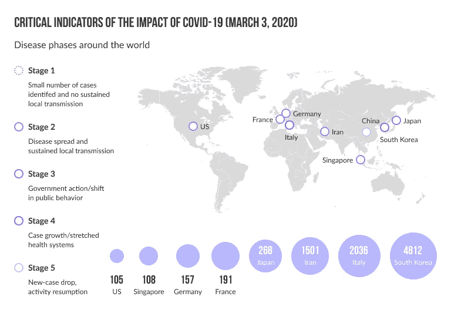
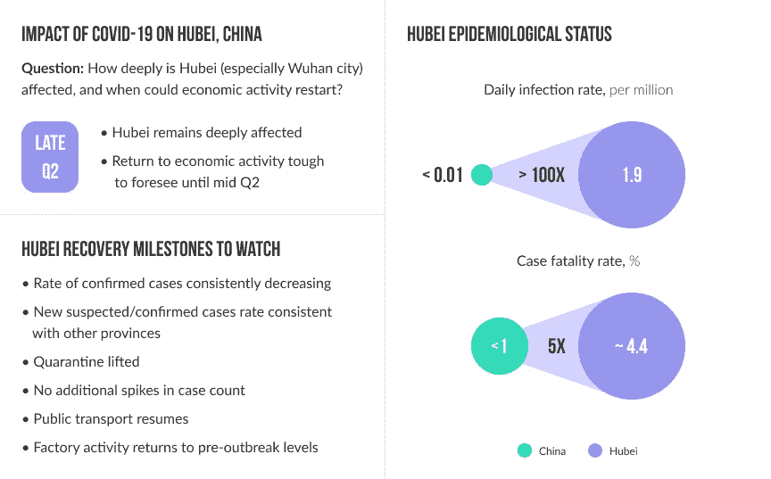
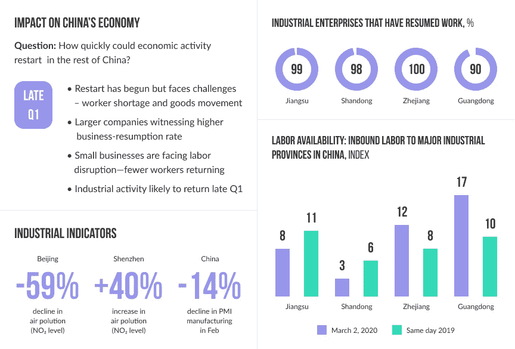
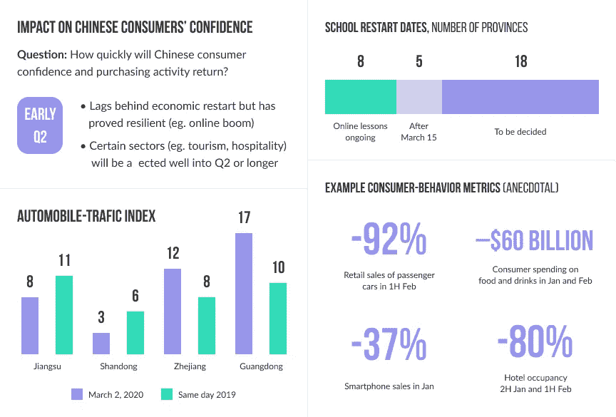

# 新冠肺炎。谁将真正受害？

> 原文：<https://medium.datadriveninvestor.com/covid-19-who-will-actually-suffer-6fb0e62a6beb?source=collection_archive---------19----------------------->

Geniusee 团队决定撰写这篇文章，为商业领袖提供对新冠肺炎局势发展的理解，以及等待他们的是什么。这种病毒突然出现并迅速传播，我们将要谈论的一些观点可能会很快过时。

对新冠肺炎引发经济危机的担忧正在增长。爱沙尼亚已经表示，它已经进入危机阶段。其他国家意识到经济危机和重组就在他们的门口。未来损失的大小取决于疫情会持续多久。

# 三种情况

正如任何预测所预期的那样，我们模拟了三种情况:乐观、可信和悲观。下面就来分别说一下。

根据第一条**乐观的一条**，其他国家的疫情控制将会像中国一样迅速建立起来。正在记录新的病例，但成年人继续去工作，儿童也继续去上学。在这种情况下，全球经济可能主要局限于中国的损失——其 GDP 增长可能从 6%放缓至 4.7%，全球 GDP 可能从之前预测的 2.5%降至 2%。与此同时，中国可能会在 2021 年第一季度末恢复大部分生产。

 [## 另一场精心策划的全球经济危机正在逼近？如果我们的数据经济可以帮助它|数据…

### 我们的 DApp 的开发，称为 DECENTR，目前正与我们的 R&D 同步进行，作为我们即将到来的…

www.datadriveninvestor.com](https://www.datadriveninvestor.com/2019/03/06/another-engineered-global-economic-crisis-looming-not-if-our-data-economy-can-help-it/) 

在第二种情况下，一种更为**可信的情况是**目前，全球增长将放缓，因为遇到冠状病毒的国家无法像中国那样快速控制其传播。根据这种情况，中小企业和发展中国家作为一个整体将感受到更大的压力。航空和旅游公司将错过夏季假期的开始。但到了 5 月至 6 月，病毒将会消失，需求将会恢复。油价将承压至第三季度。世界经济增长将放缓至 1-1.5%。

这两种情况都表明冠状病毒是季节性的，这仍然不能确定。如果随着北半球春天的到来，病毒继续积极传播，全球经济衰退将开始。全年都会感受到。这是第三个**场景，也是最糟糕的一个。**在这种情况下，全球 GDP 增长将放缓至 1.5-0.5%。

能够更好地应对干扰的公司通常会成功，因为他们投资于核心客户群，并预测他们的行为。

# 供应问题

毫无疑问，应该专门解决供应链问题。分析师表示，中国爆发的病毒对其生产的影响对欧洲经济产生了放缓效应。尽管许多中国工厂已经恢复生产，并且自 3 月初以来一直以超过 90%的产能运行，但其他依赖中国进口的公司现在才面临后果。他们正经历着平均 8-10 天的交货延迟，并且需求恢复的时间和规模的不可预测性非常高。

# 如何对新冠肺炎做出反应的 7 个技巧

**1。保护员工。**提供关于冠状病毒的明确信息，并为当地管理人员提供自主权，以快速准确地应对变化。

**2。创建一个跨职能的响应团队**，该团队将在冠状病毒传播的背景下监控员工的状况、公司的财务状况、供应链、营销和沟通。速度很重要:每个小组都为接下来的 48 小时设定了具体的目标。

**3。确保你有足够的流动性(财务压力测试和应急计划)。**公司必须在这三种情景中的每一种情景下建立财务表现模型，并找出可能显著降低流动性的触发因素。

**4。稳定供应链。**当某些产品开始囤积时，防止消费者需求增加。

**5。贴近你的顾客。那些预测客户行为的公司会更好地容忍失败。例如，在中国，当人们被告知要自我隔离时，网上购物、食品和杂货配送都有所增长。投资在线交付现在似乎是一个双赢的商业选择。**

即时稳定(库存计划、近期价格变化、折扣)

中长期稳定(对长期增长的优先领域的投资和微观目标)

**为不同的场景制定计划**和行为，并遵照执行。

**应对挑战。**企业应该记住自己是社区的一部分。准备好用金钱、设备和专业知识来支持人们。有些公司已经转而生产医用口罩和服装，因为这是必要的。

来源:美国消费者新闻与商业频道；经济学家；埃及航空公司；国际航空运输协会；约翰霍普金斯系统科学与工程中心；纽约时报；OAG 全球航空；路透社；世界卫生组织情况报告。

来源:百度千玺；疾病控制中心；哥伦比亚大学；经济学家；埃及航空公司；雅加达邮报；约翰霍普金斯系统科学与工程中心；伦敦卫生和热带医学学院；中国国家统计局；纽约时报；OAG 全球航空；经济合作发展组织；北京大学汇丰商学院；路透社；TomTom Traš指数；世界卫生组织情况报告；西安交通大学；麦肯锡全球研究所

新冠肺炎危机是一个结局未知的故事，它可能的结局在很大程度上取决于我们每个人如何行动。所以照顾好你爱的人和你的生意。

你可以在这里获得更多信息。

*最初发表于*[T5【https://geniusee.com】](https://geniusee.com/single-blog/covid-19-who-will-actually-suffer)*。*