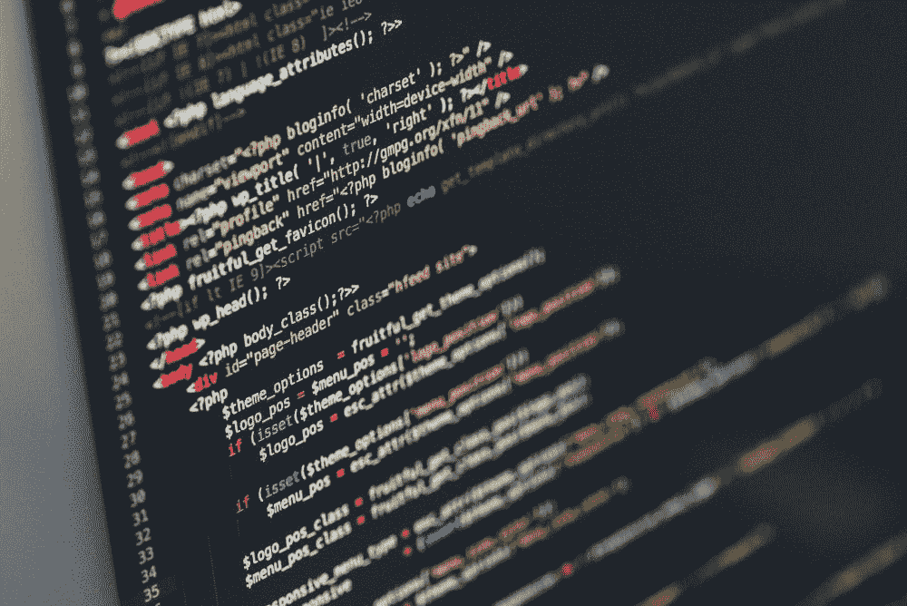

# 新冠肺炎将改变我们的生活方式

> 原文：<https://medium.datadriveninvestor.com/covid-19-will-change-the-way-we-live-our-lives-4a4febf7fb48?source=collection_archive---------5----------------------->

这个新冠肺炎·疫情继续对全世界的每个人产生巨大的影响。这种疫情的一些影响是，许多人因为被这种疾病感染而失去生命，大医院已经达到了它们的最大能力，导致其他需要立即医疗护理的人得不到他们需要的适当医疗，因为医院不能分配足够的工作人员来容纳病人， 因为没有顾客购买他们的产品和服务，企业正在迅速亏损，因为企业试图省钱，人们正在失业，这种无情的疾病带来了更多悲惨的后果。

 [## 冠状病毒；惊慌失措；字里行间的 z |数据驱动的投资者

### 围绕冠状病毒的话题；更准确地说，新冠肺炎几乎占据了整个新闻预报的头条…

www.datadriveninvestor.com](https://www.datadriveninvestor.com/2020/03/23/coronavirus-a-to-panic-z-between-the-lines/) 

在陈述了我们目前面临的一些问题后，我认为有几件事迟早会发生，以防止类似疫情的大规模撞击再次发生:

## 公司将推动他们的业务数字化

公司将大力投资于技术，以及技术如何改善和自动化他们的业务，以及技术如何帮助他们的员工远程工作。

## 对 IT 人才的需求将会进一步增加

关于我提到的第一点，我认为对 IT 专业人员的需求将会进一步增加，因为每个行业现在都意识到尽可能远程工作以继续业务运营的重要性。

## 将在健康方面进行大量投资

人民和政府肯定会在卫生和医药方面投入大量资金，努力防止像这样的疫情事件再次发生。

此外，我认为一定的健康指导方针和新的法律将会出台，以防止像这样的疫情再次发生。

## 科技巨头将在其产品中加入健康相关的功能

苹果、谷歌、华为、小米等科技巨头将在产品中加入更多与健康相关的功能，因为他们知道人们比以往任何时候都更加渴望健康和健身信息。

## 各国将会把他们的文化变得更好

我也认为一些国家，如果不是所有的国家，会根据我们目前在疫情经历的改变他们的文化。人们将开始改变他们的饮食，我认为人们也会远离外来食物，因为害怕吃外来动物会感染另一种致命的疾病。

让我知道你是否同意我的观点，让我知道你是否有更多关于这个话题的信息。如果你喜欢这篇文章，请务必在 [Jan Almazora](https://medium.com/u/c74bb2ab0a0f?source=post_page-----4a4febf7fb48--------------------------------) 关注我。