# 新冠肺炎的指数增长:

> 原文：<https://medium.datadriveninvestor.com/covid-19s-exponential-growth-5e5b6d044752?source=collection_archive---------5----------------------->

# 恐慌，还是不恐慌，这是一个问题

在加拿大-美国边境关闭之后，我想知道:

> 这些措施是否过于极端？

我从一月初就开始关注这种疾病，并见证了社会从“这只是流感”到“买你能找到的每一平方的卫生纸。”

这里的目标是探索我们在当前新冠肺炎疫情流行病学曲线上的位置。我用一条 S 形曲线来模拟疫情，以显示病例的指数增长和下降。我将该模型应用于国际地区以及我的祖国加拿大。

结论呢？如果我们不认真对待，这是相当严重的。

# 快速入门

Exponential Growth

对于每一个感染新冠肺炎病毒的人，他们会感染大约 2-4 个其他人，这些人会继续感染另外 2-4 个人，等等。这种指数增长开始时很慢，但在短时间内迅速上升到疫情。然而，在自然界中，由于人口饱和或群体免疫的发展，会有有限数量的人被感染。因此，我选择使用一条 S 形曲线，它有一个指数起点，但最终随着疾病在人群中传播而饱和。

SIR 模型是一种经典的流行病学分室建模技术([起源于 1927](https://en.wikipedia.org/wiki/Kermack%E2%80%93McKendrick_theory) )，用于理解流行病期间的疾病传播。每个人要么对这种疾病易感，目前具有传染性，要么已经恢复免疫力，不能再感染其他人(注意这包括已经死亡的人)。

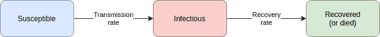

SIR compartmental model (Susceptible, Infectious, Recovered)

快速浏览一下数学，我已经用一系列微分方程来表示这个模型，这些微分方程与自第一次爆发以来的天数有关。

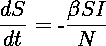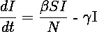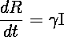

其中:
***S(t)***:*易感人数
***I(t)*** :感染人数
***R(t)*** :已痊愈或死亡人数
***N*** :总人口*

* [## 机器学习的外汇交易挑战|数据驱动的投资者

### 机器学习是人工智能的一个分支，之前占据了很多头条。人们是…

www.datadriveninvestor.com](https://www.datadriveninvestor.com/2019/02/18/the-challenge-of-forex-trading-for-machine-learning/) 

最后，另一个需要注意的重要指标是 ***R 零*** (又名**基本再生数**)。该值表示从单个案例直接生成的案例数。在撰写本文时，COVD-19 的基本再生数估计为 1.4 至 3.9 之间的**。**

**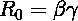**

**绘制出理论曲线，你可以得到一个类似这样的图表:**

**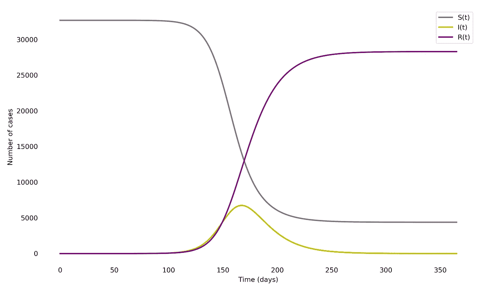**

**The theoretical graph S(t): number of individuals susceptible to the disease, I(t): number of individuals currently infectious, R(t): number of individuals that have recovered with immunity or have died.**

**如果我们专注于曲线 I(t)(那些积极传染的人)，我们可以看到它有一个峰值体积，然后逐渐变小。**

**通过研究*(它可以受到政策、疫苗接种、限制传播等外部因素的影响)我们得到了一个你可能已经看过的图表，进一步解释了社会距离和“拉平曲线”的重要性***

***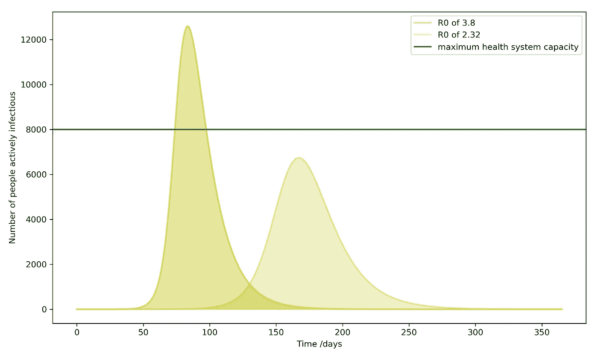***

***Graphical representation of “flattening the curve.”***

***不过我跑题了我要重点说的是下面的关系:***

***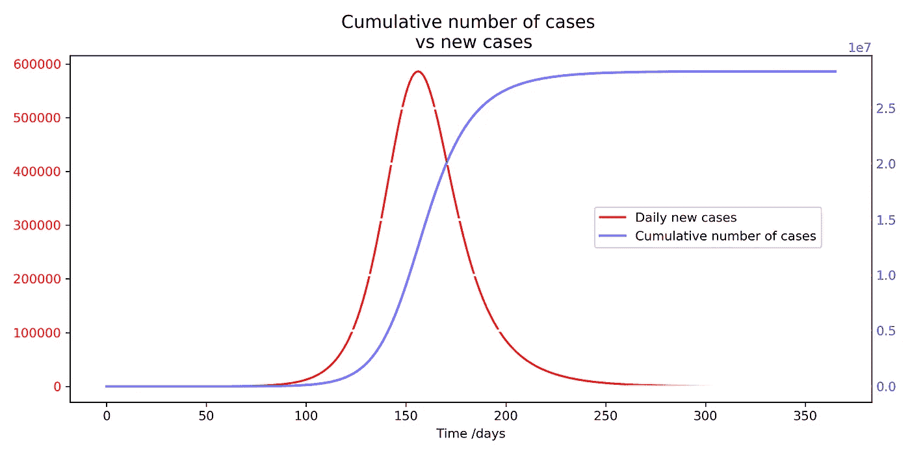***

***Theoretical representation of disease growth and saturation***

***蓝色曲线是累计病例数(上图中“当前感染”和“免疫恢复或死亡”的总和)。我们可以把它看作是感染这种疾病的人数。注意它是如何做出**s 形图案**的。***

***红色曲线是每天新病例的数量(即，s 形曲线的导数，因为我们都是书呆子)。**目标是了解每个国家/地区在红色曲线上的位置，以便预测该国家/地区的总病例数。*****

# ***看看实际的数据***

***从全球确诊病例数开始。在撰写本文时，我们有近 20 万个案例。***

***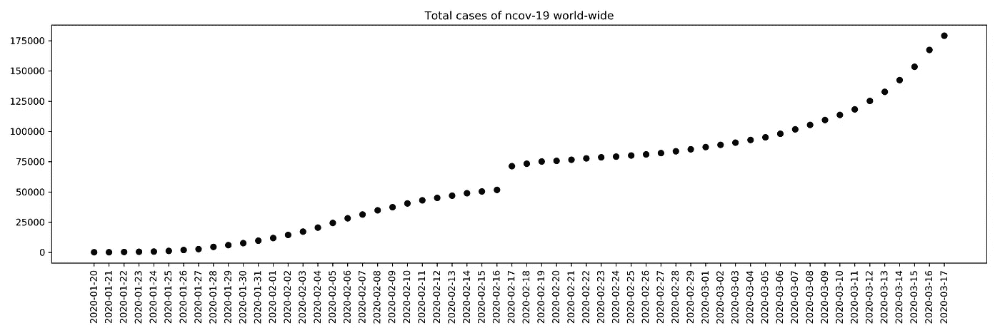***

***Total confirmed cases of COVID-19***

***将中国的情况与世界其他国家的情况区分开来:***

***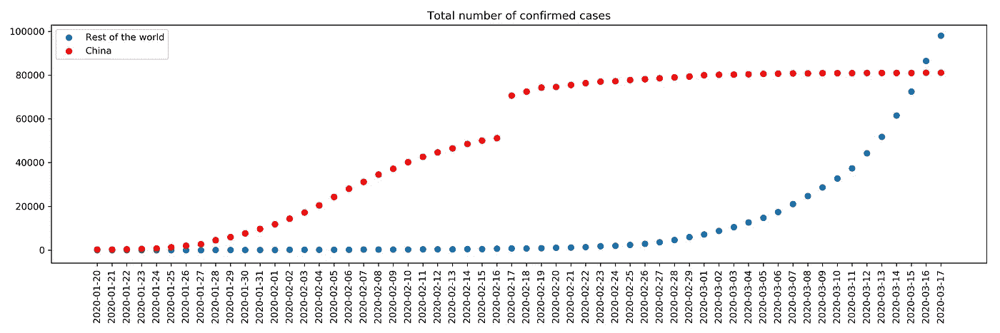***

***Total confirmed cases of COVID-19\. Separating China (red) and the rest of the world (blue). Notice how March 16, 2020, was the first date where the volume of cases in China was less than that of the rest of the world combined***

***你可以开始看到，中国的案例开始形成一个 s 形模式，而世界其它地区仍处于指数轨迹。***

***在对每个国家进行分析时出现的一个明显问题是，数据完全依赖于该国的报告。例如，当美国选择退出检测时，我们的数据显示不再有任何新的病例。或者，如果中国决定实施严厉的措施来遏制这种传播，那么我们将会看到大量报告病例的涌入。***

***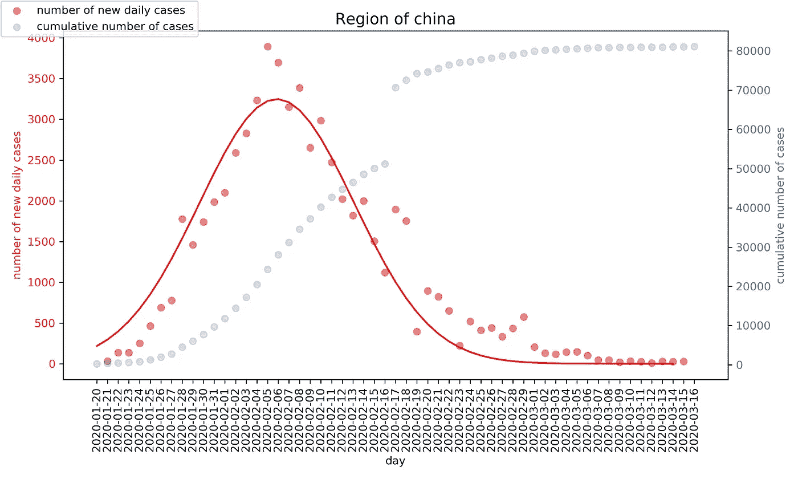***

***A cumulative number of cases in China overlaid with the number of new daily cases in China. The massive increase on Feb 17th was deemed an outlier and thus removed.***

***为了尝试抵消这些不规则性，我按地区汇总了这些国家，并绘制了它们各自的轨迹:***

***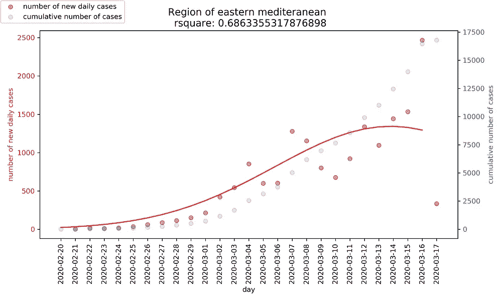******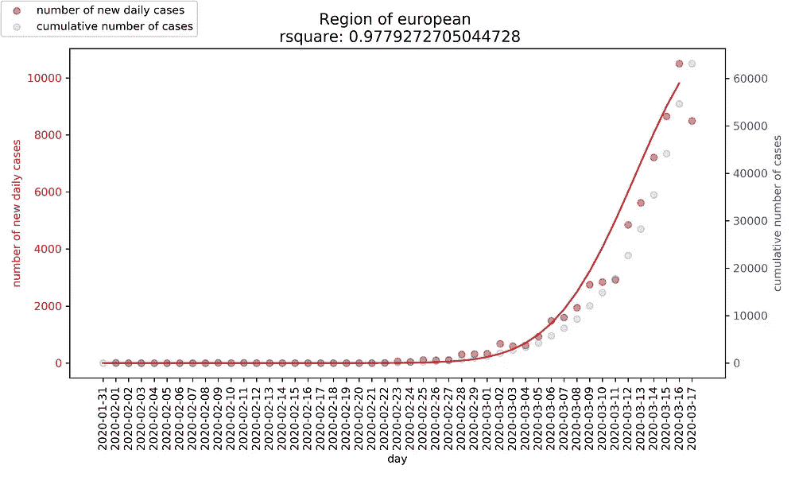******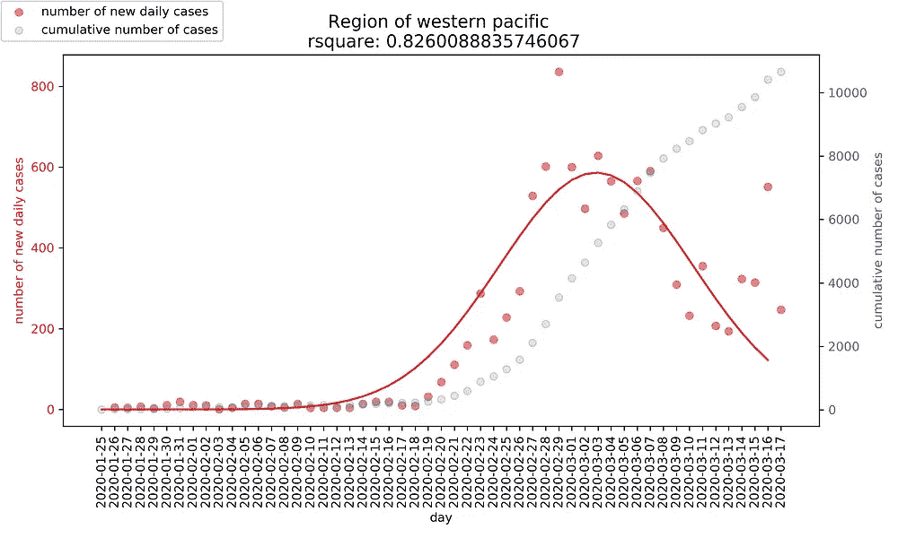************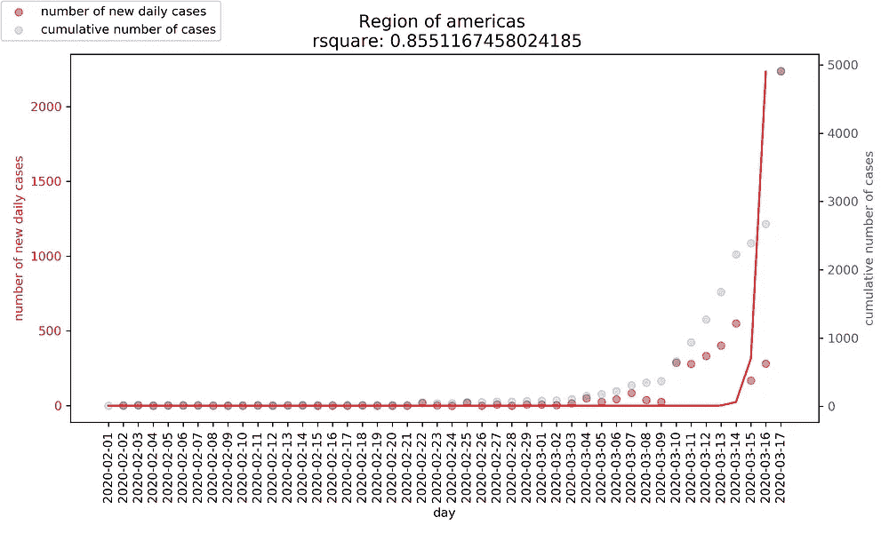******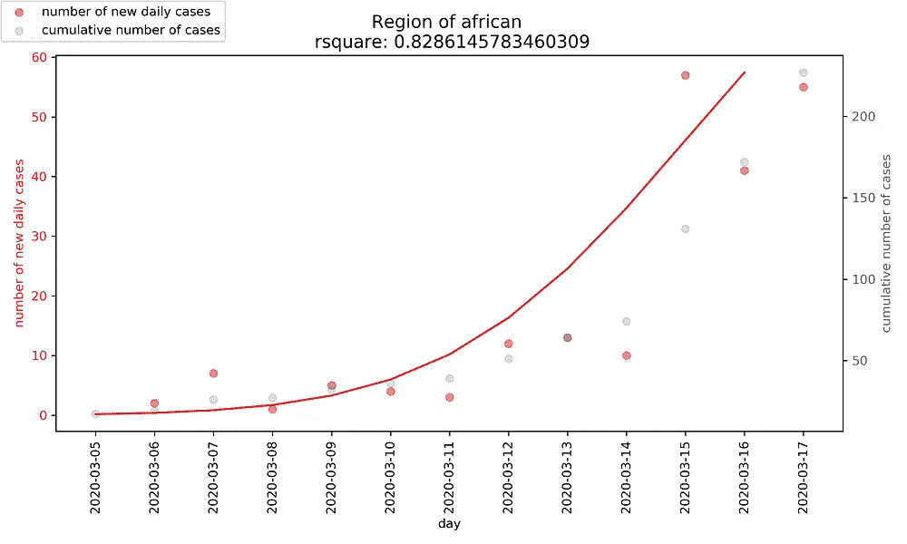***

***这里有很多有趣的见解。我不会对每个地区进行评论，但我会强调我认为值得注意的地方。***

*   ***欧洲地区仍在增长，但最新数据显示他们将很快达到每日新增病例的峰值。他们的累计数量可能会超过 100，000 起。***
*   ***西太平洋地区的传播速度似乎已经放缓，预计将稳定在累计 2 万例以下。***
*   ***美国**地区**的数据完全不可用，主要是因为美国连续几天报告了 0 例新病例(可能是由于缺乏检测)。***

# ***笑点是***

***在加拿大，我试图看看我们国家的命运会是什么样子。在撰写本文时，看起来我们正处于指数增长的开端，病例数量即将开始增加。***

***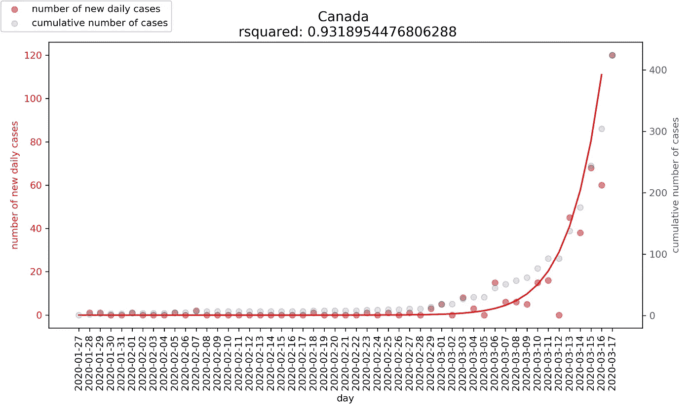***

***通过对我们的红色曲线进行积分，我们得到了累计总案例的预测:***

***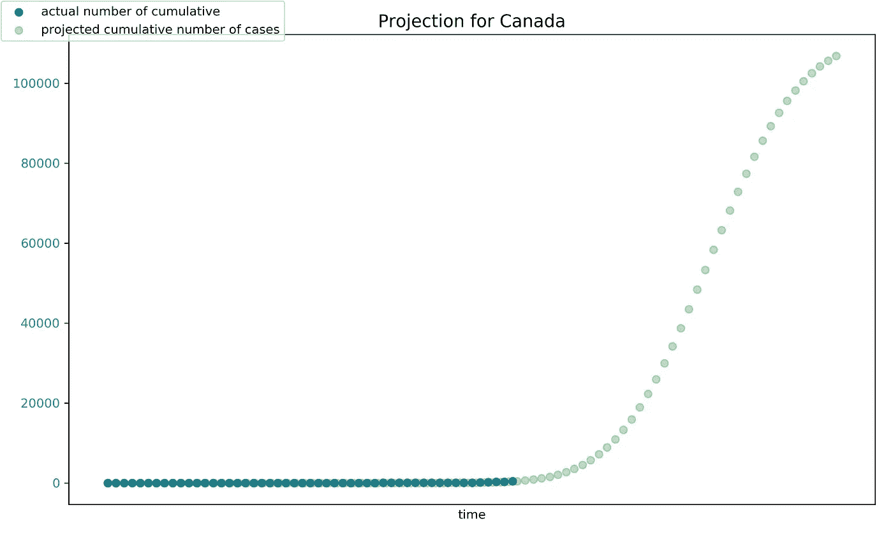***

***根据我的模型，预计累计总数是**预计超过 10 万人**。请记住，如果我们不实施任何变更，这是预计的数字**。*****

***作为一个健全的检查，目前中国病例的累计总数不到 9 万人。凭直觉，加拿大这个人口密度低几个数量级、有更多时间为疫情做准备的国家，似乎不太可能有更高的累积计数。***

***截至本周，加拿大多个省份已经发布紧急状态，限制国际旅行，并限制边境到我们可爱的南方邻居。***

***我将关注并支持我们的国家，看看我们是否能拉平这条曲线，远离这个令人生畏的计划。***

***—***

***数据来源:
[https://www . who . int/emergencies/diseases/novel-coronavirus-2019/situation-reports](https://www.who.int/emergencies/diseases/novel-coronavirus-2019/situation-reports)***

***完整代码:
[https://github . com/ericphamhung/新冠肺炎/blob/master/Main-ncov . ipynb](https://github.com/ericphamhung/covid-19/blob/master/Main-ncov.ipynb)****