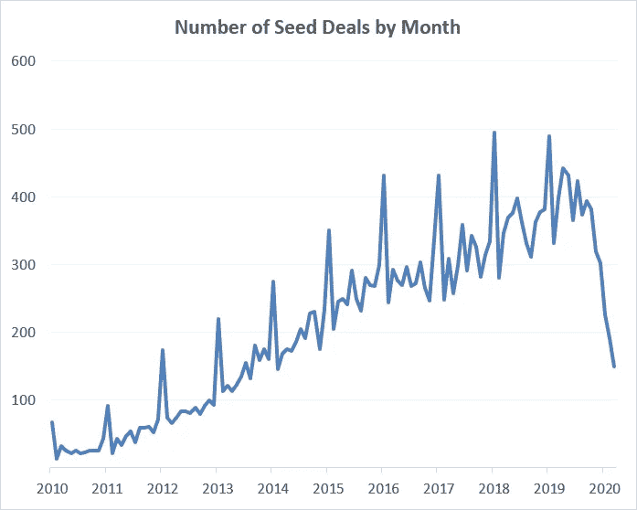
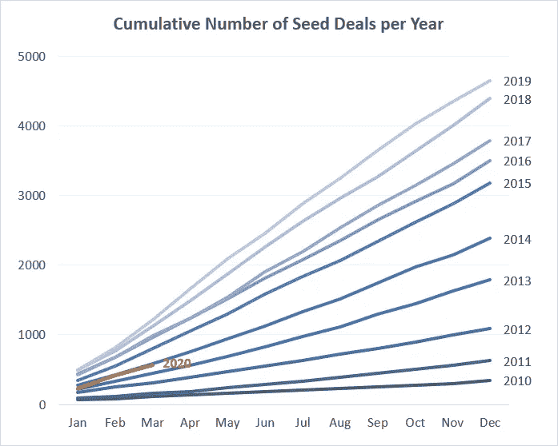

# 新冠肺炎对种子投资的影响

> 原文：<https://medium.datadriveninvestor.com/covid-19s-impact-on-seed-investing-fa9291f03d4?source=collection_archive---------14----------------------->

…今年我们可能会看到多少种子投资

Data from Pitchbook

上图显示了过去十年每月的种子交易数量。2020 年，种子融资已经跌至 2013 年以来的最低水平。过去三年，截至 3 月底，种子交易有 2000 至 2500 笔，但今年只有 1200 笔。

 [## 投资区块链前要问的三个简单问题(也是一个困难的问题)|数据…

### 现在是了解区块链的最佳时机。不同货币之间的增长率，比如…

www.datadriveninvestor.com](https://www.datadriveninvestor.com/2020/03/12/three-simple-questions-and-one-difficult-one-to-ask-before-investing-in-a-blockchain/) 

有趣的是，通常每年 1 月都会有一个交易高峰，而今年我们没有看到这个高峰，这可能表明中国创业市场的放缓和/或风投在新冠肺炎到达欧洲和北美之前就开始关注它的传播。

仔细看看交易数量的队列视图，现在看起来我们有望迎来像 2014 年一样的一年，当时风投们投资了 2，400 笔种子交易。与 2019 年相比，这将是约 50%的同比下降。

当然，即使交易量大幅下降，风投仍在寻找新的投资(T2 还在吹嘘这件事)，初创公司仍在起步。正如保罗·格拉厄姆最近[发推文](https://twitter.com/paulg/status/1245292019318210560?utm_campaign=The%20DL&utm_medium=email&utm_source=Revue%20newsletter) …

> “任何在接下来几个月开始的创业公司，成功的可能性都是不成比例的。成功最重要的是取决于决心，想象一下，在全球疫情中创业需要多大的决心。”

🙋🏻‍♂️:如果你喜欢这篇文章，可以看看我的每周时事通讯，它是关于科技、创业和在西北太平洋地区投资的。