# COVID 关键要点:另一个十大要点

> 原文：<https://medium.datadriveninvestor.com/covid-key-takeaways-another-top-10-462c5fa2620?source=collection_archive---------16----------------------->

# 这是一段疯狂的旅程——没有可预见的下一站——但我认为我们可以从整个事件中保留一些积极的东西。列出来！

## 10.属于你自己的时间

不是克里斯·诺兰所说的“看着我，时间是我的偶像”(有点奇怪，但他拍了很多关于它的电影，那又怎样？！).**我的意思很简单……你可以享受在非 COVID 世界舞台上可能永远不会享受的东西**。

你找到了兴趣爱好。重新发现的激情。交了新朋友，建立了新的世界，身体上的，精神上的。

科学家可能会说你甚至变得更年轻了。**你可能相信他们。**

**没事。你们俩都喝醉了**。

放松点。这对你来说其实是件好事…

## 9.狂欢游行

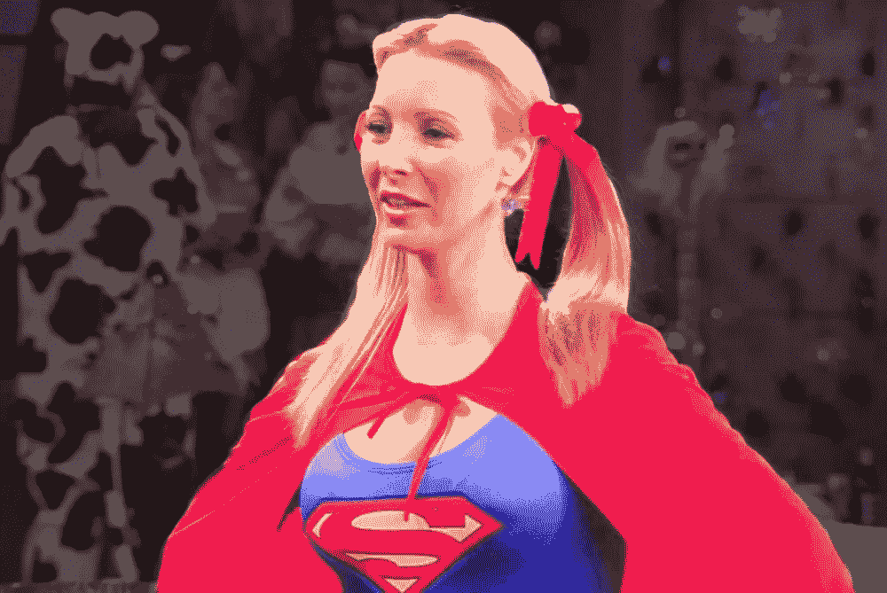

好，那么想象一下#COVID 没有朋友。我知道，#天启，对吧？！

没有借口可以避免莫妮卡和钱德勒乱搞，钱德勒差点和菲比乱搞，菲比和乔伊，是吗，是吗瑞秋和罗斯。

其他节目也一样。

电视收视率飙升。电视广告也是如此。

对主流媒体来说还没那么糟糕。

至于你的大脑……让它自己从**中解脱出来吧**。

it will do you good…

## 8.当你只是为了好玩而购买下一个面具时，没有人会敲你的竹杠

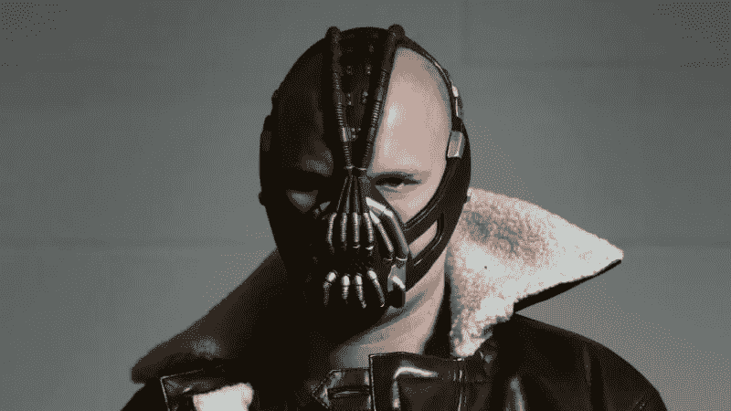

您目前拥有多少 COVID 口罩？**单身，7 个孩子的父亲/母亲？谁在乎呢。** …

你组装好一个**面具室**了吗？

有组织的 ***假面舞会*** ？

狂看整个面具秀？是的，我指的是卡通片《T21》！

无论你的交易是什么，**口罩已经成为我们生活的一部分。这是你的烟，即使你不抽**。

在第一阶段，它显示了我们内在的精神和绝对猿#它:每个人都渴望一个小小的“医疗”设备的每一个，有一对夫妇的字符串。

 [## 4 COVID 细胞疗法和制造这些疗法的公司|数据驱动的投资者

### 新冠肺炎疫情是现代医学最大的挑战之一，有 2000 万(还在增加)确诊病例…

www.datadriveninvestor.com](https://www.datadriveninvestor.com/2020/08/31/4-covid-cell-therapies-and-the-companies-that-are-making-them/) 

后来，它变成了时尚——因为这就是我们；**食人族在第一次灭绝时惊鸿一瞥；生存之后，时尚达人！instagram 和 pinterest 都疯了。我是说香蕉面具。或者某种形式的香蕉保护。**

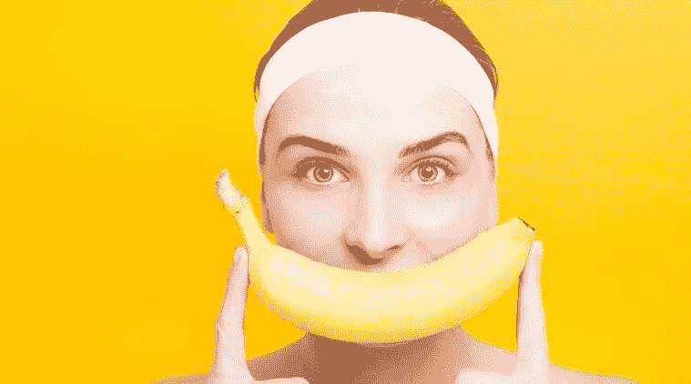

not efficient, despite being awfully tasty

马脸。

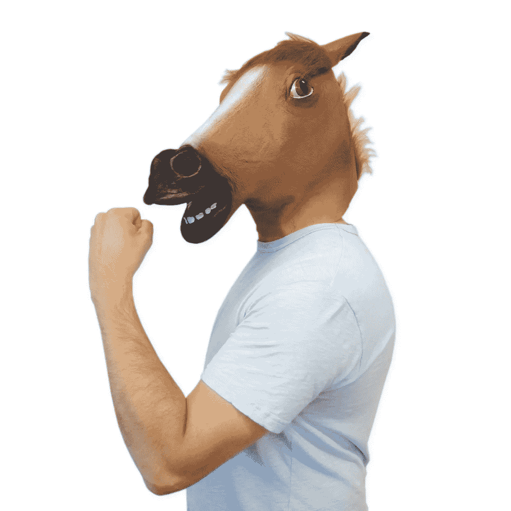

超级英雄。

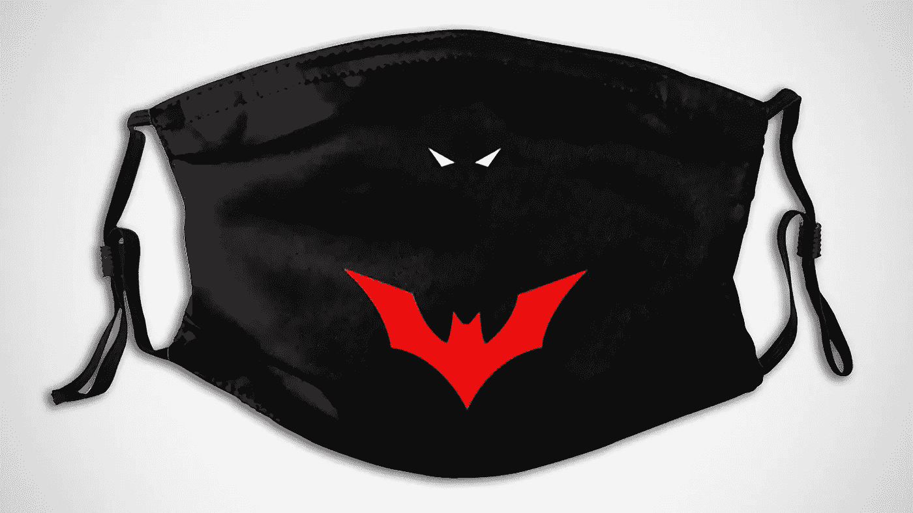

超级恶棍。

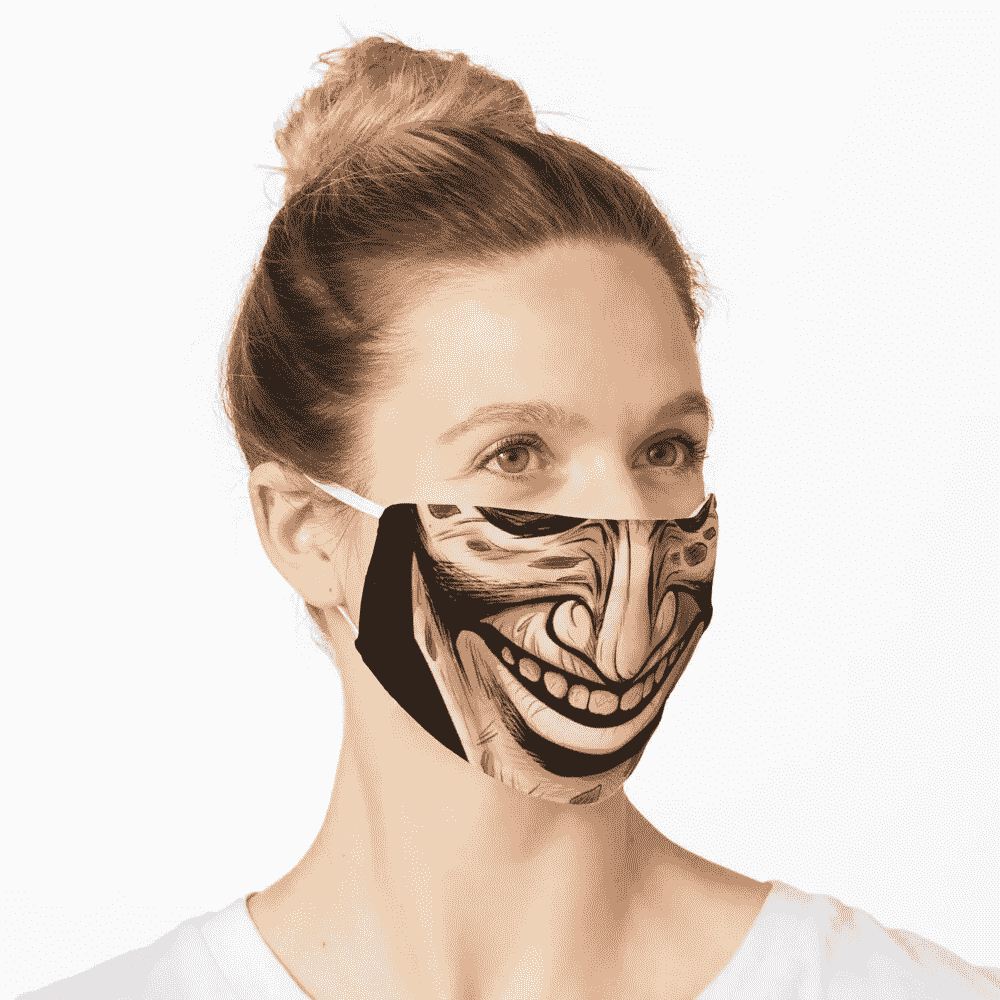

#maskon but not that much girl!

再过几个月就没用了。

让我们祈祷吧！

## 7.你找回了你的魔力

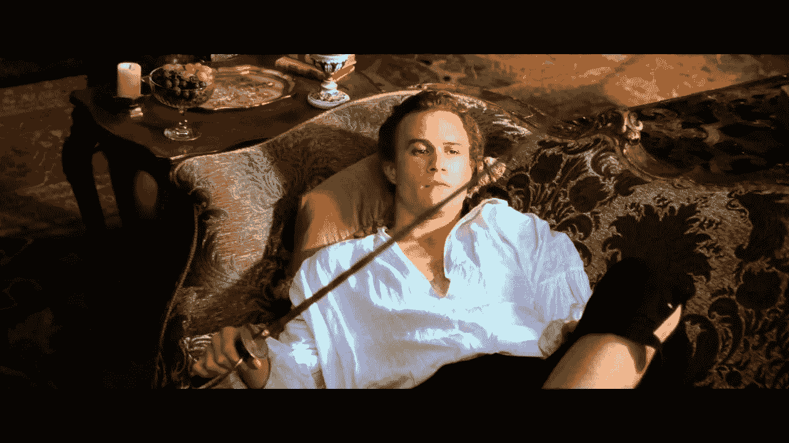

所以你一次又一次地打掉你丈夫/妻子的袜子。这太棒了。为那个喝彩。

“他总是很累”，她过去常说……“她工作到很晚，我只能用她的 iPad”。

COVID 教我们要更有耐心，即使有时我们都瞥了一眼下一个窗口，想知道如果我们**像 Geronimo 风格**那样去做，会有什么感觉和声音。自杀？也许吧。

但是我们重新学会了爱。与此同时，**我们也发现了仇恨的新形式**。这将我们引向…

## 6.你见证了许多关系的起起落落

就像证券交易所一样，当涉及到关系时，这是最后一个站着的男人/女人。不再是夫妻了。**单身男女你不可能想象再玩一次‘野战’**。

有了这个，更多的人受苦了，**有没有孩子，都没有好处，即使你是一个铁杆的 Schadenfreudean** ，当两个人分崩离析，彼此远离。**你曾经见过的人，他们看起来似乎永远幸福。**

我们再次学会了爱。仇恨也是如此。

对全世界的精神病学家来说是一笔好交易。让你的血清素修复。尽快。

因为这件事可能还会持续一年左右。

> 注:并不是所有事情都是*暗友*一集。人们也聚在一起，很快“解决”了他们的生活。顺便说一下，我想找出 COVID 的峰值与出生率之间的直接关系

## 5.你一定学到了一些新技能。我想是的。

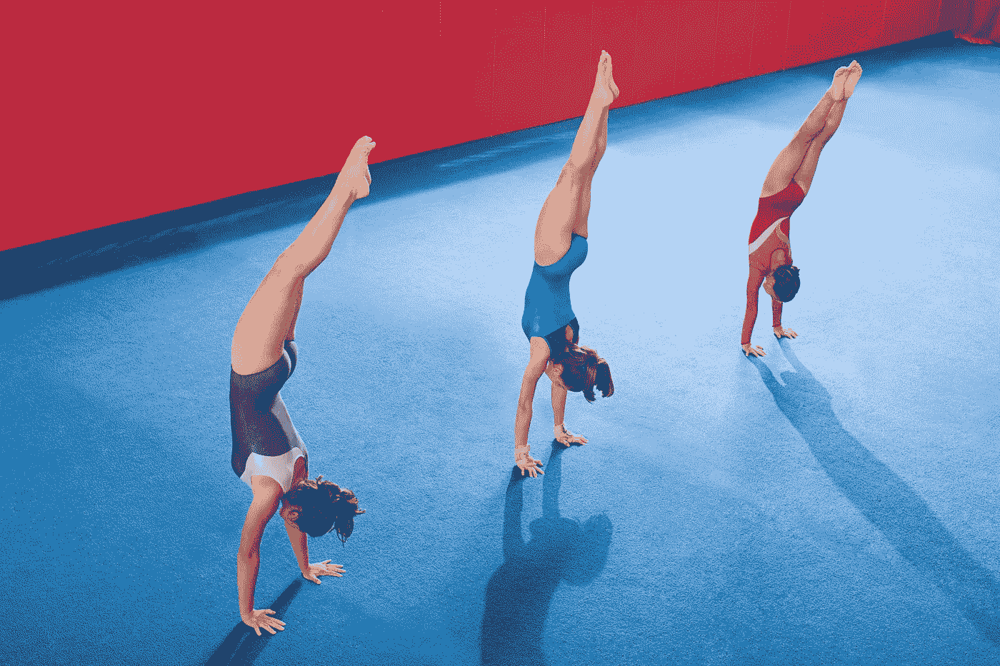

就我而言，我现在精通西班牙语。纯正的西班牙语。

喜欢，我总是听一些西班牙歌曲，我珍惜他们的文化。但是现在我能写、能说、能理解，****文体**。这不是什么特别值得骄傲的事情——我是葡萄牙人，所以基本上是半个西班牙人……——但是……**这也算**。**

**我还没学会如何弹吉他和钢琴。我留着给 COVID 重装上阵。2022 年左右。**佛祖**。**

**随着像抖音(有趣的人)、Zoom 和团队(商业)这样的东西的巨大增长，DYI 热和创造力挑战使我们更能适应变化。**

** [## 抖音国际版

### 哦，抖音的主要目的地是哪里？我们的队长和队长是一个很重要的人，我…

www.tiktok.com](https://www.tiktok.com/pt_BR/) 

即使你打开新闻看到美国人互相射击… **你现在已经准备好容忍并遵守共同的规则**。而你也找到了一些空余时间**去制作** / **或者打破自己的**。

**好，现在你是 6 级单簧管…**

**4。你永远不会去你邻居的房子。为什么？因为 TP 是你一周左右的生活**

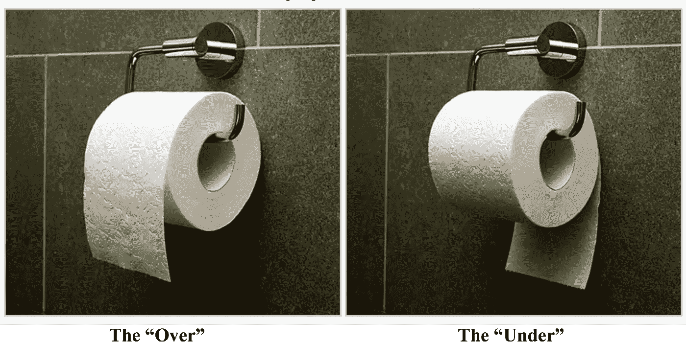

人类就像成群的大象。当遇到危险时，他们会逃跑，他们会恐慌，他们会完全进入“生存模式”。 *Medo，muchacho* 。顺便说一句，那是伊比利亚语中**#恐惧**的意思。

**那么，以吨为单位，你的 TP max 是多少？**

要诚实。

这里没有判断。

你这个怪胎…

## 3.新发现的对艺术家、播客、youtubers、整个创意社区的热爱

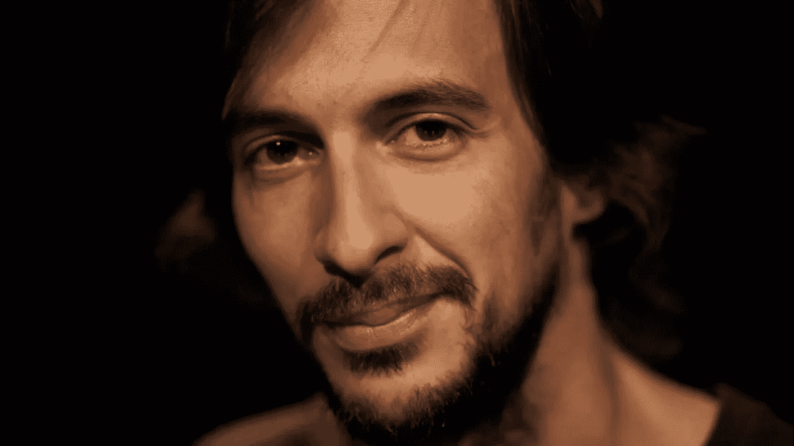

在葡萄牙，所有人都涌向这个叫[布鲁诺](https://www.instagram.com/corpodormente/?hl=pt)的家伙。我没有研究过，但我想说每个国家都有他/她的布鲁诺。

我们失去了电影、剧院和单口相声表演，但我们从未失去音乐。感谢上帝，从这里到日本，再到复活节岛。

音乐从未离开过我们，就像你最喜欢的 youtuber 一样。

我将分享一些从未失去重点的渠道:

[**corridor digital**](https://www.youtube.com/user/CorridorDigital)

 [## 走廊

### 你认为不可能的视频，由萨姆和尼科和走廊的工作人员创造！

www.youtube.com](https://www.youtube.com/user/CorridorDigital) 

杜德佩克

 [## 哥们太棒了

### 五个最好的朋友正在踢它。如果你喜欢体育+喜剧，就来加入都德完美团队吧！

www.youtube.com](https://www.youtube.com/user/corycotton) 

**推介会**，由[主持人](http://screenrant.com)

这是 66.6%的电影，但你也可以找到音乐家的最新作品，如

**幼稚的甘比诺。珍妮·爱子。九寸钉乐队。菲奥娜·艾波。里兹·阿迈德。威肯。笔画。布兰登·本森。瓦克萨哈奇**

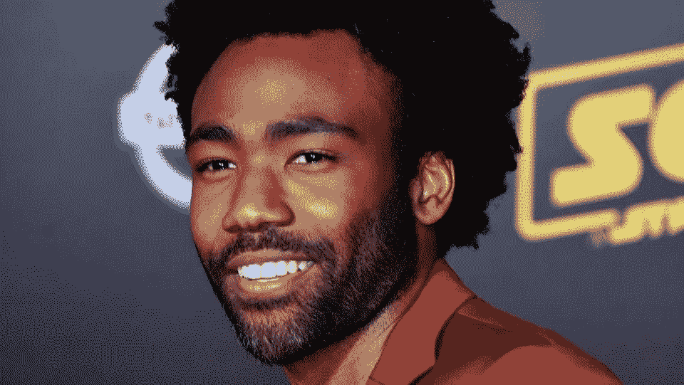

and etc.

家是你竖起耳朵想去的地方，真的(音乐就是这样，有 COVID 和没有 COVID)。

感谢上帝给了我无线网络连接。我不认为我们欣赏那种安慰！

## 2.他人的时间

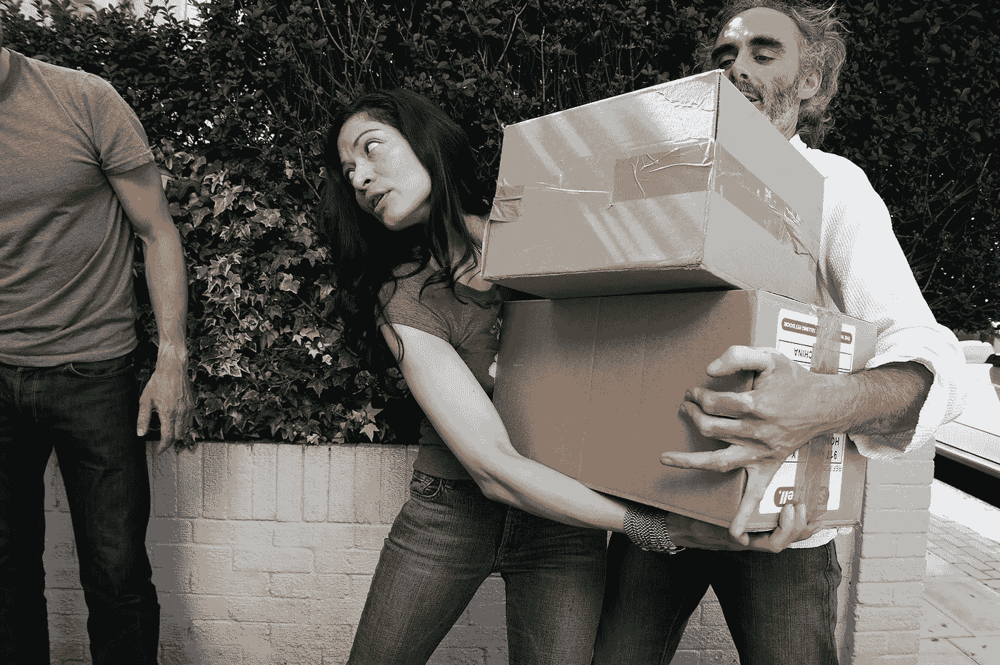

由于我无法解释的原因，这并不是最重要的。因为。

我觉得你——不管是马龙派基督徒还是即将成为山达基教徒——诚实地打破了你的自我最大化的泡沫，以便在你周围产生一些温暖。

不是因为你需要或被迫这样做，而是——让我们想象一下，人类并不总是那么坏— **因为你只是觉得做这件事很自然。**

> 也许你厌倦了做一个自恋的蠢蛋。
> 
> 也许你充满了愤怒，想要发泄出来。
> 
> 你从未感觉与家人和朋友更亲近。
> 
> 你帮助了他们。带他们回家，听他们的音乐。

**这是这一时期人类最大的胜利。**

**不是#拯救星球交易。**

另外，情感和交流胜过了技术和小发明。

你可以拥有你所有的小发明。

**只要你能拿五个人说话。**

还有，OMG，**你们谈得还不错吧？！**

## 1.也许是我们自找的…

好了，现在来谈谈争议。从现在开始，我指的是我们。

我们是在去往一个人造万物的虚空的路上吗？

**无用的小发明，花哨无用的技术，虚无的大师们，他们基本上把你编码成自动的和捏造的反应**？

有针对性的广告，有针对性的演讲和谈话，**追随崇拜假神的无脑羊群**？

我们生活在地球村。**村民是人，不是算法，然而我们被告知代码和通用人工智能将解决我们的每一个问题**。

我们不知何故在自找麻烦。

用塑料填满这个星球，用我们可以从朋友那里，从你隔壁的图书馆轻松学到的东西填满我们的大脑。

我们是这个电子游戏的第一和第二玩家。

CPU 没有信用。

我们说了算。我不是#机械师。

我可以推理出计算机有它们的发言权，但不是以我们站着看的方式。

在这种情况下，我们是罪犯，而不是受害者。

我们做了这个。

我们会解决这个问题。

靠我们自己。

就像自然进化……‘教’了我们。

#gohumans

**访问专家视图—** [**订阅 DDI 英特尔**](https://datadriveninvestor.com/ddi-intel)**