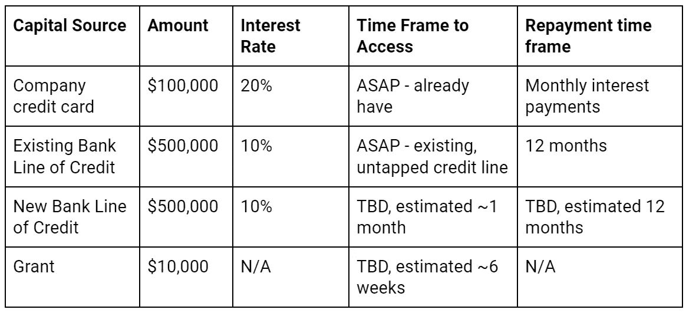
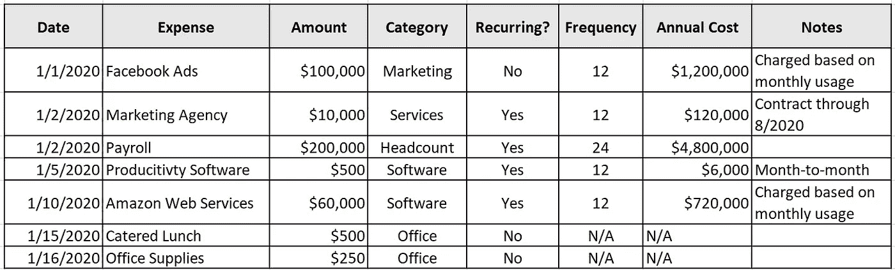

# COVID 协议:您的企业如何在冠状病毒中生存

> 原文：<https://medium.datadriveninvestor.com/covid-protocol-how-your-business-can-survive-the-coronavirus-4873ad6d5568?source=collection_archive---------4----------------------->

我们看到了前所未有的商业环境。无论你经营的是本地瑜伽馆还是风投支持的初创公司，每个公司都需要做出改变。作为一名拥有创业转型经验的前战略顾问，我有以下建议。

Photo by [Boris Dunand](https://unsplash.com/@borisdunand?utm_source=unsplash&utm_medium=referral&utm_content=creditCopyText) on [Unsplash](https://unsplash.com/s/photos/empty-shelves?utm_source=unsplash&utm_medium=referral&utm_content=creditCopyText)

# 第一步:确立你的优先事项

出于本文的目的，我将假设每个公司的首要目标是**保持偿付能力，同时遵循健康指导方针**以确保员工和客户的安全。

除此之外，花点时间思考其他目标。一些公司将专注于支持他们的社区，而另一些公司将专注于收入或收益。以下是一些潜在的目标:

*   为员工提供财务稳定性，减少裁员需求
*   确保关键合作伙伴的偿付能力，如关键供应商
*   促进客户和员工的心理健康(减少压力，提供喜剧性的缓解，等等。)
*   在你的社区和客户中产生善意和积极的公共关系
*   当锁定停止时，捕捉新用户和/或为自己的增长找到最佳位置
*   继续关注传统的增长指标，如收入和用户增长

无论你做了什么决定，优先考虑这些目标，并在接下来的艰难决定中把它们放在最前面。

## **与利益相关方保持一致**

既然你已经确立了作为一个经营者的优先事项，那么花点时间来认可你的财务利益相关者(投资者？共有人？你付给他版税的合伙人？)与这些团体联系，确保你们的目标一致。以我的经验来看，利益相关者总是喜欢尽早参与艰难的对话。

# **第二步:调整你的运营**

## **合理确定运营规模**

几乎每个企业都在经历不正常的需求，需要调整运营。

*如果收入下降…* 探索其他收入来源以增加收入。您的服务可以通过电话或直播提供吗？你能提供提货或送货服务吗？你能拍下你的产品并建立一个快速的电子商务阵线吗？在亚马逊或易贝上销售？先把你的员工转移到新项目，然后裁员。

*如果收入增加…* 你应该感到幸运！然而，您可能仍然需要做出改变，以使您的操作符合医疗保健协议。仓库吞吐量将不可避免地放缓，因为工人之间保持 6 英尺的距离，清洁频率增加。

 [## 一个企业在肚子上移动:如何照顾直觉|数据驱动的投资者

### 事实证明，直觉不仅仅是一种感觉。科学很清楚:你的直觉比你知道的更多…

www.datadriveninvestor.com](https://www.datadriveninvestor.com/2018/11/09/a-business-moves-on-its-stomach-how-to-make-allowances-for-gut-feelings/) 

*如果变化是永久性的…* 你需要考虑裁员(更多内容请见第 4 步)、减少仓库或零售店的占地面积，以及其他措施。

## *进行其他业务调整。*

*   重置客户期望。由于我们的运输网络不堪重负，运输速度将会减慢。同样，如果员工生病或必须照顾孩子，他们的可用时间可能会减少。
*   优先考虑关键客户。电子商务网站可以添加一个结账选项，以表明某个商品是否急需，然后减慢所有其他商品的发货速度。
*   考虑临时涨价或附加费。消费者现在的支付意愿可能会更高。
*   如果你通常亲自销售，通过电话或电子邮件接受订单
*   查看退款的驱动因素，并实施流程变更以解决最严重的问题。

# **第三步:了解你的现金状况**

## **了解你的烧钱率和持续盈利能力**

现金是任何公司的命脉，你需要清楚自己有多少。了解你的 [**总**现金消耗率](https://www.investopedia.com/terms/b/burnrate.asp)，这是你每个月产生的运营成本。运营商通常评估**净**燃烧率，这也是收入的一个因素。然而，考虑到目前大多数企业的收入是多么不稳定，你会想要了解最坏的情况。

用你手头的现金总额除以你的月消耗率，计算出你的跑道，也就是你可以用现有现金生存的月数。您需要确保您的运营成本考虑到第 2 步中的任何运营变化，例如增加的清洁和卫生费用以及降低的生产率。

Photo by [Michael Longmire](https://unsplash.com/@f7photo?utm_source=unsplash&utm_medium=referral&utm_content=creditCopyText) on [Unsplash](https://unsplash.com/s/photos/money?utm_source=unsplash&utm_medium=referral&utm_content=creditCopyText)

## **确定额外资本的来源**

研究适用于你的企业的额外资金来源。(一些想法包括信用卡、银行贷款、来自投资者的过桥贷款、对供应商的延期付款、来自主要合作伙伴的贷款以及小企业协会赠款)。根据访问速度和成本对每个资源进行分类。以这种方式看待这些信息可以帮助你理解你需要多快开始获取更深层次的现金。

与你的利益相关者协商，看看他们可以支持哪些资源，特别是如果他们优先考虑增长而不是偿付能力的话。

An example of capital planning. Note that all data is illustrative.

# **第四步:管理你的开支和现金流**

## **列出你的开销**

如果你还没有，现在是时候看看你的企业花的每一分钱。将你过去 3-6 个月的支出汇总成一份电子表格(大多数财务工具应该允许你导出数据)。然后，检查您的合同文件夹，并添加任何不在列表中的合同。

对每项费用进行分类，并指明是一次性费用还是经常性费用。考虑经常性开支的最好方法是问“如果我什么都不做，将来我会为此被收费吗？”例如，如果每月都需要计划和订购，每月提供的午餐就不是经常性费用。添加频率(您每年支付的次数)并计算年度费用。

An illustrative example of categorizing your business expenses.

一组建议的类别包括:

*   工资单(仅限 FTE)
*   租金
*   软件
*   营销支出
*   代理和顾问
*   库存
*   仓储和履行
*   一次性费用(员工费用、办公用品、一次性费用等。)

## **管理你的开支**

一旦你确定了所有的开支，你就可以开始想办法减少每一项开支。主要关注经常性开支，从最大的类别开始。

*工资单。*这可能是你最大的支出之一，你在这里的行动将遵循你既定的优先事项。如果你认为需求减少是暂时的，我强烈建议你在有能力的情况下考虑给员工发工资。如果你预计人员需求会长期减少，你需要考虑裁员。有经验的企业家和投资者建议，迅速采取行动很困难，但还是推荐这样做。

虽然我不是人力资源专业人士，但还是有一些关于裁员的注意事项:

*   请注意[警告法案](https://www.dol.gov/agencies/eta/layoffs/warn)，该法案要求大型企业给予一定数量的通知和/或遣散费。(经济危机是个例外，但我会让专家来判断这种环境是否合格。)
*   别等了。在你还有现金支付最后的薪水，最好是遣散费的时候，进行裁员。
*   加州的失业保险取决于你上一年的收入，但 6 个月左右的上限为 450 美元/周(相当于~ 23400 美元年薪)。虽然这是一个很大的好处，但要认识到你的员工可能不会变得完整。
*   经历了 50%的裁员，我个人的建议是用积极的态度、广泛的技能和学习的意愿留住员工。认识到平衡水平:保留一个挣 25 万美元的人相当于减少 3 个挣 8 万美元的人。在领导者和执行者之间取得适当的平衡，但对每个人都要有同情心。

如果你想避免或减少裁员的影响:

*   寻找那些想休一段时间无薪假期的志愿者。清楚地记录下你达成的任何协议。
*   探索全面削减 20%的工资或可用班次，以避免 20%的员工布局
*   如果您正在制定任何临时措施，尽可能让员工了解时间表，以便他们可以为自己的未来做计划。他们今天同意的，下周可能就不适用了。
*   研究有关失业资格的法律。例如，如果你的团队自愿无薪休假，他们可能没有资格。

*租金。*与房东沟通可能的付款方式，如延期付款或降低租金。考虑转租你办公室的额外空间(一旦我们完成了社交距离！)

*软件。*对于基本软件，要求延长合同以换取折扣率。对于不必要的软件，可以考虑取消服务，要求打折，或者延迟付款。遗憾的是，您将对该供应商的业务产生负面影响，但您也会惊讶地发现，您为重复的、非必要的服务支付了多少费用。对于所有服务，重新评估您的数量和服务级别需求。

*营销支出。*考虑减少开支以节省现金，并密切关注你的渠道在这个非常时期的表现。如果转换率或保留率下降，您将需要降低您的许可客户获取成本(CAC ),以符合您的新客户终身价值(LTV)。削减成本较高的渠道，并退出未来的承诺。也就是说，随着公司取消广告承诺并增加供应，也要在对你有用的渠道中寻找折扣。

*机构&顾问*。考虑重新协商合同，缩小服务范围，或同意长期合同以换取折扣。在这段时间里，他们可能会继续和你合作，并努力让双方都受益。

*库存。考虑就交货时间、单价、批量和付款条件进行协商，以保持双方的顺利进行。*

*入库&履行。*随着越来越多的业务转移到网上，以及预防措施导致吞吐量下降，成本可能会增加。讨论您的 SLA、单价、合同期限和支付条款的变化如何使双方保持运转。

*一次性费用。*重新审视您的费用政策，如果需要，向您的团队提供更新的指导。这也是重新评估你在办公室文化项目上的预算的好时机，比如活动和小吃，并削减一些品牌礼品。(放心吧，钱少也能玩的很开心！)

## **管理现金支出**

利用现有的折扣和赠品。许多公用事业公司表示，他们不会削减服务或收取滞纳金，而许多远程工作工具提供免费订阅和最佳实践指南。请记住，数字服务企业在增量单位上的利润比实体产品更高，所以要把精力放在这上面！

为供应商付款创建预算。虽然这会让你感觉很不舒服，但制定一个持续的每周现金支付预算将有助于稳定你的现金流。不是所有的供应商都会按时得到付款，所以优先向关键的供应商和可能无法在这次衰退中生存下来的小公司付款。这个想法是让一些钱(无论数额多小)每个月都流向关键的供应商。始终像员工一样按时支付个人承包商的工资。

*交流。*积极与你的供应商沟通，探索各种选择，如付款计划、折扣和部分付款。每个人都应该努力一起度过这次低迷期。

## **集中收现金**

当越来越多的公司开始谨慎管理现金支付时，你需要更加自觉地收取现金。这通常是一个优化不足的过程。一些提示:

*   发送发票提醒并跟进未清发票。
*   开发灵活的选项来接收部分付款或为预付费服务提供折扣。
*   创建预付选项，促进礼品卡的销售(即使这需要你手动解决)
*   如果取消影响到你的业务，提供未来服务的信用而不是现金返还。
*   考虑与其他供应商交换商品和服务，而不是现金支付。

# **第五步:规划未来**

*过度关注现有客户。加倍努力确保你的现有客户满意。询问你如何帮助他们度过这个困难时期，并分享你正在采取什么措施成为一个好的商业伙伴。考虑重新分配市场营销和销售人员以实现客户成功，或者让 eng 提供这种非常需要的功能。*

考虑你的企业在世界上的角色。如果社区和善意对你来说特别重要，你的企业如何帮助简化以下群体的生活？锻炼你的同理心！

*   首次远程工作的团队
*   失学儿童和日托
*   在家平衡孩子和远程工作的父母
*   医护人员、送货司机和其他让我们生存的人
*   必须格外小心的老年人和免疫力低下者

一些优秀的例子包括提供非接触式交付的交付应用程序或杂货店为老年和高风险客户创造特殊时间。

Photo by [Mike Petrucci](https://unsplash.com/@mikepetrucci?utm_source=unsplash&utm_medium=referral&utm_content=creditCopyText) on [Unsplash](https://unsplash.com/s/photos/small-business?utm_source=unsplash&utm_medium=referral&utm_content=creditCopyText)

*说出你的故事。*现在许多故事都在疯传，曝光范围很广，但速度很快。花一点时间在社交媒体上介绍你的公司及其背后的人，并解释你的企业如何支持社区。

*为这一切结束后制定一个计划。虽然很难相信，但总有一天，一切都会恢复正常。你的行业将会发生怎样的变化？现在你能做些什么来建立用户的忠诚度，以便在行业反弹时与他们一起成长？*

如果你提供的是免费服务，制定一个计划让用户转向付费服务。如果你为餐馆或小企业服务，帮助他们建立电子商务或礼品卡选项。当他们重新开业，整个社区都渴望#shopsmall 时，你将准备好与他们一起成长。考虑如何减轻恐惧和焦虑。房地产经纪人可以分享为什么衰退是购买房地产的好时机，而健康公司则借此机会教授冥想的好处。如果你的本地业务刚刚数字化，记录下你自己并发起一个纯数字会员。

# 这也会过去的。

这是一个前所未有的时代，但是请记住，它终将过去。花点时间考虑你如何才能最好地定位你的企业，不仅要生存，还要在这个新世界里茁壮成长。