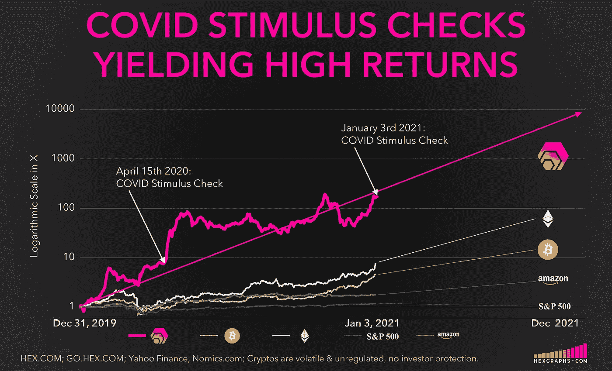
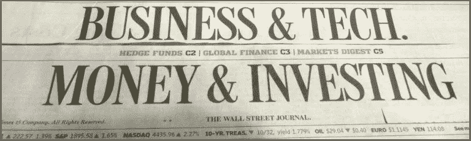
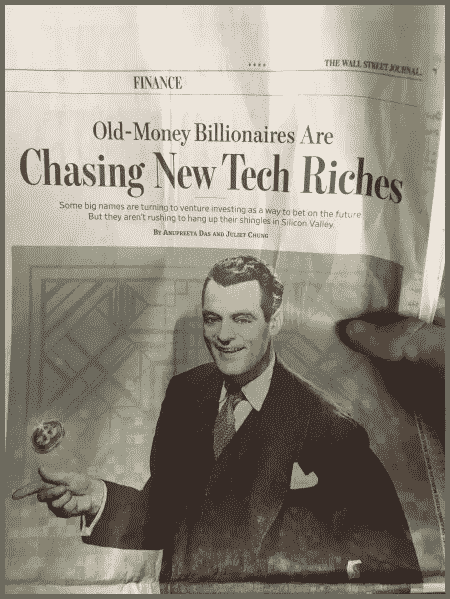
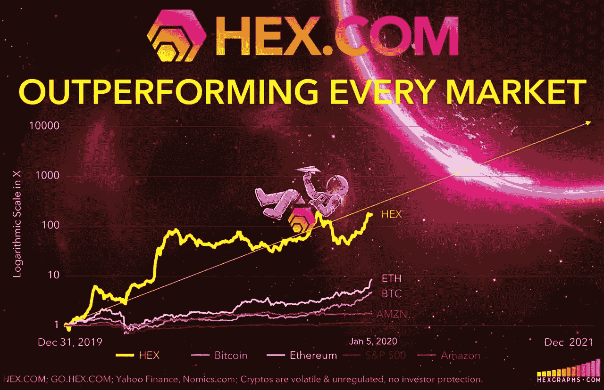
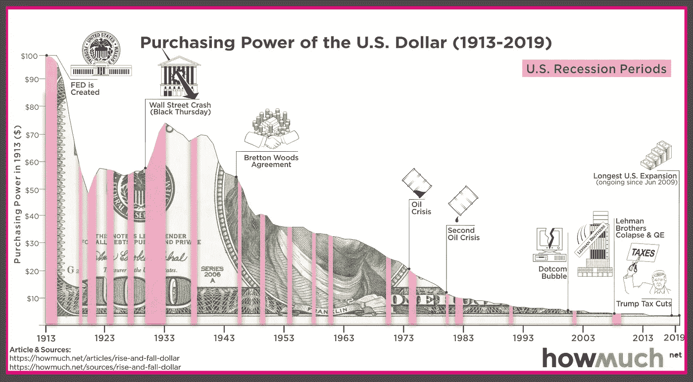
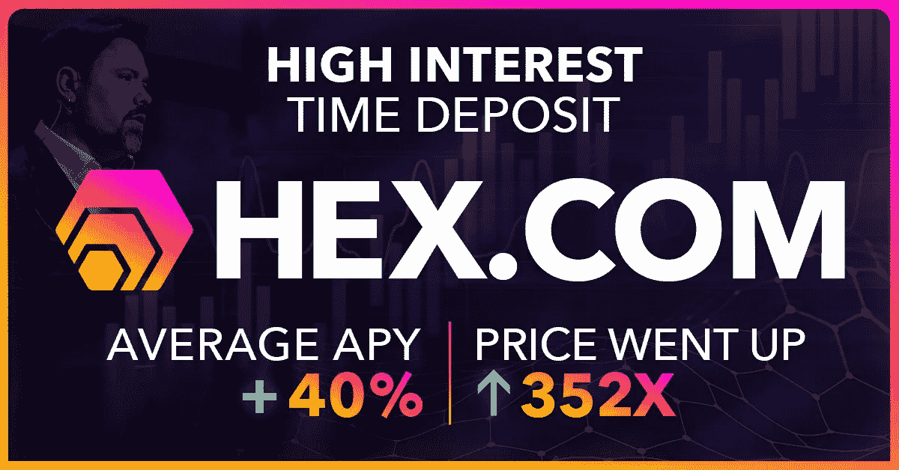
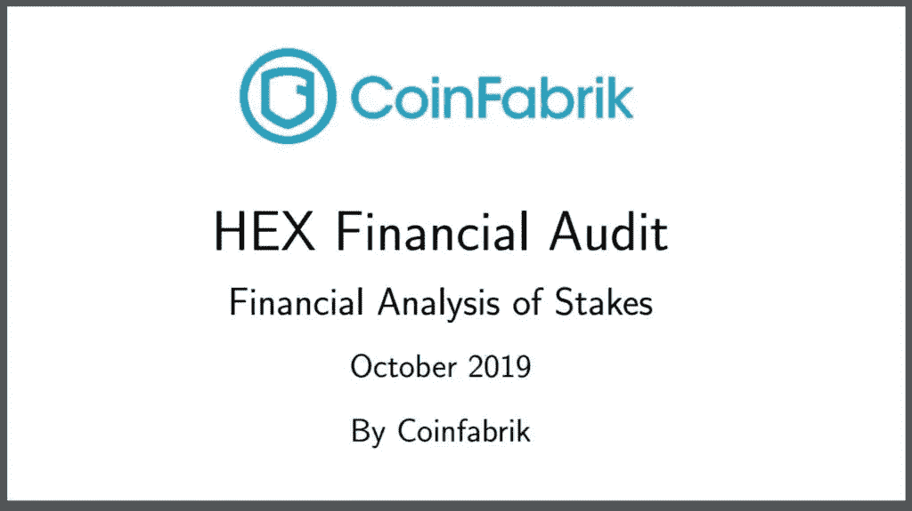
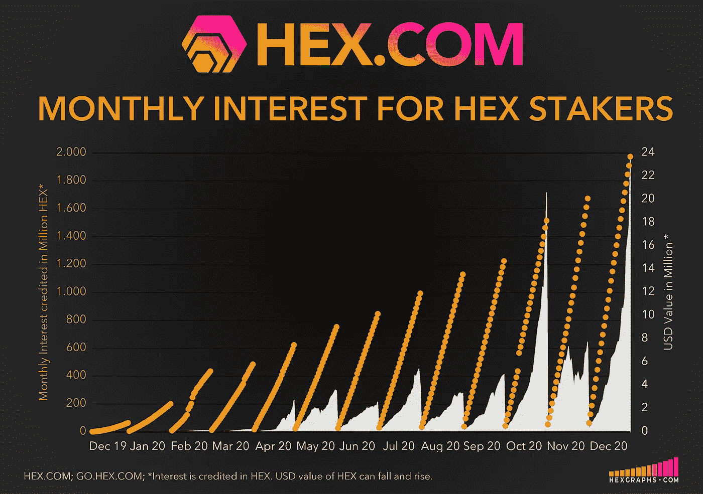
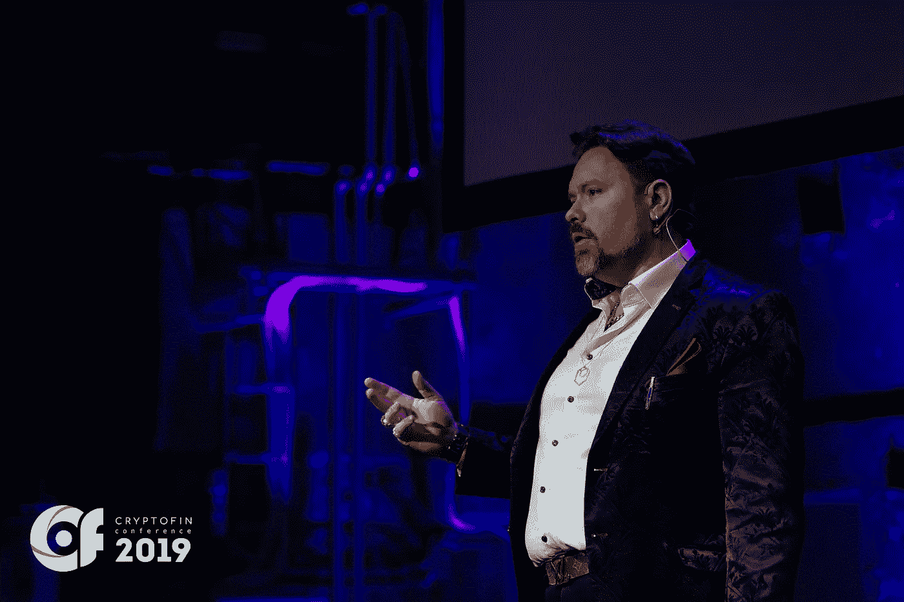

# COVID 刺激检查正在区块链上取得巨大进展

> 原文：<https://medium.datadriveninvestor.com/covid-stimulus-checks-are-making-big-gains-on-the-blockchain-de490bc99d73?source=collection_archive---------5----------------------->

## 你本可以将 2020 年 4 月的刺激计划增加 22 倍以上；许多人这样做了，随着第二轮刺激检查的到来，他们准备再做一次

W 如果你可以把你的 COVID 刺激支票放在一个咖啡罐里，埋在你的后院，当你将来把它挖出来的时候，它已经翻了很多倍*和*收到了利息支付——所有这一切只是为了在你选择的时间内安全地持有它。这正是许多人在 4 月份的第一轮刺激计划中所做的；只不过他们没有把它们种在自家后院——甚至更容易——他们把它们安全地存入(或****)***区块链第一个经过全面审计的高息定期存款金融产品:HEX.com。快进到写作的时候:*

> *从 4 月份开始，他们每人 1200 美元的刺激支票翻了 22 倍，达到 26412 美元。从 HEX 的安全性、无信任的兴趣和超常的价格表现中获得的信心和认可，现在已经吸引了这些投资者和许多其他人，包括 HEX 作为他们投资组合的一部分。*

*全美数百万符合条件的领取者正在接受他们的第二轮 COVID 刺激检查。虽然个人需求将在很大程度上决定每个人如何将这些资金应用到他们的生活中，但一些接受者已经将 HEX 确定为一种新的金融产品，专门设计为提供高存款利息，并在其基础价格上超越其他市场。这些人已经并将继续把新资金转化为非常有意义的金额。随着第二轮 COVID 刺激检查的到来，他们准备再次这样做。*

# *更智能的技术=卓越的投资产品*

**

*随着技术的进步，投资产品也在进步。从 20 世纪 90 年代到 21 世纪初，出现了几种新的投资产品，如 ETF、公开交易的 REITs、目标日期基金等。2009 年，比特币被发明出来，利用区块链技术解决点对点货币市场。*

*10 年后，比特币的点对点货币叙事转向了价值储存，或者更恰当地说，转向了“数字黄金”，并被视为在华尔街以这种方式推广。*

**

*在比特币的基础上，2015 年以太坊区块链的诞生带来了以智能合约功能为特色的图灵完整语言的卓越安全性。以太坊的能力极大地促进了区块链科技的发展。其无数的可编程设计功能，加上更好的安全性和性能，是比特币严重缺乏的功能。*

*加密货币迅速成为人类历史上升值幅度最高的资产类别。比特币的价格在 7 年内从 0.01 美元涨到了 2，000，000 倍。以太坊在 2.5 年内从 0.15 美元到 1595 美元做了 10,633x。*

*如果你投入 1 美元，你可能已经赚了数百万。许多人这样做了，更多的人继续这样做，因为这个行业才刚刚超过 10 年。HEX.com 是第一个高息区块链定期存款，是一个完整的、经过全面审计的金融产品，于 2019 年 12 月推出。它的设计表现甚至比比特币或以太坊还要好。*

# *起作用了*

*

Visit HEXGRAPHS.com For Up to Date Charts & Graphs* 

# *什么是 HEX？*

*“HEX 是一种加密货币，尽管是一种非常不同的加密货币。HEX 不是简单地消费或交易这种加密货币，而是让你锁定你的钱并从中获得利息。*

*我们已经通过银行做到了这一点。这就是银行业所说的存单。客户将财富锁定一定时间，反过来通过赚取利息来增长财富。*

**

*Inflation Decay on Purchasing Power of the Dollar*

*但是我们锁在银行里的传统货币遭受通货膨胀。这意味着当你获得利息时，随着时间的推移，你的钱也在贬值。这就是 HEX 大放异彩的地方，因为 HEX 是第一种高息支付的加密货币。*

*HEX 把银行和政府印钞的利润拿出来给 HEX 持有者。HEX 实际上是为了增值而设计的；事实上，在推出的头几个月内，一个十六进制令牌的价值已经翻了 80 多倍。这意味着妖术持有者不仅获得了利息，还成倍地增加了他们现有的投资。这才刚刚开始。*

**

*使 HEX 更加可靠的是，HEX 是一个不可信的对等系统，这意味着没有控制系统的中央权力。一切都由用户驱动，没有任何交易对手风险。"
-HEX.com*

> ****美国和中国的定期存款超过 7.2 万亿美元。这是一个比比特币旨在解决的点对点货币市场大 50%的市场，在点对点货币市场中，印刷现金总额约为 5 万亿美元。HEX 是专为解决定期存款市场而设计的，其性价比超过了比特币和以太坊。****

*HEX is an Autonomous Financial Product Running on the Ethereum Blockchain*

*HEX 于 2019 年 12 月 2 日推出，是一款经过全面审计的完整产品，运行在以太坊的区块链上。HEX 拥有 100%的正常运行时间，并且比比特币更安全、更快速、交易成本更低。创造加密货币是为了消除中间商和交易对手风险；在 HEX 中没有交易对手风险，没有中间人，您可以 100%控制您的资金。*

# *设立新标准&认真对待安全性*

*HEX 区别于其他加密货币的优势在于，在推出之前，它是经过三重审核的完整产品，而不是项目。作为普通人的悲剧，比特币本身还没有经过全面的安全审计，仍在研发中；因此，令一些人惊讶的是，比特币出现了 [2 通货膨胀漏洞，两者都很少被提及。最近一次发生在 2018 年 9 月，允许任何人印刷无限量的硬币。这些安全风险在 HEX 中被消除。](https://tldrtaylor.medium.com/itcoin-unhackable-it-happened-twice-not-blowing-smoke-9e16bcddd5ab)*

*作为一个完整的产品，HEX 与 99.99%仍处于项目状态的其他加密货币区分开来。对未来发展的承诺通常永远不会实现，这意味着这些投资依赖于其他人的未来工作。HEX 已审核并完成；没有未来的工作要做，它只是运行 100%的链和设计。*

> ****“HEX 被延迟了将近一年才获得安全权限，这就是为什么它有 3 个审核；2 项安全审计，1 项经济审计。十六进制没有管理密钥。没有关闭开关。没有暂停开关。它是完全自主的。****
> 
> *如果 HEX.com 下线，我死了，系统继续正常工作。这是不可阻挡的:代码在区块链。你来经营。你自己创造奖励。就是这样。–[**理心**](https://medium.com/datadriveninvestor/youve-done-the-impossible-declares-bitcoin-com-host-to-richard-heart-founder-of-hex-dd95a3526063) **，十六进制发明者***

**

*HEX 的合同代码创造了一个强大的经济护城河，版权所有[由全球顶级合同审计师中的两位进行 3 次独立审计](https://medium.com/datadriveninvestor/defis-cream-of-the-crop-blazes-ahead-with-2-000-tps-at-0-01-tx-privacy-100-uptime-audits-e3a0708b498a#9764)。如此关注细节使得 HEX 精确地按照设计运行，100%正常运行。*

# *储蓄、增长和创造收入的简单方法*

*

Visit HEXGRAPHS.com For Up to Date Charts & Graphs* 

## *HEX 因其高性能和用户友好的购买体验而成为许多投资者的首选。这个过程对任何人来说都很简单，可以分解为:买一些以太币，把它换成 HEX，然后在你选择的时间段下注。将 HEX 兑换成美元只不过是颠倒了这个简单的过程。参见下面的[逐步指南](https://medium.com/datadriveninvestor/how-to-buy-hex-in-3-easy-steps-d839204c850e)。*

# *时间的最佳货币化*

*   ***在撰写本文时，HEX 的市值超过 70 亿美元，是第九大加密货币******。*****
*   *****HEX 有超过 7.8 亿美元的活跃股份，向股东支付 40%的可变 APY。平均股权长度约为 5 年；最长的赌注是 15 年。*****
*   *****这种用十六进制** **看到的** [**可验证的 onchain 承诺在加密货币中是前所未有的。**](https://hex.vision/goto/610cdd1b335c2fbccd70ef56296bf782)***

# ***开始***

***HEX 是由知名连续创业者、比特币早期采用者理查德·哈特(Richard Heart)发明的。到 2003 年，他的生意每年为他带来超过 6000 万美元的收入，那时，哈特提前退休并环游世界。几年后，当比特币交易价格在 1 美元左右时，他引起了他的注意，他很快就开始独自挖掘完整的比特币区块。Heart 高度重视准确性和对细节的关注，成为比特币的主题专家，并找到了改进比特币的方法。***

******

***Richard Heart, Founder of HEX, speaking at CryptoFin***

***今天，理查德·哈特是以太坊的精通支持者，也是一系列主题中令人振奋的思想领袖。毫无疑问，哈特是一个两极分化的人物，他高度重视准确性，被许多同龄人认为是一个有天赋的梦想家。***

***支持者和不知情的愤世嫉俗者都在广泛讨论理查德·哈特和他的天才作品《妖术》。有一点是肯定的:HEX 的设计和性能让 HEX 的投资者受益匪浅，他们获得了巨大的回报，并对他们的未来有所启发。***

# ***赌注十六进制&看它倍增***

***[桩工。App](https://staker.app/invite/PQn8) 让你安全可靠地在网上积累 100%的财富，并实时观察财富的增长:***

******

# ***相关文章***

******************

## ***更多信息:HEX.COM[⬣](https://hex.com/)***

## ***⬣ **新闻和更新:** [关注 Twitter @HEXcrypto](https://twitter.com/hexcrypto)***

## ***https://t.me/HEXcrypto***

## *****📺每天看 HEX 每日新闻直播，太平洋标准时间下午 3:40 Twitch**:[HEX ologist](https://www.twitch.tv/thehexologist)***

## *****📺每周一、三、五在 Twitch 上观看直播 Discourse Syndicate(*周五晚间聚会)*太平洋时间晚上 7 点:**[Discourse Syndicate](https://www.twitch.tv/discourse__syndicate)(**Discourse Syndicate 仅面向成熟观众)*****