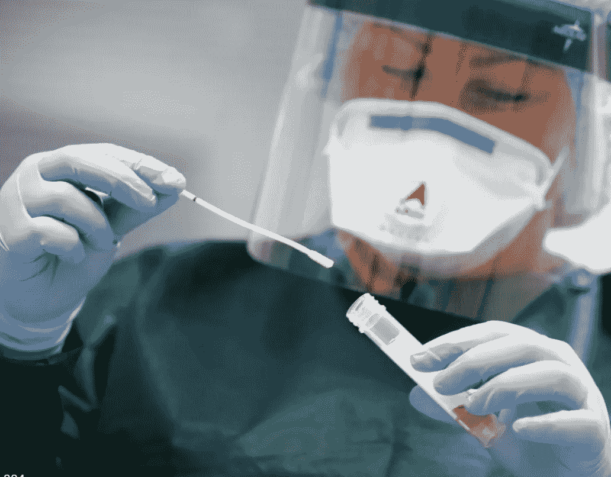
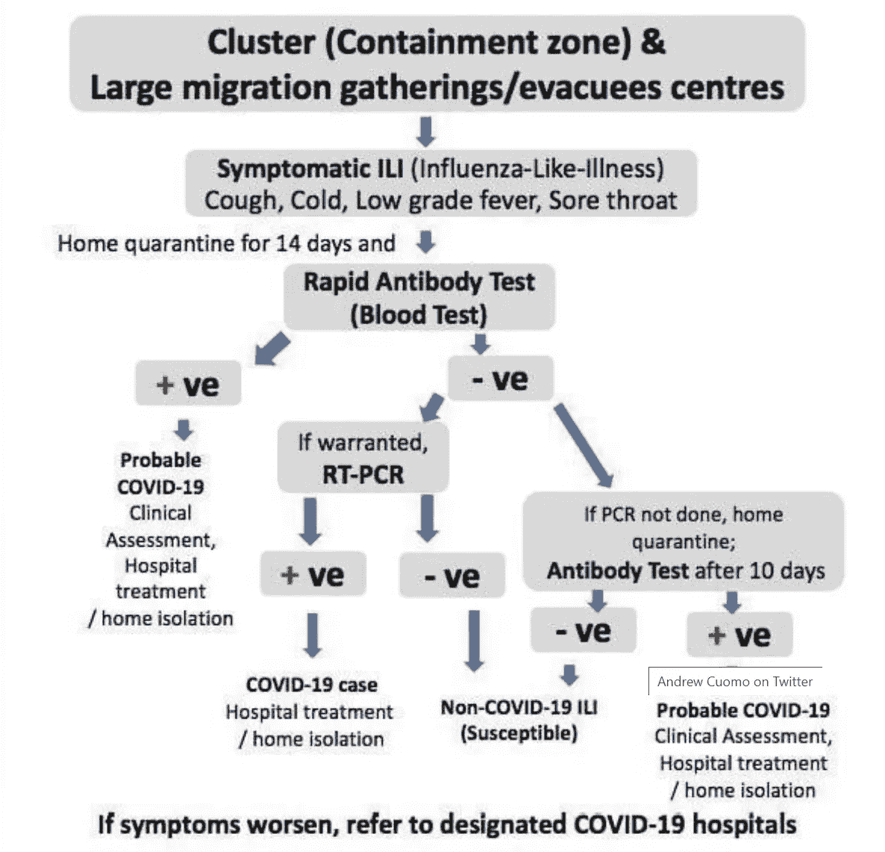
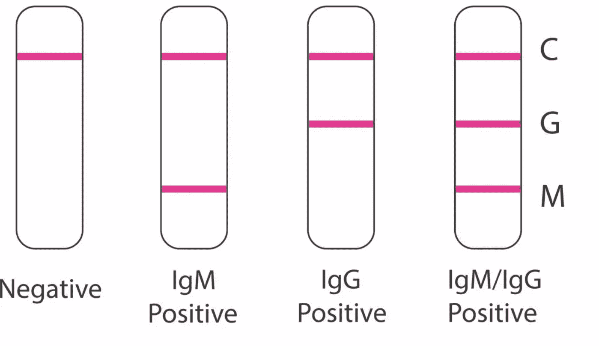

# COVID19 诊断-是如何做到的？

> 原文：<https://medium.datadriveninvestor.com/covid19-diagnostics-how-is-it-done-20daa80273ef?source=collection_archive---------20----------------------->

Image Credits: The Texas Tribune

*这里列出了目前市场上 COVID19 检测技术的所有方法*。

在目前的疫情，有很多关于冠状病毒的问题。作为一名生物学家，我的许多朋友和家人一直在问我问题，关于病毒、疗法以及科学界如何试图解决目前的情况。

我收到的最常见的问题之一是如何诊断一个人患有冠状病毒。测试协议是什么？嗯，这是一个多层次的过程，比从你的鼻子里提取血样、咽拭子或拭子，然后在实验室里进行处理要广泛得多。

 [## 冠状病毒；惊慌失措；字里行间的 z |数据驱动的投资者

### 围绕冠状病毒的话题；更准确地说，新冠肺炎几乎占据了整个新闻预报的头条…

www.datadriveninvestor.com](https://www.datadriveninvestor.com/2020/03/23/coronavirus-a-to-panic-z-between-the-lines/) 

我将向您介绍对单个人进行 COVID19 检测的每个步骤，以及采集样本后的实际情况。

# 顺序测试过程

[https://inshorts.com/en/news/govt-releases-advisory-to-start-rapid-antibody-test-for-coronavirus-at-hotspots-1586067618157](https://inshorts.com/en/news/govt-releases-advisory-to-start-rapid-antibody-test-for-coronavirus-at-hotspots-1586067618157)

所以让我们从一个封闭区开始，那里有大约 20 人被检测为 COVID19 阳性，容纳了大约 500 人。现在我们有政府人员去那里测试 500 个人。

## **自我检疫期**

而不是收集 500 个样本。他们首先要求每个人隔离自己至少 14 天。

这确保了病毒有时间在体内繁殖。一旦人体内存在足够多的病毒，就更容易检测出冠状病毒的存在。因为大多数情况下会出现症状。

*即使你没有症状，但与感染者有过密切接触，在隔离 14 天后，一定要进行检测！*

## 老鼠数量

[https://www.biomedomics.com/products/infectious-disease/covid-19-rt/](https://www.biomedomics.com/products/infectious-disease/covid-19-rt/)

现在使用快速抗体测试的快速诊断可以揭示很多。虽然这是一个非常不准确的测试。它是为快速筛选而创建的。

快速抗体测试或 RAT 检查血液样本中是否存在 IgG 和 IgM 抗体。

抗体是由免疫反应产生的。它们是防御分子，是身体对我们体内冠状病毒的存在做出反应而产生的。

这种抗体是对我们体内任何外来细菌、病毒或病原体的反应而产生的。所以不准确。但是很快。

为了确定某人是否被感染，有一种叫做 RT-PCR 的测试。

## RT-PCR 或实时 PCR

就像每个人都有独一无二的指纹一样，每个生物都有独一无二的 DNA 序列。使用冠状病毒特有的 DNA 序列，我们能够检测样本中是否存在冠状病毒。

很简单。

我们在每个实验室都有来自病毒的这些独特序列的拷贝，如果它们存在于你的血液中，它们就会锁定我们引入的拷贝并开始繁殖。通过 PCR，我们可以看到这种增殖随着时间的推移而发生。如果血液样本中有足够数量的这种独特序列。这意味着这个人被感染了。

这是最后的考验。

## 流程已完成

RT-PCR 的结果会传到你那里。

如果是阳性。准备撞击。

如果是阴性。注意安全。保持健康。