# 使用 LSTM-RNN 时间序列预测

> 原文：<https://medium.datadriveninvestor.com/covid19-time-series-forecasting-using-lstm-rnn-753a04944483?source=collection_archive---------0----------------------->

由于臭名昭著的新型冠状病毒(COVID19)，我们的星球仍然处于封锁状态，我决定利用我的一些时间开发一个机器学习模型，该模型将预测冠状病毒确诊病例和死亡病例的数量。尽管如此，我还是向上帝祈祷，希望这些数字能减少到零或零。

我从约翰·霍普斯金大学的 github 知识库中获得了直播数据。

 [## CSSEGISandData/新冠肺炎

### 取消警告-下面的文件将不再被更新。随着新数据结构的发布，我们…

github.com](https://github.com/CSSEGISandData/COVID-19/tree/master/csse_covid_19_data/csse_covid_19_time_series) 

现在让我们来谈谈建模部分。

因为，对于大多数国家来说，随着病例数呈指数增长，时间序列图相当简单。所以，我应用了用于**指数平滑**的**霍尔特温特方法**。我将趋势和平滑级别分别设置为“mul”和 1.0。这些数字呈指数增长，预测数据在很大程度上依赖于更近而不是更远的数据点。因此，根据霍尔特·温特的方法，如果我们希望预测严格依赖于最近的日期，平滑水平(0 <阿尔法< 1)需要趋向于 1。在下图中，绘制了伊朗确诊病例数。

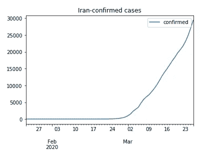

在 2 月的最后一周之前，曲线看起来是平坦的，但从 3 月的第一周开始，数字突然激增。

霍尔特·温特的方法产生了很好的结果，平均绝对百分误差(MAPE)在 4% — 10%的范围内。这种方法在确诊病例数量大幅增长的国家，如意大利、西班牙、伊朗和美国，效果很好。但对于中国、新加坡和韩国等疫情得到一定程度控制的国家，曲线趋于饱和。

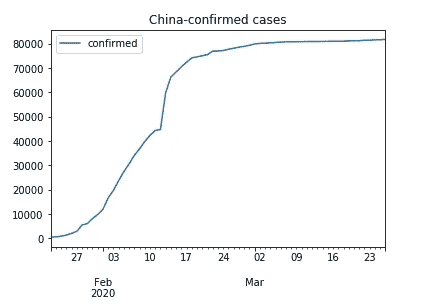

因此，这些案例需要关注整体数据，而不是更重视最新数据。因此，需要改变这些情况下的超参数，以使 MAPE 处于安全范围内。

由于这涉及大量的人工干预，我们决定建立一个稳健的模型，无论曲线是平坦的还是指数的，该模型都会处理好。让我们说，在未来，意大利遏制冠状病毒的传播，霍尔特冬季不会产生相同的超参数的好结果。然而，我喜欢 Holt Winter 的方法在特定情况下很容易实现，但很难将其推广到所有情况。

 [## 将定义 2020 年就业前景的五大数据科学和机器学习趋势|数据驱动…

### 数据科学和 ML 是 2019 年最受关注的趋势之一，毫无疑问，它们将继续发展…

www.datadriveninvestor.com](https://www.datadriveninvestor.com/2020/02/19/five-data-science-and-machine-learning-trends-that-will-define-job-prospects-in-2020/) 

上述事实构成了本文的背景——“稳健的 LSTM 时间序列模型”。现在让我们谈谈技术细节。

## 要求:

Python 3 或以上版本的 Jupyter 笔记本

熊猫，numpy，sklearn，Keras，tensorflow

## 步骤 1:数据收集

约翰·霍普斯金大学一直在发布每个国家每天确诊、痊愈和死亡病例的时间序列数据[这里](https://github.com/CSSEGISandData/COVID-19/tree/master/csse_covid_19_data/csse_covid_19_time_series)。我将暂时带走**确诊病例**，因为我希望我的文章准确。对于恢复和死亡病例，您可以重复相同的过程。

读取伊朗的数据并将其转换成合适的时间序列格式。

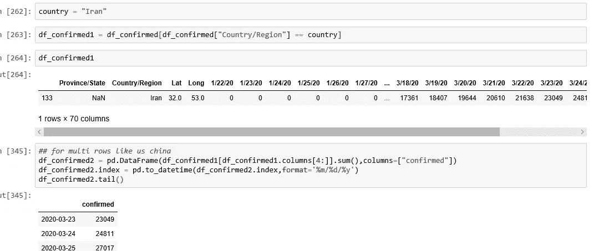

伊朗确诊、死亡和恢复病例图

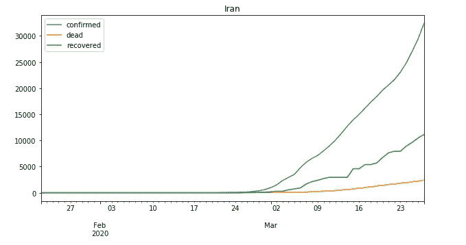

## 第二步:数据预处理

由于数据存在巨大差异，我们将采取小步骤进行预测。这里我们采取了 5 个步骤，即验证集将由 5 个数据点组成，其余的将是训练集。因为数据是从 1 月 22 日开始提供的，所以总共有 66 天或 66 个数据点。

验证集= 5 个数据点

训练=总数-验证集= 66–5 = 61 个数据点

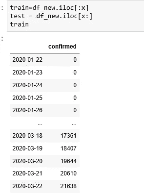

由于数据严重倾斜(从零开始，一直到数千)，我们将根据训练集对数据进行标准化(将每个值除以训练集的最大值)。

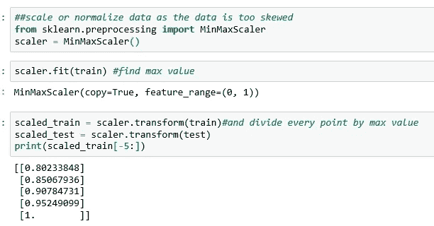

***时间序列发生器***

时间序列生成器是一个实用程序类，用于在 keras 中生成批量时态数据，即从常规时间序列数据中生成用于训练/验证的批量数据。这些批次将用于训练模型。

对于我们的例子，我们采取 5 个步骤，即考虑 5 个数据点来预测第 6 个数据点。因此，批次应该是[feed=[t1，t2，t3，t4，t5]，predict=t6]。

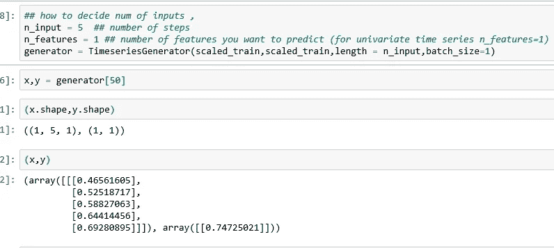

流程将会是

x →神经网络/更新权重→ y

## 第三步:模型构建

我们正在使用 Keras 实现 LSTM(长短期记忆)算法。因为任何神经网络都是多层的(输入层→隐藏层→输出层),所以我们使用 keras 库的顺序类。

我认为神经元的数量在 150 左右。然而，通过网格搜索和 k-fold 交叉验证，我们总能获得最佳的神经元数量。但是作为初步的方法，我们可以使用下面的公式。

> 其中，I = 3/2 * h *输入点数

h 是隐含层的数目，I 是输入神经元，input_points 是训练数据点的数目。

我们有 2 个隐藏层和 1 个输出神经元，因此，输入神经元= 2 * 3/2 * 60 = 180。我把它四舍五入到 150 英镑。

最初，我们只有一层 150 个神经元，但为了提高准确性和模型的鲁棒性，我们增加了一层 75 个神经元。因此，模型的结构将是— ->将 150 个神经元传递到 LSTM 层→将输出缩减到 75 个神经元，以馈送到密集层→再增加一个密集层，该密集层将输出进一步缩减为 1

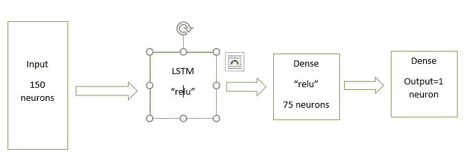

激活函数是非线性变换，如果在数据中存在，它会破坏任何线性。 ***激活*** *功能*对于人工神经网络学习和理解输入和响应变量之间非常复杂的非线性复杂功能映射非常重要。没有激活功能的神经网络将简单地是一个线性模型**、**，其具有有限的能力并且在大多数时候表现不佳。我们希望我们的神经网络不仅仅学习和计算一个线性函数，而是比这更复杂的东西。

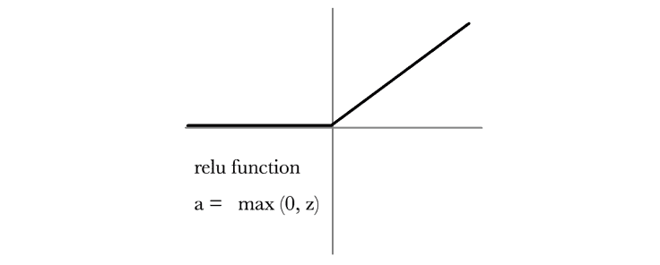

我们选择优化器为“adam”。Adam 是一种优化算法，可以用来代替经典的随机梯度下降过程，以基于训练数据迭代地更新网络权重。它适用于非常嘈杂和/或稀疏梯度的问题，计算效率非常高，需要较少的超参数调整。

我们的损失函数是“均方误差损失/二次损失”。MSE 是我们的目标变量和预测值之间距离的平方和。

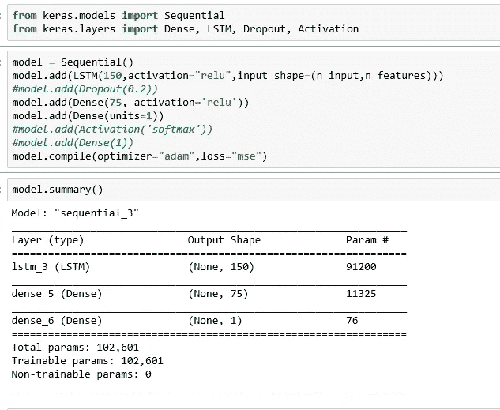

**验证集**

我们还引入了验证集来计算损失和 MAPE。回想一下，当批次的形状为[(t1，t2，t3，t4，t5)，(t6)]即[(1，5，1)，(1，1)]时，验证集等于步长数，即 5。因此，所需的总数据点将为 6，即我们必须从训练集中获取的数据点之一。

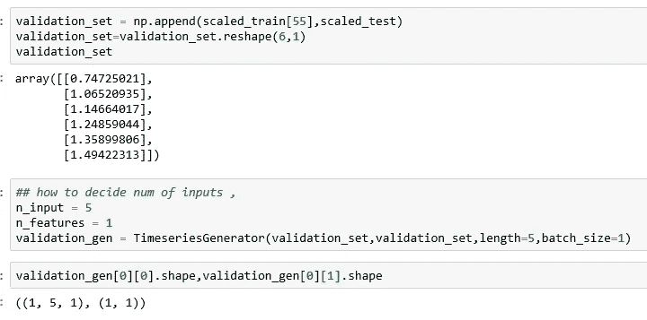

**训练模型**

我们有 keras 的早期停止机制，当监测到的数量停止改善时，它就会停止训练。换句话说，如果 val_loss 在即将到来的时期内没有减少，则训练停止。我们已经将耐心设为 20，也就是说，即使质量没有提高，我们也不能停止训练，直到 20 次迭代。有一个名为“*restore _ best _ weights”*的重要标志，它从迭代中获取最佳权重(其中 val 损失最小)。

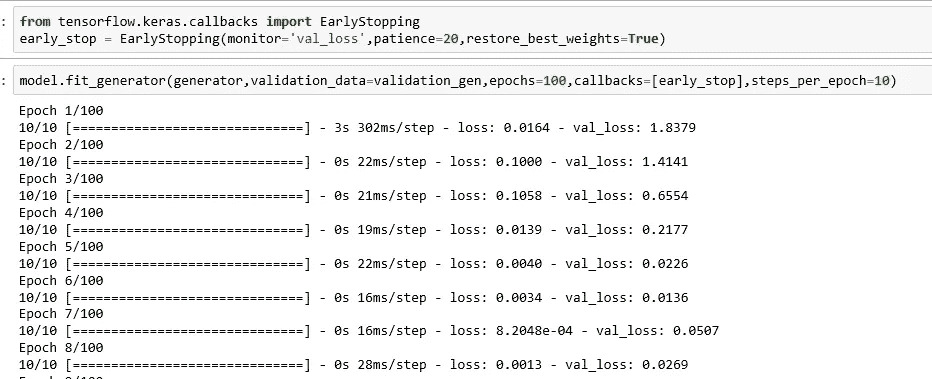

## 步骤 4:模拟性能

该模型看起来不错，因为训练损失和验证损失以最小值重叠。此外，随着历元数的增加，两条曲线都变平了。

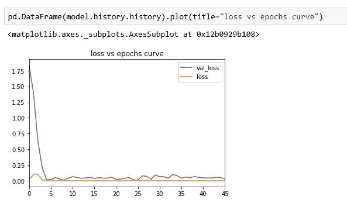

如果我们分开来看这两种损失

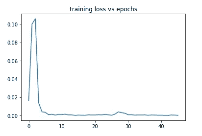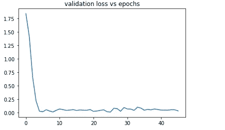

在经过几个时期的训练后，这两个图倾向于彼此跟随，并在之后达到类似的饱和值。这证明我们的模型训练有素。

## 第五步:预测

我们将预测从今天起的 7 天内伊朗确诊病例的数量。

输出是标准化的数据，因此我们对以下内容应用逆变换。

将数组重构为可读的熊猫数据帧。

绘制原始数据和预测数据的曲线

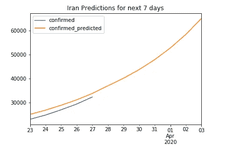

平均绝对百分比误差(MAPE)

准确度将是 100-MAPE = ~ 93%

**预测区间的计算(95%置信水平，CL)**

*对于 95%的 CL，t 乘数为 1.96* ，这是根据样品的自由度和所需的 CL 计算得出的

t 乘数*标准差给出了区间的大小。

最小和最大范围由下式给出:

min =值-区间

最大值=值+间隔

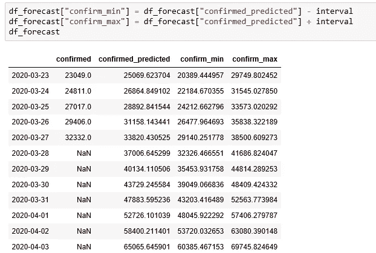

**Iran-prediction with Prediction Intervals**

## **结论**

上述方法可用于每个国家的死亡和康复病例数。只是我们必须循环运行模型并得到预测。

然而，我在《华盛顿邮报》上看到一篇文章说，温度和湿度可能会减缓病毒的传播。这解释了为什么与欧洲或美国相比，柬埔寨、老挝和越南等国家的传播率相对较低。

所以，下次我可能会尝试用温度、湿度和人口密度等变量来模拟一个多元时间序列。

如果有任何建议或疑问，欢迎在评论区提问。

我要感谢[何塞·波尔蒂利亚](https://www.linkedin.com/in/jmportilla/)在 Udemy 上为我们提供的关于时间序列的精彩教程。

## [Github 回购](https://github.com/ashukrishna100/COVID19-time-series)