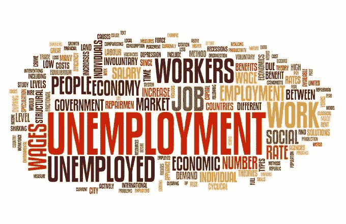
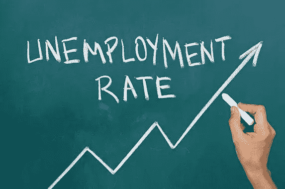
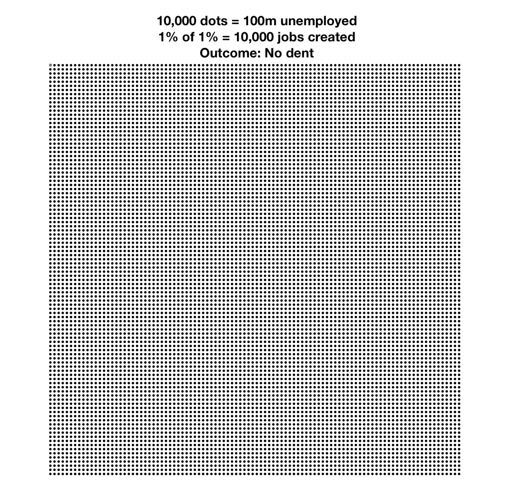
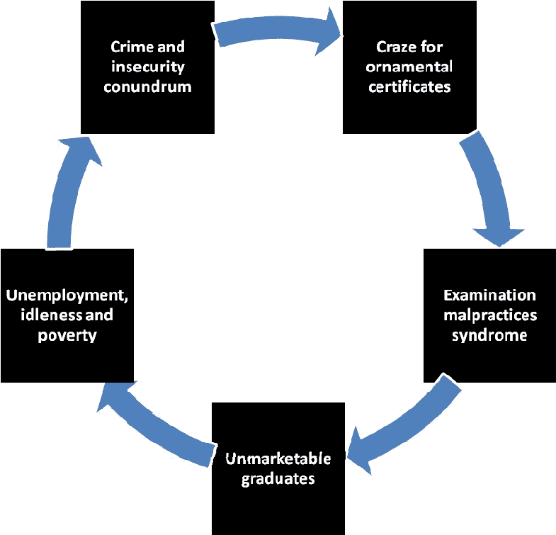
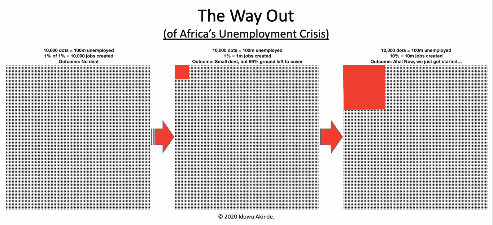
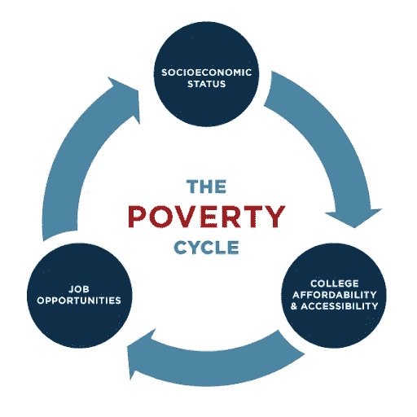

# 解决非洲的失业问题

> 原文：<https://medium.datadriveninvestor.com/cracking-unemployability-in-africa-5070990e81e4?source=collection_archive---------3----------------------->

解决非洲(日益严重的)失业问题的蓝图。我的“蓝图”系列的第一篇。

近 60%的非洲人口(约 13 亿)年龄在 25 岁以下，这使其成为世界上“最年轻”的大陆。根据联合国的人口预测，到 2100 年，非洲的青年人口可能相当于欧洲总人口的两倍。此外，国际劳工组织的预测([基于 2019 年的数据](https://www.ktpress.rw/2019/12/youth-unemployment-in-africa-a-time-bomb-warns-ilo/))是，非洲 5 亿多劳动力中有 21.4%(即 1.07 亿)失业。

几年来，非洲教育系统产出的总体质量(供应方)与雇主对其业务需求的期望质量(需求方)之间还存在着**巨大的(且日益扩大的)差距**。

善意的人们(一些企业家、其他社会创新者以及少数情况下的政府机构)已经做出了许多尝试来弥合这一差距。但我看到了一个问题，它似乎是一种模式:以前所有解决这个问题的尝试似乎只对解决某个梯队的问题感兴趣，即所谓的“精英中的精英”。

> 我对针对“1%中的 1%”的方法的质疑是，它忽略了更大的问题(并降低了问题的严重性)，即非洲失业问题的绝对紧迫性。

是的，你没看错。更大的问题不是失业本身，而是非洲精英阶层未能把当前的形势视为绝对必要。

> 在我看来，如果得不到有效解决，这个独特的问题有可能给我们的孩子和他们的孩子带来无尽的痛苦和苦难，其程度远远超过我们目前面临的任何问题。

Can you spot the red dot? Top Left corner. Relative to the size of the grid, that’s “1% of 1%”. Negligible, right?

我对以“1%中的 1%”为目标的方法的质疑是，它忽略了更大的问题(从而降低了问题的严重性)，这就是非洲失业(以及就业不足)问题的绝对紧迫性。如果你在街上偶然遇到我，问我“嘿，你认为今天非洲最大的问题是什么，并且这个问题在接下来的 10 年里仍然存在？”，我会不假思索地回应道:“**教育**”。为什么？因为教育(或缺乏教育)与就业能力成正比(或相应地，与就业能力成正比)。巨大的失业率反过来又推高了犯罪率和社会不安情绪。他们还保证了一个已经贫穷的大陆仍然贫穷，如果我们批判地思考它，这就是**教育失败的真正成本**——失去的机会:1)创造新的宏观经济价值(如果这些年轻的小伙子和姑娘得到适当的技能，整个大陆可能会积累数十亿，也许数万亿美元的 GDP)， 2)打破不断加剧的贫困恶性循环，因为一代又一代的孩子在达到工作年龄之前，都没有能力以最佳方式思考自己和周围的世界。

> 教育失败的真正代价是失去了打破贫困恶性循环的机会，因为一代又一代的孩子没有能力以最佳方式思考自己和周围的世界。

## **嗯嗯。**

等等，我所说的那种教育，我相信它可以“纠正”非洲发展和增长的方向，可能不是你所想的那种类型。我在以前的一篇文章([*your For The take*](https://medium.com/@idowuakinde/yours-for-the-taking-13d9f4edcd40))中指出，技能——而不是知识——是 21 世纪的“热门”货币，也正是非洲今天非常缺乏的东西。根据最新统计，非洲大约 50 个成员国中有 1701 所大学，拥有丰富的学位，但这些毕业生(和其他年轻人)是否拥有雇主所需的关键技能是个大问题。

 [## 面向 Noobs |数据驱动型投资者的数字身份

### 聪明人如何在增强现实中创造身份价值？我最近刚满 40 岁。作为一个生物…

www.datadriveninvestor.com](https://www.datadriveninvestor.com/2019/02/28/digital-identity-for-noobs/) 

在这一点上，安德拉、[迪冈](https://decagonhq.com/)、[乌蒂瓦](https://utiva.io/)、[斯图特恩](https://stutern.com/)和[大学](https://univelcity.com/)至少解决了问题的一小部分，但我担心这还远远不够。是的，他们中的一些人在微观层面上取得了显著的成功，但没有一个人在宏观层面上有所建树。**秤，秤，秤**。我们作为一个大陆的生存取决于此。

The grid on the left represents the “1% of 1%” approach, the grid in the middle represents the “1%” approach, and the grid on the right represents the “10%” approach.

> 安德拉、迪冈、乌蒂瓦、T21 和大学至少解决了问题的一小部分，但恐怕这还远远不够。鉴于当前问题的规模，非洲需要从一开始就针对金字塔更大部分的解决方案。

## 那么我们能做些什么呢？

很多。

至少，解决这一问题的主流模式必须改变。

以 SkillsFund 为例:简单来说，SkillsFund 为应届毕业生提供高需求技能的培训，然后帮助他们找到需要这些技能的雇主。它还为无力支付的申请人提供奖学金，并且已经在未来 5 年内提高 100 万非洲青年的技能。因此，很明显 [Bola Lawal](https://www.linkedin.com/in/bola-lawal-3344ba32/) 和他的团队有着重要的见解:1)一个真正可持续的解决方案必须能够解决既是技能差距问题的原因又是其结果的经济问题，2)一个完全处于金字塔顶端的模型不会真正解决非洲大规模的失业问题**只有处于金字塔中间和底部的模型才能解决这个问题**。

> 一个专属的**金字塔顶端的**模式不会真正解决非洲大规模的失业问题——只有一个**金字塔中端和底端的**模式会。

## 啊啊…

从一开始，SkillsFund 就没有着眼于提升非洲所谓的“精英技术人才”的技能，而是关注提升尽可能多的人才的技能，只要这些候选人满足最低认知能力门槛。这里的“ ***”大赌注“*** 是在整个非洲大规模提升青年技能的级联效应(即一项计划所能达到的最底层)，即他们将获得的消费能力、他们将创造的辅助性工作岗位，以及最重要的他们将给予后代的教育和指导——**将点燃我们热爱的非洲大陆急需的经济复兴**。

> **思考内容:**现在想象一下，有另外 9 项计划，其目标都是在未来 5 年内提高 100 万名非洲青年的现代工业相关技能？

## 回到具体能做些什么。

我没有所有的答案，但我有一些想法:

1.  **建立更多的**“技能基金”市场足够大。
2.  **改变一些传统的技能发展平台，远离精英的“1%中的 1%”的模式，转向**尽可能深入金字塔底层的任何模式**。**
3.  我知道，每个人都不可能建立一个公司。但是每个人都可以支持一个。如果你建不出这样的公司，**请支持一个**。有:
    - > **资助**、
    - >教育学(教学/ **辅导** /师徒)、
    - >(作为政府)**税收减免**针对这个特殊部门。他们所做的是将非洲从目前注定失败的轨迹中拯救出来，他们的成功是所有人的成功。作为一个大陆，我们不能在这一点上失败，因为恶性循环将继续下去(下一代将更难打破)，
    - >等等。
4.  在我们的象牙塔里升级课程(和教学方法)**灌输比理论更多的技能发展**。是的，我知道教育经费是一个巨大的挑战，但是我们不能听天由命——我们必须有所创新。
5.  **(作为公民社会)提高对这一危机的认识。从屋顶拉响警报。广泛传播这一信息。代表整个非洲大陆，在权力走廊中倡导。**

有什么要补充的吗？请发表评论，让我们来谈谈吧…

谢谢，我已经吼完了。🙂老实说，如果你能忍受我到目前为止的胡言乱语，我不得不说一声非常感谢你。🙏🏾

我们能做到的。💪🏾

全面披露:在撰写本文时(2020 年 4 月 24 日)，我正在与 SkillsFund 谈判，以支持他们的技术技能培训。没有交换条件，这里表达的观点是我个人的观点。