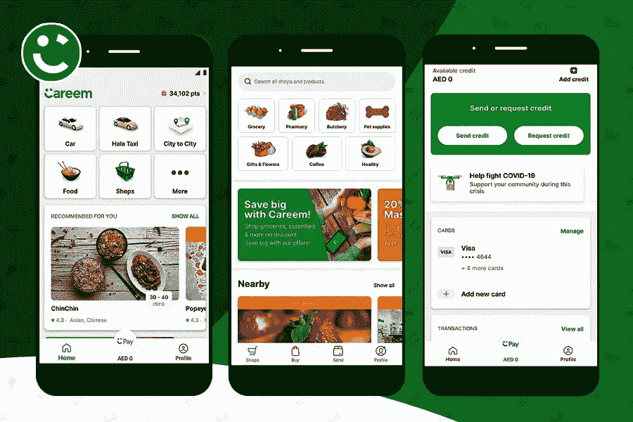

# 创建一个类似 Careem 的打车应用——汽车、食品、购物和支付

> 原文：<https://medium.datadriveninvestor.com/create-a-taxi-app-like-careem-car-food-shop-pay-xicom-34f05e87f066?source=collection_archive---------25----------------------->

植根于迪拜的领先出租车预订应用 Careem 渴望发展成为一款日常生活应用。

准时打车的麻烦是真实的！

或者你可能想租一辆出租车。

但是，在漫长的等待和失望的经历之后，你最终会付出比要求更多的钱！由于传统的交通服务往往无法检查以客户为中心的服务，像 Careem、Ola 和优步这样的应用程序理解这种痛苦，并从中受益。

随着 2009 年优步的首次亮相，它颠覆了运输行业。就在以客户为导向之后，优步提升了日常拒签、麻烦和造成的不便。但渐渐地，行业内涌现出许多竞争者，对优步形成了瓶颈竞争。

一个如此神奇的名字是“Careem”，一个外地打车应用程序给了优步一场严重的争吵。

但在你向前迈进之前，有必要揭开是什么让 Careem 如此独特，以至于一个 9 年的巨人在迪拜也面临打击？

尽管总部位于加州的迪拜拥有全球最大份额，但它仍落后于 Careem 的领地。[根据一份报告](https://www.arabianbusiness.com/uber-vs-careem-which-is-most-talked-about-in-middle-east--665326.html)，优步的竞争对手最终在社交媒体对话中超过了优步。

毫不奇怪，Careem outhussle 优步，因为当地认为这是一个本土品牌！

[在一份报告](https://www.arabianbusiness.com/technology/456361-dubais-careem-says-first-super-app-has-amassed-48-million-users)中，Careem 的超级应用程序在新冠肺炎疫情爆发的高峰期推出，已经积累了 4800 万用户。此外，作为该地区第一个“超级应用程序”，Careem 在一个平台上提供所有服务，在一个地方提供乘车、自行车共享、杂货店购物、数字支付选项、城际旅行和送货选项。

简而言之，该应用的核心目标是迎合他们在任何地方的纯粹便利性——解决通勤者面临的技术异议。准确地说，全球各地的打车应用通过欢迎按需乘车功能，彻底改变了交通行业。

因此，假设你有一家出租车公司，并计划在迪拜将它提升到一个新的水平。在这种情况下，你需要的只是一家可靠的[移动应用开发公司](https://www.xicom.ae/services/mobile-app-development/)，该公司在开发按需打车应用方面拥有业经验证的专业知识。谁知道你会成为当今时代的下一个卡里姆或优步。

开始吧！

# 成功应用的历史——Careem

Careem 最初的服务是一项基于网络的公司租车服务，后来发展成为一家提供日常租车服务的公司。在其花式阶段，预先安排的预订是一个集成的功能，所以他们有一个很好的时间来为通勤者预约和安排出租车。通常，用户来自需要经常出差的公司。

Careem 的首席执行官和联合创始人有一个愿景，Careem 渴望成为一个专注于消费者日常需求的应用程序，关注协同效应，从而提高运营效率和改善客户体验。准确地说，他们希望在一个平台上创建一个更全面的消费者视图。

# Careem 业务模式的 360 度视图

无论是 Android 还是 [iOS 应用程序开发](https://www.xicom.ae/services/iphone-app-development/)，Careem 应用程序都由三种模式组成，它们是应用程序的重要元素:

1.  船长/驾驶员应用程序
2.  通勤 App
3.  管理仪表板

## 船长/驾驶员应用程序

司机使用该应用程序接收出租车预订通知并赚钱。以下是注册成为司机的步骤:

*   在应用程序的驱动程序凭据页面注册您的详细信息
*   完成船长培训
*   下载驱动程序
*   接受你的第一次旅行，你已经成功开始了你的赚钱之旅。
*   在中东北非地区和土耳其周边的大城市，如迪拜、利雅得、吉达、贝鲁特、伊斯坦布尔等，出租车预订服务全天候可用。

## 通勤 App

乘客或通勤应用程序是用户可以根据自己的方便轻松预订出租车的应用程序。可以为常规通勤预订，也可以为以后的驾驶安排。

*   下载并安装应用程序。借助集成的 GPS 功能，专家将准确获取您的位置，以便快速驾驶。
*   选择你的汽车类型，并根据你想什么时候出发选择“现在乘坐”或“以后乘坐”——这是一种比传统出租车服务更灵活的方法。
*   选择您的下车地点进行粗略估计。
*   键入“YALLA”并立即得到确认。此外，请填写您的司机详细信息和位置。
*   实时跟踪您的行程。一旦你的车到了，上车，坐下来放松。只有当你的上升完成时，你才需要支付。
*   预订乘车时，您可以选择通过现金或信用卡支付。使用卡支付时，Careem 会自动从您的账户中扣除相应金额，如果使用现金支付，您必须在乘车结束时将钱交给司机。
*   不要忘记评价服务或分享您的反馈。

## 管理面板

管理面板允许超级管理员管理司机，出租车，评论，仪表板和更多的列表。

# 创建像 Careem 这样的应用程序需要什么？总体规划

用于优步和 Careem 预订的技术栈已经得到发展。随着全球打车应用初创公司提出新鲜和创新的想法来解决独特的挑战或试图使旅程安全舒适等。而且，在你坚持这些特点的同时，其他所有打车创业公司都在寻找一件事——“成功”！

要珍惜成功的滋味，你需要确保让用户体验像 ABC 一样简单。同时，它必须在中东和北非地区的目标区域扩大您的客户群。

## 以中东地区为目标时，很少进行评估

1.  你的竞争对手。
2.  你搭建打车 app 的范围。
3.  你在中东地区的目标受众。
4.  你对这款应用的长期目标。

然而，通过正确的策略，你可以很容易地接触到像迪拜和阿布扎比这样的大城市的客户。为了制定这个策略，你需要提前回答这些问题。完成这份问卷后，决定是选择跨平台打车 app 还是原生 app 开发，

无论你选择什么平台来创建像中东 Careem 这样的[应用，从迪拜领先的应用开发公司中选择最好的后端和前端开发团队是至关重要的。](https://www.xicom.ae/blog/careem-super-app)

**嗯，这是相对简短的。让我们更深入地探讨一下最佳技术，帮助您** [**开发像阿联酋的 Careem**](https://www.xicom.ae/blog/careem-super-app) **这样的应用程序。**

## 1.在你的应用中选择 GPS 追踪

你的克隆应用，比如 Careem，需要同时管理几个请求。并且，这些请求将来自不同的位置。同时，出租车必须准时到达用户的位置。

因此，它确保你的应用程序持续跟踪用户的位置，这将在最近的点或在一只手臂的范围内联系司机。

在应用程序中集成 GPS 功能是必须的。对于 iOS，使用核心位置框架。该框架使用设备 GPS 功能来跟踪用户位置，反过来，提供 ETA(估计到达时间)。对于 Android 应用程序开发，位置管理器允许应用程序频繁更新用户的地理位置。

## 2.保持无与伦比的应用性能

最后，你准备创建一个像 Careem 这样的应用程序。但是，你做完作业了吗？

开发任何打车应用都伴随着一些相关的责任。任何一家移动应用开发公司都不能保证为你的平台提供最好的支持。而且，这次我们讨论的是支持，你的应用程序必须是动态的，能够在一天内处理大量的请求。

为了确保你的应用运行起来不关任何人的事，你需要确保无可挑剔的性能。最理想的技术是 AWS，亚马逊网络服务。它很容易接近，是最好的。毫无疑问，对于你在阿联酋的目标受众来说，AWS 是你最好的选择。它将使你的应用程序动态，以避免当请求最大化时崩溃。

像 Careem 和优步这样已经建立起来的应用程序会跟随一个动态服务器来处理负载。他们已经使自己的计算能力强大到足以在不崩溃的情况下运行。因此，你的用户会更加满意，从而坚持应用程序！

## 3.“无现金”支付集成

优步、Ola、Careem——你使用的任何打车应用都集成了可靠的支付网关，让支付变得轻而易举。

他们已经将这个过程自动化了，这样用户就不必去掏钱包了。您始终可以选择现金支付，也可以保留 UPI、卡支付等流行的支付选项，或者在您的出租车预订应用程序中提供 Careem wallet 选项等替代选项。

要在阿联酋为您的应用集成无缝和无现金支付方式，您可以轻松选择 iOS 的[CCA vene](https://www.ccavenue.com/)和 [Stripe](https://stripe.com/) 技术。这些技术也有潜力管理移动支付。当您需要在应用程序中添加支付集成时，iOS SDK(软件开发工具包)是理想的选择。它使本地支付的 API 易于应用程序使用。此外，为了使它更加无缝，一键购买是你需要包括在内的。

Braintree 可以保存信息片段，这将阻止用户不时地展示他们的信息。我还建议 iOS 和 Android 应用程序开发人员为 Careem 等打车应用程序使用 Stripe API。

## 4.创建像 Careem 这样的应用程序的成本下降

终于，对最终成本的等待结束了！

让我来帮你。为中东和北非地区创建一个像 Careem 这样成功的应用程序的成本最终取决于您选择的功能。谈到 Careem，它们具有相似的功能和特性集，已经改变了整个运输系统。

这两种运输猛犸象都有无缝的 UX/UX 感觉，很少出错，调试也很少。因此，现在是时候揭开邪恶的面纱，了解是什么决定了像 Careem 这样的应用程序的成本。

补充一下，你也可以外包一个开发团队，他们会帮你得到一个动态的解决方案，而不会在你的口袋里留下一个洞。让我们来了解一下你的打车应用必须具备的功能:

## 驾驶员应用程序功能

*   车辆跟踪
*   短信提醒
*   给司机的通知
*   自动电子收据

## 乘客应用功能

*   用户配置文件和凭据
*   按需预订
*   数字计费
*   乘坐历史
*   自动电子收据
*   灵活的支付选项
*   灵活跟踪系统(GPS)
*   通知和短信提醒
*   预定预订
*   配置文件定制

决定性的问题是，如果你想创建一个像 Careem 这样针对阿联酋的应用程序，你添加的功能越多，你的成本就越高。但是，你总能找到比 Careem 或优步更好的应用版本。来自不同地区的外包将向您收取不同的费用，而且价格合理、可靠。

此外，增加社交媒体整合、分摊账单、群发消息等功能将使价格更高。所以，最后，你可以选择你想要添加什么功能或者包含什么设计，更重要的是，你的 iOS 和 Android 应用开发者有多少经验。

# 关键的外卖

如果你正在为中东地区制定战略，请记住，与其他任何应用相比，本土打车应用将获得更多的受众。因此，只需关注消除每天朝九晚五的上班族和通勤者的痛苦，集思广益，通过移动应用程序在线开展出租车业务。

为了打造统治市场的最佳按需打车应用，[知道我们如何帮助](https://www.xicom.ae/contact/)！

*原载于 2021 年 2 月 11 日*[*https://www . xicom . AE*](https://www.xicom.ae/blog/careem-super-app/)*。*