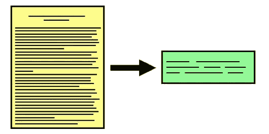

# 用 Flask、Sumy 和 Trafilatura 创建一个文本摘要 API

> 原文：<https://medium.datadriveninvestor.com/create-a-text-summarization-api-with-flask-sumy-and-trafilatura-385212b759d8?source=collection_archive---------3----------------------->

## 文本摘要 API 可能是昂贵的、不一致的和不准确的。使用这些 python 库为您的用例定制一个。

# 编写 API

在试验了几个摘要库之后，我发现 sumy 是最准确的。不会生成新的文本——sumy 只是根据重要性对每个句子进行评分，并返回前 x 个结果。因为一篇文章的第一段通常试图总结页面，所以我想把它包含在每个回复中。

sumy 的评分系统虽然表现不错，但是它的文章抽取机制并不是很大。它通常会将评论、广告和不相关的小节解释为故事的一部分。这很好，因为不相关的句子得分很低，会被排除在结果之外。为了始终如一地提取第一段并确定故事的长度，trafilatura 要有效得多。

/url/ endpoint 有两个参数—URL 和摘要的相对长度，范围从 0 到 1。/text/ endpoint 接受纯文本而不是 url，这对于总结长注释很有用。本指南中的代码只是一个基本模板——一个更正式的 API 将具有身份验证、错误处理、数据库连接和其他特性。

# 部署

我使用 Heroku CLI 部署了该应用程序，Procfile 和 requirements.txt 如下所示。我不得不使用 Heroku 日志作为指导方针，多次修改文件以使 API 从本地运行到实际运行。如果你以前没有部署到 Heroku，你可以在这里阅读如何部署。

打电话给 API-【https://text-summarize-api.herokuapp.com/url/? URL = https://www . nature . com/articles/d 41586-020-02706-6&length = 0.3

# 结论

您最好订阅一个现有的摘要 API，特别是当您将它集成到一个付费服务中时。然而，重要的是要记住，自定义 API 可以执行得类似或更好，可以为您的项目专门定制，并且在较小的规模下完全免费。