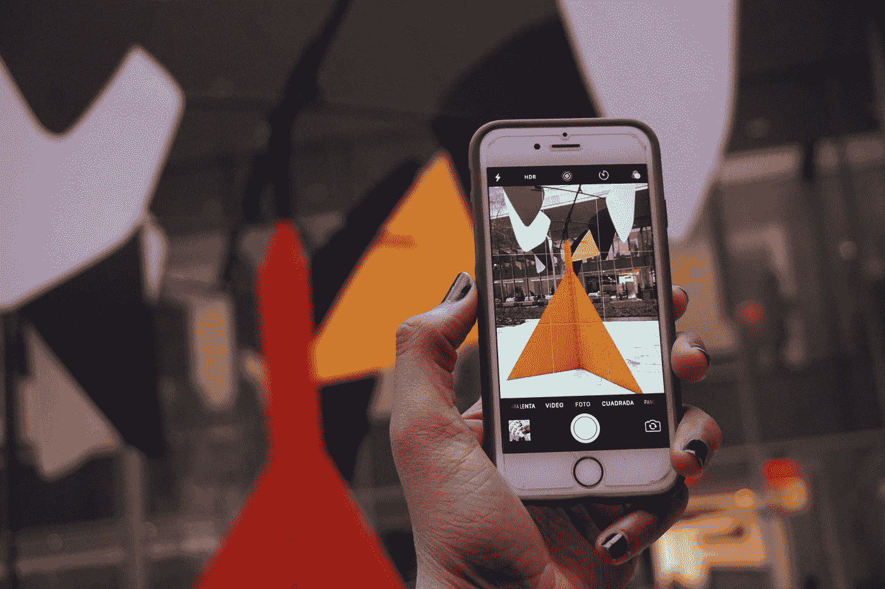
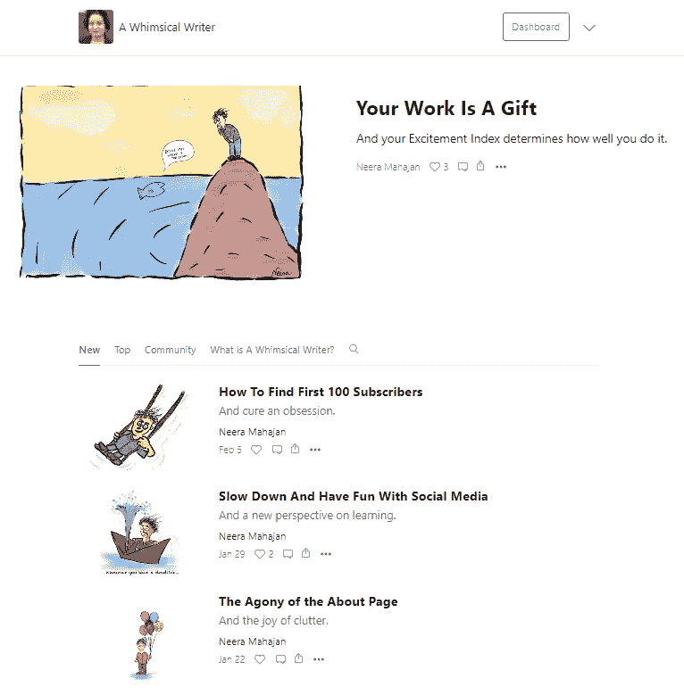

# 消费之前先创造

> 原文：<https://medium.datadriveninvestor.com/create-before-you-consume-3da6b20ff773?source=collection_archive---------27----------------------->

## 这是我得到的最好的建议，但我没有听从。

Photo by [Laura Highgrace](https://unsplash.com/@laurahighgrace?utm_source=medium&utm_medium=referral) on [Unsplash](https://unsplash.com?utm_source=medium&utm_medium=referral)

我几乎睡着了，突然惊醒。

经常听着 YouTube 视频睡觉。这种做法有双重好处。第一，我可以听那些我无法适应的视频。第二，我入睡没有任何问题。

旁注:当你到了我这个年纪，失眠会成为一个真正的问题。虽然我在大多数晚上睡觉没有问题，但听听舒缓的音乐、精神上的谈话或冗长无聊的采访会有所帮助。

这个特别的夜晚，我听着保罗·贾维斯采访玛丽·弗里奥，他一如既往的兴奋。玛丽·弗里奥，被奥普拉称为下一代的思想领袖，是保罗·贾维斯的完美搭档，她说的一些话让我从沉睡中醒来，回到了现实世界。

她说，**“先创造再消费。”**

她的建议有道理。大多数人一醒来，甚至在去洗手间之前都会检查手机。特别是年轻一代。

但不是我。

我不太喜欢社交媒体。我的手机几乎没有任何应用程序。它在那里只有一个目的——如果需要的话打电话。

但这仍然是一个很好的建议，我把它藏在脑海的某个角落，然后继续睡觉。

我来自朱莉娅·卡门的时代，在那个时代，我们被灌输了早上第一件事就是写早报。多年来，我已经训练自己扑通一声躺在床上写作，甚至在我喝杯茶之前，因为泡茶意味着看到厨房里的杂乱，忘记从你内心深处出现的一连串新鲜想法。

我喜欢早上写作的时间。几年后，我已经能够训练我的家人不要在早上打扰我。这是我的创作时间。

反正我在社交媒体上也没什么可查的。直到最近，今年年初，我给自己设定了一个挑战，在[脸书](https://www.facebook.com/neera.mahajan.359/)、 [Instagram](https://www.instagram.com/neeramah/) 或 [LinkedIn](http://www.linkedin.com/in/neeramahajan) 上发布一小段文字和一幅素描。现在每天早上，我醒来，想知道有没有人提到昨晚的帖子。

我已经陷入了同样的早上查看社交媒体的陷阱。

这对我的工作效率有微妙的影响。

我一开始几乎没注意到。

但是很明显，我写得少了，读得多了。

我读别人的材料越多，就越没有信心写出自己的想法。

然后今天早上，我的大脑以其一贯的神秘方式，提出了玛丽·弗里奥的话——“在消费之前创造”。

这将是我现在的口头禅。

消费之前先创造。

直到我把它变成一种习惯。

*先创造再消费。*

这是一个如此强烈的习惯，以至于我在创作之前不会陷入消费的陷阱。

*先创造再消费。*

我们无法回避社交媒体，但我们可以控制它。

消费之前先创造。

这就是我要做的。

*先创造再消费。*

— — — — — — — — — — — — — — — — — — — — — — — —

在你的作家创业之旅中需要帮助吗？订阅我的免费时事通讯，[一个异想天开的作者](https://neera.substack.com/welcome)，每周获得一步一步的指导，让你开始并坚持下去。一路上玩得开心点。在这里，在你[订阅](https://neera.substack.com/welcome)之前，先来看一看[。](https://neera.substack.com/)

— — — — — — — — — — — — — — — — — — — — — — — —

喜欢这篇文章。你可能也会喜欢这些。

 [## 你是作家还是作家企业家

### 这是有区别的。

medium.com](https://medium.com/authorpreneure/are-you-an-author-or-an-authorpreneur-162214d88c9a)  [## 理解作者创业

### 用一个学生的镜头。

medium.com](https://medium.com/authorpreneure/understanding-authorpreneurship-f6c6862f907b)  [## authorpreneur——面向作家的新出版物

### 帮助作家成为作家企业家。

medium.com](https://medium.com/authorpreneure/authorpreneur-a-new-publication-for-writers-5812b2042c80)